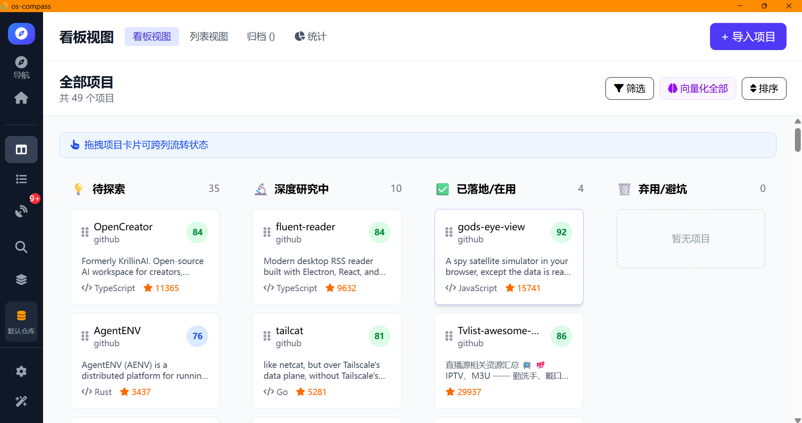
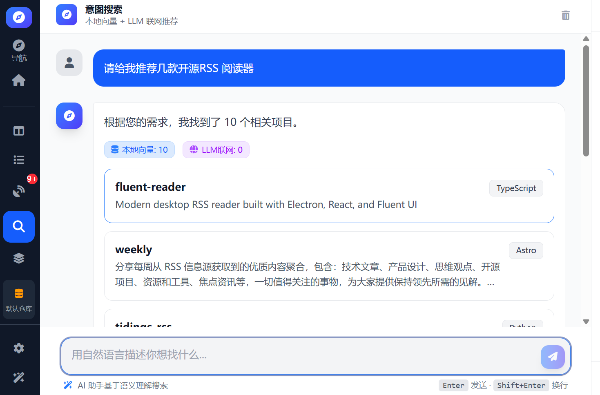
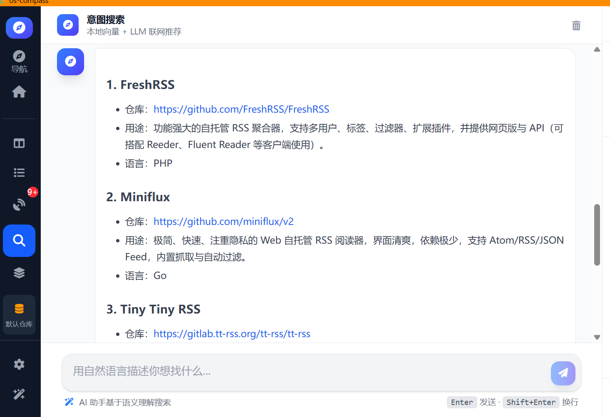
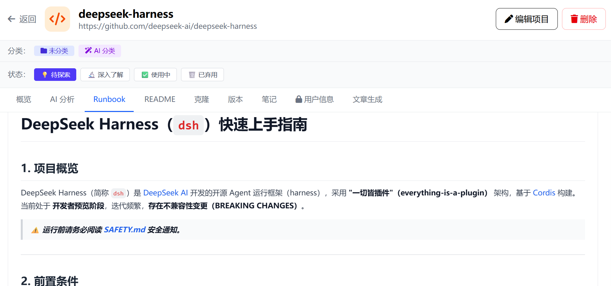
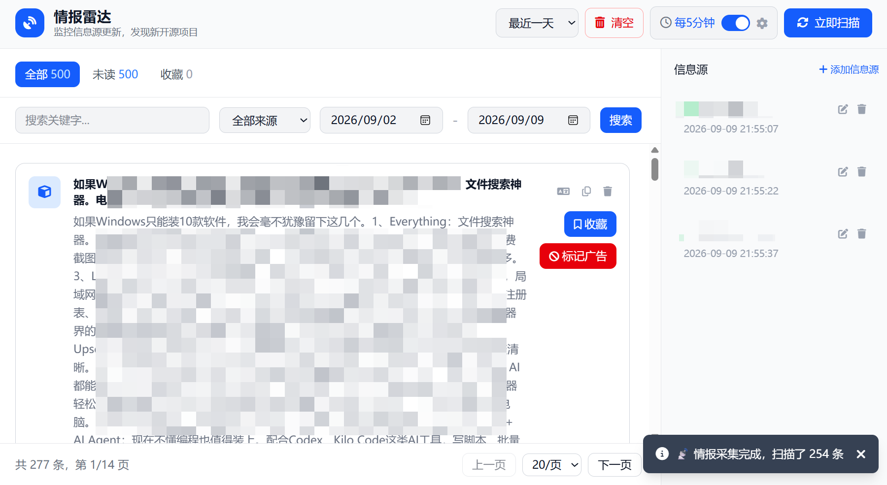
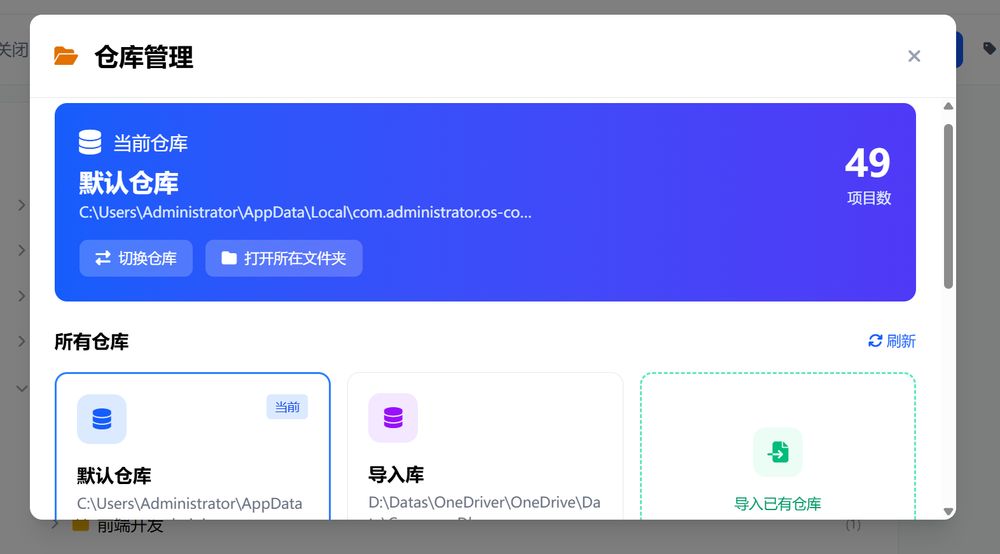
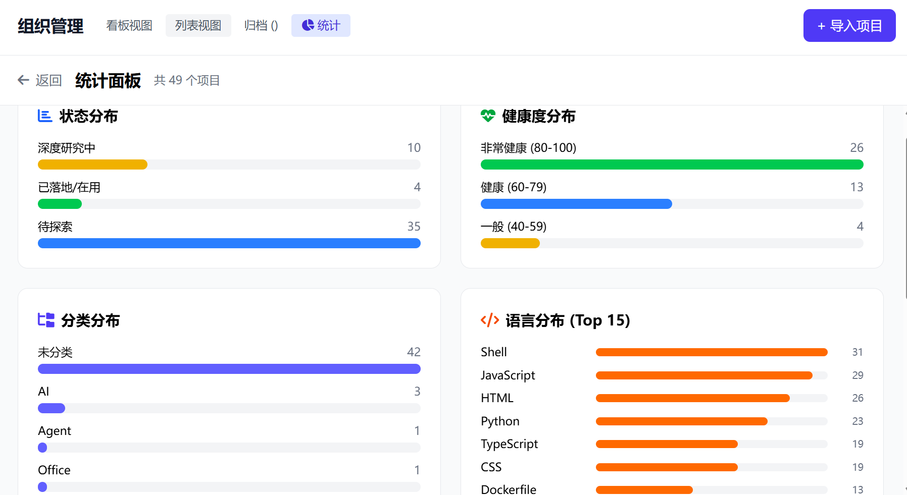

<div align="center">

# 🧭 OS-Compass（开源罗盘）

**基于“本地优先 (Local-First)”理念设计的跨平台开源项目全生命周期管理与决策系统**


[](https://tauri.app/)
[](https://reactjs.org/)
[](https://www.typescriptlang.org/)
[](https://www.rust-lang.org/)
[](https://sqlite.org/)
[](LICENSE)

[功能特性](#-核心特性) • [安装与使用](#-快速上手) • [架构与设计](#-技术架构) • [安全说明](#-数据安全与隐私) • [贡献指南](#-开源共建)

</div>

---

## 📖 为什么需要 OS-Compass？

在日常开发与技术选型中，开发者常常面临以下困扰：

* 📚 **收藏即吃灰**：GitHub Star、浏览器书签积压数百个，缺乏分类、进度标记与生命周期状态追踪，需要用时根本想不起来；
* 🌍 **验证门槛高**：面对全英文 README、庞杂的代码结构与繁琐的环境配置，往往花费数小时却连 Demo 都跑不起来；
* 🔍 **检索不合拍**：传统基于关键词的搜索只能机械匹配，无法深入理解“找一个轻量级音视频转码库并支持 WebAssembly”这类复杂业务意图；
* ☁️ **云端顾虑重重**：许多管理工具强依赖云端账号，个人知识资产与企业技术储备随时面临服务中断或隐私泄漏的风险。

**OS-Compass（开源罗盘）** 为此而生。它不是一个单纯的书签工具，而是常驻桌面的 **“开源资产智能管家与选型决策智库”**。

---

## ✨ 核心特性

OS-Compass 将“发现项目、理解项目、验证项目、管理项目”整合在一个桌面工作台中。你可以把它当作个人开源资产库，也可以把它用于团队技术选型、PoC 跟踪和长期知识沉淀。

### 1. 📥 项目导入与开源资产收集

把散落在不同平台上的项目集中到自己的本地仓库中：

* **多平台识别与导入**：支持 GitHub、Gitee、NPM、PyPI、Crates.io 等常见开源平台，并对未知链接提供通用解析与降级处理；
* **批量导入与手动添加**：可以粘贴项目 URL 导入，也可以手动补充项目名称、描述、语言和来源信息；
* **重复项目识别**：根据 URL 和项目标识避免重复入库，保留已有笔记、分类和状态；
* **导入后自动整理**：项目元数据、README、语言、标签和来源统一保存，导入完成后可自动生成语义向量；
* **安全迁移**：支持导入已有仓库，适合备份恢复、换电脑和多人之间传递独立的数据仓库。

### 2. 🔍 智能意图搜索与技术选型

不用记住准确的项目名，也不用反复尝试关键词，直接描述你要解决的问题：

* **自然语言提问**：例如“帮我找一个支持 WebAssembly 的轻量级音视频转码工具”；
* **本地语义检索**：结合项目名称、描述、编程语言等信息进行向量匹配，优先从自己的项目库中找到相关资产；
* **多轮澄清与上下文记忆**：需求不明确时会主动追问，并承接前几轮对话，逐步收敛技术场景和约束条件；
* **本地与联网推荐结合**：本地结果不足时，可调用配置的大模型生成额外推荐，并将项目名称、链接、用途和适用场景整理为可读报告；
* **搜索历史管理**：保存搜索记录，支持重新搜索和单条删除，方便回溯过去的选型思路；
* **推荐结果直接行动**：本地项目可直接打开详情，外部推荐项目可在系统浏览器中打开。


> **🎯 典型使用场景：**
> ```
> “帮我找一个轻量级、支持 WebAssembly 的音视频转码库”
> → 先检索本地项目库并按相关性排序
> → 本地结果不足时请求大模型补充候选
> → 对比项目的语言、用途、维护状态与集成成本
> → 将合适的项目导入仓库，继续做 AI 分析和 PoC 验证
> ```



### 3. 🗂️ 项目列表、筛选与批量管理

项目数量增长后，仍然可以快速定位和维护：

* **列表视图**：集中查看项目名称、分类、编程语言、更新时间、健康度和生命周期状态；
* **组合筛选**：按关键字、分类、标签、状态和时间范围进行筛选，适合从几十到上千条资产中快速找出目标项目；
* **批量操作**：多选项目后批量移动分类、修改状态、归档或导出；
* **归档而不是误删**：不再使用的项目可以先软删除并保留恢复能力，避免误操作造成数据丢失；
* **统计视图**：查看项目数量、状态分布、分类分布等整体情况，了解自己的开源资产结构。

### 4. 🧭 生命周期看板与项目推进

用看板跟踪项目从“看到”到“真正使用”的全过程：

* 💡 **待探索（TO_EXPLORE）**：刚收藏或刚导入，等待进一步了解；
* 🔬 **深度研究中（DIVING）**：正在阅读源码、运行 Demo 或进行 PoC 验证；
* ✅ **已落地（IN_USE）**：已经用于个人项目、团队系统或生产环境；
* 🗑️ **弃用/避坑（ABANDONED）**：记录不适用原因，避免以后重复踩坑；
* **拖拽流转**：通过拖拽卡片更新状态，直观看到当前正在研究和已经落地的项目；
* **项目操作闭环**：从看板卡片进入详情、打开本地目录、编辑笔记或执行归档。

### 5. 🏷️ 分类、标签与个人知识组织

将“收藏列表”变成符合自己工作方式的技术知识库：

* **无限层级分类树**：按技术栈、业务领域、使用场景或团队结构建立多级分类；
* **分类说明（Explain）**：为分类写清楚边界和适用范围，帮助 AI 在导入项目时做更准确的自动归类；
* **标签体系**：使用轻量标签补充语言、平台、部署方式、成熟度等交叉维度；
* **分类导入导出**：可以复用已有分类体系，在不同仓库之间迁移个人知识结构；
* **项目与分类解耦**：项目可以随时重新分类，不影响原始链接、分析报告和历史记录。

### 6. 🤖 项目详情、AI 报告与开发指引

打开一个项目后，不只是查看链接，而是获得一份可继续使用的项目档案：

* **概览分析**：提炼项目定位、主要能力、适用场景、优势与局限；
* **README 阅读与翻译**：支持 Markdown 排版、原文阅读和目标语言翻译，降低阅读陌生项目的成本；
* **AI Runbook**：整理运行环境、安装命令、配置步骤、快速验证方式和常见问题；
* **二次开发参考**：帮助定位核心目录、关键模块、API 或插件扩展入口；
* **发布与版本信息**：查看项目 Release、版本变化和升级线索；
* **本地笔记与用户信息**：记录自己的测试结果、决策理由、部署参数和项目相关信息；
* **直接进入本地开发**：支持克隆源码，并在下载完成后打开项目目录或使用默认编辑器继续工作。



### 7. 📡 情报雷达与开源动态收件箱

持续发现新的开源项目，而不是等到需要时才临时搜索：

* **多源聚合**：支持 GitHub Trending、NPM、PyPI、Crates.io、RSS、Telegram 等来源；
* **收件箱式处理**：将新内容分为全部、未读、已收藏等视图，逐条标记感兴趣或忽略；
* **精确筛选**：按关键词、信息源和采集时间过滤，并通过分页处理大量内容；
* **永久收藏**：收藏内容不受默认时间范围影响，可以长期沉淀和回看；
* **广告与垃圾内容过滤**：支持中英文关键词、混淆文本和不同过滤强度，减少低质量信息干扰；
* **定时采集与通知**：按计划自动获取新内容，并在有新情报时刷新界面和发送系统通知；
* **一键入库**：发现有价值的条目后，可直接转为项目资产继续分类和分析。



### 8. 🏠 多仓库管理与本地数据隔离

通过独立仓库管理不同领域的技术资产：

* 可以分别建立“个人学习”“公司项目”“AI 工具”“待评估开源库”等仓库；
* 每个仓库拥有独立的项目、分类、标签、笔记、向量和数据库文件；
* 切换仓库时，当前项目和搜索上下文不会混入其他仓库；
* 支持创建新仓库、切换仓库、导入已有仓库、打开仓库目录和移除仓库索引；
* 适合备份、迁移和按工作场景隔离数据。



### 9. ⚙️ 设置、国际化与桌面体验

* **大模型配置**：支持兼容 OpenAI API 的供应商、Base URL、模型名称和 API Key；
* **向量模型设置**：配置 Embedding 服务和模型，支持批量重建项目向量；
* **分层代理**：分别配置 LLM 请求、下载与扩展使用的网络代理；
* **界面语言**：支持简体中文和 English；
* **亮色/暗色主题**：适配不同工作环境，项目详情和 Markdown 内容同步支持暗色显示；
* **初始化向导**：首次使用时引导创建或选择仓库、配置基础选项；
* **快捷操作**：提供导航、快捷键帮助、错误重试和空状态提示，降低桌面工具的学习成本。

### 10. 🔒 本地优先与数据主权

* 项目数据、分类、标签、笔记和搜索历史默认保存在本地 SQLite 仓库中；
* 系统级配置与仓库业务数据分离，切换仓库不会改变全局设置；
* 敏感凭据使用 AES-256-GCM 加密存储，不将明文 API Key 写入业务数据库、日志或发布产物；
* 应用本身不要求云端账号，不以项目管理数据为目的上传用户资产；联网功能仅在用户配置并使用相应服务时访问外部 API；
* 数据库启用 WAL 和外键约束，兼顾本地可靠性与多模块读写。



---

## 🚀 快速上手

### 方式一：下载桌面安装程序（推荐）

1. 前往 GitHub 的 [Releases 页面](../../releases)；
2. 下载适配 Windows 10 及以上系统的最新版本：
   * **Windows 安装版**：`os-compass_x.y.z_x64-setup.exe` 或 `.msi`；
   * **便携绿色版**：解压后直接运行 `os-compass.exe`；
3. 首次启动后，按照初始化向导创建或选择一个仓库；
4. 在设置中配置可选的大模型、向量模型、代理和默认工作目录；
5. 粘贴一个开源项目链接，或进入情报雷达和意图搜索开始使用。

### 一个完整的使用流程

```text
发现项目
  ├─ 粘贴 GitHub / Gitee / NPM / PyPI / Crates.io 链接导入
  ├─ 在意图搜索中描述业务需求，寻找本地或联网推荐
  └─ 从情报雷达持续发现新的开源动态
        ↓
理解与评估
  ├─ 阅读项目概览、README、翻译和 Release
  ├─ 查看 AI 生成的分析报告与 Runbook
  └─ 记录自己的测试结果、风险和选型理由
        ↓
验证与落地
  ├─ 克隆源码到本地工作目录
  ├─ 打开项目目录或默认编辑器进行 PoC
  └─ 将项目推进到“研究中”或“已落地”
        ↓
长期管理
  ├─ 归类、加标签、维护状态和本地笔记
  ├─ 收藏有价值的雷达情报
  └─ 通过多个仓库隔离不同领域的资产
```

### 方式二：从源码编译构建

#### 支持环境

| 类别 | 支持情况 |
|------|----------|
| 首发平台 | Windows 10 及以上，x64 |
| 桌面框架 | Tauri 2.0 |
| 前端 | React 18、TypeScript 5、Tailwind CSS 3 |
| 后端 | Rust 1.75+ |
| 数据库 | SQLite 3.40+ |
| 包管理器 | Node.js 20+、pnpm 9+ |
| Windows 编译工具 | MSVC（Visual Studio C++ 桌面开发）或 MSYS2 MinGW |
| 其他平台 | macOS/Linux 架构已预留，当前发布包与重点验证平台为 Windows |

#### 克隆与安装

```bash
# 1. 克隆代码仓库
git clone <你的仓库地址>
cd os_compass\os-compass

# 2. 安装前端依赖
pnpm install

# 3. 本地开发调试运行
pnpm tauri dev

# 4. 前端类型检查与测试
pnpm typecheck
pnpm test

# 5. 编译打包生成可执行文件和安装包
pnpm tauri build
```

Windows + MSYS2 环境可以在构建前将 UCRT64 工具链加入 PATH：

```powershell
$env:PATH="D:\Soft\msys64\ucrt64\bin;D:\Soft\msys64\usr\bin;$env:PATH"
pnpm tauri build
```

构建生成的安装包位于：`os-compass/src-tauri/target/release/bundle/`。

---

## 🏛️ 技术架构

OS-Compass 采用经典的“轻量前端 + 高性能原生内核”架构：

```
┌─────────────────────────────────────────────────────────────┐
│                    用户界面层 (Frontend)                     │
│    React 18 + TypeScript + Tailwind CSS + Zustand + i18next │
└──────────────────────────────┬──────────────────────────────┘
                               │ Tauri IPC (JSON / Binary)
┌──────────────────────────────▼──────────────────────────────┐
│                    原生核心层 (Core / Rust)                 │
│  ┌─────────────────┬───────────────────┬─────────────────┐  │
│  │   生命周期引擎   │   意图搜索与向量  │    情报雷达     │  │
│  │ (Project CRUD)  │ (Embeddings/Cosine)│ (Crawler & RSS) │  │
│  └─────────────────┴───────────────────┴─────────────────┘  │
│  ┌───────────────────────────────────────────────────────┐  │
│  │                安全加密服务 (AES-256-GCM)              │  │
│  └───────────────────────────────────────────────────────┘  │
└──────────────────────────────┬──────────────────────────────┘
                               │ WAL 模式高速并发
┌──────────────────────────────▼──────────────────────────────┐
│                    存储层 (Storage / SQLite)                │
│   系统库 (全局配置 plugins.db)  │  仓库库 (业务数据 os_compass.db)│
└─────────────────────────────────────────────────────────────┘
```

* **双库架构分离**：系统全局配置（大模型设置、代理设置）与具体仓库数据（项目明细、标签、笔记）物理隔离，切换仓库互不影响；
* **嵌入式向量计算**：支持 SiliconFlow、OpenAI 等标准 Embedding 接口，在 Rust 内存层高效完成相似度加权排序。

---

## 🛡️ 数据安全与隐私

我们深刻理解技术资产和开发者私有数据的重要性：

1. **零遥测、无回传**：应用本身没有任何用户行为统计、日志上报或遥测分析组件；
2. **纯本地持久化**：不提供也无需注册任何云端账号，断网环境下绝大部分管理功能正常可用；
3. **凭据安全防护**：大模型 API Key 存储遵循项目 [安全工程方法论](docs/安全工程方法论.md)，严禁将任何明文凭据写入业务数据库或日志文件。

---

## 🗺️ 项目路线图 (Roadmap)

- [x] **Phase 1 (MVP 核心)**：多平台项目导入、多级分类、看板管理、大模型深度报告、Runbook 生成
- [x] **M13 - M16**：双语自动翻译、初始化向导、异常处理保障体系
- [x] **M17 - M18**：智能意图搜索、向量语义分析、多轮上下文智能收敛
- [x] **M19 - M22**：全域情报雷达、广告自学习过滤、定时采集、搜索历史溯源
- [x] **M23 (当前版本)**：安全发布流水线、一键安装打包自动化
- [ ] **后续规划**：多端本地数据同步、多语言版本、更多平台生态适配器、可视化关联知识图谱

---

## 🤝 开源共建

我们非常欢迎来自社区的贡献与反馈！

* **提报 Bug / 需求建议**：请直接提交 [GitHub Issue](../../issues)；
* **代码贡献**：Fork 本仓库，新建特性分支，遵循代码规范并提交 Pull Request。

---

## 📄 开源许可证

本项目基于 [MIT License](LICENSE) 开源发布。可自由用于个人学习、技术选型及商业研发。
