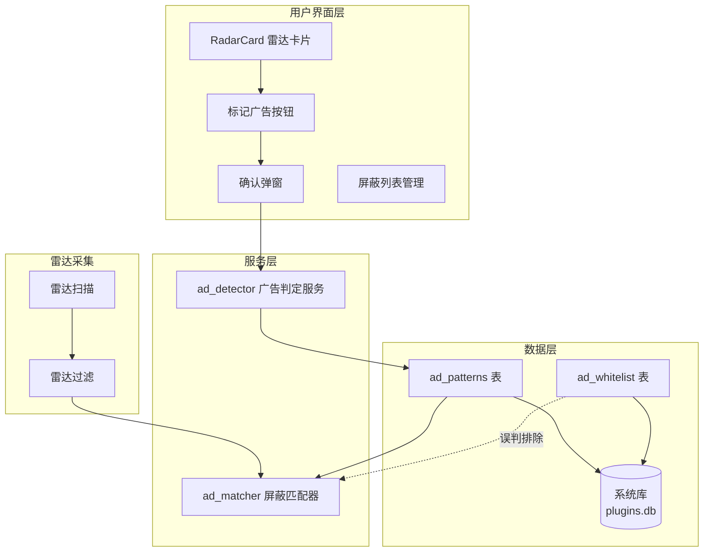
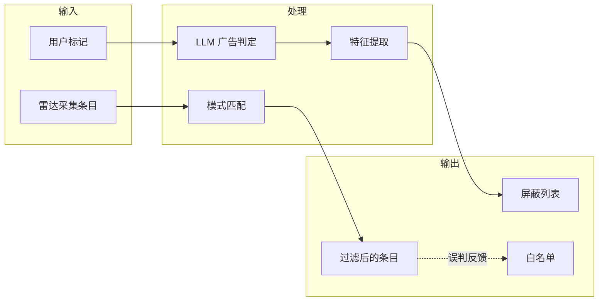
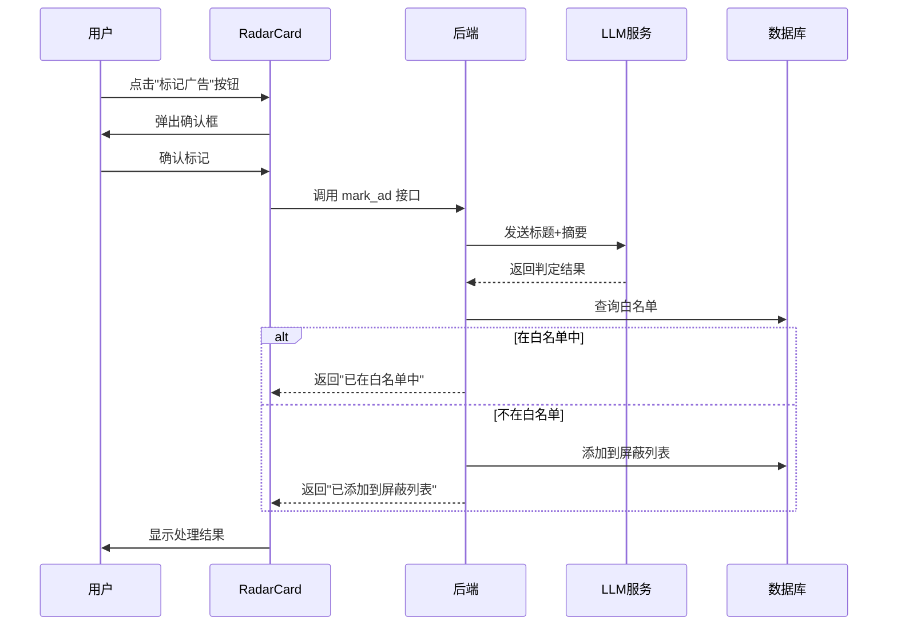
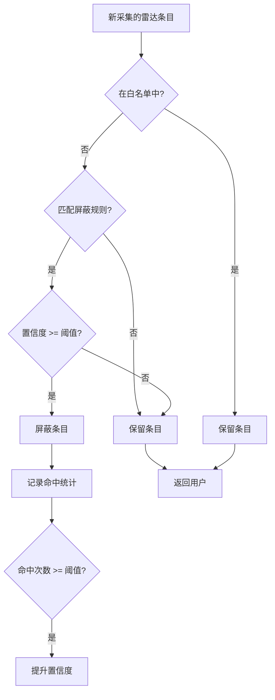
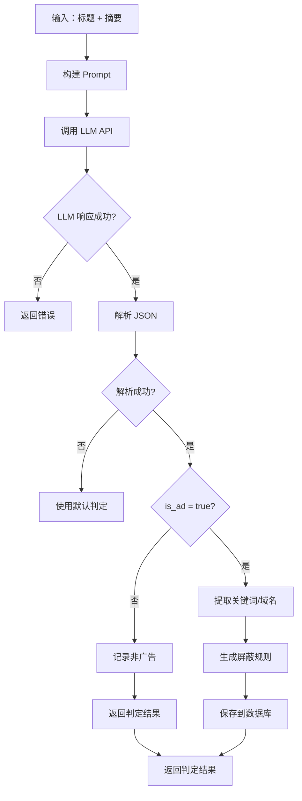
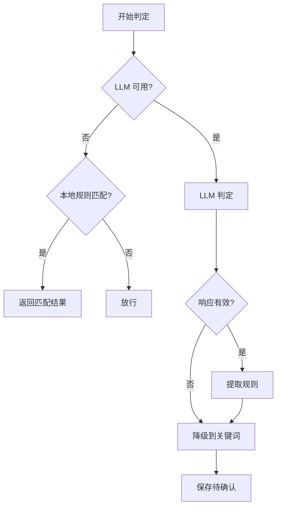

# M19.2: 广告学习功能需求规格说明书

> **版本**：V1.0
> **创建时间**：2026-08-17
> **更新时间**：2026-08-17
> **状态**：需求设计

---

## 1. 概述

### 1.1 功能定位

广告学习是情报雷达的智能增强功能，通过用户参与式标记 + LLM 智能分析，构建自适应广告屏蔽系统。

### 1.2 设计目标

| 目标 | 描述 |
|------|------|
| **用户可控** | 用户决定什么是广告，系统学习用户偏好 |
| **智能判定** | LLM 分析内容语义，而非简单关键词匹配 |
| **自动进化** | 随用户使用，系统自动完善屏蔽规则 |
| **零侵入** | 屏蔽逻辑对用户透明，不干扰正常浏览 |

### 1.3 核心价值

```
┌─────────────────────────────────────────────────────────────┐
│  用户标记 1 次广告                                          │
│        ↓                                                    │
│  LLM 提取广告特征                                            │
│        ↓                                                    │
│  系统自动屏蔽相似内容（关键词/域名/正则）                    │
│        ↓                                                    │
│  后续 100+ 条广告被自动过滤，用户零操作                       │
└─────────────────────────────────────────────────────────────┘
```

---

## 2. 系统架构

### 2.1 整体架构图



### 2.2 数据流向



---

## 3. 用户交互流程

### 3.1 广告标记流程



### 3.2 雷达数据过滤流程



---

## 4. 功能详细设计

### 4.1 UI 交互设计

#### 4.1.1 雷达卡片布局

```
┌─────────────────────────────────────────────────────────────────┐
│  ┌─────────────────────────────────────────────────────────┐    │
│  │ [来源图标] [来源名称]              [采集时间] [操作⋮] │    │
│  │─────────────────────────────────────────────────────────│    │
│  │                                                          │    │
│  │  文章标题（多行显示）                                     │    │
│  │                                                          │    │
│  │  摘要内容（最多显示3行，超出省略...）                    │    │
│  │                                                          │    │
│  │─────────────────────────────────────────────────────────│    │
│  │  [🔍 查看]  [📋 导入项目]  [🚫 标记广告]  [⭐ 收藏]    │    │
│  └─────────────────────────────────────────────────────────┘    │
└─────────────────────────────────────────────────────────────────┘
```

#### 4.1.2 确认弹窗

```
┌─────────────────────────────────────────┐
│  🚫 标记广告                            │
├─────────────────────────────────────────┤
│                                         │
│  确定要将以下内容标记为广告吗？           │
│                                         │
│  ┌─────────────────────────────────┐    │
│  │ 文章标题                          │    │
│  │ 来源：xxx.com                    │    │
│  └─────────────────────────────────┘    │
│                                         │
│  系统将分析内容特征，自动屏蔽相似广告。   │
│                                         │
├─────────────────────────────────────────┤
│              [取消]    [确认标记]        │
└─────────────────────────────────────────┘
```

#### 4.1.3 屏蔽列表管理界面

```
┌─────────────────────────────────────────────────────────────────┐
│  广告屏蔽设置                                              [×] │
├─────────────────────────────────────────────────────────────────┤
│                                                                 │
│  [搜索屏蔽规则...]                               [+ 添加规则]   │
│                                                                 │
│  ┌───────────────────────────────────────────────────────────┐  │
│  │ 关键词屏蔽                                                  │  │
│  ├───────────────────────────────────────────────────────────┤  │
│  │ 🔤 限时优惠   置信度 85%  来源：LLM学习  命中 23  [编辑][删除] │
│  │ 🔤 立即注册   置信度 72%  来源：LLM学习  命中 15  [编辑][删除] │
│  │ 🔤 低价促销   置信度 60%  来源：手动添加  命中 5   [编辑][删除] │
│  ├───────────────────────────────────────────────────────────┤  │
│  │ 域名屏蔽                                                    │  │
│  ├───────────────────────────────────────────────────────────┤  │
│  │ 🌐 ad.example.com  置信度 95%  来源：LLM学习  命中 45 [编辑][删除] │
│  ├───────────────────────────────────────────────────────────┤  │
│  │ 正则屏蔽                                                    │  │
│  ├───────────────────────────────────────────────────────────┤  │
│  │ 📋 广告.*推广  置信度 70%  来源：手动添加  命中 12  [编辑][删除] │
│  └───────────────────────────────────────────────────────────┘  │
│                                                                 │
│  ┌───────────────────────────────────────────────────────────┐  │
│  │ 误判白名单 (2)                                    [管理]  │  │
│  └───────────────────────────────────────────────────────────┘  │
│                                                                 │
│  [清空所有规则]                              [导出规则] [导入规则]│
└─────────────────────────────────────────────────────────────────┘
```

### 4.2 LLM 广告判定服务

#### 4.2.1 判定流程



#### 4.2.2 Prompt 设计

```json
{
  "system_prompt": "你是一个专业的广告识别专家。你的任务是分析给定的内容，判断其是否为广告，并提取广告特征。",
  "user_prompt": """
请分析以下内容是否为广告：

标题：{title}
来源：{source_url}
摘要：{summary}

判断标准：
1. 商业推广内容（产品促销、服务推销）
2. 夸大宣传（绝对化用语、虚假承诺）
3. 诱导行为（限时优惠、立即行动）
4. 低质量内容（标题党、内容农场）

请返回 JSON 格式的分析结果：
{
  "is_ad": true/false,           // 是否为广告
  "confidence": 0.0-1.0,          // 判定置信度
  "ad_type": "string",           // 广告类型：promotion/affiliate/malware/phishing/other
  "ad_keywords": ["string"],      // 提取的关键词
  "ad_domains": ["string"],       // 相关域名
  "reasoning": "string"           // 判定理由
}

请直接返回 JSON，不要包含其他内容。
"""
}
```

#### 4.2.3 LLM 响应示例

```json
{
  "is_ad": true,
  "confidence": 0.92,
  "ad_type": "promotion",
  "ad_keywords": ["限时优惠", "立即购买", "错过不再"],
  "ad_domains": ["promo.example.com"],
  "reasoning": "内容包含明显的促销话术和限时优惠信息，属于商业推广性质"
}
```

### 4.3 屏蔽匹配引擎

#### 4.3.1 匹配优先级

| 优先级 | 匹配类型 | 说明 |
|--------|----------|------|
| 1 | 白名单 | URL 在白名单中，直接放行 |
| 2 | 域名精确匹配 | source_url 完全匹配域名规则 |
| 3 | 关键词匹配 | 标题/摘要包含关键词 |
| 4 | 正则匹配 | 符合正则表达式规则 |

#### 4.3.2 置信度阈值

| 置信度范围 | 处理策略 |
|------------|----------|
| 95-100 | 直接屏蔽，无需确认 |
| 80-94 | 屏蔽，但记录统计 |
| 50-79 | 标记为可疑，降低展示优先级 |
| <50 | 不屏蔽，仅记录 |

#### 4.3.3 命中统计与自适应

```
屏蔽规则命中统计：
┌─────────────────────────────────────────┐
│  关键词：限时优惠                        │
│  置信度：72% (初始) → 85% (当前)       │
│  命中次数：23                           │
│  最后命中：2026-08-17 14:30            │
└─────────────────────────────────────────┘

自适应规则：
- 连续命中 10 次：置信度 +5%
- 连续命中 50 次：置信度 +10%
- 超过 100 次命中：标记为"高置信度规则"
```

---

## 5. 数据模型

### 5.1 ad_patterns 表

**用途**：存储广告屏蔽规则

**存储位置**：系统库 `plugins.db`

```sql
CREATE TABLE IF NOT EXISTS ad_patterns (
    id INTEGER PRIMARY KEY AUTOINCREMENT,
    pattern_type TEXT NOT NULL CHECK(pattern_type IN ('keyword', 'domain', 'regex')),
    pattern_value TEXT NOT NULL,
    confidence INTEGER DEFAULT 50 CHECK(confidence >= 1 AND confidence <= 100),
    source TEXT DEFAULT 'manual' CHECK(source IN ('manual', 'llm_learned')),
    hit_count INTEGER DEFAULT 0,
    consecutive_hits INTEGER DEFAULT 0,
    last_hit_at TEXT,
    enabled INTEGER DEFAULT 1,
    created_at TEXT DEFAULT (datetime('now', 'localtime')),
    updated_at TEXT DEFAULT (datetime('now', 'localtime')),
    UNIQUE(pattern_type, pattern_value)
);

CREATE INDEX idx_ad_patterns_type ON ad_patterns(pattern_type);
CREATE INDEX idx_ad_patterns_confidence ON ad_patterns(confidence DESC);
CREATE INDEX idx_ad_patterns_enabled ON ad_patterns(enabled);
```

**字段说明**：

| 字段 | 类型 | 说明 |
|------|------|------|
| id | INTEGER | 主键 |
| pattern_type | TEXT | 类型：keyword/domain/regex |
| pattern_value | TEXT | 规则值 |
| confidence | INTEGER | 置信度 1-100 |
| source | TEXT | 来源：manual/llm_learned |
| hit_count | INTEGER | 累计命中次数 |
| consecutive_hits | INTEGER | 连续命中次数 |
| last_hit_at | TEXT | 最后命中时间 |
| enabled | INTEGER | 是否启用 |
| created_at | TEXT | 创建时间 |
| updated_at | TEXT | 更新时间 |

### 5.2 ad_whitelist 表

**用途**：存储误判白名单

```sql
CREATE TABLE IF NOT EXISTS ad_whitelist (
    id INTEGER PRIMARY KEY AUTOINCREMENT,
    url_hash TEXT NOT NULL UNIQUE,
    source_url TEXT,
    added_by TEXT DEFAULT 'user',
    note TEXT,
    created_at TEXT DEFAULT (datetime('now', 'localtime'))
);
```

### 5.3 ad_feedback 表（扩展）

**用途**：记录用户反馈，用于优化 LLM

```sql
CREATE TABLE IF NOT EXISTS ad_feedback (
    id INTEGER PRIMARY KEY AUTOINCREMENT,
    item_id TEXT,
    item_title TEXT,
    item_url TEXT,
    action TEXT NOT NULL CHECK(action IN ('marked_ad', 'marked_legit', 'unmarked')),
    llm_judgment BOOLEAN,
    user_judgment BOOLEAN,
    pattern_id INTEGER,
    created_at TEXT DEFAULT (datetime('now', 'localtime')),
    FOREIGN KEY (pattern_id) REFERENCES ad_patterns(id)
);
```

---

## 6. API 接口设计

### 6.1 广告标记

```typescript
// 标记广告
invoke('mark_as_ad', {
  itemId: string,
  title: string,
  summary: string,
  sourceUrl: string
}): Promise<AdMarkResult>

interface AdMarkResult {
  success: boolean;
  patternId?: number;
  llmJudgment: {
    isAd: boolean;
    confidence: number;
    adKeywords: string[];
    reasoning: string;
  };
  message: string;
}
```

### 6.2 屏蔽列表管理

```typescript
// 列出屏蔽规则
invoke('list_ad_patterns', {
  type?: 'keyword' | 'domain' | 'regex',
  enabled?: boolean
}): Promise<AdPattern[]>

// 添加屏蔽规则
invoke('add_ad_pattern', {
  type: 'keyword' | 'domain' | 'regex',
  value: string,
  confidence?: number,
  source?: 'manual' | 'llm_learned'
}): Promise<AdPattern>

// 更新屏蔽规则
invoke('update_ad_pattern', {
  id: number,
  enabled?: boolean,
  confidence?: number
}): Promise<void>

// 删除屏蔽规则
invoke('delete_ad_pattern', { id: number }): Promise<void>
```

### 6.3 白名单管理

```typescript
// 添加到白名单
invoke('add_ad_whitelist', {
  url: string,
  note?: string
}): Promise<void>

// 移除白名单
invoke('remove_ad_whitelist', { url: string }): Promise<void>

// 列出白名单
invoke('list_ad_whitelist'): Promise<AdWhitelist[]>
```

### 6.4 广告检查

```typescript
// 检查内容是否匹配屏蔽规则
invoke('check_ad_pattern', {
  title: string,
  summary: string,
  sourceUrl: string
}): Promise<AdCheckResult>

interface AdCheckResult {
  isBlocked: boolean;
  matchedPatterns: Array<{
    id: number;
    type: string;
    value: string;
    confidence: number;
  }>;
}
```

---

## 7. 错误处理

### 7.1 异常场景

| 场景 | 处理方式 |
|------|----------|
| LLM 调用失败 | 使用默认判定规则，标记为"待确认" |
| LLM 响应格式错误 | 降级到关键词匹配 |
| 数据库写入失败 | 重试 3 次，记录错误日志 |
| 网络超时 | 降级到本地判定 |

### 7.2 降级策略



---

## 8. 隐私与安全

### 8.1 数据收集

| 数据 | 用途 | 存储 |
|------|------|------|
| 文章标题 | LLM 判定 | 临时内存 |
| 文章摘要 | LLM 判定 | 临时内存 |
| 来源 URL | 域名匹配 | 仅存哈希 |
| 判定结果 | 反馈分析 | 脱敏后存储 |

### 8.2 隐私保护

- 标题/摘要仅用于当次判定，不持久化存储
- URL 仅存储哈希值，无法还原原始 URL
- 用户反馈不关联个人身份

---

## 9. 性能要求

| 指标 | 要求 |
|------|------|
| 单条判定响应时间 | < 3 秒 |
| 屏蔽匹配响应时间 | < 10ms |
| 屏蔽列表容量 | 支持 10000+ 规则 |
| 规则匹配 QPS | > 1000/s |

---

## 10. 任务分解

| Task | 内容 | 文件 | 工时 | 状态 |
|------|------|------|------|------|
| Task 7 | 广告标记 UI | `RadarCard.tsx` | 2h | 📋 |
| Task 8 | LLM 广告判定 | `ad_detector.rs` | 3h | 📋 |
| Task 9 | 屏蔽列表管理 | `ad_patterns.rs` | 2h | 📋 |
| Task 10 | 雷达过滤集成 | `filter.rs` | 2h | 📋 |
| **合计** | | | **9h** | |

---

## 11. 验收标准

| # | 标准 | 验证方法 |
|---|------|----------|
| 1 | 每条雷达数据可见"标记广告"按钮 | UI 检查 |
| 2 | 点击后弹出确认框 | UI 交互测试 |
| 3 | LLM 判定返回结构化结果 | 模拟测试 |
| 4 | 判定正确的广告加入屏蔽列表 | 数据库检查 |
| 5 | 新采集数据自动过滤已屏蔽广告 | 采集测试 |
| 6 | 用户可查看/编辑/删除屏蔽列表 | UI 交互测试 |
| 7 | 误判可加入白名单 | UI 交互测试 |
| 8 | 命中统计正确更新 | 数据库检查 |

---

## 12. 参照文档

| 文档 | 说明 |
|------|------|
| `docs/M19其他常用网站采集扩展.md` | M19 整体需求 |
| `docs/M19实施计划.md` | 任务分解 |
| `docs/数据库设计说明书.md` §11 | 数据库表设计 |
| `docs/API接口设计说明书.md` §3.17 | API 接口定义 |

---

**文档结束**
