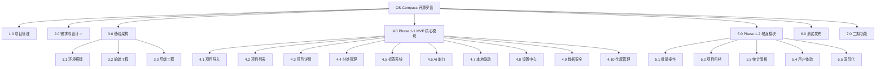

# OS-Compass WBS 分解

| **部 门：** | 研发部 / 项目管理组 |
| --- | --- |
| **编 写：** | 系统架构师 |
| **审 核：** | Charlie Liu |
| **批 准：** | Charlie Liu |
| **日 期：** | 2026-06-28 |
| **版 本：** | V3.0（分期交付） |

---

## 1. 项目周期阶段划分

| 阶段 | 说明 | 交付物 |
|------|------|--------|
| Phase 0 | 准备期 | 开发环境、工程初始化、设计文档 |
| **Phase 1-1** | MVP 核心交付 | 导入 → 分析 → 本地联动 |
| **Phase 1-2** | 增强功能 | 批量操作、统计面板、国际化 |
| Phase 2 | 二期交付 | 意图搜索、情报雷达、扩展插件 |

---

## 2. WBS 分解结构图

---

## 3. Phase 1-1 MVP 核心（约 40 个功能点）

### 3.1 项目管理

| 工作包 | 功能点 | 复杂度 | 阶段 |
|--------|--------|--------|------|
| **1.1 开发规范** | 1.1.1 代码规范（Rust/TypeScript） | 低 | MVP |
| | 1.1.2 Git 提交规范 | 低 | MVP |
| | 1.1.3 数据库变更规范 | 低 | MVP |
| **1.2 连续性保障** | 1.2.1 AGENTS.md 维护 | 低 | MVP |
| | 1.2.2 会话记录规范 | 低 | MVP |

### 3.2 基础架构

| 工作包 | 功能点 | 复杂度 | 阶段 |
|--------|--------|--------|------|
| **3.1 环境搭建** | 3.1.1 Tauri 2.0 工程初始化 | 中 | MVP |
| | 3.1.2 Rust 工具链配置 | 中 | MVP |
| | 3.1.3 pnpm 包管理器配置 | 低 | MVP |
| **3.2 前端工程** | 3.2.1 Tailwind CSS 配置 | 低 | MVP |
| | 3.2.2 Zustand 状态管理 | 低 | MVP |
| | 3.2.3 目录结构搭建 | 低 | MVP |
| **3.3 后端工程** | 3.3.1 sqlx 数据库配置 | 中 | MVP |
| | 3.3.2 数据库迁移工具 | 中 | MVP |
| | 3.3.3 日志系统 | 低 | MVP |
| **3.4 系统变量管理** | 3.4.1 system_variables 表 | 低 | MVP |
| | 3.4.2 变量 CRUD API | 中 | MVP |
| | 3.4.3 变量加密存储 | 中 | MVP |
| | 3.4.4 变量管理页面 | 低 | MVP |
| **3.5 扩展配置管理** | 3.5.1 source_plugins 表 | 低 | MVP |
| | 3.5.2 扩展列表 API | 低 | MVP |
| | 3.5.3 扩展启用/禁用 | 低 | MVP |
| | 3.5.4 扩展配置页面 | 中 | MVP |

### 3.3 项目导入

| 工作包 | 功能点 | 复杂度 | 阶段 |
|--------|--------|--------|------|
| **4.1 项目导入** | 4.1.1 URL 解析与平台识别 | 中 | MVP |
| | 4.1.2 GitHub 插件（API + 爬虫降级） | 高 | MVP |
| | 4.1.3 Gitee 插件（API + 爬虫降级） | 高 | MVP |
| | 4.1.4 NPM 插件 | 中 | MVP |
| | 4.1.5 PyPI 插件 | 中 | MVP |
| | 4.1.6 未知平台回退（爬虫/web2md） | 高 | MVP |
| | 4.1.7 手动录入表单 | 低 | MVP |
| **4.2 项目列表** | 4.2.1 看板视图（四列状态） | 中 | MVP |
| | 4.2.2 列表视图（表格） | 中 | MVP |
| | 4.2.3 项目卡片组件 | 中 | MVP |
| | 4.2.4 拖拽排序（看板） | 高 | MVP |

**Token 双轨制设计**：

| 配置情况 | 数据获取方式 | 数据质量 |
|----------|--------------|----------|
| 有 Token | 平台 API | ✅ 完整数据，可计算健康度 |
| 无 Token | 爬虫服务（web2md） | ⚠️ 部分数据，无法计算健康度 |

### 3.4 项目详情

| 工作包 | 功能点 | 复杂度 | 阶段 |
|--------|--------|--------|------|
| **4.3 项目详情** | 4.3.1 概览标签页 | 中 | MVP |
| | 4.3.2 AI 报告标签页 | 中 | MVP |
| | 4.3.3 Runbook 标签页 | 中 | MVP |
| | 4.3.4 README 标签页 | 高 | MVP |
| | 4.3.5 克隆标签页 | 中 | MVP |
| | 4.3.6 Releases 标签页 | 中 | MVP |
| | 4.3.7 本地笔记标签页 | 低 | MVP |
| | 4.3.8 用户信息标签页 | 中 | MVP |

### 3.5 分类管理

| 工作包 | 功能点 | 复杂度 | 阶段 |
|--------|--------|--------|------|
| **5.1 分类树** | 5.1.1 分类 CRUD | 中 | MVP |
| | 5.1.2 多层级树形结构 | 高 | MVP |
| | 5.1.3 系统分类"未分类" | 低 | MVP |
| **5.2 AI 智能分类** | 5.2.1 分类栏 AI 分类按钮 | 中 | MVP |
| | 5.2.2 LLM 语义匹配分类 | 中 | MVP |

### 3.6 标签系统

| 工作包 | 功能点 | 复杂度 | 阶段 |
|--------|--------|--------|------|
| **6.1 标签管理** | 6.1.1 tags 表 CRUD | 低 | MVP |
| | 6.1.2 LLM 提取标签 | 中 | MVP |
| | 6.1.3 用户添加/删除标签 | 低 | MVP |
| | 6.1.4 标签筛选 | 低 | MVP |

### 3.7 AI 能力

| 工作包 | 功能点 | 复杂度 | 阶段 |
|--------|--------|--------|------|
| **7.1 LLM 服务** | 7.1.1 LLM 供应商配置（自由配置） | 中 | MVP |
| | 7.1.2 容错降级机制 | 中 | MVP |
| **7.2 AI 分析** | 7.2.1 健康度评分（差异化） | 高 | MVP |
| | 7.2.2 AI 评估摘要生成 | 高 | MVP |
| **7.3 Markdown 处理** | 7.3.1 Markdown 渲染组件 | 中 | MVP |
| | 7.3.2 XSS 防护 | 中 | MVP |
| | 7.3.3 Markdown 编辑器（EasyMDE） | 中 | MVP |
| | 7.3.4 HTML 转 Markdown（turndown） | 中 | MVP |

### 3.8 本地联动

| 工作包 | 功能点 | 复杂度 | 阶段 |
|--------|--------|--------|------|
| **8.1 下载管理** | 8.1.1 git clone 下载 | 高 | MVP |
| | 8.1.2 下载进度显示 | 中 | MVP |
| | 8.1.3 代理配置支持 | 中 | MVP |
| **8.2 IDE 集成** | 8.2.1 打开本地目录 | 低 | MVP |
| | 8.2.2 VS Code 打开 | 低 | MVP |

### 3.9 设置中心

| 工作包 | 功能点 | 复杂度 | 阶段 |
|--------|--------|--------|------|
| **9.1 通用设置** | 9.1.1 数据目录配置 | 低 | MVP |
| **9.2 LLM 设置** | 9.2.1 供应商选择 | 低 | MVP |
| | 9.2.2 API 配置 | 中 | MVP |

### 3.10 数据安全

| 工作包 | 功能点 | 复杂度 | 阶段 |
|--------|--------|--------|--------|
| **10.1 加密服务** | 10.1.1 AES-256-GCM 加密 | 中 | MVP |
| | 10.1.2 OS 密钥库集成 | 高 | MVP |
| **10.2 数据保险箱** | 10.2.1 敏感信息加密存储 | 中 | MVP |
| | 10.2.2 点击复制 | 低 | MVP |

### 3.11 仓库管理

| 工作包 | 功能点 | 复杂度 | 阶段 |
|--------|--------|--------|------|
| **5.11 仓库管理** | 5.11.1 仓库索引管理（vault-index.json 读写） | 低 | MVP |
| | 5.11.2 创建仓库（指定名称和目录，初始化 db） | 中 | MVP |
| | 5.11.3 仓库列表（显示名称、路径、项目数） | 低 | MVP |
| | 5.11.4 切换仓库（验证有效性后切换） | 中 | MVP |
| | 5.11.5 删除仓库（仅移除索引/彻底删除文件） | 中 | MVP |
| | 5.11.6 仓库验证（文件存在、可打开、表结构完整） | 中 | MVP |
| | 5.11.7 启动加载（自动打开上次仓库） | 低 | MVP |
| | 5.11.8 导入已有仓库（校验齐全有效后登记回清单） | 中 | MVP |
| | 5.11.9 初始化向导（首次启动引导创建/选择仓库） | 中 | M16 |

---

## 4. Phase 1-2 增强功能（约 30 个功能点）

### 4.1 批量操作

| 工作包 | 功能点 | 复杂度 | 阶段 |
|--------|--------|--------|------|
| **5.1 批量操作** | 5.1.1 复选框多选 | 低 | 1-2 |
| | 5.1.2 批量移动分类 | 中 | 1-2 |
| | 5.1.3 批量归档 | 中 | 1-2 |
| | 5.1.4 批量导出（JSON/CSV） | 中 | 1-2 |

### 4.2 项目归档

| 工作包 | 功能点 | 复杂度 | 阶段 |
|--------|--------|--------|------|
| **5.2 项目归档** | 5.2.1 归档字段（archived_at） | 低 | 1-2 |
| | 5.2.2 归档列表查看 | 低 | 1-2 |
| | 5.2.3 恢复归档 | 低 | 1-2 |
| | 5.2.4 永久删除 | 中 | 1-2 |

### 4.3 统计面板

| 工作包 | 功能点 | 复杂度 | 阶段 |
|--------|--------|--------|------|
| **5.3 统计面板** | 5.3.1 健康度分布统计 | 中 | 1-2 |
| | 5.3.2 分类分布统计 | 中 | 1-2 |
| | 5.3.3 语言分布统计 | 中 | 1-2 |
| | 5.3.4 标签使用统计 | 中 | 1-2 |

### 4.4 用户体验

| 工作包 | 功能点 | 复杂度 | 阶段 |
|--------|--------|--------|------|
| **5.4 UI 状态** | 5.4.1 骨架屏/Loading | 低 | 1-2 |
| | 5.4.2 错误状态展示 | 低 | 1-2 |
| | 5.4.3 空状态设计 | 低 | 1-2 |
| **5.5 国际化** | 5.5.1 i18n 框架集成 | 中 | 1-2 |
| | 5.5.2 中文/English 界面 | 低 | 1-2 |

### 4.5 增强功能

| 工作包 | 功能点 | 复杂度 | 阶段 |
|--------|--------|--------|------|
| **5.6 分类管理增强** | 5.6.1 拖拽调整层级 | 高 | 1-2 |
| **5.7 标签增强** | 5.7.1 标签管理页面 | 低 | 1-2 |
| **5.8 设置增强** | 5.8.1 主题设置 | 低 | 1-2 |
| | 5.8.2 默认编辑器配置 | 低 | 1-2 |
| **5.9 本地联动增强** | 5.9.1 本地文件状态同步 | 中 | 1-2 |
| **5.10 AI 增强** | 5.10.1 README 多语言版本选择 | 低 | 1-2 |
| | 5.10.2 刷新 README | 低 | 1-2 |

---

## 5. Phase 2 二期功能

### 5.1 M13: 意图搜索与情报雷达（约 30 个功能点）

#### 5.1.1 插件管理基础设施

| 工作包 | 功能点 | 复杂度 | 阶段 |
|--------|--------|--------|------|
| **13.1 FeaturePlugin 基础设施** | 13.1.1 FeaturePlugin trait + 类型定义 | 中 | M13 |
| | 13.1.2 DbMode 枚举 + 路径规则解析 | 中 | M13 |
| | 13.1.3 PluginContext + PluginError | 低 | M13 |
| **13.2 数据库层** | 13.2.1 plugin_config_db（独立配置库） | 中 | M13 |
| | 13.2.2 plugins.db 表结构（system_plugins） | 低 | M13 |
| | 13.2.3 open_db_at_path 工具函数 | 低 | M13 |
| **13.3 PluginManager** | 13.3.1 PluginRegistry + 注册机制 | 中 | M13 |
| | 13.3.2 插件生命周期管理 | 中 | M13 |
| | 13.3.3 占位插件实现（Radar/Search） | 低 | M13 |
| **13.4 插件命令** | 13.4.1 list_feature_plugins | 低 | M13 |
| | 13.4.2 set_plugin_enabled | 低 | M13 |
| | 13.4.3 get/save_plugin_config | 低 | M13 |
| | 13.4.4 plugin_get_db_path | 低 | M13 |

#### 5.1.2 信息源引擎

| 工作包 | 功能点 | 复杂度 | 阶段 |
|--------|--------|--------|------|
| **13.5 SourceAdapter** | 13.5.1 SourceAdapter trait | 中 | M13 |
| | 13.5.2 RawContent 结构体 | 低 | M13 |
| | 13.5.3 get_adapter 工厂函数 | 低 | M13 |
| | 13.5.4 build_client 工具函数 | 低 | M13 |
| **13.6 适配器实现** | 13.6.1 RssAdapter（RSS/Atom 解析） | 中 | M13 |
| | 13.6.2 WebCrawlAdapter（web2md HTTP API） | 中 | M13 |
| | 13.6.3 TelegramAdapter（TG 频道爬取） | 中 | M13 |
| | 13.6.4 PlatformPresetAdapter（GitHub/Gitee Trending） | 低 | M13 |
| **13.7 LLM 解析器** | 13.7.1 parse_content_with_llm | 中 | M13 |
| | 13.7.2 ParsedProjectInfo 结构体 | 低 | M13 |

#### 5.1.3 情报雷达插件

| 工作包 | 功能点 | 复杂度 | 阶段 |
|--------|--------|--------|------|
| **13.8 RadarPlugin 核心** | 13.8.1 init_radar_db（插件库表初始化） | 低 | M13 |
| | 13.8.2 定时扫描循环 | 中 | M13 |
| | 13.8.3 URL 去重（url_hash） | 低 | M13 |
| | 13.8.4 LLM 解析调用 | 中 | M13 |
| | 13.8.5 系统通知推送 | 低 | M13 |
| **13.9 雷达命令** | 13.9.1 雷达信息源 CRUD | 低 | M13 |
| | 13.9.2 get_radar_items | 低 | M13 |
| | 13.9.3 radar_item_action（import/blacklist/ignore） | 中 | M13 |
| | 13.9.4 trigger_radar_scan | 低 | M13 |
| | 13.9.5 get_radar_unread_count | 低 | M13 |
| | 13.9.6 clear_radar_cache | 低 | M13 |

#### 5.1.4 意图搜索插件

| 工作包 | 功能点 | 复杂度 | 阶段 |
|--------|--------|--------|------|
| **13.10 SearchPlugin 核心** | 13.10.1 init_search_db（插件库表初始化） | 低 | M13 |
| | 13.10.2 三层搜索架构 | 高 | M13 |
| | 13.10.3 LLM 关键词提取 | 中 | M13 |
| | 13.10.4 本地库搜索 | 中 | M13 |
| | 13.10.5 缓存搜索 | 中 | M13 |
| | 13.10.6 联网搜索（多策略） | 高 | M13 |
| **13.11 搜索命令** | 13.11.1 intent_search | 中 | M13 |
| | 13.11.2 get/clear_search_history | 低 | M13 |
| | 13.11.3 搜索信息源 CRUD | 低 | M13 |
| | 13.11.4 refresh_search_cache | 低 | M13 |
| | 13.11.5 import_search_result | 低 | M13 |

#### 5.1.5 前端集成

| 工作包 | 功能点 | 复杂度 | 阶段 |
|--------|--------|--------|------|
| **13.12 前端 API 层** | 13.12.1 plugin.ts API | 低 | M13 |
| | 13.12.2 radar.ts API | 低 | M13 |
| | 13.12.3 search.ts API | 低 | M13 |
| **13.13 UI 组件** | 13.13.1 RadarInbox 收件箱视图 | 中 | M13 |
| | 13.13.2 SearchView 搜索视图 | 中 | M13 |
| | 13.13.3 PluginSettings 插件管理面板 | 中 | M13 |
| | 13.13.4 插件配置弹窗 | 中 | M13 |
| **13.14 导航集成** | 13.14.1 Sidebar 雷达/搜索按钮 | 低 | M13 |
| | 13.14.2 App.tsx 视图路由 | 低 | M13 |
| | 13.14.3 未读徽标更新 | 低 | M13 |
| **13.15 i18n + 暗色** | 13.15.1 zh.json/en.json 翻译键 | 低 | M13 |
| | 13.15.2 暗色模式覆盖 | 低 | M13 |

#### 5.1.6 架构完善（本期新增）

| 工作包 | 功能点 | 复杂度 | 阶段 |
|--------|--------|--------|------|
| **13.16 插件配置存储** | 13.16.1 plugin_config_db.rs 实现 | 中 | M13 |
| | 13.16.2 独立配置库路径设计 | 低 | M13 |
| | 13.16.3 操作域层次设计 | 中 | M13 |
| **13.17 设计文档** | 13.17.1 插件接入规范完善 | 中 | M13 |
| | 13.17.2 数据库设计说明书更新 | 低 | M13 |
| | 13.17.3 API 接口设计说明书更新 | 低 | M13 |
| | 13.17.4 原型功能对照表更新 | 低 | M13 |
| **13.18 前端 UI 重构** | 13.18.1 Settings 功能插件标签页重构 | 中 | M13 |
| | 13.18.2 插件配置弹窗实现 | 中 | M13 |
| | 13.18.3 插件统计信息显示 | 低 | M13 |

---

## 6. Phase 2 扩展插件（M14）

| 工作包 | 功能点 | 复杂度 | 阶段 |
|--------|--------|--------|------|
| **6.1 GitLab 扩展** | 6.1.1 GitLab API 集成 | 高 | M14 |
| | 6.1.2 项目导入 | 中 | M14 |
| | 6.1.3 健康度评分 | 高 | M14 |
| **6.2 Docker Hub 扩展** | 6.2.1 Docker Hub API 集成 | 高 | M14 |
| | 6.2.2 镜像统计 | 中 | M14 |
| | 6.2.3 项目卡片 | 中 | M14 |
| **6.3 插件热加载** | 6.3.1 插件清单格式 | 中 | M14 |
| | 6.3.2 动态注册机制 | 高 | M14 |
| | 6.3.3 生命周期管理 | 中 | M14 |
| | 6.3.4 隔离沙箱 | 高 | M14 |
| **6.4 插件市场** | 6.4.1 市场 UI | 中 | M14 |
| | 6.4.2 安装/卸载 | 中 | M14 |
| | 6.4.3 插件详情 | 低 | M14 |
| **6.5 备份恢复** | 6.5.1 自动备份 | 低 | M14 |
| | 6.5.2 手动备份 | 低 | M14 |
| | 6.5.3 恢复功能 | 中 | M14 |
| **6.6 帮助系统** | 6.6.1 新手引导 | 中 | M14 |
| | 6.6.2 快捷键系统 | 中 | M14 |
| **M14 小计** | | **16** | |

## 6.7 Phase 2 主页增强（M15）

| 工作包 | 功能点 | 复杂度 | 阶段 |
|--------|--------|--------|------|
| **6.7.1 首页/引导页** | 6.7.1.1 极简输入框 | 中 | M15 |
| | 6.7.1.2 URL 平台识别 | 中 | M15 |
| | 6.7.1.3 最近项目列表 | 低 | M15 |
| | 6.7.1.4 快捷入口 | 低 | M15 |
| **6.7.2 新手引导** | 6.7.2.1 引导流程 | 中 | M15 |
| | 6.7.2.2 首次启动检测 | 低 | M15 |
| **M15 小计** | | **5** | |

---

## 7. 功能点统计

| 阶段 | 模块 | 功能点数量 | 高 | 中 | 低 |
|------|------|----------|---|---|---|---|
| **Phase 1-1 MVP** | 基础架构 | 11 | 0 | 4 | 7 |
| | 项目导入 | 8 | 3 | 4 | 1 |
| | 项目列表 | 4 | 1 | 3 | 0 |
| | 项目详情 | 8 | 1 | 4 | 3 |
| | 分类管理 | 5 | 1 | 2 | 2 |
| | 标签系统 | 4 | 0 | 1 | 3 |
| | AI 能力 | 8 | 2 | 4 | 2 |
| | 本地联动 | 5 | 1 | 2 | 2 |
| | 设置中心 | 2 | 0 | 1 | 1 |
| | 数据安全 | 3 | 1 | 1 | 1 |
| | 仓库管理 | 8 | 0 | 5 | 3 |
| **MVP 小计** | | **66** | **9** | **31** | **26** |
| **Phase 1-2 增强** | 批量操作 | 4 | 0 | 3 | 1 |
| | 项目归档 | 4 | 0 | 1 | 3 |
| | 统计面板 | 4 | 0 | 4 | 0 |
| | 用户体验 | 5 | 0 | 1 | 4 |
| | 国际化 | 2 | 0 | 1 | 1 |
| | 增强功能 | 7 | 1 | 3 | 3 |
| **1-2 小计** | | **26** | **1** | **13** | **12** |
| **Phase 2 M13** | 插件基础设施 | 14 | 0 | 7 | 7 |
| | 信息源引擎 | 11 | 0 | 6 | 5 |
| | 情报雷达插件 | 11 | 0 | 4 | 7 |
| | 意图搜索插件 | 11 | 1 | 5 | 5 |
| | 前端集成 | 12 | 0 | 4 | 8 |
| **M13 小计** | | **59** | **1** | **26** | **32** |
| **Phase 2 M14** | GitLab 适配器 | 2 | 0 | 1 | 1 |
| | Docker Hub 适配器 | 2 | 0 | 1 | 1 |
| | 插件热加载 | 3 | 1 | 1 | 1 |
| | 本地插件管理 | 2 | 0 | 1 | 1 |
| | 备份恢复 | 3 | 0 | 1 | 2 |
| | 新手引导 | 2 | 0 | 1 | 1 |
| | 快捷键系统 | 2 | 0 | 1 | 1 |
| | i18n + 构建 | 2 | 0 | 0 | 2 |
| **M14 小计** | | **18** | **1** | **7** | **10** |
| **Phase 2 M15** | 首页/引导页 | 4 | 0 | 2 | 2 |
| | 导航优化 | 1 | 0 | 1 | 0 |
| **M15 小计** | | **5** | **0** | **3** | **2** |
| **二期小计** | | **82** | **2** | **36** | **44** |
| **总计** | | **174** | **12** | **80** | **82** |

---

## 7. 原型清单

| # | 原型 | 阶段 | 状态 |
|---|------|------|------|
| 1 | main-interface.html | MVP | ✅ |
| 2 | list-view.html | MVP | ✅ |
| 3 | import-form.html | MVP | ✅ |
| 4 | import-confirm.html | MVP | ✅ |
| 5 | manual-add.html | MVP | ✅ |
| 6 | project-detail.html | MVP | ✅ |
| 7 | category-manager.html | MVP | ✅ |
| 8 | tag-manager.html | MVP | ✅ |
| 9 | settings.html | MVP | ✅ |
| 10 | plugin-manager.html | MVP | ✅ |
| 11 | search-view.html | M13 | ✅ |
| 12 | radar-inbox.html | M13 | ✅ |
| 13 | archive.html | 1-2 | ✅ |
| 14 | vault-manager.html | 1-2 | ✅ |
| 15 | plugin-market.html | M14 | ✅ |
| 16 | home.html | M15 | ✅ |

---

## 8. Phase 2 M13 交付物清单

### M13 交付物

| 交付物 | 说明 |
|--------|------|
| FeaturePlugin trait | 插件接口定义 + DbMode + PluginContext |
| PluginManager | 插件注册、启停、配置管理 |
| SourceAdapter | 信息源统一抽象层 |
| RssAdapter | RSS/Atom 解析适配器 |
| WebCrawlAdapter | web2md 爬虫适配器 |
| TelegramAdapter | TG 频道爬取适配器 |
| PlatformPresetAdapter | GitHub/Gitee Trending 预设 |
| LLM Parser | 原始内容 -> 结构化项目信息 |
| RadarPlugin | 情报雷达插件（定时扫描 + 收件箱） |
| SearchPlugin | 意图搜索插件（三层搜索） |
| RadarInbox UI | 情报雷达收件箱视图 |
| SearchView UI | 意图搜索对话视图 |
| 插件管理面板 | 设置中心插件管理标签页 |

---

## 9. Phase 2 M14 交付物清单

### M14 交付物

| 交付物 | 说明 |
|--------|------|
| GitLab 适配器 | GitLab API 集成、项目导入、健康度评分 |
| Docker Hub 适配器 | Docker Hub API 集成、镜像统计 |
| 插件热加载 | 动态加载第三方插件 |
| 插件市场 UI | 插件浏览、安装、卸载 |
| 备份恢复 | 数据库备份与恢复 |
| 新手引导 | 首次使用引导流程 |
| 快捷键系统 | 全局快捷键支持 |

### M15 交付物

| 交付物 | 说明 |
|--------|------|
| 首页/引导页 | 极简输入框、URL 识别、最近项目 |
| 导航优化 | Logo 点击返回主页 |

---

## 10. 依赖关系

---

## 11. 交付物清单

### Phase 1-1 MVP 核心交付物

| 交付物 | 说明 |
|--------|------|
| Tauri 桌面客户端 | 可运行的 MVP 版本 |
| 项目导入 | URL 导入 → AI 分析 → 本地下载 |
| 健康度评分 | GitHub/Gitee/NPM/PyPI 平台支持 |
| AI 报告 | LLM 生成评估摘要、Runbook |
| 设置中心 | LLM/代理/目录配置 |

### Phase 1-2 增强交付物

| 交付物 | 说明 |
|--------|------|
| 批量操作 | 复选框多选、批量移动/归档/导出 |
| 统计面板 | 健康度/分类/语言/标签分布 |
| 项目归档 | 归档查看、恢复、永久删除 |
| 界面国际化 | 中英文切换 |
| UI 状态优化 | 空状态、错误状态、主题切换 |
| 仓库管理 | 多仓库管理、数据隔离 |

---

**最后更新**：2026-07-11（新增 Phase 2 M13 WBS 分解，59 个功能点）
