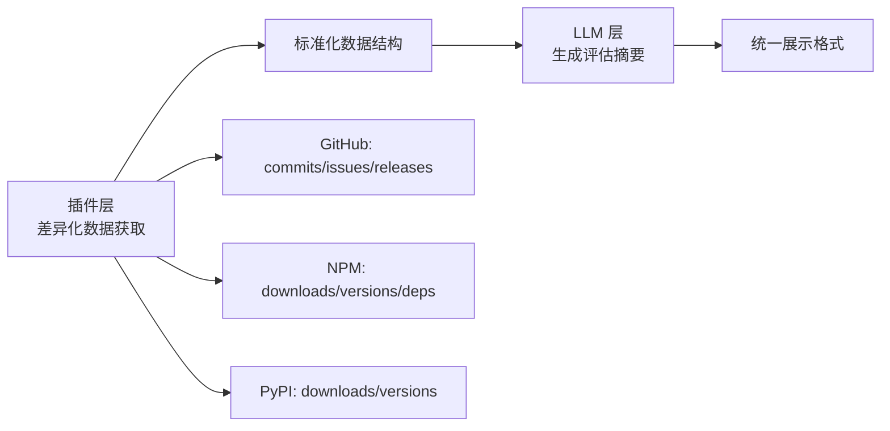
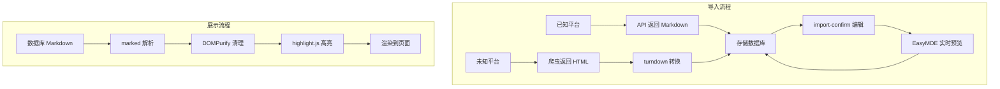

# OS-Compass 需求规格说明书

版本：v1.3
日期：2026-07-08

## 1. 文档目的

本文档在《OS-Compass (开源罗盘) V1.0 PRD》的基础上，将产品需求固化为可验收的软件需求规格。后续的客户端 UI 开发、Tauri/Rust 后端接口编写、SQLite 数据库迁移（Migration）设计、测试验收以及扩展插件框架建设，均以本文档为工程需求基线。

**版本历史**：

| 版本 | 日期 | 变更说明 |
|------|------|----------|
| v1.0 | 2026-06-24 | 初始版本 |
| v1.1 | 2026-06-28 | 补充 Phase 1-2 增强功能需求 |
| v1.2 | 2026-06-29 | 补充批量操作、国际化等需求 |
| v1.3 | 2026-07-08 | 补充翻译稳定性、Releases、AI智能分类、仓库管理等需求 |
| v1.4 | 2026-07-10 | 仓库管理模块新增「导入已有仓库」功能 |

## 2. 项目背景

随着开源生态爆炸式增长，开发者面临"收藏即吃灰"、"环境难配难跑通"、"带着业务找轮子效率低"三大痛点。现有工具（如浏览器书签、单纯的 GitHub 标星工具）缺乏 AI 深度解析、结构化归类与本地环境联动的能力。

新系统需要建设一个基于"本地优先（Local-First）"的跨平台桌面客户端，结合大语言模型（LLM）的智能解析与翻译能力，以及本地工作区联动（如下载部署），为开发者提供一款安全、私密、极客化的开源资产智能管家。

## 3. 目标与范围

### 3.1 项目目标

- **构建跨平台桌面客户端**：采用 Tauri (Rust + Webview) 框架，确保极致轻量、低内存占用及系统原生文件读写权限。
- **实现 AI 赋能的全流程闭环**：通过调用 LLM 接口，实现 URL 到多层级分类的自动映射、外文 README 智能翻译、健康度体检、以及二次开发/部署步骤的结构化提取。
- **实现"本地工作区"联动**：打通操作系统的 Git 进程，支持基于前端 UI 配置的代码一键克隆与 IDE 唤起。
- **确立类 Obsidian 插件化架构**：系统核心保持高度克制，情报雷达、联网意图搜索模块以插件形态集成。

### 3.2 MVP 范围

首批实现并验证以下核心链路以证明架构可行性：

- **核心框架与存储**：完成 Tauri 基础外壳开发，实现本地 SQLite 数据库的初始化与读写。
- **分类与入库模块**：实现前端多层级分类树管理；实现"粘贴开源平台链接 -> 异步抓取 -> LLM 提取标签与 Runbook -> 生成本地资产卡片"的完整链路。
- **前端设置中心与联动**：实现可视化的全局系统设置 UI（LLM Key 存储、Proxy 代理表单、存储目录选择）；实现遵循代理规则的本地 `git clone` 代码下载联动。
- **基础视图展示**：实现基础的列表查询视图与四栏生命周期看板（Kanban）视图。
- **用户信息管理**：每个项目内置数据保险箱，存储密码/Token 等敏感信息。

### 3.3 一期明确排除

以下功能为二期或插件实现，一期不包含：

- 意图搜索（RAG 联网检索）
- 情报雷达（RSS/资讯抓取）
- 插件系统 API

## 4. 用户角色

- **极客/独立开发者**：日常浏览寻找酷炫项目，使用其作为跨平台的超级书签和一键测试工具。
- **架构师/企业技术负责人**：利用系统的健康度分析、License 合规审查功能，进行企业级开源组件的技术选型与安全排雷。
- **跨界探索者（如 PM/前端试水 AI）**：高度依赖系统的 AI Runbook（部署向导）与翻译功能，克服语言和底层环境依赖的壁垒。

## 5. 功能需求

### 5.1 项目导入来源

| 来源类型 | 平台 | 说明 |
|----------|------|------|
| URL 自动导入 | GitHub、Gitee、NPM、PyPI | 一期支持 |
| 未知平台回退 | 任意 URL | 爬虫转 markdown → 用户确认 → 标记"未评分" |
| 手动录入 | - | 满足私有仓库、内网项目 |

**平台探针逻辑**：
- 根据 URL 域名/路径自动识别平台
- 调用对应平台的开放 API 抓取项目元数据（Stars、Language、README）
- 支持 Gitee API 需用户配置 Token（可选）

**未知平台回退策略**：

| 场景 | 处理方式 | 数据标记 |
|------|----------|----------|
| 已知平台 | SourcePlugin 抓取 API 数据 | 正常入库，含健康度评分 |
| 未知平台 + 爬虫成功 | 用户确认 markdown 内容 | `is_scored = false` |
| 未知平台 + 爬虫失败 | 用户手动输入 | `is_scored = false` |

**确认页面交互**：
- 页面加载时自动从 `document.title` 提取项目名称
- 提供"从标题提取"按钮可重新生成
- 智能截取规则：取标题第一个分隔符前的内容，去除括号等冗余字符

**"未评分"状态限制**：
- 不计算健康度评分，显示"未评分"标签
- 不触发数据完整性校验
- 可手动触发 AI 分析，但结果仅供参考

### 5.2 多语言支持

#### 5.2.1 编程语言多选

**背景**：单一 `language` 字段无法准确描述混合语言项目。

**设计方案**：
| 设计项 | 说明 |
|--------|------|
| 存储结构 | JSON 数组，如 `["TypeScript", "JavaScript", "CSS"]` |
| 主要语言 | 数组第一个元素为"主要语言" |
| 二次分析 | LLM 可分析代码结构补充语言列表 |
| 前端展示 | 显示多个语言徽章 |

**筛选交互**：
- 筛选器为多选下拉框
- 支持"包含任意一个"和"包含全部"两种模式
- 显示已选语言徽章

#### 5.2.2 标签系统

**标签来源**：

| 来源 | 说明 | 优先级 |
|------|------|--------|
| LLM 提取 | 导入时 AI 分析项目关键词 | 初始标签 |
| 用户添加 | 手动输入，数量无限制 | 可覆盖 LLM |
| 预设标签 | 系统预设常用标签（可选） | 辅助筛选 |

**标签属性**：

| 字段 | 类型 | 说明 |
|------|------|------|
| id | INTEGER | 标签唯一标识 |
| name | VARCHAR(50) | 标签名称 |
| color | VARCHAR(7) | 标签颜色（可选） |
| source | VARCHAR(20) | 来源：ai / user / preset |

**项目-标签关系**：
- 多对多关系，一个项目可有多个标签
- 一个标签可关联多个项目
- 独立 `project_tags` 关联表

**AI 分析契约**（LLM 输出 JSON Schema）：

```json
{
  "summary": "string (< 50字简介)",
  "category_id": "number (匹配的最佳分类ID)",
  "languages": ["string (编程语言列表)"],
  "tags": ["string (3-5个技术标签)"],
  "evaluation": {
    "health_score": "number (0-100健康度)",
    "license_safe": "boolean (License是否友好)",
    "activity": "string (团队活跃度描述)"
  },
  "runbook": {
    "requirements": ["string (前置环境要求)"],
    "install_steps": ["string (安装步骤)"],
    "run_steps": ["string (运行步骤)"],
    "dev_entry": ["string (二次开发入口路径)"]
  }
}
```

**标签管理功能**：
| 功能 | 说明 |
|------|------|
| 添加标签 | 输入标签名，自动创建或关联已有标签 |
| 删除标签 | 移除项目与标签的关联 |
| 标签筛选 | 按标签筛选项目列表 |
| 标签统计 | 显示各标签下的项目数量 |

### 5.3 AI 评估摘要

**设计原则**：AI 评估摘要由插件提供差异化数据，LLM 统一生成摘要文本。

**评估维度**：

| 维度 | 说明 | 主观/客观 |
|------|------|----------|
| 成熟度 | 项目稳定性和社区接受度 | 主观（基于客观数据） |
| 学习曲线 | 新手上手难度 | 主观 |
| 社区活跃度 | Issue/PR 响应情况 | 主观 |
| 商业友好度 | License 风险评估 | 客观 |

**平台差异化数据源**：

| 平台 | 可用数据 | 评估指标 |
|------|----------|----------|
| **GitHub/Gitee** | commits, issues, releases, contributors, forks | 提交活跃度、Issue 闭环率、版本迭代速度、贡献者规模 |
| **NPM** | downloads, versions, dependencies, maintainers | 下载热度、版本活跃度、依赖健康度、维护者状态 |
| **PyPI** | downloads, versions, release_status, author | 下载热度、版本稳定性、发布规范性 |

**数据流向**：



**插件接口扩展**：

```rust
/// 插件扩展接口 - 获取评估数据
pub trait EvaluationDataProvider {
    /// 获取平台特定的可评估数据
    fn get_evaluation_data(&self, url: &str) -> EvaluationData;
}

/// 标准化评估数据结构
pub struct EvaluationData {
    // GitHub/Gitee 特有
    pub commit_frequency: Option<f32>,      // 提交频率
    pub issue_response_rate: Option<f32>,   // Issue 响应率
    pub release_frequency: Option<f32>,     // 发布频率
    pub contributor_count: Option<u32>,     // 贡献者数量
    
    // NPM 特有
    pub weekly_downloads: Option<u64>,      // 周下载量
    pub version_count: Option<u32>,         // 版本数
    pub dependency_count: Option<u32>,      // 依赖数
    
    // 通用
    pub license_type: Option<String>,       // License 类型
    pub star_count: Option<u32>,            // Star 数
}
```

**AI 分析契约**（扩展）：

```json
{
  "summary": "string (< 50字简介)",
  "category_id": "number (匹配的最佳分类ID)",
  "languages": ["string (编程语言列表)"],
  "tags": ["string (3-5个技术标签)"],
  "ai_evaluation": {
    "maturity": "string (成熟度评价)",
    "learning_curve": "string (学习曲线评价)",
    "community_activity": "string (社区活跃度评价)",
    "commercial_friendly": "string (商业友好度评价)"
  },
  "evaluation_data": {
    "commit_frequency": "number (可选)",
    "issue_response_rate": "number (可选)",
    "weekly_downloads": "number (可选)"
  },
  "runbook": { ... }
}
```

### 5.4 README 处理机制

#### 5.4.1 获取时机

| 时机 | 行为 |
|------|------|
| 项目导入时 | 自动抓取 README（优先多语言版本） |
| 手动刷新 | 用户点击"刷新 README"按钮 |

#### 5.4.2 多语言 README 处理

| 场景 | 行为 |
|------|------|
| 存在多语言版本 | 列出可选语言，用户选择后加载对应 README |
| 仅有单一语言 | 加载该 README，不可切换语言 |
| 非目标语言 | 自动/手动触发 LLM 翻译 |

**多语言文件识别**：
- `README_zh.md`、`README_ja.md`、`README_ko.md` 等
- `docs/zh/README.md`、`i18n/zh/README.md` 等

#### 5.4.3 定期更新机制

| 方案 | 说明 | 默认 |
|------|------|------|
| 关闭 | 完全手动更新 | - |
| 智能检测 | 检测 README 哈希变化，提示用户 | ✅ |
| 自动同步 | 定期自动抓取最新 README | - |

**智能检测流程**：
```
定期检测（可配置：每天/每周/关闭）
    ↓
比对 README 哈希值
    ↓
哈希变化？ → 是 → Toast 提示"README 已更新，是否刷新？"
    ↓
用户点击"刷新" → 更新 README + 重新翻译
```

#### 5.4.4 数据结构

```rust
pub struct ReadmeContent {
    pub versions: HashMap<String, ReadmeVersion>, // key: 语言代码
    pub selected_language: String,                 // 当前选中语言
    pub translations: HashMap<String, String>,     // 翻译版本
    pub hash: String,                              // 当前内容哈希
    pub last_fetched: DateTime,                   // 最后抓取时间
}

pub struct ReadmeVersion {
    pub language: String,      // 语言代码
    pub source_file: String,   // 来源文件名
    pub content: String,       // 原始内容
    pub hash: String,          // 内容哈希
}
```

#### 5.4.5 README 标签页交互

| 功能 | 说明 |
|------|------|
| 多语言选择器 | 下拉选择不同语言的 README 版本 |
| 刷新 README | 重新从平台抓取最新 README |
| 重新翻译 | 重新调用 LLM 翻译 |
| 原文/翻译切换 | Toggle 切换显示原文或翻译版本 |
| 更新状态提示 | 显示最后更新时间、是否已是最新 |

### 5.5 Markdown 处理模块

#### 5.5.1 需求背景

| 场景 | 原始格式 | 处理需求 |
|------|----------|----------|
| 已知平台导入 | GitHub/Gitee API 直接返回 Markdown | 渲染展示 |
| 未知平台爬虫 | HTML 网页 | HTML → Markdown → 渲染展示 |
| import-confirm 编辑 | Markdown | Markdown 编辑 + 实时预览 |

#### 5.5.2 技术选型

| 功能 | 前端方案 | 说明 |
|------|----------|------|
| Markdown 渲染 | `marked` + `highlight.js` | 轻量、快速 |
| Markdown 编辑器 | `EasyMDE` | 集成编辑 + 实时预览 |
| XSS 防护 | `DOMPurify` | 渲染前 sanitization |
| HTML → Markdown | `turndown` | 爬虫场景使用 |

**后端备选**：
- `pulldown-cmark`（Rust）：Markdown → HTML
- `html2text`（Rust）：HTML → Markdown

#### 5.5.3 渲染展示

**使用场景**：项目详情页 README 标签页、import-confirm 预览区

**功能要求**：
| 功能 | 说明 |
|------|------|
| 代码高亮 | 使用 highlight.js，支持主流语言 |
| 表格渲染 | 支持合并单元格 |
| 图片处理 | 相对路径补全、懒加载 |
| 任务列表 | 支持 [x] 复选框渲染 |
| 目录导航 | 长文档生成锚点目录（可选） |

**XSS 防护流程**：
```
用户输入 Markdown
    ↓
marked 解析为 HTML
    ↓
DOMPurify 清理恶意脚本
    ↓
渲染到页面
```

#### 5.5.4 Markdown 编辑器

**使用场景**：import-confirm.html 确认页面（用户修正爬虫内容）

**功能要求**：
| 功能 | 说明 |
|------|------|
| 实时预览 | 左右分栏，编辑同步预览 |
| 工具栏 | 粗体、斜体、代码、链接、列表等快捷按钮 |
| 全屏编辑 | 支持全屏沉浸式编辑 |
| 自动保存 | 本地缓存草稿，防止意外丢失 |

#### 5.5.5 HTML 转 Markdown

**使用场景**：未知平台爬虫回退

**转换链路**：
```
目标网页（HTML）
    ↓
爬虫服务返回 HTML
    ↓
turndown 转换为 Markdown
    ↓
用户编辑确认
    ↓
存储到数据库
```

**转换限制**：
| 限制项 | 说明 |
|--------|------|
| 复杂表格 | 嵌套表格可能丢失结构 |
| 代码高亮 | HTML 内的代码块样式可能丢失 |
| 图片 | 保留 img 标签，路径可能需手动修复 |

#### 5.5.6 数据流



### 5.6 多层级分类体系

分类是 AI 精准归类的核心依据。

**分类节点属性**：

| 字段 | 类型 | 说明 |
|------|------|------|
| id | INTEGER | 分类唯一标识 |
| name | VARCHAR(100) | 分类名称，如"大语言模型推理框架" |
| path | VARCHAR(255) | 层级路径，如"AI/底层框架/推理框架" |
| explain | TEXT | **分类描述，供 LLM 理解分类边界** |
| sort_order | INTEGER | UI 排序权重 |

**树形交互**：
- 支持右键新建子分类、重命名、拖拽调整层级
- 支持折叠/展开、拖拽排序

**AI 上下文注入**：
- 入库时将所有分类信息（id, name, path, explain）作为 Prompt 上下文
- 强制 LLM 根据分类描述语义返回最佳分类 ID

### 5.6 开源项目资产管理 (CRUD)

#### 5.3.1 新增项目 (Create)

**自动入库流水线（核心）**：
1. 用户在顶部输入框粘贴 URL
2. 系统识别平台类型
3. 调用平台 API 抓取元数据（Stars、Language、README）
4. 将元数据 + 分类上下文发送给 LLM
5. LLM 返回结构化分析结果
6. 数据持久化，刷新列表

**URL唯一性校验**：
- 导入前规范化 URL（去除尾部斜杠、域名小写）
- 检查 ACTIVE 状态项目是否存在重复
- 重复时跳过并提示，不阻断后续导入

**异步导入**：
- 入库成功立即关闭导入页面
- AI分析、标签、翻译、RUNBOOK 在后台异步执行
- 通过事件驱动前端更新进度

**AI 分析契约**（LLM 输出 JSON Schema）：

```json
{
  "summary": "string (< 50字简介)",
  "category_id": "number (匹配的最佳分类ID)",
  "tags": ["string (3-5个技术标签)"],
  "evaluation": {
    "health_score": "number (0-100健康度)",
    "license_safe": "boolean (License是否友好)",
    "activity": "string (团队活跃度描述)"
  },
  "runbook": {
    "requirements": ["string (前置环境要求)"],
    "install_steps": ["string (安装步骤)"],
    "run_steps": ["string (运行步骤)"],
    "dev_entry": ["string (二次开发入口路径)"]
  }
}
```

**异常熔断机制**：

| 异常类型 | 处理策略 | 用户感知 |
|----------|----------|----------|
| 网络超时 | 保存已获取的元数据，标记"网络超时" | Toast 提示，显示部分信息 + 重试按钮 |
| LLM 调用失败 | 保存元数据，标记"AI 解析失败" | 显示元数据 + 重试按钮 |
| Token 超限 | 降级保存，标记"分析不完整" | 提示手动补充 |
| 平台 API 限流 | 队列重试，延迟入库 | 显示加载状态 |

**禁止行为**：禁止抛出导致前端白屏、闪退的异常。

**手动录入**：
- 支持通过表单填写项目名称、URL、描述
- 支持手动选择分类
- 满足私有仓库、内网项目管理需求
- **未知平台回退**：爬虫转换失败后，引导用户手动输入

#### 5.3.2 查看项目 (Read)

- 列表/看板视图快速浏览项目元数据
- 点击进入详情页，查看完整的 AI 体检报告
- 支持双语 Toggle 切换原文/翻译

#### 5.3.3 修改与更新 (Update)

- 允许用户修改 AI 自动生成的内容（summary、tags、分类、Runbook）
- 支持编写本地踩坑笔记（User Notes）
- **一键重解析**：详情页提供"重新获取与 AI 分析"按钮

#### 5.3.4 项目归档 (Archive)

**设计理念**：删除改为归档（软删除），符合"本地优先"理念，避免误操作导致数据丢失。

**归档与删除的区别**：

| 操作 | 说明 | 数据处理 |
|------|------|----------|
| 归档 | 软删除，不显示在正常列表 | `archived_at = now()`，可恢复 |
| 永久删除 | 彻底删除，需二次确认 | 从数据库移除，不可恢复 |

**归档项目管理**：

| 功能 | 说明 |
|------|------|
| 查看归档 | 设置页提供"显示归档项目"开关 |
| 恢复归档 | 将项目恢复到原分类 |
| 永久删除 | 归档列表中可永久删除 |

**数据库字段**：
```sql
ALTER TABLE projects ADD COLUMN archived_at DATETIME;
```

#### 5.3.5 批量操作

**支持场景**：

| 操作 | 说明 | 入口 |
|------|------|------|
| 批量移动 | 将多个项目移动到其他分类 | 列表视图、看板视图 |
| 批量归档 | 将多个项目标记为归档 | 列表视图、看板视图 |
| 批量导出 | 批量导出选中项目为 JSON/CSV | 列表视图、看板视图 |
| 全选/反选 | 快速选择多个项目 | 列表视图、看板视图 |

**交互设计**：
- 列表视图每行左侧增加复选框
- 选中项目后顶部显示"已选中 X 项" + 操作按钮
- 支持 Shift 多选
- 看板视图支持点击选中 + 批量操作

### 5.7 项目详情页

详情页包含 8 个标签页：

| 标签页 | 内容 |
|--------|------|
| 概览 | 基本信息、Stars、语言、健康度、License |
| AI 报告 | LLM 生成的深度体检报告（健康度、安全性、活跃度） |
| Runbook | 环境要求、安装/运行/二开步骤 |
| README | 双语对照展示（原文 / 翻译 Toggle） |
| Releases | 版本发布历史（版本号、日期、下载链接） |
| 克隆 | 项目克隆设置和操作记录 |
| 本地笔记 | 用户自由编写的踩坑记录 |
| 用户信息 | **数据保险箱**（密码/Token 等敏感凭证管理） |

### 5.8 用户自定义信息管理区（数据保险箱）

每个项目独立的数据保险箱。

**字典管理**：

| 字段 | 类型 | 说明 |
|------|------|------|
| key | VARCHAR(100) | 键名，如"npm_token"、"服务器密码" |
| value | TEXT | 值 |
| is_secret | BOOLEAN | 是否敏感（敏感则加密存储） |

**操作**：

| 操作 | 说明 |
|------|------|
| 新增 | 添加键值对 |
| 编辑 | 修改值 |
| 删除 | 移除条目 |
| 复制 | 点击复制值到剪贴板 |

**安全设计**：

| 数据类型 | 存储 | 保护方式 |
|----------|------|----------|
| key | 明文 | - |
| value（普通） | 明文 | - |
| value（敏感） | AES-256-GCM 加密 | - |
| 加密密钥 | OS 密钥库 | 系统级保护 |

**密钥管理流程**：
1. 首次启动自动生成随机密钥，存入 OS 密钥库
2. 后续启动自动恢复
3. 用户无感

**导入/导出接口**：二期实现

### 5.10 视图与检索机制

**列表视图**：
- 紧凑型数据表格，展示：项目名称、分类、Stars、语言、健康度、更新时间
- 顶部组合筛选器：
  - 关键字模糊搜索
  - 树状分类下拉选择
  - 标签多选
  - 语言多选下拉（支持交集筛选）
  - 状态筛选
- 支持列宽拖拽调整
- 表格操作列：归档、编辑、删除下拉菜单

**看板视图**：
- 四列生命周期状态：`TO_EXPLORE`（待探索）、`DIVING`（研究中）、`IN_USE`（已落地）、`ABANDONED`（归档）
- 拖拽交互，拖拽结束即时保存状态
- 支持多选模式（点击选中 + 批量操作）
- 支持 Pointer Events 拖拽（兼容 Tauri WebView2）

### 5.10 统计面板

**功能定位**：提供项目数据的可视化统计，帮助用户了解项目库的整体情况。

**统计维度**：

| 统计项 | 说明 | 可视化方式 |
|--------|------|------------|
| 项目总数 | 已导入项目数量 | 数字 |
| 状态分布 | 四列看板项目数量 | 条形图 |
| 健康度分布 | 各健康度等级项目占比 | 条形图（4区间） |
| 分类分布 | 各分类项目数量 | 条形图 |
| 语言分布 | 各编程语言项目占比 | 横向条形图（Top 15） |
| 标签使用 | 最常用标签 | 标签云（Top 20，字号按频率缩放） |

**入口设计**：
- 侧边栏提供"统计"视图入口

### 5.11 意图搜索（二期）

**功能定位**：用户输入业务需求描述，系统通过 LLM 联网搜索，从可信来源中推荐相关开源项目。

**使用场景**：
- 用户有业务需求，不知道用什么开源项目
- 用户想探索某个领域有哪些优秀项目

**功能设计**：

| 功能 | 说明 |
|------|------|
| 自然语言输入 | 用户输入业务需求描述 |
| LLM 解析 | LLM 分析需求，提取技术关键词 |
| 联网搜索 | 从可信来源（Tavily、GitHub Search 等）搜索 |
| 结果展示 | 返回匹配项目列表，支持一键导入 |
| 结果反哺 | 搜索结果可一键保存到本地项目库 |

**数据流向**：


**二期功能标记**：
- 本期不实现
- 搜索入口已预留（左上角搜索按钮）
- 搜索结果可与本地库联动

### 5.12 情报雷达（二期）

**功能定位**：通过 RSS 订阅监控用户关注的项目/话题更新，发现新动态时主动推送通知。支持对已采集数据进行搜索增强展示。

**使用场景**：
- 用户关注某个技术领域的最新动态
- 用户想追踪特定开源项目的版本更新、Issue 讨论等
- 用户想发现领域内的新项目

**功能设计**：

| 功能 | 说明 |
|------|------|
| RSS 订阅 | 订阅 GitHub/Gitee 的 RSS feed |
| 更新检测 | 定期检测 feed 更新（可配置频率） |
| 通知推送 | 有更新时通过系统通知提醒用户 |
| 一键导入 | 通知中可直接将新项目添加到本地库 |
| **搜索增强** | 对已采集数据进行关键字/来源/时间筛选和分页浏览 |

**搜索增强功能**：

| 功能 | 说明 |
|------|------|
| 关键字搜索 | 模糊匹配项目名称和描述 |
| 信息源筛选 | 按来源信息源多选筛选 |
| 时间范围筛选 | 按数据采集时间精确筛选（开始日期 ~ 结束日期） |
| 分页浏览 | 支持每页显示数量配置（10/20/50条） |

**订阅来源**：

| 来源 | 说明 |
|------|------|
| GitHub Trending | 热门项目 RSS |
| Gitee 趋势 | 热门项目 RSS |
| 技术博客 RSS | 自定义 RSS 源 |
| 关键词订阅 | 基于关键词的新项目发现 |

**配置选项**：

| 配置项 | 说明 | 默认 |
|--------|------|------|
| 雷达开关 | 启用/禁用情报雷达 | 关闭 |
| 检测频率 | 每小时/每天/每周 | 每天 |
| 通知方式 | 系统通知/邮件/微信 | 系统通知 |
| 订阅列表 | 管理 RSS 订阅源 | - |

### 5.13 本地联动与状态跟踪

**下载到本地**：
1. 用户点击"下载到本地"按钮
2. 读取全局设置中的"默认源码存放目录"
3. 结合代理配置，通过 Tauri 调用 `git clone`
4. IPC 事件实时推送进度到前端显示进度条
5. 下载完成更新 `is_downloaded=true`，写入 `local_path`

**后续操作**：
- "打开本地目录"：调用系统文件管理器
- "使用 VS Code 打开"：调用 `code` 命令

**删除联动**：
- 删除已下载项目时，提示是否同时删除物理文件

### 5.14 全局设置中心

| 设置项 | 类型 | 说明 |
|--------|------|------|
| **全局代理** | 分组 | 用于 Git Clone 和爬虫服务 |
| 全局代理开关 | Toggle | 启用/禁用 |
| 全局代理协议 | Select | HTTP / HTTPS / SOCKS5 |
| 全局代理地址 | Input | IP:Port |
| 全局代理认证 | Input | Username / Password（可选） |
| **LLM 代理** | 分组 | 用于 LLM API 调用 |
| LLM 代理开关 | Toggle | 启用/禁用 |
| LLM 代理协议 | Select | HTTP / HTTPS / SOCKS5 |
| LLM 代理地址 | Input | IP:Port |
| LLM 代理认证 | Input | Username / Password（可选） |
| **翻译引擎** | 分组 | 翻译偏好设置 |
| 翻译引擎 | Select | auto / google / llm |
| Google API Key | Input | Google 翻译密钥 |
| 默认阅读语言 | Select | 简体中文 / English / 日本語 |
| 自动翻译 README | Checkbox | 导入时自动翻译非目标语言 README |
| 自动翻译 AI 报告 | Checkbox | AI 报告使用阅读语言生成 |
| **LLM 配置** | 分组 | AI 分析设置 |
| LLM 供应商 | Select | OpenAI / Anthropic / DeepSeek / Ollama 等 |
| API Base URL | Input | 支持反代地址 |
| API Key | Input（加密显示） | 存入 OS 密钥库 |
| 测试连接 | Button | 验证配置有效性 |
| 模型名称 | Input | 如 gpt-4o、deepseek-chat |
| **存储设置** | 分组 | 文件位置 |
| 数据库目录 | Path Picker | SQLite 文件存放位置 |
| 源码存放目录 | Path Picker | git clone 根目录 |
| 默认编辑器 | Select | VS Code / Cursor / 其他 |
| **界面设置** | 分组 | UI 偏好 |
| 界面语言 | Select | 简体中文 / English |
| 主题 | Select | 深色 / 浅色 / 跟随系统 |

### 5.15 离线与网络容错

**设计理念**：强调"本地优先 (Local-First)"理念，在网络不稳定时仍能提供基本功能。

**离线支持**：

| 功能 | 说明 |
|------|------|
| 本地缓存 | 项目数据存储在本地 SQLite |
| 离线浏览 | 无网络时可浏览已导入项目 |
| 离线分析 | 已生成的分析报告可离线查看 |

**网络容错**：

| 场景 | 处理策略 | 用户感知 |
|------|----------|----------|
| 网络超时 | 保存已获取的元数据，标记"网络超时" | Toast 提示，显示部分信息 + 重试按钮 |
| API 限流 | 队列重试，延迟入库 | 显示加载状态 |
| 完全离线 | 允许浏览本地数据，禁止导入新项目 | 顶部提示栏显示网络状态 |

### 5.19 翻译稳定性增强

#### 5.19.1 翻译处理

**翻译不仅仅是语言转换，还包括**：
- **提炼**：去除冗余信息，保留核心内容
- **简化**：将复杂描述转化为简洁清晰的表述
- **结构化**：按主题分段，便于快速浏览

**翻译触发场景**：

| 场景 | 触发条件 | 说明 |
|------|----------|------|
| 导入时自动翻译 | 默认阅读语言 ≠ README 语言 + 自动翻译开启 | 完整流程 |
| 手动翻译 | 用户点击"翻译 README"按钮 | 快速翻译 |
| 重新翻译 | 用户点击"重新翻译"按钮 | 更新翻译结果 |

**概览页快速操作区分**：

| 按钮 | 位置 | 范围 | 说明 |
|------|------|------|------|
| 重新分析（全部） | 概览 - 快速操作 | 数据 + AI报告 + Runbook | 全量更新 |
| 重新分析 | AI 报告标签页 | 仅 AI 报告 | 健康度评分 + 深度分析 |
| 重新生成 | Runbook 标签页 | 仅 Runbook | 环境/安装/二开步骤 |
| 重新翻译 | README 标签页 | 仅 README | 翻译 + 提炼 + 简化 |

#### 5.19.2 语言处理流程

| 场景 | 处理方式 |
|------|----------|
| 原文语言 = 默认阅读语言 | 直接展示原文 |
| 原文语言 ≠ 默认阅读语言 + 自动翻译开启 | LLM 翻译 + 提炼 + 简化 |
| 原文语言 ≠ 默认阅读语言 + 自动翻译关闭 | 仅展示原文 |

### 5.16 主题与国际化

**主题**：
- 一期：单一深色主题（主色调可配置）
- 架构支持多主题切换扩展

**国际化（i18n）**：
- 一期：中文界面
- 架构预留 i18n 接口，支持后续扩展语言

### 5.17 导入URL唯一性校验

**设计目的**：避免重复导入同一项目。

**URL规范化**：
- 去除尾部斜杠
- 域名统一小写
- 去除 query string 和 fragment

**校验流程**：
1. 导入前检查 ACTIVE 状态项目中是否存在规范化后的 URL
2. 存在重复时返回 DuplicateInfo，不阻断后续导入
3. 前端显示"已跳过重复 N 个"
4. 重复项目提供"查看项目"按钮

### 5.18 导入流程异步化

**设计目的**：优化用户体验，导入后立即关闭页面。

**异步任务**：
- AI 分析
- 标签生成
- 翻译（概览 + README）
- RUNBOOK 生成

**任务管理**：
- 使用 `tauri::async_runtime::spawn` 脱离前端生命周期
- 通过 `import:task_progress` 事件驱动前端
- 单任务失败不影响其他任务

**用户体验**：
- 入库成功 → 立即关闭导入页面，后台任务继续
- 入库失败 → 停留在导入页，显示失败统计
- 详情页显示后台任务进度提醒

### 5.19 翻译稳定性增强

**翻译引擎使用范围**：
| 内容 | 翻译引擎 | 原因 |
|------|----------|------|
| 概览翻译 | LLM | 质量好，稳定 |
| README 翻译 | 自动选择（Google → LLM） | Google 快，LLM 兜底 |

**稳定性措施**：
| 措施 | 说明 |
|------|------|
| 60秒超时 | LLM 请求设置超时，避免挂起 |
| 3次重试 | 翻译失败自动重试，间隔3秒 |
| 字段间延迟 | 避免 API 限流 |
| 前端补译 | 后台任务完成后检查缺失字段并补译 |

**"已翻译"判断**：
- 不使用全局标志
- 只检查具体字段是否有值

### 5.20 AI分析README预处理

**设计目的**：减少 token 消耗，加快 AI 分析速度。

**预处理策略**：
| 用途 | 最大字符数 | 说明 |
|------|-----------|------|
| AI 分析 | 6000 | 摘要、适用场景、风险、依赖 |
| 标签生成 | 2000 | 只需项目概况 |
| RUNBOOK | 12000 | 需要安装步骤等详细信息 |

**预处理内容**：
1. 过滤整行图片（`` 和 `` 开头）
2. 过滤行内图片
3. 合并连续空行
4. 按字符截取（避免中文乱码）

**注意**：README 模块展示和翻译仍使用完整内容，预处理仅用于 AI 分析输入。

### 5.21 Releases标签页

**功能定位**：展示项目的版本发布历史。

**支持平台**：GitHub、Gitee

**功能设计**：
| 功能 | 说明 |
|------|------|
| 自动抓取 | 导入/打开详情时自动获取 Releases |
| 手动刷新 | 点击刷新按钮重新获取 |
| 版本列表 | 显示版本号、发布日期、标题 |
| 下载/复制 | 下载链接跳转、复制下载命令 |
| 翻译 | 支持翻译版本标题和说明 |

### 5.22 AI智能分类

**功能定位**：根据项目信息自动推荐分类。

**实现方式**：
- 调用 LLM 语义匹配已有分类
- 将所有分类信息（名称、路径、描述）作为上下文
- LLM 返回最佳匹配的分类 ID

**交互设计**：
- 分类栏新增"AI 分类"按钮
- 点击后调用 `ai_classify_project` 命令
- 分类全路径显示（支持递归）

### 5.23 仓库管理模块

**功能定位**：借鉴 Obsidian 的 Vault 概念，支持多仓库管理。

**核心功能**：
| 功能 | 说明 |
|------|------|
| 创建仓库 | 指定名称和目录，创建 SQLite 数据库并执行初始化脚本 |
| 导入已有仓库 | 选择已有仓库文件目录，校验齐全、有效后登记回仓库清单（不立即切换）。适用场景：备份恢复、跨机器迁移、索引丢失 |
| 仓库列表 | 显示所有仓库（名称、路径、项目数量、最后访问时间） |
| 切换仓库 | 选择已有仓库，验证数据库有效性后切换 |
| 删除仓库 | 支持仅移除索引或彻底删除数据库文件 |

**创建流程**：
1. 验证目录有效性
2. 创建数据库文件
3. 执行初始化脚本
4. 验证数据库结构

**导入已有仓库校验链**：
1. 目录存在
2. `os_compass.db` 存在
3. `.cryptokey` 存在
4. db 能打开（合法 SQLite 文件）
5. 12 张必需表全在
6. 关键列存在（`tags.source`、`projects.data_status`、`projects.lifecycle_status`、`system_variables.is_secret`）
7. 密钥匹配验证（仅当 db 中有 `is_secret=1` 的加密记录时，用 `.cryptokey` 解密一条验证密钥正确）
8. 路径不在 `vault-index.json` 里（重复导入以无效论处）
9. 名称不与现有清单重复

**导入约束**：
- 仅手动选目录，不做自动扫描
- 不做 schema 自动迁移（旧版本直接拒绝）
- 不跑 `PRAGMA integrity_check`
- 导入是只读操作，不修改目标目录里的任何文件
- 导入后不立即切换仓库

**文件结构**：
```
/data/
├── vault-index.json      # 主索引
├── last-vault.txt       # 当前仓库路径
└── /vaults/
    ├── work/
    │   ├── config.json
    │   └── os_compass.db
    └── personal/
```

**UI 入口**：设置中心新增「仓库管理」标签页

## 6. 非功能需求

### 6.1 性能基准

- **内存占用**：Tauri 打包后，后台静默运行 ≤ 50MB
- **I/O 响应**：10,000 条项目数据下，列表渲染和条件过滤 ≤ 30ms
- **启动时间**：冷启动 ≤ 3 秒

### 6.2 隐私与安全

- **绝对本地化**：严禁向第三方服务器上传数据库内容、路径信息、API Key
- **加密保护**：敏感凭证使用 AES-256-GCM 加密，密钥存 OS 密钥库
- **插件沙箱**：插件执行限制网络白名单和文件读写目录

### 6.3 技术规范

| 规范项 | 要求 |
|--------|------|
| 前端类型 | TypeScript 强制类型注解 |
| 数据库迁移 | sqlx migrations（版本化迁移文件） |
| 前端测试 | Vitest |
| 后端测试 | Cargo Test |

## 7. 数据库设计

详见 `docs/数据库设计说明书.md`

**核心表结构**：

| 表名 | 说明 |
|------|------|
| categories | 分类目录（id, name, path, explain, sort_order） |
| projects | 项目主表（id, name, url, status, stars, language 等） |
| project_notes | 本地笔记 |
| project_user_info | 用户自定义信息（加密字段） |
| downloads | 下载记录 |
| settings | 系统配置 |
| llm_providers | LLM 供应商配置 |
| ai_reports | AI 分析报告缓存 |

## 8. API 接口设计

详见 `docs/API接口设计说明书.md`

**Tauri 命令规范**：
- 前后端通过 `invoke` 通信
- 统一返回 `Result<T, AppError>`
- 错误信息不包含敏感数据

## 9. 验收标准

### 9.1 MVP 验收用例

| 编号 | 用例 | 验收条件 |
|------|------|----------|
| MVP-001 | 设置与存储闭环 | 启动客户端 → 配置代理/LLM/目录 → 测试连接成功 → 重启后配置保留 |
| MVP-002 | 分类管理 | 创建 3 层以上分类树 → 填写 explain → 导入新项目验证归类准确率 |
| MVP-003 | URL 导入 | 粘贴 GitHub/Gitee/NPM/PyPI URL → 10 秒内入库 → 查看卡片信息完整 |
| MVP-004 | 手动录入 | 填写表单 → 保存成功 → 列表显示 |
| MVP-005 | 看板交互 | 拖拽卡片 → 状态即时更新 → 刷新后状态保持 |
| MVP-006 | 详情页浏览 | 点击卡片 → 6 标签页正常切换 → AI 报告双语显示 |
| MVP-007 | 重解析 | 点击"重新分析" → 元数据更新 → 报告重新生成 |
| MVP-008 | 下载联动 | 点击"下载到本地" → 进度条显示 → 源码目录出现 → VSCode 打开成功 |
| MVP-009 | 删除联动 | 删除已下载项目 → 勾选删除文件 → 物理文件同时删除 |
| MVP-010 | 数据保险箱 | 存储密码 → 复制到剪贴板 → 重启后解密正常 |

### 9.2 容错测试用例

| 场景 | 预期行为 |
|------|----------|
| 断网环境下导入 | 显示"网络超时"提示，保存部分信息，显示重试按钮 |
| LLM API 不可用 | 显示"AI 解析失败"，保存元数据，显示重试按钮 |
| 代理失效 | 提示配置错误，提供重新配置入口 |

## 10. 需求追踪

| 编号 | 需求项 | 来源/目的 | 验收方式 |
|------|--------|----------|----------|
| REQ-001 | 前端可视化全局设置 | 提供符合现代桌面软件的用户体验 | 在 UI 面板配置各项参数并重启软件，验证配置持久化 |
| REQ-002 | 附带 explain 的多层级分类 | 指导 LLM 精准归类 | 构建多个带描述分类，导入新链接，校验归类准确性 |
| REQ-003 | 多平台 URL 导入 | 支持 GitHub/Gitee/NPM/PyPI | 验证各平台 URL 解析结果 |
| REQ-004 | AI 全自动解析流水线 | 提取 Runbook 与体检报告 | 检查入库项目详情 JSON 包含必填项 |
| REQ-005 | 容错与降级机制 | 保障服务连续性 | 模拟网络/LLM 异常，验证 UI 反馈 |
| REQ-006 | 代理挂载与源码联动下载 | 解决环境隔离与网络痛点 | 配置代理 → 执行下载 → 验证链路 |
| REQ-007 | 看板拖拽状态流转 | 快速定位和状态管理 | 拖拽卡片 → 状态即时保存 |
| REQ-008 | 详情页 6 标签页 | 完整信息展示 | 各标签页内容正确显示 |
| REQ-009 | 双语对照 Toggle | 降低外语项目学习门槛 | 导入英文项目 → 验证翻译切换 |
| REQ-010 | 数据保险箱 | 安全存储敏感凭证 | 存储密码 → 复制 → 验证加密存储 |
| REQ-011 | 删除联动文件清理 | 磁盘空间有效回收 | 删除已下载项目 → 验证物理文件删除 |
