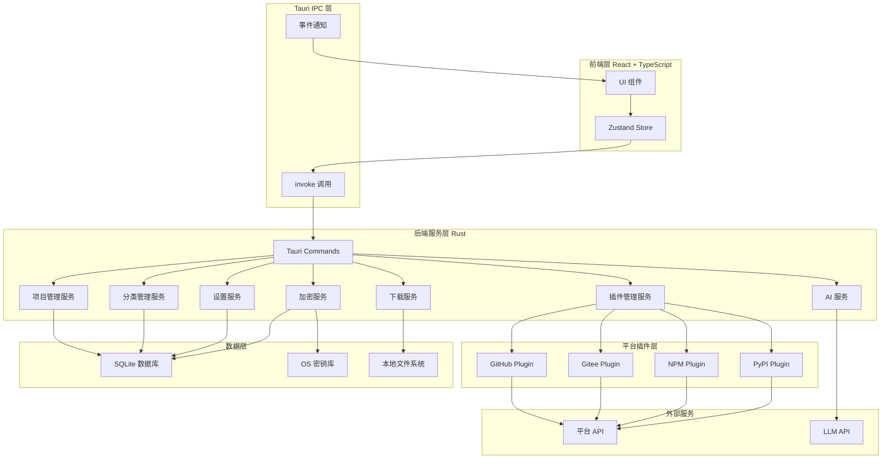
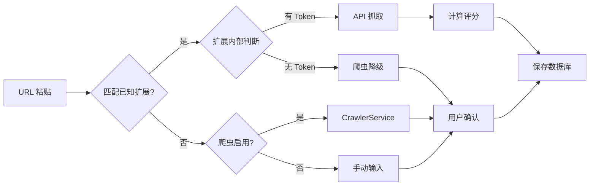
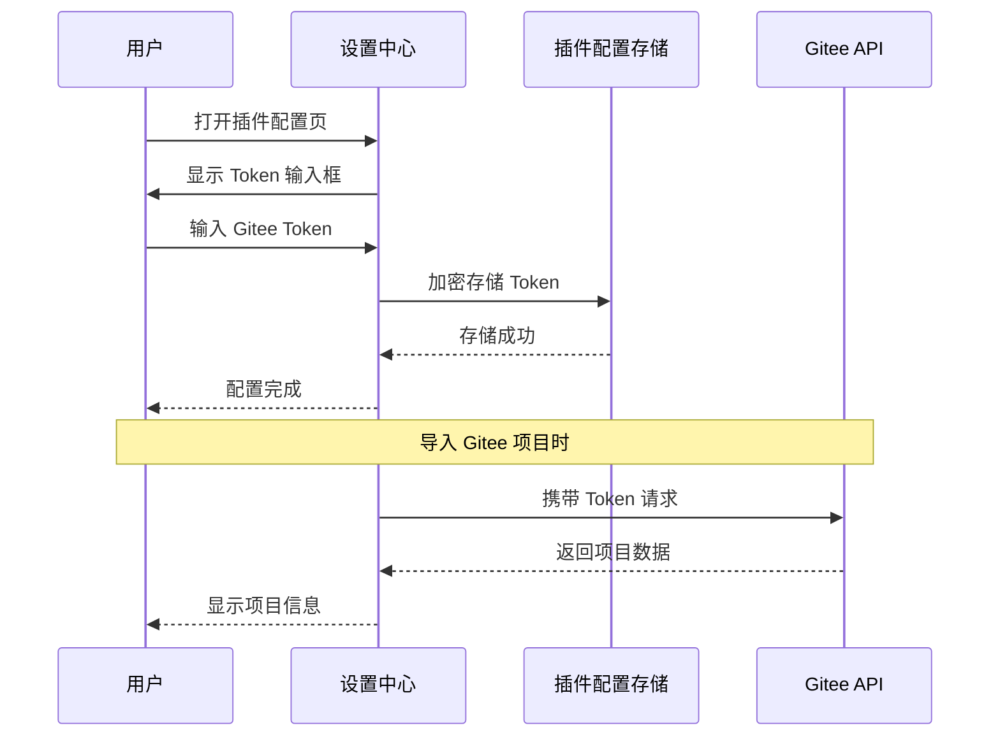
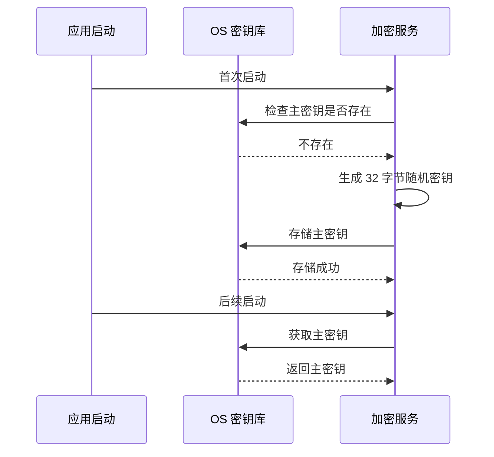
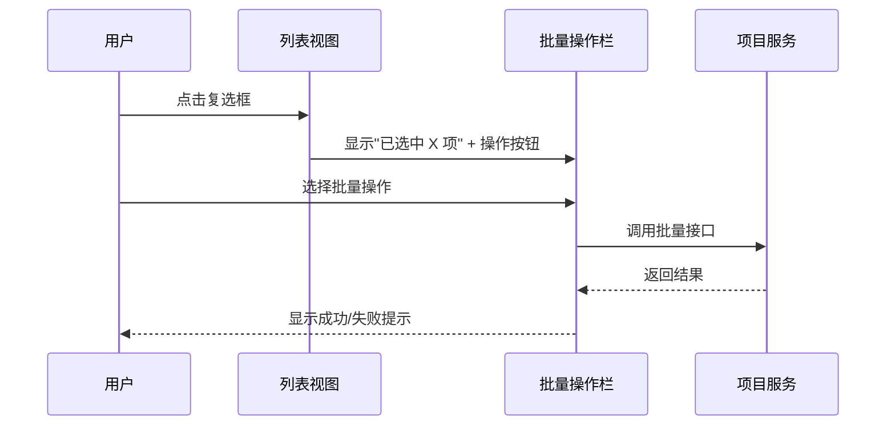
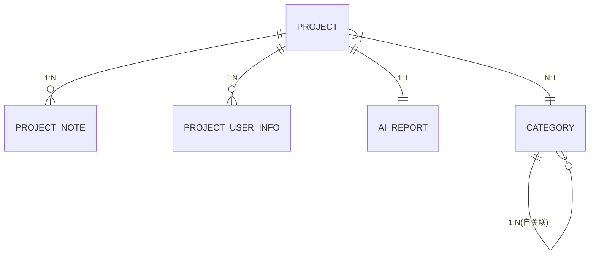
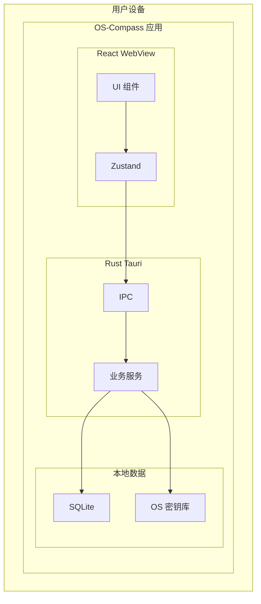

# OS-Compass 技术架构设计说明书

| 部门 | 研发部 |
|------|--------|
| 编写 | 系统架构师 |
| 审核 | Charlie liu |
| 批准 |  |
| 日期 | 2026-07-01 |
| 版本 | V1.3 |

---

## 1 引言

### 1.1 编写目的

本文档作为 OS-Compass（开源罗盘）的核心技术指导文件，旨在全局性阐述系统的技术架构、模块划分、技术选型理由及关键技术难点解决方案。本文档将作为研发工程师进行编码、重构及后续功能扩展的直接依据。

### 1.2 预期读者

| 读者 | 用途 |
|------|------|
| 研发工程师 | 指导日常编码、模块设计和接口定义 |
| 架构师/技术负责人 | 把控技术选型方向和系统扩展性 |
| 测试工程师 | 理解系统架构以制定测试策略 |

### 1.3 术语与缩写

| 术语 | 全称 | 说明 |
|------|------|------|
| Tauri | - | 跨平台桌面应用框架 |
| WebView | - | 嵌入式网页视图组件 |
| LLM | Large Language Model | 大语言模型 |
| SourcePlugin | - | 平台扩展接口（本期 MVP） |
| FeaturePlugin | - | 功能插件接口（二期） |
| 扩展配置 | - | 本期 MVP 的平台集成功能 |
| 插件系统 | - | 二期的热加载/市场功能 |
| Runbook | - | 场景化操作手册 |
| WAL | Write-Ahead Logging | 预写日志，SQLite 高并发模式 |
| AES-256-GCM | - | 对称加密算法 |
| IPC | Inter-Process Communication | 进程间通信 |

---

## 2 系统概述

### 2.1 系统定位

OS-Compass 定位为一款"本地优先（Local-First）"的跨平台桌面客户端，专注于解决开发者面临的三大痛点：

| 痛点 | 现有方案 | OS-Compass 解决方案 |
|------|----------|---------------------|
| 收藏即吃灰 | 浏览器书签、GitHub Star 无分类 | 多层级分类 + AI 自动归类 |
| 环境难配难跑通 | 手动查找文档 | AI Runbook 自动生成 |
| 找轮子效率低 | 搜索引擎大海捞针 | AI 健康度评分 + 本地快速检索 |

### 2.2 核心技术指标

| 指标 | 目标值 | 说明 |
|------|--------|------|
| 内存占用 | ≤ 50MB | 后台静默运行 |
| 启动时间 | ≤ 3 秒 | 冷启动到主界面可交互 |
| 列表查询（10k 条） | ≤ 30ms | 条件过滤响应 |
| 打包体积 | ≤ 15MB | Tauri 原生优势 |

---

## 3 技术选型总结

### 3.1 核心技术栈

| 层级 | 技术选型 | 版本要求 | 选型理由 |
|------|----------|----------|----------|
| 桌面框架 | **Tauri 2.0** | 2.0+ | Rust 后端 + WebView 前端，极致轻量（对比 Electron 小 10 倍） |
| 前端框架 | **React** | 18+ | 生态成熟，组件化开发 |
| 类型系统 | **TypeScript** | 5+ | 类型安全，减少运行时错误 |
| 样式方案 | **Tailwind CSS** | 3+ | 原子化 CSS，开发效率高 |
| 状态管理 | **Zustand** | 4+ | 轻量，无 Provider 嵌套 |
| 后端语言 | **Rust** | 1.75+ | 内存安全、高性能、零成本抽象 |
| 数据库 | **SQLite** | 3.40+ | 本地优先，WAL 模式提升并发 |
| 加密算法 | **AES-256-GCM** | - | 业界标准对称加密 |
| 密钥库 | **OS Credential Manager** | - | Windows/macOS 原生密钥存储 |

### 3.2 技术选型理由详述

#### 3.2.1 为什么选择 Tauri 而非 Electron？

| 对比维度 | Electron | Tauri | OS-Compass 选择 |
|----------|----------|-------|----------------|
| 打包体积 | ~150MB | ~10MB | Tauri |
| 内存占用 | ~200MB | ~50MB | Tauri |
| API 能力 | Node.js 生态 | Rust 原生能力 | 需评估 |
| 安全沙箱 | Chromium 沙箱 | 多进程隔离 | 相当 |
| 开发体验 | Web 技术栈 | Web + Rust | 需学习曲线 |

**结论**：Tauri 的轻量化优势符合"本地优先"定位，且 Rust 后端可复用 SQLite、加密等成熟库。

#### 3.2.2 为什么选择 Rust 而非 Node.js 作为后端？

| 对比维度 | Node.js | Rust | OS-Compass 选择 |
|----------|--------|------|----------------|
| 内存安全 | V8 GC | 所有权系统 | Rust |
| SQLite 驱动 | node-sqlite3 | rusqlite/sqlx | Rust |
| 加密库 | Node.js crypto | ring/aes-gcm | Rust |
| 异步生态 | Tokio 异步 | Tokio 异步 | 相当 |
| 学习曲线 | 平缓 | 陡峭 | 需投入 |

**结论**：Rust 的内存安全性和零成本抽象可减少运行时问题。

#### 3.2.3 为什么选择 SQLite 而非 PostgreSQL/MySQL？

| 对比维度 | PostgreSQL | MySQL | SQLite | OS-Compass 选择 |
|----------|-----------|-------|--------|----------------|
| 部署复杂度 | 高 | 高 | 零部署 | SQLite |
| 数据量支持 | TB 级 | TB 级 | 适合 100GB 以下 | SQLite |
| 并发能力 | 强 | 强 | 够用 | SQLite |
| 桌面集成 | 需服务 | 需服务 | 原生嵌入 | SQLite |

**结论**：桌面应用数据量有限，SQLite 的零部署和 WAL 模式足够。

---

## 4 总体架构设计

### 4.1 架构设计原则

| 原则 | 说明 | 在 OS-Compass 中的体现 |
|------|------|----------------------|
| 本地优先 | 数据存储在本地，强调隐私 | SQLite 本地存储，OS 密钥库 |
| 插件化 | 模块可替换，接口隔离 | SourcePlugin 插件接口 |
| 容错降级 | 异常不影响核心功能 | AI/网络失败可跳过 |
| 类型安全 | 编译期检查 | TypeScript + Rust 类型 |

### 4.2 逻辑架构视图



### 4.3 模块职责划分

| 模块 | 职责边界 | 依赖关系 |
|------|----------|----------|
| Commands | 接收前端请求，返回响应 | 依赖所有服务 |
| ProjectSvc | 项目 CRUD、状态流转 | 依赖 SQLite |
| CategorySvc | 分类树管理、AI 上下文 | 依赖 SQLite |
| PluginSvc | 插件注册、调度 | 依赖平台 API |
| AISvc | LLM 调用、Prompt 构建 | 依赖 LLM API |
| DownloadSvc | git clone、IDE 唤起 | 依赖文件系统 |
| CryptoSvc | 加密解密、密钥管理 | 依赖 OS 密钥库 |
| SettingsSvc | 配置读写、LLM 连接测试 | 依赖 SQLite |

---

## 5 关键技术设计

### 5.1 平台插件系统

#### 5.1.1 为什么需要插件化？

不同平台的数据结构和 API 方式差异巨大：

| 平台 | API 特点 | 评分维度 | URL 格式 |
|------|----------|----------|----------|
| GitHub | REST API，Token 提限 | Commit + Issue + Release | github.com/{owner}/{repo} |
| Gitee | Open API，需 Token | 类似 GitHub | gitee.com/{owner}/{repo} |
| NPM | Registry API，无需认证 | 下载量 + 版本数 | npmjs.com/package/{name} |
| PyPI | JSON API，无需认证 | 下载量 + 版本数 | pypi.org/project/{name} |

插件化使核心逻辑与平台解耦，新增平台只需实现接口。

#### 5.1.2 插件接口设计

```rust
#[async_trait]
pub trait SourcePlugin: Send + Sync {
    fn id(&self) -> &str;
    fn name(&self) -> &str;
    fn match_url(&self, url: &str) -> bool;
    async fn fetch_metadata(&self, url: &str) -> Result<ProjectMetadata, PluginError>;
    async fn fetch_readme(&self, url: &str) -> Result<String, PluginError>;
    fn calculate_health_score(&self, metadata: &ProjectMetadata) -> HealthScore;
}
```

#### 5.1.3 各扩展对比

| 扩展 | ID | API 端点 | 认证要求 | URL 格式 | 健康度维度 |
|------|-----|----------|----------|----------|-----------|
| GitHub | `github` | `api.github.com` | 可选（双轨制） | `github.com/{owner}/{repo}` | Commit + Issue + Release + Star |
| Gitee | `gitee` | `gitee.com/api/v5` | 可选（双轨制） | `gitee.com/{owner}/{repo}` | 类似 GitHub |
| NPM | `npm` | `registry.npmjs.org` | 无需 | `npmjs.com/package/{name}` | 下载量 + 版本数 + 依赖数 |
| PyPI | `pypi` | `pypi.org/pypi/{name}/json` | 无需 | `pypi.org/project/{name}` | 下载量 + 版本数 |
| 通用爬虫 | `crawler` | web2md HTTP | 无需 | 任意 URL | 不支持 |

**Token 双轨制设计**：

| 配置情况 | 数据获取方式 | 数据质量 |
|----------|--------------|----------|
| 有 Token | 平台 API | ✅ 完整数据，可计算健康度 |
| 无 Token | 爬虫服务（web2md） | ⚠️ 部分数据，无法计算健康度 |

#### 5.1.4 平台识别与回退策略

**识别优先级**：

| 优先级 | 平台 | 识别方式 | 处理结果 |
|--------|------|----------|----------|
| 1 | GitHub | URL 包含 `github.com` | 扩展抓取（有 Token 用 API，无 Token 降级爬虫） |
| 2 | Gitee | URL 包含 `gitee.com` | 扩展抓取（有 Token 用 API，无 Token 降级爬虫） |
| 3 | NPM | URL 包含 `npmjs.com` | 扩展抓取 + 完整评分 |
| 4 | PyPI | URL 包含 `pypi.org` | 扩展抓取 + 完整评分 |
| 5 | 其他平台 | 无法匹配已知扩展 | 爬虫回退 / 手动输入 |

**回退架构**：



**回退处理**：

| 场景 | 处理方式 | 数据标记 |
|------|----------|----------|
| 已知平台 + 有 Token | SourcePlugin API 抓取 | 正常入库，含健康度评分 |
| 已知平台 + 无 Token | 爬虫降级 | 用户确认，含 README |
| 未知平台 + 爬虫成功 | 用户确认 markdown 内容 | `is_scored = false` |
| 未知平台 + 爬虫失败 | 用户手动输入 | `is_scored = false` |

#### 5.1.5 爬虫服务设计（web2md HTTP 服务）

**集成方式**：HTTP 服务（推荐）

**推荐理由**：
- Tauri Rust 后端调用更自然（reqwest HTTP 调用）
- 服务生命周期管理更简单（自动启动/重启）
- 连接复用性能更好
- 适合 Windows 环境（避免命令行参数编码问题）

**启动时机**：随应用启动（后台常驻）

**端口管理**：默认 8080，端口冲突时自动切换可用端口

**web2md HTTP API 设计**：

| 端点 | 方法 | 说明 |
|------|------|------|
| `GET /health` | GET | 健康检查 |
| `POST /convert` | POST | 将 URL 转换为 Markdown |

```bash
# 启动 web2md HTTP 服务
web2md serve --port 8080

# 健康检查
curl http://localhost:8080/health
# Response: {"status": "ok"}

# 转换 URL 为 Markdown
curl -X POST http://localhost:8080/convert \
  -H "Content-Type: application/json" \
  -d '{"url": "https://github.com/facebook/react"}'
# Response: {"title": "React", "markdown": "# React\n\n...", "source": "http|api|browser"}
```

**Rust HTTP 客户端调用**：

```rust
/// 爬虫服务接口
pub trait CrawlerService: Send + Sync {
    /// 检查服务是否启用
    fn is_enabled(&self) -> bool;

    /// 将网页转换为 Markdown
    async fn fetch_as_markdown(&self, url: &str) -> Result<String, CrawlerError>;

    /// 获取服务配置
    fn get_config(&self) -> &CrawlerConfig;
}

/// 爬虫配置
pub struct CrawlerConfig {
    /// 是否启用爬虫服务
    pub enabled: bool,
    /// HTTP 服务地址
    pub api_url: String,
    /// 超时时间（秒）
    pub timeout_secs: u64,
}

/// 爬虫错误类型
pub enum CrawlerError {
    NetworkError(String),
    ParseError(String),
    Timeout,
    Disabled,
    ServiceUnavailable,
}
```

**数据标记**：

```rust
/// 项目数据结构
pub struct Project {
    /// 是否已评分
    pub is_scored: bool,
    /// 健康度评分（is_scored = false 时为 None）
    pub health_score: Option<HealthScore>,
    /// 来源平台
    pub source_platform: String,  // "github" | "gitee" | "npm" | "pypi" | "crawler" | "unknown"
}
```

#### 5.1.4 GitHub 插件

**URL 格式**：`https://github.com/{owner}/{repo}`

**API 特点**：
- 公开仓库无需 Token
- 认证后可提升 API 请求限额（60次/小时 → 5000次/小时）

**数据获取**：
```rust
// 元数据
GET https://api.github.com/repos/{owner}/{repo}

// README
GET https://api.github.com/repos/{owner}/{repo}/readme
```

#### 5.1.5 Gitee 插件

**URL 格式**：`https://gitee.com/{owner}/{repo}`

**与 GitHub 的核心差异**：

| 差异项 | GitHub | Gitee |
|--------|--------|-------|
| API 端点 | `api.github.com` | `gitee.com/api/v5` |
| **认证要求** | 可选（提升限额） | **必须**（大多数接口需要 Token） |
| Token 类型 | Personal Access Token | Personal Access Token |
| 公共仓库访问 | 无需认证 | **需要 Token** |
| 请求限额 | 60次/小时（未认证） | 根据 Token 类型有限额 |

**Token 配置流程**：


**代码实现要点**：
```rust
pub struct GiteePlugin {
    client: Client,
    // Gitee **必须** 携带 Token 才能正常访问
    token: Option<String>,
}

#[async_trait]
impl SourcePlugin for GiteePlugin {
    fn match_url(&self, url: &str) -> bool {
        url.contains("gitee.com")
    }

    async fn fetch_metadata(&self, url: &str) -> Result<ProjectMetadata, PluginError> {
        // 1. 检查 Token 是否配置
        let token = self.token.as_deref()
            .ok_or(PluginError::ConfigMissing("Gitee Token 未配置"))?;

        // 2. 解析 URL
        let (owner, repo) = self.parse_url(url)?;
        let api_url = format!(
            "https://gitee.com/api/v5/repos/{}/{}",
            owner, repo
        );

        // 3. 携带 Token 请求
        let resp = self.client
            .get(&api_url)
            .header("Authorization", format!("Bearer {}", token))
            .send()
            .await?;

        // 4. 处理认证失败
        if resp.status() == 401 {
            return Err(PluginError::AuthFailed("Gitee Token 无效或已过期"));
        }

        let data: GiteeRepo = resp.json().await?;
        Ok(self.normalize(data))
    }
}
```

#### 5.1.6 NPM/PyPI 插件

```rust
pub struct PluginManager {
    plugins: HashMap<String, Box<dyn SourcePlugin>>,
}

impl PluginManager {
    pub fn find_plugin(&self, url: &str) -> Option<&dyn SourcePlugin> {
        self.plugins.values().find(|p| p.match_url(url))
    }

    pub async fn import(&self, url: &str) -> Result<Project, ImportError> {
        let plugin = self.find_plugin(url)
            .ok_or(ImportError::PluginNotFound)?;
        let metadata = plugin.fetch_metadata(url).await?;
        let health_score = plugin.calculate_health_score(&metadata);
        // 标准化并保存
    }
}

#### 5.1.7 功能插件设计（二期）

**功能插件 vs 平台插件的本质区别**：

| 维度 | 平台插件（SourcePlugin） | 功能插件（FeaturePlugin） |
|------|------------------------|----------------------|
| 入口 | 项目导入时自动调用 | 用户主动触发或后台运行 |
| 生命周期 | 一次性获取数据 | 可能持续运行 |
| 数据流向 | 外部 → 系统 | 外部 ↔ 系统 |

**功能插件类型**：

| 插件类型 | 功能描述 | 调用方式 |
|----------|----------|----------|
| 情报雷达 | RSS 订阅监控，发现更新推送通知 | 后台定时 |
| 意图搜索 | 联网检索相关项目 | 用户触发 |
| Webhook | 通知推送到第三方 | 事件触发 |
| 导入器 | 从其他工具导入数据 | 用户触发 |

```rust
/// 功能插件接口
#[async_trait]
pub trait FeaturePlugin: Send + Sync {
    fn id(&self) -> &str;
    fn name(&self) -> &str;
    fn plugin_type(&self) -> FeaturePluginType;
    fn is_enabled(&self) -> bool;
    async fn execute(&self, context: &Context) -> Result<FeatureResult, PluginError>;
}

pub enum FeaturePluginType {
    Radar,    // 情报雷达
    Search,    // 意图搜索
    Webhook,   // Webhook
    Importer,  // 导入器
}
```

### 5.2 加密服务设计

#### 5.2.1 为什么需要加密服务？

用户可能存储敏感信息：

| 信息类型 | 示例 | 保护方式 |
|----------|------|----------|
| NPM Token | `npm_xxxx` | AES-256-GCM 加密 |
| GitHub PAT | `ghp_xxxx` | AES-256-GCM 加密 |
| 代理密码 | `proxy_pass` | AES-256-GCM 加密 |
| 普通笔记 | 项目描述 | 明文 |

#### 5.2.2 密钥管理流程



#### 5.2.3 加密算法选择

| 算法 | 优势 | 在 OS-Compass 中的用途 |
|------|------|----------------------|
| AES-256-GCM | 抗篡改，支持认证加密 | 加密敏感字段 |
| ChaCha20-Poly1305 | 性能优于 AES | Rust 的 ring 库支持 |
| Argon2 | 密钥派生标准 | 从主密钥派生会话密钥 |

**选择 AES-256-GCM**：硬件加速支持广泛，Rust 生态成熟。

### 5.3 健康度评分设计

#### 5.3.1 GitHub 评分算法

| 维度 | 权重 | 评分规则 |
|------|------|----------|
| 提交活跃度 | 25% | 最近6月：25分，6-12月：15分，12-24月：8分，>24月：0分 |
| Issue 闭环率 | 20% | >=80%：20分，>=60%：15分，>=40%：10分，<40%：5分 |
| 版本发布频率 | 20% | 最近6月：20分，6-12月：12分，12-24月：6分，>24月：0分 |
| Star 数量 | 15% | >=50k：15分，>=10k：12分，>=1k：8分，>=100：4分，<100：1分 |
| 贡献者数量 | 10% | >=100：10分，>=20：8分，>=5：5分，<5：2分 |
| License 风险 | 10% | MIT/Apache：+10分，GPL/AGPL：-5分，无协议：0分 |

#### 5.3.2 NPM/PyPI 评分差异

| 平台 | 核心指标 | 权重说明 |
|------|----------|----------|
| NPM | 下载量 | NPM 包下载频率直接反映流行程度 |
| NPM | 版本数 | 版本多表示活跃度高 |
| NPM | 依赖数 | 依赖过多表示复杂度过高 |
| PyPI | 下载量 | 同 NPM |
| PyPI | 发布时间 | 包龄过老可能已过时 |

### 5.4 批量操作设计

#### 5.4.1 支持的批量操作

| 操作 | 说明 | 入口 |
|------|------|------|
| 批量移动 | 将多个项目移动到其他分类 | 列表视图 |
| 批量归档 | 将多个项目标记为归档 | 列表视图 |
| 批量导出 | 批量导出选中项目为 JSON/CSV | 列表视图 |
| 全选/反选 | 快速选择多个项目 | 列表视图 |

#### 5.4.2 交互流程



### 5.5 归档功能设计

#### 5.5.1 设计理念

符合"本地优先（Local-First）"理念，归档替代删除，支持数据恢复。

#### 5.5.2 数据模型

```sql
-- 归档状态字段
ALTER TABLE projects ADD COLUMN is_archived BOOLEAN DEFAULT FALSE;
ALTER TABLE projects ADD COLUMN archived_at TIMESTAMP;
```

#### 5.5.3 归档列表视图

| 功能 | 说明 |
|------|------|
| 归档项目列表 | 展示所有已归档项目 |
| 恢复项目 | 将项目恢复到正常列表 |
| 彻底删除 | 永久删除（需二次确认） |
| 批量归档 | 支持多选批量归档 |

### 5.6 国际化（i18n）设计

#### 5.6.1 技术选型

| 方案 | 选型 | 理由 |
|------|------|------|
| 框架 | react-i18next | React 生态成熟 |
| 语言 | 中文 / English | 首批支持 |
| 格式 | ICU MessageFormat | 复数、性别支持 |

#### 5.6.2 翻译粒度

| 粒度 | 示例 | 管理方式 |
|------|------|----------|
| 页面文本 | "项目列表"、"设置" | JSON 文件 |
| 提示信息 | Toast、错误信息 | JSON 文件 |
| 日期格式 | 相对时间、本地化日期 | date-fns |
| 数字格式 | 千分位、小数点 | Intl API |

### 5.7 离线支持设计

#### 5.7.1 离线缓存策略

| 数据类型 | 缓存策略 | 过期时间 |
|----------|----------|----------|
| 项目元数据 | SQLite 本地存储 | 永久（手动刷新） |
| README 内容 | SQLite 本地存储 | 7 天（哈希比对刷新） |
| AI 报告 | SQLite 本地存储 | 永久（手动刷新） |
| 用户笔记 | SQLite 本地存储 | 永久 |

#### 5.7.2 离线检测与提示

```typescript
// 监听网络状态
window.addEventListener('online', () => {
  toast.info('网络已恢复，正在同步...');
});

window.addEventListener('offline', () => {
  toast.warn('当前处于离线模式，部分功能受限');
});
```

### 5.8 统计面板设计

#### 5.8.1 统计数据维度

| 统计项 | 数据来源 | 说明 |
|--------|----------|------|
| 健康度分布 | AI 报告 | 各评分区间项目数量 |
| 分类分布 | 项目分类 | 各分类项目数量 |
| 语言分布 | 项目语言 | 各编程语言项目数量 |
| 活跃趋势 | 项目状态 | 最近活跃项目趋势 |

### 5.4 LLM 集成设计

#### 5.4.1 为什么需要 LLM？

| 场景 | 无 LLM | 有 LLM |
|------|--------|--------|
| 分类 | 用户手动打标签 | AI 自动分析归类 |
| README | 英文阅读困难 | 自动翻译 + 提炼 |
| Runbook | 手动查找文档 | AI 生成安装/运行步骤 |
| 健康度 | 人工评估 | AI 多维度评分 |

#### 5.4.2 LLM 接口抽象

```rust
#[async_trait]
pub trait LLMClient: Send + Sync {
    async fn chat(&self, prompt: &str) -> Result<String, LLMError>;
    async fn chat_json(&self, prompt: &str) -> Result<Value, LLMError>;
}
```

支持多种 LLM 供应商：

| 供应商 | base_url 示例 | 模型示例 |
|--------|---------------|----------|
| OpenAI | api.openai.com/v1 | gpt-4o, gpt-4o-mini |
| DeepSeek | api.deepseek.com | deepseek-chat |
| Ollama | 127.0.0.1:11434/v1 | qwen2.5, llama3 |

#### 5.4.3 Prompt 设计策略

```rust
impl AIService {
    fn build_analysis_prompt(&self, project: &Project, categories: &[Category]) -> String {
        let category_context = categories.iter()
            .map(|c| format!("- {} ({})：{}\n", c.name, c.path, c.explain))
            .collect::<Vec<_>>()
            .join("");

        format!(r#"
你是一个专业的开源项目分析师。请分析以下项目并返回 JSON 格式结果。

项目信息：
- 名称：{}
- 描述：{}

可用分类：
{}

请返回：
{{
    "category_id": 数字,
    "summary": "一句话总结（不超过50字）",
    "applicable_scenarios": ["场景1", "场景2", "场景3"]
}}
"#, project.name, project.description, category_context)
    }
}
```

---

## 6 数据架构

### 6.1 数据库选型理由

| 维度 | SQLite | PostgreSQL | MongoDB | OS-Compass 选择 |
|------|--------|-----------|--------|----------------|
| 部署复杂度 | 零 | 高 | 高 | SQLite |
| 数据量 | <100GB 足够 | TB 级 | TB 级 | SQLite |
| 并发能力 | WAL 模式够用 | 强 | 强 | SQLite |
| 桌面集成 | 原生嵌入 | 需服务 | 需服务 | SQLite |
| 体积 | ~1MB | >100MB | >200MB | SQLite |

### 6.2 数据库架构



### 6.3 敏感数据存储策略

```sql
-- 敏感字段存储加密后的 Base64 字符串
CREATE TABLE project_user_info (
    id INTEGER PRIMARY KEY,
    project_id INTEGER REFERENCES projects(id),
    info_key VARCHAR(100) NOT NULL,
    info_value TEXT,  -- 加密后存储
    is_secret BOOLEAN DEFAULT FALSE
);
```

---

## 7 部署架构

### 7.1 单体应用架构



### 7.2 外部依赖

| 依赖 | 用途 | 是否必需 |
|------|------|----------|
| WebView2 | Windows 10+ 自带 | 是 |
| git | git clone | 是 |
| VS Code（可选） | 用 IDE 打开项目 | 否 |

---

## 8 技术难点及解决方案

### 8.1 网络代理配置（分层架构）

系统采用**分层代理架构**，不同功能使用独立的代理配置：

| 代理类型 | 配置位置 | 用途范围 | 实现方式 |
|---------|---------|---------|---------|
| **下载代理** | 系统设置 → 下载页 | Git Clone、爬虫服务 | 环境变量注入 (`HTTPS_PROXY`) |
| **LLM 代理** | 系统设置 → 大模型页 | LLM API 调用 | `reqwest::Proxy::all()` |
| **扩展代理** | 各扩展配置页 | 各扩展独立使用 | 插件内部读取 |

**配置字段说明**：

```rust
// 下载代理（用于 Git Clone / 爬虫）
proxy_enabled: bool
proxy_protocol: String  // "http" | "https" | "socks5"
proxy_host: String
proxy_port: i32
proxy_username: String
proxy_password: String

// LLM 代理（用于 AI 分析）
llm_proxy_enabled: bool
llm_proxy_protocol: String
llm_proxy_host: String
llm_proxy_port: i32
llm_proxy_username: String
llm_proxy_password: String
```

**实现位置**：
- 下载代理：`src-tauri/src/commands/download.rs`、`src-tauri/src/crawler_service.rs`
- LLM 代理：`src-tauri/src/llm.rs`
- 扩展代理：`src-tauri/src/plugins/github.rs` 等各插件内部

### 8.2 LLM 响应稳定性

| 难点 | 解决方案 |
|------|----------|
| JSON 解析失败 | 启用 `response_format: json_object` |
| 响应超时 | 设置 30 秒超时，降级处理 |
| 令牌超限 | Token 预算控制 |

### 8.3 插件热加载

| 难点 | 解决方案 |
|------|----------|
| 运行时加载 | 插件目录 `~/.os-compass/plugins/` |
| 接口版本兼容 | 版本号 + 运行时检查 |
| 插件隔离 | 沙盒限制文件/网络访问 |

---

## 9 附录

### 9.1 目录结构规划

```
os-compass/
├── src/                    # React 前端
│   ├── components/           # UI 组件
│   ├── pages/              # 页面
│   ├── stores/             # Zustand Store
│   └── types/              # TypeScript 类型
├── src-tauri/              # Rust 后端
│   ├── src/
│   │   ├── commands/       # Tauri Commands
│   │   ├── services/       # 业务服务
│   │   ├── plugins/        # 平台插件
│   │   └── db/            # 数据库
│   └── migrations/         # 数据库迁移
├── design-system/           # 设计系统
└── docs/                   # 设计文档
```

### 9.2 环境要求

| 环境 | 版本要求 | 说明 |
|------|----------|------|
| Rust | 1.75+ | 后端编译 |
| Node.js | 18+ | 前端构建 |
| MSYS2/UCRT64 | 最新 | MinGW 工具链 |
| Windows | 10+ | 桌面支持 |
| WebView2 | 自带 | Windows 10+ |

---

## 10 文档变更记录

| 版本 | 日期 | 变更说明 |
|------|------|----------|
| V1.0 | 2026-06-27 | 初始版本 |
| V1.1 | 2026-06-29 | 新增：批量操作设计（5.4）、归档功能设计（5.5）、国际化设计（5.6）、离线支持设计（5.7）、统计面板设计（5.8）、web2md HTTP API 集成说明 |
| V1.2 | 2026-06-29 | 重构项目状态设计：lifecycle_status + data_status 双维度；明确 web2md HTTP 服务为推荐集成方式 |

**文档结束**