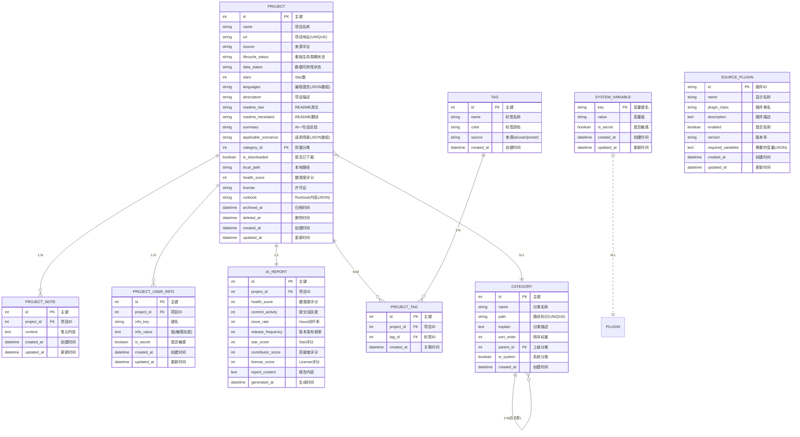

# OS-Compass 数据库设计说明书

| 部门 | 研发部 |
|------|--------|
| 编写 | 系统架构师 |
| 审核 | |
| 批准 | |
| 日期 | 2026-07-08 |
| 版本 | V1.4 |
| 修订日期 | 2026-07-20 |
| 修订说明 | 新增 M14/M15 表结构（backups、shortcuts、onboarding、market_plugins） |

---

## 1 概述

### 1.1 编写目的

本文档定义 OS-Compass 系统的数据库结构设计，作为 SQLite 数据库建表和迁移的规范文档。

### 1.2 设计原则

| 原则 | 说明 |
|------|------|
| 本地优先 | 所有业务数据存储在本地 SQLite |
| WAL 模式 | 启用 WAL 模式提升并发读写性能 |
| 外键约束 | 启用外键约束保证数据一致性 |
| 索引优化 | 关键查询字段添加索引 |
| 敏感加密 | 敏感字段存储加密后的密文 |

### 1.3 数据库配置

```sql
PRAGMA journal_mode = WAL;
PRAGMA foreign_keys = ON;
PRAGMA busy_timeout = 5000;
```

---

## 2 数据库架构

### 2.1 ER 图



### 2.2 表关系说明

| 关系 | 说明 |
|------|------|
| Project → Category | 多对一，项目归属于一个分类 |
| Category → Category | 自关联，实现多层级树形结构 |
| Project → ProjectNote | 一对多，一个项目有多条笔记 |
| Project → ProjectUserInfo | 一对多，一个项目有多个用户信息 |
| Project → AIReport | 一对一，一个项目有一份 AI 报告 |
| SystemVariable → SourcePlugin | 变量声明由扩展提供，运行时由系统变量表提供值 |

---

## 3 表结构详细设计

### 3.1 projects 表

项目主表，存储所有开源项目信息。

```sql
CREATE TABLE IF NOT EXISTS projects (
    id INTEGER PRIMARY KEY AUTOINCREMENT,
    name VARCHAR(255) NOT NULL,
    url TEXT NOT NULL UNIQUE,
    source VARCHAR(20) NOT NULL CHECK(source IN ('github', 'gitee', 'npm', 'pypi', 'crawler', 'unknown')),
    -- 看板生命周期状态（4种）
    lifecycle_status VARCHAR(20) NOT NULL DEFAULT 'TO_EXPLORE'
        CHECK(lifecycle_status IN ('TO_EXPLORE', 'DIVING', 'IN_USE', 'ABANDONED')),
    -- 数据可用性状态（3种）
    data_status VARCHAR(20) NOT NULL DEFAULT 'ACTIVE'
        CHECK(data_status IN ('ACTIVE', 'ARCHIVED', 'DELETED')),
    stars INTEGER DEFAULT 0,
    languages TEXT NOT NULL DEFAULT '[]',
    description TEXT,
    readme_versions TEXT NOT NULL DEFAULT '{}',
    readme_selected_lang VARCHAR(10) DEFAULT 'en',
    readme_translations TEXT NOT NULL DEFAULT '{}',
    readme_hash VARCHAR(64),
    readme_last_fetched DATETIME,
    summary VARCHAR(500),
    applicable_scenarios TEXT,
    category_id INTEGER REFERENCES categories(id),
    is_downloaded BOOLEAN DEFAULT FALSE,
    local_path TEXT,
    health_score INTEGER,
    license VARCHAR(50),
    runbook TEXT,
    archived_at DATETIME,
    deleted_at DATETIME,
    created_at DATETIME DEFAULT CURRENT_TIMESTAMP,
    updated_at DATETIME DEFAULT CURRENT_TIMESTAMP
);

-- 索引
CREATE INDEX idx_projects_status ON projects(lifecycle_status);
CREATE INDEX idx_projects_data_status ON projects(data_status);
CREATE INDEX idx_projects_category ON projects(category_id);
CREATE INDEX idx_projects_source ON projects(source);
CREATE INDEX idx_projects_updated ON projects(updated_at DESC);
CREATE INDEX idx_projects_stars ON projects(stars DESC);
CREATE INDEX idx_projects_languages ON projects(languages);
```

**字段说明**：

| 字段 | 类型 | 约束 | 说明 |
|------|------|------|------|
| id | INTEGER | PK, AUTO | 主键，自增 |
| name | VARCHAR(255) | NOT NULL | 项目名称 |
| url | TEXT | NOT NULL, UNIQUE | 项目地址 |
| source | VARCHAR(20) | NOT NULL | 来源平台：github/gitee/npm/pypi/crawler/unknown |
| lifecycle_status | VARCHAR(20) | NOT NULL | **看板生命周期状态**：TO_EXPLORE/DIVING/IN_USE/ABANDONED |
| data_status | VARCHAR(20) | NOT NULL DEFAULT 'ACTIVE' | **数据可用性状态**：ACTIVE/ARCHIVED/DELETED |
| stars | INTEGER | DEFAULT 0 | Star 数 |
| languages | TEXT | NOT NULL, DEFAULT '[]' | **JSON 数组，编程语言列表** |
| description | TEXT | | 项目描述 |
| readme_versions | TEXT | NOT NULL, DEFAULT '{}' | **JSON 对象，多语言 README 版本** |
| readme_selected_lang | VARCHAR(10) | DEFAULT 'en' | **当前选中的 README 语言** |
| readme_translations | TEXT | NOT NULL, DEFAULT '{}' | **JSON 对象，翻译版本** |
| readme_hash | VARCHAR(64) | | **README 内容哈希（用于检测更新）** |
| readme_last_fetched | DATETIME | | **最后抓取时间** |
| summary | VARCHAR(500) | | AI 生成的一句话总结 |
| applicable_scenarios | TEXT | | JSON 数组，适用场景 |
| category_id | INTEGER | FK | 所属分类 ID |
| is_downloaded | BOOLEAN | DEFAULT FALSE | 是否已下载到本地 |
| local_path | TEXT | | 本地下载路径 |
| health_score | INTEGER | | 健康度评分（0-100） |
| license | VARCHAR(50) | | 许可证类型 |
| runbook | TEXT | | JSON 对象，Runbook 内容 |
| archived_at | DATETIME | | **归档时间** |
| deleted_at | DATETIME | | **删除时间** |
| created_at | DATETIME | DEFAULT | 创建时间 |
| updated_at | DATETIME | DEFAULT | 更新时间 |

**状态说明**：

| 状态维度 | 状态值 | 说明 |
|----------|--------|------|
| **lifecycle_status** | TO_EXPLORE | 待探索：新发现或感兴趣的项目 |
| | DIVING | 深度研究中：正在评估的项目 |
| | IN_USE | 已落地/在用：已采用并使用的项目 |
| | ABANDONED | 弃用/避坑：已放弃的项目 |
| **data_status** | ACTIVE | 正常状态，可显示在看板/列表 |
| | ARCHIVED | 归档状态，隐藏显示，可恢复 |
| | DELETED | 删除状态，隐藏显示，可恢复或彻底删除 |

**状态流转规则**：
- `archive_project`：data_status → ARCHIVED（不改变 lifecycle_status）
- `restore_project`：data_status → ACTIVE（从 ARCHIVED 或 DELETED 恢复）
- `soft_delete_project`：data_status → DELETED
- `permanent_delete`：仅 data_status = DELETED 时可执行

---

### 3.2 categories 表

分类表，支持多层级树形结构。

```sql
CREATE TABLE IF NOT EXISTS categories (
    id INTEGER PRIMARY KEY AUTOINCREMENT,
    name VARCHAR(100) NOT NULL,
    path VARCHAR(255) NOT NULL UNIQUE,
    explain TEXT,
    sort_order INTEGER DEFAULT 0,
    parent_id INTEGER REFERENCES categories(id),
    is_system BOOLEAN DEFAULT FALSE,
    created_at DATETIME DEFAULT CURRENT_TIMESTAMP
);

-- 索引
CREATE INDEX idx_categories_parent ON categories(parent_id);
CREATE INDEX idx_categories_path ON categories(path);
CREATE INDEX idx_categories_sort ON categories(sort_order);
```

**字段说明**：

| 字段 | 类型 | 约束 | 说明 |
|------|------|------|------|
| id | INTEGER | PK, AUTO | 主键 |
| name | VARCHAR(100) | NOT NULL | 分类名称 |
| path | VARCHAR(255) | NOT NULL, UNIQUE | 路径标识，如 "frontend/react" |
| explain | TEXT | | 分类描述，供 AI 理解分类边界 |
| sort_order | INTEGER | DEFAULT 0 | UI 排序权重 |
| parent_id | INTEGER | FK(self) | 上级分类 ID，NULL 表示顶级 |
| is_system | BOOLEAN | DEFAULT FALSE | 是否系统分类 |
| created_at | DATETIME | DEFAULT | 创建时间 |

**路径生成规则**：
- 顶级分类：path = 名称的拼音slug
- 子分类：path = parent.path + "/" + 名称的拼音slug

**系统分类**：
- id = 1：`uncategorized`，名称"未分类"，不可删除

---

### 3.3 project_notes 表

项目笔记表。

```sql
CREATE TABLE IF NOT EXISTS project_notes (
    id INTEGER PRIMARY KEY AUTOINCREMENT,
    project_id INTEGER NOT NULL REFERENCES projects(id) ON DELETE CASCADE,
    content TEXT NOT NULL,
    created_at DATETIME DEFAULT CURRENT_TIMESTAMP,
    updated_at DATETIME DEFAULT CURRENT_TIMESTAMP
);

-- 索引
CREATE INDEX idx_notes_project ON project_notes(project_id);
```

**字段说明**：

| 字段 | 类型 | 约束 | 说明 |
|------|------|------|------|
| id | INTEGER | PK, AUTO | 主键 |
| project_id | INTEGER | FK, NOT NULL | 项目 ID |
| content | TEXT | NOT NULL | 笔记内容 |
| created_at | DATETIME | DEFAULT | 创建时间 |
| updated_at | DATETIME | DEFAULT | 更新时间 |

**级联删除**：删除项目时自动删除所有关联笔记。

---

### 3.5 tags 表

标签表，存储项目标签。

```sql
CREATE TABLE IF NOT EXISTS tags (
    id INTEGER PRIMARY KEY AUTOINCREMENT,
    name VARCHAR(50) NOT NULL UNIQUE,
    color VARCHAR(7),
    source VARCHAR(20) NOT NULL DEFAULT 'user'
        CHECK(source IN ('ai', 'user', 'preset')),
    created_at DATETIME DEFAULT CURRENT_TIMESTAMP
);

-- 索引
CREATE UNIQUE INDEX idx_tags_name ON tags(name);
```

**字段说明**：

| 字段 | 类型 | 约束 | 说明 |
|------|------|------|------|
| id | INTEGER | PK, AUTO | 主键 |
| name | VARCHAR(50) | NOT NULL, UNIQUE | 标签名称 |
| color | VARCHAR(7) | | 标签颜色（十六进制，如 #3B82F6） |
| source | VARCHAR(20) | NOT NULL | 来源：ai（LLM提取）/ user（用户添加）/ preset（预设） |
| created_at | DATETIME | DEFAULT | 创建时间 |

---

### 3.6 project_tags 表

项目-标签关联表（多对多）。

```sql
CREATE TABLE IF NOT EXISTS project_tags (
    id INTEGER PRIMARY KEY AUTOINCREMENT,
    project_id INTEGER NOT NULL REFERENCES projects(id) ON DELETE CASCADE,
    tag_id INTEGER NOT NULL REFERENCES tags(id) ON DELETE CASCADE,
    created_at DATETIME DEFAULT CURRENT_TIMESTAMP,
    UNIQUE(project_id, tag_id)
);

-- 索引
CREATE INDEX idx_project_tags_project ON project_tags(project_id);
CREATE INDEX idx_project_tags_tag ON project_tags(tag_id);
```

**字段说明**：

| 字段 | 类型 | 约束 | 说明 |
|------|------|------|------|
| id | INTEGER | PK, AUTO | 主键 |
| project_id | INTEGER | FK, NOT NULL | 项目 ID |
| tag_id | INTEGER | FK, NOT NULL | 标签 ID |
| created_at | DATETIME | DEFAULT | 关联时间 |

**级联删除**：删除项目或标签时自动删除关联记录。

---

### 3.7 project_user_info 表

用户信息表（数据保险箱）。

```sql
CREATE TABLE IF NOT EXISTS project_user_info (
    id INTEGER PRIMARY KEY AUTOINCREMENT,
    project_id INTEGER NOT NULL REFERENCES projects(id) ON DELETE CASCADE,
    info_key VARCHAR(100) NOT NULL,
    info_value TEXT,
    is_secret BOOLEAN DEFAULT FALSE,
    created_at DATETIME DEFAULT CURRENT_TIMESTAMP,
    updated_at DATETIME DEFAULT CURRENT_TIMESTAMP,
    UNIQUE(project_id, info_key)
);

-- 索引
CREATE INDEX idx_user_info_project ON project_user_info(project_id);
```

**字段说明**：

| 字段 | 类型 | 约束 | 说明 |
|------|------|------|------|
| id | INTEGER | PK, AUTO | 主键 |
| project_id | INTEGER | FK, NOT NULL | 项目 ID |
| info_key | VARCHAR(100) | NOT NULL | 键名，如 "npm_token" |
| info_value | TEXT | | 值，敏感字段存储加密后的密文 |
| is_secret | BOOLEAN | DEFAULT FALSE | 是否敏感，敏感则加密存储 |
| created_at | DATETIME | DEFAULT | 创建时间 |
| updated_at | DATETIME | DEFAULT | 更新时间 |

**加密规则**：
- `is_secret = FALSE`：明文存储
- `is_secret = TRUE`：存储 AES-256-GCM 加密后的 Base64 字符串

**级联删除**：删除项目时自动删除所有关联用户信息。

---

### 3.5 ai_reports 表

AI 分析报告表。

```sql
CREATE TABLE IF NOT EXISTS ai_reports (
    id INTEGER PRIMARY KEY AUTOINCREMENT,
    project_id INTEGER NOT NULL UNIQUE REFERENCES projects(id) ON DELETE CASCADE,
    health_score INTEGER,
    commit_activity INTEGER,
    issue_rate INTEGER,
    release_frequency INTEGER,
    star_score INTEGER,
    contributor_score INTEGER,
    license_score INTEGER,
    report_content TEXT,
    generated_at DATETIME DEFAULT CURRENT_TIMESTAMP
);

-- 索引
CREATE INDEX idx_reports_project ON ai_reports(project_id);
```

**字段说明**：

| 字段 | 类型 | 约束 | 说明 |
|------|------|------|------|
| id | INTEGER | PK, AUTO | 主键 |
| project_id | INTEGER | FK, UNIQUE, NOT NULL | 项目 ID |
| health_score | INTEGER | | 综合健康度评分（0-100） |
| commit_activity | INTEGER | | 提交活跃度评分 |
| issue_rate | INTEGER | | Issue 闭环率评分 |
| release_frequency | INTEGER | | 版本发布频率评分 |
| star_score | INTEGER | | Star 数量评分 |
| contributor_score | INTEGER | | 贡献者数量评分 |
| license_score | INTEGER | | License 评分 |
| report_content | TEXT | | 完整报告内容（Markdown） |
| generated_at | DATETIME | DEFAULT | 生成时间 |

**级联删除**：删除项目时自动删除 AI 报告。

---

### 3.8 system_variables 表

系统变量表，存储扩展插件配置所需的变量。

```sql
CREATE TABLE IF NOT EXISTS system_variables (
    key VARCHAR(100) PRIMARY KEY,
    value TEXT,
    is_secret BOOLEAN DEFAULT FALSE,
    created_at DATETIME DEFAULT CURRENT_TIMESTAMP,
    updated_at DATETIME DEFAULT CURRENT_TIMESTAMP
);

-- 索引
CREATE INDEX idx_variables_secret ON system_variables(is_secret);
```

**字段说明**：

| 字段 | 类型 | 约束 | 说明 |
|------|------|------|------|
| key | VARCHAR(100) | PRIMARY KEY | 变量键名，如 github_token |
| value | TEXT | | 变量值，敏感字段加密存储 |
| is_secret | BOOLEAN | DEFAULT FALSE | 是否敏感（加密存储） |
| created_at | DATETIME | DEFAULT | 创建时间 |
| updated_at | DATETIME | DEFAULT | 更新时间 |

**预置变量**：

| 变量键名 | 说明 | 类型 |
|----------|------|------|
| github_token | GitHub Personal Access Token | 敏感 |
| github_proxy | GitHub 代理地址 | 普通 |
| gitee_token | Gitee 私有令牌 | 敏感 |
| crawler_url | 爬虫服务地址 | 普通 |

---

### 3.9 source_plugins 表

扩展配置表，存储已安装的扩展信息。

```sql
CREATE TABLE IF NOT EXISTS source_plugins (
    id VARCHAR(50) PRIMARY KEY,
    name VARCHAR(100) NOT NULL,
    plugin_class VARCHAR(255) NOT NULL,
    description TEXT,
    enabled BOOLEAN DEFAULT TRUE,
    version VARCHAR(20),
    required_variables TEXT,
    created_at DATETIME DEFAULT CURRENT_TIMESTAMP,
    updated_at DATETIME DEFAULT CURRENT_TIMESTAMP
);

-- 索引
CREATE INDEX idx_plugins_enabled ON source_plugins(enabled);
```

**字段说明**：

| 字段 | 类型 | 约束 | 说明 |
|------|------|------|------|
| id | VARCHAR(50) | PRIMARY KEY | 扩展 ID，如 github、gitee |
| name | VARCHAR(100) | NOT NULL | 显示名称 |
| plugin_class | VARCHAR(255) | NOT NULL | 扩展实现类名，如 plugins::GitHubPlugin |
| description | TEXT | | 扩展描述 |
| enabled | BOOLEAN | DEFAULT TRUE | 是否启用 |
| version | VARCHAR(20) | | 版本号 |
| required_variables | TEXT | | JSON 数组，声明需要的变量 |
| created_at | DATETIME | DEFAULT | 创建时间 |
| updated_at | DATETIME | DEFAULT | 更新时间 |

**required_variables JSON 结构**：
```json
[
  {"key": "github_token", "name": "GitHub Token", "secret": true},
  {"key": "github_proxy", "name": "代理地址", "secret": false}
]
```

**预置扩展**：

| ID | 名称 | 类名 | 说明 |
|----|------|------|------|
| github | GitHub | plugins::GitHubPlugin | 获取项目信息、评分 |
| gitee | Gitee | plugins::GiteePlugin | 获取项目信息、评分 |
| crawler | 通用爬虫 | plugins::CrawlerPlugin | 降级方案 |

---

## 4 数据库迁移规范

### 4.1 迁移文件命名

```
V{YYYYMMDD}_{序号}__{描述}.sql
```

**示例**：
```
V20260627_001__create_projects_table.sql
V20260627_002__create_categories_table.sql
```

### 4.2 迁移文件格式

```sql
-- Migration: V20260627_001__create_projects_table.sql
-- Description: 创建项目主表
-- Author: System Architect
-- Date: 2026-06-27

-- UP: 升级脚本
CREATE TABLE IF NOT EXISTS projects (
    id INTEGER PRIMARY KEY AUTOINCREMENT,
    name VARCHAR(255) NOT NULL,
    url TEXT NOT NULL UNIQUE,
    -- ... 其他字段
);

CREATE INDEX idx_projects_status ON projects(status);

-- DOWN: 回滚脚本
DROP INDEX IF EXISTS idx_projects_status;
DROP TABLE IF EXISTS projects;
```

### 4.3 迁移目录结构

```
src-tauri/
└── migrations/
    ├── V20260627_001__create_projects_table.sql
    ├── V20260627_002__create_categories_table.sql
    ├── V20260627_003__create_project_notes_table.sql
    └── V20260627_004__create_ai_reports_table.sql
```

---

## 3.10 project_clone 表（克隆配置）

项目克隆配置表，存储每个项目的克隆状态和代理设置。

```sql
CREATE TABLE IF NOT EXISTS project_clone (
    id INTEGER PRIMARY KEY AUTOINCREMENT,
    project_id INTEGER NOT NULL UNIQUE REFERENCES projects(id) ON DELETE CASCADE,
    cloned_path TEXT,
    cloned_at TEXT,
    proxy_enabled BOOLEAN DEFAULT FALSE,
    proxy_protocol TEXT,
    proxy_host TEXT,
    proxy_port INTEGER,
    proxy_username TEXT,
    proxy_password TEXT,
    created_at TEXT DEFAULT (datetime('now', 'localtime')),
    updated_at TEXT DEFAULT (datetime('now', 'localtime'))
);

-- 索引
CREATE UNIQUE INDEX idx_clone_project ON project_clone(project_id);
```

**字段说明**：

| 字段 | 类型 | 约束 | 说明 |
|------|------|------|------|
| id | INTEGER | PK, AUTO | 主键 |
| project_id | INTEGER | FK, UNIQUE, NOT NULL | 项目 ID |
| cloned_path | TEXT | | 克隆到的本地目录 |
| cloned_at | TEXT | | 克隆时间 |
| proxy_enabled | BOOLEAN | DEFAULT FALSE | 是否启用代理 |
| proxy_protocol | TEXT | | 代理协议 |
| proxy_host | TEXT | | 代理地址 |
| proxy_port | INTEGER | | 代理端口 |
| proxy_username | TEXT | | 代理用户名 |
| proxy_password | TEXT | | 代理密码 |
| created_at | TEXT | DEFAULT | 创建时间 |
| updated_at | TEXT | DEFAULT | 更新时间 |

**设计说明**：
- 独立表存储，不影响现有 projects 表
- 按需创建：切换到克隆标签页时才创建记录
- 不同项目可用不同代理设置

**级联删除**：删除项目时自动删除克隆配置。

---

### 5.1 克隆设置存储

克隆相关配置存储在 `AppSettings` 结构体中（内存管理，通过 JSON 文件持久化）：

| 字段 | 类型 | 默认值 | 说明 |
|------|------|--------|------|
| clone_path | String | "" | 全局克隆目录路径 |
| clone_proxy_enabled | bool | false | 是否启用代理 |
| clone_proxy_protocol | String | "http" | 代理协议 |
| clone_proxy_host | String | "" | 代理地址 |
| clone_proxy_port | i32 | 0 | 代理端口 |
| clone_proxy_username | String | "" | 代理用户名（可选） |
| clone_proxy_password | String | "" | 代理密码（可选） |

**设计说明**：
- 克隆设置是全局配置，所有项目共用
- 不记录项目的"已克隆"状态，克隆操作是一次性的
- 代理密码可选择加密存储

### 5.2 JSON 字段存储

以下字段存储为 JSON 格式：

| 字段 | 表 | JSON 结构 |
|------|------|-----------|
| applicable_scenarios | projects | `["场景1", "场景2"]` |
| tags | projects | `["react", "typescript"]` |
| runbook | projects | 见 Runbook 结构 |
| runbook | ai_reports | 同上 |

**Runbook JSON 结构**：
```json
{
  "requirements": ["Node.js >= 18.0.0", "npm >= 9.0.0"],
  "install_steps": ["npm install", "npm install -g package"],
  "run_steps": ["npm start", "npm run dev"],
  "dev_entry": ["src/index.ts", "src/App.tsx"]
}
```

### 5.2 敏感字段加密

加密字段：

| 表 | 字段 | 说明 |
|------|------|------|
| project_user_info | info_value | 用户敏感信息 |
| system_variables | value | 插件配置敏感变量（如 Token） |
| settings | value (部分) | LLM API Key、代理密码 |

**加密格式**：Base64(Nonce || Ciphertext)

**加密示例**：
```
原文：ghp_xxxxxxxxxxxx
密文：dGhpcyBpcyBhIHRlc3Q=（实际为 Base64 编码的 Nonce + 密文）
```

---

## 6 初始数据

### 6.1 系统分类

```sql
-- 系统内置分类：未分类
INSERT INTO categories (name, path, explain, is_system) VALUES
('未分类', 'uncategorized', '无法归入其他分类的项目', TRUE);
```

### 6.2 预置插件

```sql
-- 预置扩展插件
INSERT INTO source_plugins (id, name, plugin_class, description, version, required_variables) VALUES
('github', 'GitHub', 'plugins::GitHubPlugin', '获取 GitHub 项目信息、健康度评分', '1.0.0',
 '[
   {"key": "github_token", "name": "GitHub Token", "secret": true},
   {"key": "github_proxy", "name": "代理地址", "secret": false}
 ]'),
('gitee', 'Gitee', 'plugins::GiteePlugin', '获取 Gitee 项目信息、健康度评分', '1.0.0',
 '[
   {"key": "gitee_token", "name": "Gitee 私有令牌", "secret": true}
 ]'),
('crawler', '通用爬虫', 'plugins::CrawlerPlugin', '无 Token 时的降级方案', '1.0.0', '[]');
```

---

## 6.11 project_releases 表

**用途**：存储项目的 Releases 信息，包括版本号、发布日期、发布说明和下载地址。

**设计说明**：
- 每个项目可有多个 Release
- 下载地址使用 JSON 数组存储
- 支持多平台（GitHub/GitLab/Gitee）

```sql
CREATE TABLE project_releases (
    id TEXT PRIMARY KEY,
    project_id TEXT NOT NULL,
    tag_name TEXT NOT NULL,           -- 版本号（如 v2.1.0）
    published_at TEXT,               -- 发布日期（YYYY-MM-DD HH:MM:SS）
    body TEXT,                      -- 发布说明（Markdown）
    body_zh TEXT,                   -- 翻译后的发布说明
    download_urls TEXT,              -- JSON数组：[{name, url}, ...]
    source TEXT,                    -- 来源平台：github/gitlab/gitee
    fetched_at TEXT,                -- 抓取时间
    created_at TEXT DEFAULT (datetime('now')),
    FOREIGN KEY (project_id) REFERENCES projects(id) ON DELETE CASCADE
);

-- 索引
CREATE INDEX idx_releases_project ON project_releases(project_id);
CREATE INDEX idx_releases_published ON project_releases(published_at DESC);
```

**字段说明**：

| 字段 | 类型 | 说明 |
|------|------|------|
| id | TEXT | Release ID（平台原始 ID） |
| project_id | TEXT | 所属项目 ID |
| tag_name | TEXT | 版本号（如 v2.1.0） |
| published_at | TEXT | 发布日期 |
| body | TEXT | 发布说明（Markdown） |
| body_zh | TEXT | 翻译后的发布说明 |
| download_urls | TEXT | 下载地址（JSON 数组） |
| source | TEXT | 来源平台 |
| fetched_at | TEXT | 抓取时间 |
| created_at | TEXT | 入库时间 |

**download_urls 格式示例**：

```json
[
  {"name": "Source code (zip)", "url": "https://github.com/.../zipball/v2.1.0"},
  {"name": "react-dom.zip", "url": "https://github.com/.../react-dom-2.1.0.zip"}
]
```

---

## 7 仓库管理结构

### 7.1 设计背景

借鉴 Obsidian 的 Vault 概念，将数据存储抽象为独立的「仓库（Vault）」单元。

### 7.2 仓库文件结构

```
/data/
├── vault-index.json          # 主索引：记录所有仓库
├── last-vault.txt          # 当前仓库路径
└── /vaults/
    ├── work/
    │   ├── config.json       # 仓库元数据（可选，地址变化时可缺失）
    │   ├── .cryptokey        # 仓库加密密钥（必需，AES-256-GCM 密钥的 base64 文本）
    │   └── os_compass.db     # SQLite 数据库（必需）
    └── personal/
        ├── config.json
        ├── .cryptokey
        └── os_compass.db
```

**仓库文件齐全性要求**：
- `os_compass.db`：必需，核心数据
- `.cryptokey`：必需，加密密钥（github_token、gitee_token 等敏感字段解密依赖它，每个仓库独立密钥）
- `config.json`：可选，仅存 path 字段，缺失时由系统按当前实际路径重建
- WAL 文件（`os_compass.db-wal`、`os_compass.db-shm`）：可选，缺失时 SQLite 自动重建

### 7.3 vault-index.json 结构

```json
{
  "version": "1.0",
  "vaults": [
    {
      "id": "550e8400-e29b-41d4-a716-446655440000",
      "name": "工作项目库",
      "path": "D:/data/vaults/work",
      "created_at": "2026-07-08T10:00:00Z",
      "last_opened": "2026-07-08T14:30:00Z"
    }
  ]
}
```

| 字段 | 类型 | 说明 |
|------|------|------|
| version | string | 索引文件版本 |
| vaults | array | 仓库列表 |
| id | string | UUID，唯一标识 |
| name | string | 仓库显示名称 |
| path | string | 仓库目录绝对路径 |
| created_at | string | 创建时间（ISO 8601） |
| last_opened | string | 最后打开时间（ISO 8601） |

### 7.4 vault-config.json 结构

每个仓库目录下有一个 `config.json` 文件：

```json
{
  "version": "1.0",
  "vault_id": "550e8400-e29b-41d4-a716-446655440000",
  "name": "工作项目库",
  "created_at": "2026-07-08T10:00:00Z"
}
```

### 7.5 last-vault.txt

纯文本文件，存储当前打开的仓库路径：

```
D:/data/vaults/work
```

### 7.6 仓库验证规则

切换仓库时需验证：
1. 数据库文件存在（`os_compass.db`）
2. 可正常打开连接
3. 关键表存在（projects、categories、tags 等）

### 7.7 导入仓库校验规则

导入已有仓库时（用户手上有完整文件但不在清单里），按以下顺序逐项校验，任一失败立即拒绝导入：

| # | 检查项 | 失败提示 |
|---|---|---|
| 1 | 目录存在 | "目录不存在" |
| 2 | `os_compass.db` 存在 | "未找到 os_compass.db，不是有效的仓库目录" |
| 3 | `.cryptokey` 存在 | "未找到 .cryptokey 加密密钥文件，无法解密敏感数据" |
| 4 | db 能打开（合法 SQLite 文件） | "数据库文件损坏：{错误详情}" |
| 5 | 12 张必需表全在 | "数据库结构不完整，缺少表：{表名}。可能不是 OS-Compass 仓库或为旧版本" |
| 6 | 关键列存在 | "数据库版本过旧，不支持导入" |
| 7 | 密钥匹配验证（仅有加密数据时） | ".cryptokey 与数据库加密数据不匹配，请确认密钥文件来自同一仓库" |
| 8 | 路径不在 `vault-index.json` 里 | "该仓库已在清单中，无需重复导入" |
| 9 | 名称不与现有清单重复 | "仓库名 '{名称}' 已存在，请修改名称" |

**必需表清单**（12 张）：
`categories`、`tags`、`projects`、`project_tags`、`project_notes`、`system_variables`、`app_settings`、`source_plugins`、`readme_variants`、`translations`、`project_clone`、`project_releases`

**关键列清单**（用于排除早期旧版本数据库）：

| 表 | 列 |
|---|---|
| `tags` | `source` |
| `projects` | `data_status`、`lifecycle_status` |
| `system_variables` | `is_secret` |

**密钥匹配验证逻辑**（仅当 db 中有 `is_secret=1 AND value != ''` 的记录时执行）：
1. 查询 `system_variables WHERE is_secret=1 AND value != '' LIMIT 1`，无记录则查 `app_settings WHERE is_secret=1 AND value != '' LIMIT 1`
2. 两表都无记录 → 跳过密钥匹配验证
3. 有记录 → 读 `.cryptokey`，调 `key_from_base64`，构造 `CryptoManager`，对记录的 `value` 调 `decrypt`
   - 解密成功 → 通过
   - 解密失败 → 拒绝导入（密钥不匹配）

**导入约束**：
- 整个校验使用**本地 `Connection`** 做只读校验，**不调用 `db::switch_database`**，不触碰全局 `DATABASE`
- 不跑 `PRAGMA integrity_check`
- 不做 schema 自动迁移（旧版本直接拒绝）
- 导入是只读操作，不修改目标目录里的任何文件
- 导入后不立即切换仓库

### 7.8 数据库初始化

创建新仓库时，执行以下初始化脚本：

```sql
-- 创建所有业务表（与现有 migrations 一致）
-- projects 表
CREATE TABLE IF NOT EXISTS projects (
    id INTEGER PRIMARY KEY AUTOINCREMENT,
    name VARCHAR(255) NOT NULL,
    url TEXT UNIQUE,
    source VARCHAR(50),
    lifecycle_status VARCHAR(50) DEFAULT 'TO_EXPLORE',
    data_status VARCHAR(20) DEFAULT 'ACTIVE',
    stars INTEGER DEFAULT 0,
    languages TEXT,
    description TEXT,
    readme_raw TEXT,
    readme_translated TEXT,
    summary TEXT,
    applicable_scenarios TEXT,
    tags TEXT,
    category_id INTEGER,
    is_downloaded BOOLEAN DEFAULT 0,
    local_path TEXT,
    health_score INTEGER,
    license TEXT,
    runbook TEXT,
    archived_at DATETIME,
    deleted_at DATETIME,
    created_at DATETIME DEFAULT (datetime('now', 'localtime')),
    updated_at DATETIME DEFAULT (datetime('now', 'localtime'))
);

-- categories 表
CREATE TABLE IF NOT EXISTS categories (
    id INTEGER PRIMARY KEY AUTOINCREMENT,
    name VARCHAR(100) NOT NULL,
    path VARCHAR(255) UNIQUE,
    description TEXT,
    sort_order INTEGER DEFAULT 0,
    parent_id INTEGER,
    is_system BOOLEAN DEFAULT 0,
    created_at DATETIME DEFAULT (datetime('now', 'localtime')),
    FOREIGN KEY (parent_id) REFERENCES categories(id)
);

-- 创建系统默认分类
INSERT INTO categories (name, path, is_system) VALUES ('未分类', 'uncategorized', 1);

-- tags 表
CREATE TABLE IF NOT EXISTS tags (
    id INTEGER PRIMARY KEY AUTOINCREMENT,
    name VARCHAR(50) NOT NULL UNIQUE,
    color VARCHAR(7),
    source VARCHAR(20) DEFAULT 'user',
    created_at DATETIME DEFAULT (datetime('now', 'localtime'))
);

-- 其他表（project_notes, project_user_info, translations, settings, ai_reports, project_releases, project_clone 等）
-- ... 与现有 migrations 一致

-- 创建索引
CREATE INDEX IF NOT EXISTS idx_projects_status ON projects(lifecycle_status);
CREATE INDEX IF NOT EXISTS idx_projects_category ON projects(category_id);
CREATE INDEX IF NOT EXISTS idx_projects_updated ON projects(updated_at);
CREATE INDEX IF NOT EXISTS idx_categories_parent ON categories(parent_id);
```

---

## 8 索引优化建议

### 8.1 高频查询优化

| 查询场景 | 索引 | 说明 |
|----------|------|------|
| 看板视图（按状态分组） | idx_projects_status | 快速筛选 |
| 列表视图（按分类筛选） | idx_projects_category | 分类查询 |
| 搜索（关键字匹配） | 无索引 | 使用 SQLite FTS5 全文搜索 |
| 按更新时间排序 | idx_projects_updated | 最新项目优先 |

### 8.2 复合索引

```sql
-- 看板视图查询优化
CREATE INDEX idx_projects_status_category ON projects(lifecycle_status, category_id);

-- 分类树查询优化
CREATE INDEX idx_categories_parent_sort ON categories(parent_id, sort_order);
```

---

## 9. 二期扩展表（M13：系统插件 + 意图搜索 + 情报雷达）

> **二期功能标记**：以下所有表均为二期（Phase 2）设计，不在 MVP 范围内。

### 9.0 插件数据库架构

插件系统采用三层数据库设计：

| 层级 | 数据库 | 位置 | 说明 |
|------|--------|------|------|
| 配置层 | `plugins.db` | `${AppData}/.os-compass/` | 系统级插件配置（跨仓库） |
| 主库层 | `os_compass.db` | 当前仓库目录 | 仓库级数据（项目、分类等） |
| 业务层 | `plugin_*.db` | 当前仓库目录 | 插件业务数据 |

> **注意**：原设计将插件配置存储在主库 `feature_plugins` 表，已重构为独立 `plugins.db`，实现插件域与仓库域分离。

### 9.1 系统级插件配置库

#### 9.1.0 plugins.db（插件配置库）

存放位置：`${AppData}/.os-compass/plugins.db`

存储插件元数据、启用状态、配置信息（系统级，不受仓库切换影响）。

##### 9.1.0.1 system_plugins（系统级插件注册表）

| 列名 | 类型 | 约束 | 说明 |
|------|------|------|------|
| id | TEXT | PRIMARY KEY | 插件唯一标识（如 'radar', 'search'） |
| name | TEXT | NOT NULL | 插件显示名称 |
| plugin_type | TEXT | NOT NULL | 插件类型：'radar' / 'search' / 'webhook' / 'importer' |
| version | TEXT | DEFAULT '1.0.0' | 插件版本 |
| enabled | INTEGER | DEFAULT 0 | 启用状态：0=禁用, 1=启用 |
| config | TEXT | | 插件配置 JSON |
| db_mode | TEXT | DEFAULT 'none' | 数据库模式：'main' / 'global' / 'vault' / 'none' |
| db_path_template | TEXT | | 数据库路径模板 |
| created_at | TEXT | DEFAULT datetime('now','localtime') | 创建时间 |
| updated_at | TEXT | DEFAULT datetime('now','localtime') | 更新时间 |

```sql
CREATE TABLE IF NOT EXISTS system_plugins (
    id TEXT PRIMARY KEY,
    name TEXT NOT NULL,
    plugin_type TEXT NOT NULL,
    version TEXT DEFAULT '1.0.0',
    enabled INTEGER DEFAULT 0,
    config TEXT,
    db_mode TEXT DEFAULT 'none',
    db_path_template TEXT,
    created_at TEXT DEFAULT (datetime('now', 'localtime')),
    updated_at TEXT DEFAULT (datetime('now', 'localtime'))
);

CREATE TABLE IF NOT EXISTS vault_plugins (
    vault_path TEXT NOT NULL,
    plugin_id TEXT NOT NULL,
    enabled INTEGER DEFAULT 0,
    config TEXT,
    PRIMARY KEY (vault_path, plugin_id)
);
```

##### 9.1.0.2 跨平台路径变量

| 变量 | Windows | macOS | Linux |
|------|---------|-------|-------|
| `${AppData}` | `C:\Users\xxx\AppData\Roaming` | `/Users/xxx/Library/Application Support` | `/home/xxx/.config` |

### 9.2 主库扩展表（已废弃）

> **历史版本**：原设计将插件配置存储在主库 `feature_plugins` 表（M13 V1.0），现已重构为独立 `plugins.db`。

~~#### 9.2.1 feature_plugins（功能插件注册表）~~

~~存储在主库 `os_compass.db` 中，管理所有功能插件的元数据和配置。~~

### 9.3 插件独立库

> **插件数据库策略**：情报雷达数据统一存储在系统目录，切换仓库时不丢失。

#### 9.3.1 plugin_radar.db（情报雷达插件库）

存放位置：系统目录 `$env:APPDATA/.os-compass/plugin_radar.db`（不跟随仓库切换）

##### 9.3.1.1 radar_sources（信息源表）

| 列名 | 类型 | 约束 | 说明 |
|------|------|------|------|
| id | INTEGER | PRIMARY KEY AUTOINCREMENT | 信息源 ID |
| name | TEXT | NOT NULL | 信息源名称 |
| source_type | TEXT | NOT NULL | 类型：'rss' / 'web_crawl' / 'telegram' / 'platform_preset' |
| url | TEXT | NOT NULL | 信息源 URL |
| platform | TEXT | | 平台标识（platform_preset 类型时使用，如 'github_trending' / 'gitee_trending'） |
| enabled | INTEGER | DEFAULT 1 | 启用状态 |
| check_interval | INTEGER | DEFAULT 86400 | 检测间隔（秒），默认 86400=每天 |
| last_checked_at | TEXT | | 上次检测时间 |
| last_status | TEXT | | 上次检测状态：'success' / 'error' |
| last_error | TEXT | | 上次错误信息 |
| created_at | TEXT | DEFAULT datetime('now','localtime') | |
| updated_at | TEXT | DEFAULT datetime('now','localtime') | |

```sql
CREATE TABLE IF NOT EXISTS radar_sources (
    id INTEGER PRIMARY KEY AUTOINCREMENT,
    name TEXT NOT NULL,
    source_type TEXT NOT NULL,
    url TEXT NOT NULL,
    platform TEXT,
    enabled INTEGER DEFAULT 1,
    check_interval INTEGER DEFAULT 86400,
    last_checked_at TEXT,
    last_status TEXT,
    last_error TEXT,
    created_at TEXT DEFAULT (datetime('now', 'localtime')),
    updated_at TEXT DEFAULT (datetime('now', 'localtime'))
);

CREATE INDEX IF NOT EXISTS idx_radar_sources_enabled ON radar_sources(enabled);
CREATE INDEX IF NOT EXISTS idx_radar_sources_type ON radar_sources(source_type);
```

##### 9.2.1.2 radar_items（雷达条目表）

| 列名 | 类型 | 约束 | 说明 |
|------|------|------|------|
| id | INTEGER | PRIMARY KEY AUTOINCREMENT | 条目 ID |
| source_id | INTEGER | NOT NULL REFERENCES radar_sources(id) | 来源信息源 ID |
| url_hash | TEXT | NOT NULL UNIQUE | URL 哈希（去重用） |
| project_name | TEXT | | LLM 提取的项目名称 |
| project_url | TEXT | | 项目 URL（GitHub/Gitee 等） |
| description | TEXT | | LLM 提取的项目描述 |
| language | TEXT | | 项目语言 |
| raw_content | TEXT | | 原始内容 |
| source_urls | TEXT | | 所有来源 URL 列表（JSON 数组，去重合并） |
| status | TEXT | DEFAULT 'unread' | 状态：'unread' / 'imported' / 'blacklisted' / 'ignored' |
| imported_project_id | INTEGER | | 导入后对应主库 projects.id |
| published_at | TEXT | | 内容发布时间 |
| fetched_at | TEXT | DEFAULT datetime('now','localtime') | 拉取时间 |
| expires_at | TEXT | | TTL 过期时间（NULL=永久保留） |

```sql
CREATE TABLE IF NOT EXISTS radar_items (
    id INTEGER PRIMARY KEY AUTOINCREMENT,
    source_id INTEGER NOT NULL REFERENCES radar_sources(id) ON DELETE CASCADE,
    url_hash TEXT NOT NULL UNIQUE,
    project_name TEXT,
    project_url TEXT,
    description TEXT,
    language TEXT,
    raw_content TEXT,
    source_urls TEXT,
    status TEXT DEFAULT 'unread',
    imported_project_id INTEGER,
    published_at TEXT,
    fetched_at TEXT DEFAULT (datetime('now', 'localtime')),
    expires_at TEXT
);

CREATE INDEX IF NOT EXISTS idx_radar_items_status ON radar_items(status);
CREATE INDEX IF NOT EXISTS idx_radar_items_source ON radar_items(source_id);
CREATE INDEX IF NOT EXISTS idx_radar_items_expires ON radar_items(expires_at);
```

##### 9.2.1.3 radar_blacklist（黑名单表）

| 列名 | 类型 | 约束 | 说明 |
|------|------|------|------|
| id | INTEGER | PRIMARY KEY AUTOINCREMENT | |
| url_hash | TEXT | NOT NULL UNIQUE | 被加入黑名单的 URL 哈希 |
| project_url | TEXT | | 项目 URL |
| reason | TEXT | | 不感兴趣的原因（可选） |
| created_at | TEXT | DEFAULT datetime('now','localtime') | |

```sql
CREATE TABLE IF NOT EXISTS radar_blacklist (
    id INTEGER PRIMARY KEY AUTOINCREMENT,
    url_hash TEXT NOT NULL UNIQUE,
    project_url TEXT,
    reason TEXT,
    created_at TEXT DEFAULT (datetime('now', 'localtime'))
);
```

#### 9.2.2 plugin_search.db（意图搜索插件库）

存放位置：仓库目录下 `plugin_search.db`（与 `os_compass.db` 同级）

##### 9.2.2.1 search_sources（搜索信息源表）

与 `radar_sources` 结构类似，但不含定时检测相关字段（`check_interval`、`last_checked_at`、`last_status`、`last_error`），因为搜索信息源由用户触发刷新，不需要后台定时检测。

| 列名 | 类型 | 约束 | 说明 |
|------|------|------|------|
| id | INTEGER | PRIMARY KEY AUTOINCREMENT | |
| name | TEXT | NOT NULL | 信息源名称 |
| source_type | TEXT | NOT NULL | 'rss' / 'web_crawl' / 'telegram' / 'platform_preset' |
| url | TEXT | NOT NULL | URL |
| platform | TEXT | | 平台标识 |
| enabled | INTEGER | DEFAULT 1 | 启用状态 |
| created_at | TEXT | DEFAULT datetime('now','localtime') | |
| updated_at | TEXT | DEFAULT datetime('now','localtime') | |

```sql
CREATE TABLE IF NOT EXISTS search_sources (
    id INTEGER PRIMARY KEY AUTOINCREMENT,
    name TEXT NOT NULL,
    source_type TEXT NOT NULL,
    url TEXT NOT NULL,
    platform TEXT,
    enabled INTEGER DEFAULT 1,
    created_at TEXT DEFAULT (datetime('now', 'localtime')),
    updated_at TEXT DEFAULT (datetime('now', 'localtime'))
);

CREATE INDEX IF NOT EXISTS idx_search_sources_enabled ON search_sources(enabled);
```

##### 9.2.2.2 search_cache（搜索缓存表）

| 列名 | 类型 | 约束 | 说明 |
|------|------|------|------|
| id | INTEGER | PRIMARY KEY AUTOINCREMENT | |
| source_id | INTEGER | NOT NULL REFERENCES search_sources(id) | 来源 |
| url_hash | TEXT | NOT NULL UNIQUE | URL 哈希 |
| project_name | TEXT | | 项目名称 |
| project_url | TEXT | | 项目 URL |
| description | TEXT | | 项目描述 |
| language | TEXT | | 项目语言 |
| raw_content | TEXT | | 原始内容 |
| keywords | TEXT | | LLM 提取的关键词（JSON 数组） |
| fetched_at | TEXT | DEFAULT datetime('now','localtime') | 拉取时间 |
| expires_at | TEXT | | TTL 过期时间 |

```sql
CREATE TABLE IF NOT EXISTS search_cache (
    id INTEGER PRIMARY KEY AUTOINCREMENT,
    source_id INTEGER NOT NULL REFERENCES search_sources(id) ON DELETE CASCADE,
    url_hash TEXT NOT NULL UNIQUE,
    project_name TEXT,
    project_url TEXT,
    description TEXT,
    language TEXT,
    raw_content TEXT,
    keywords TEXT,
    fetched_at TEXT DEFAULT (datetime('now', 'localtime')),
    expires_at TEXT
);

CREATE INDEX IF NOT EXISTS idx_search_cache_keywords ON search_cache(keywords);
CREATE INDEX IF NOT EXISTS idx_search_cache_expires ON search_cache(expires_at);
```

##### 9.2.2.3 search_history（搜索历史表）

| 列名 | 类型 | 约束 | 说明 |
|------|------|------|------|
| id | INTEGER | PRIMARY KEY AUTOINCREMENT | |
| query | TEXT | NOT NULL | 用户输入的搜索词 |
| result_count | INTEGER | DEFAULT 0 | 返回结果数量 |
| result_summary | TEXT | | 结果摘要 JSON |
| created_at | TEXT | DEFAULT datetime('now','localtime') | |

```sql
CREATE TABLE IF NOT EXISTS search_history (
    id INTEGER PRIMARY KEY AUTOINCREMENT,
    query TEXT NOT NULL,
    result_count INTEGER DEFAULT 0,
    result_summary TEXT,
    created_at TEXT DEFAULT (datetime('now', 'localtime'))
);

CREATE INDEX IF NOT EXISTS idx_search_history_created ON search_history(created_at DESC);
```

---

## 10 M14/M15 数据库设计

### 10.1 备份记录表（backups）

> 备份功能需要记录备份历史信息。

| 列名 | 类型 | 约束 | 说明 |
|------|------|------|------|
| id | TEXT | PRIMARY KEY | 备份 ID（UUID） |
| backup_type | TEXT | NOT NULL | 备份类型：'auto' / 'manual' |
| db_files | TEXT | NOT NULL | 备份的数据库文件列表 JSON |
| size | INTEGER | | 备份大小（字节） |
| created_at | TEXT | DEFAULT datetime('now','localtime') | 创建时间 |
| note | TEXT | | 备注 |

```sql
CREATE TABLE IF NOT EXISTS backups (
    id TEXT PRIMARY KEY,
    backup_type TEXT NOT NULL CHECK(backup_type IN ('auto', 'manual')),
    db_files TEXT NOT NULL,
    size INTEGER,
    created_at TEXT DEFAULT (datetime('now', 'localtime')),
    note TEXT
);

CREATE INDEX IF NOT EXISTS idx_backups_created ON backups(created_at DESC);
```

### 10.2 快捷键配置表（shortcuts）

> 快捷键系统需要存储用户自定义快捷键配置。

| 列名 | 类型 | 约束 | 说明 |
|------|------|------|------|
| id | TEXT | PRIMARY KEY | 快捷键 ID |
| key | TEXT | NOT NULL | 键名（如 'k'） |
| modifiers | TEXT | NOT NULL | 修饰键 JSON（如 '["ctrl"]'） |
| action | TEXT | NOT NULL | 动作类型 |
| custom_label | TEXT | | 自定义标签 |
| enabled | INTEGER | DEFAULT 1 | 是否启用 |
| created_at | TEXT | DEFAULT datetime('now','localtime') | 创建时间 |
| updated_at | TEXT | DEFAULT datetime('now','localtime') | 更新时间 |

```sql
CREATE TABLE IF NOT EXISTS shortcuts (
    id TEXT PRIMARY KEY,
    key TEXT NOT NULL,
    modifiers TEXT NOT NULL,
    action TEXT NOT NULL,
    custom_label TEXT,
    enabled INTEGER DEFAULT 1,
    created_at TEXT DEFAULT (datetime('now', 'localtime')),
    updated_at TEXT DEFAULT (datetime('now', 'localtime'))
);

CREATE INDEX IF NOT EXISTS idx_shortcuts_action ON shortcuts(action);
```

#### 10.2.1 默认快捷键

| ID | 键 | 修饰键 | 动作 |
|----|---|--------|------|
| cmd_palette | k | ctrl | OpenCommandPalette |
| new_project | n | ctrl | NewProject |
| settings | , | ctrl | OpenSettings |
| help | / | ctrl | ShowHelp |
| close | escape | - | CloseDialog |

### 10.3 新手引导状态表（onboarding）

> 新手引导需要记录用户完成状态。

| 列名 | 类型 | 约束 | 说明 |
|------|------|------|------|
| id | TEXT | PRIMARY KEY | 记录 ID |
| step_id | TEXT | NOT NULL | 步骤 ID |
| status | TEXT | NOT NULL | 状态：'pending' / 'completed' / 'skipped' |
| completed_at | TEXT | | 完成时间 |
| vault_path | TEXT | | 关联仓库路径 |

```sql
CREATE TABLE IF NOT EXISTS onboarding (
    id TEXT PRIMARY KEY,
    step_id TEXT NOT NULL,
    status TEXT NOT NULL CHECK(status IN ('pending', 'completed', 'skipped')),
    completed_at TEXT,
    vault_path TEXT
);

CREATE INDEX IF NOT EXISTS idx_onboarding_status ON onboarding(status);
```

#### 10.3.1 引导步骤

| Step ID | 步骤名称 | 说明 |
|---------|----------|------|
| welcome | 欢迎 | 介绍产品功能 |
| create_vault | 创建仓库 | 设置数据目录 |
| config_llm | 配置 LLM | API Key 设置 |
| import_project | 导入项目 | 添加第一个项目 |
| complete | 完成 | 引导结束 |

### 10.4 插件市场表（market_plugins）

> 插件市场需要存储本地安装的插件信息。

| 列名 | 类型 | 约束 | 说明 |
|------|------|------|------|
| id | TEXT | PRIMARY KEY | 插件 ID |
| name | TEXT | NOT NULL | 插件名称 |
| version | TEXT | NOT NULL | 插件版本 |
| author | TEXT | | 作者 |
| description | TEXT | | 描述 |
| entry | TEXT | NOT NULL | 入口文件路径 |
| permissions | TEXT | | 权限列表 JSON |
| source | TEXT | NOT NULL | 来源：'builtin' / 'local' / 'remote' |
| installed_at | TEXT | DEFAULT datetime('now','localtime') | 安装时间 |
| last_updated | TEXT | | 最后更新时间 |

```sql
CREATE TABLE IF NOT EXISTS market_plugins (
    id TEXT PRIMARY KEY,
    name TEXT NOT NULL,
    version TEXT NOT NULL,
    author TEXT,
    description TEXT,
    entry TEXT NOT NULL,
    permissions TEXT,
    source TEXT NOT NULL CHECK(source IN ('builtin', 'local', 'remote')),
    installed_at TEXT DEFAULT (datetime('now', 'localtime')),
    last_updated TEXT
);

CREATE INDEX IF NOT EXISTS idx_market_plugins_source ON market_plugins(source);
```

---

## 11 文档变更记录

| 版本 | 日期 | 变更说明 |
|------|------|----------|
| V1.0 | 2026-06-27 | 初始版本 |
| V1.1 | 2026-06-28 | 新增 M1-M12 数据库设计（Phase 1） |
| V1.2 | 2026-07-08 | 新增仓库管理模块表结构 |
| V1.3 | 2026-07-11 | 新增二期 M13 表结构（feature_plugins、plugin_radar.db、plugin_search.db） |
| V1.4 | 2026-07-20 | 新增 M14/M15 表结构（backups、shortcuts、onboarding、market_plugins） |

---

**文档结束**
