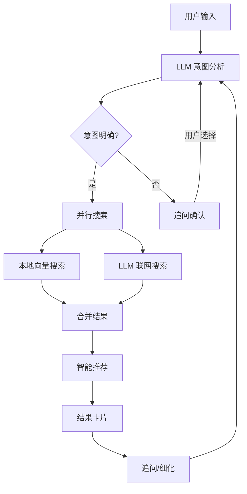
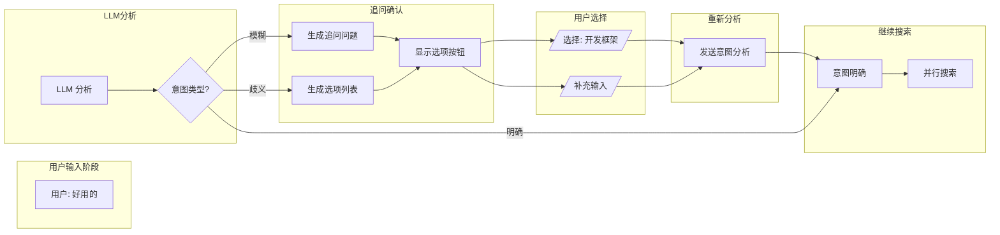
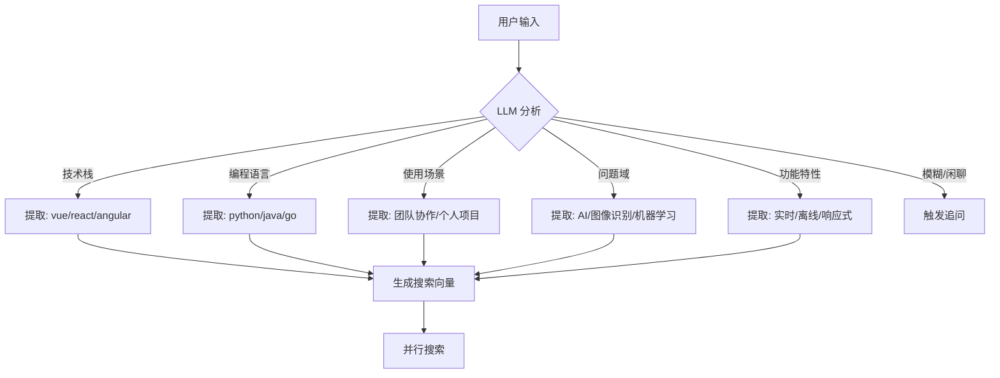
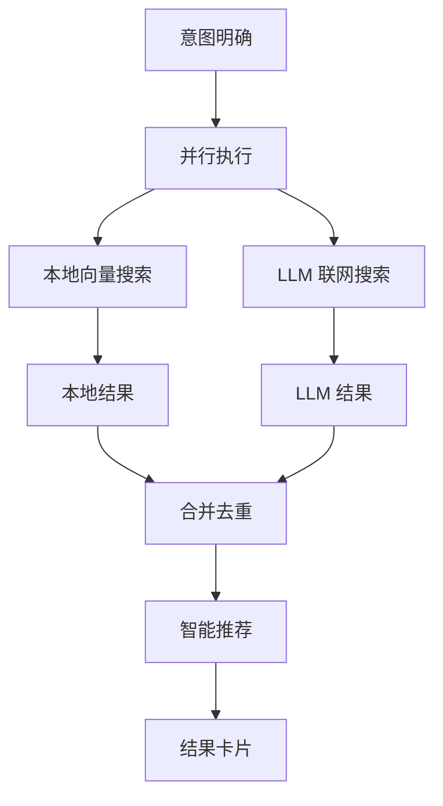
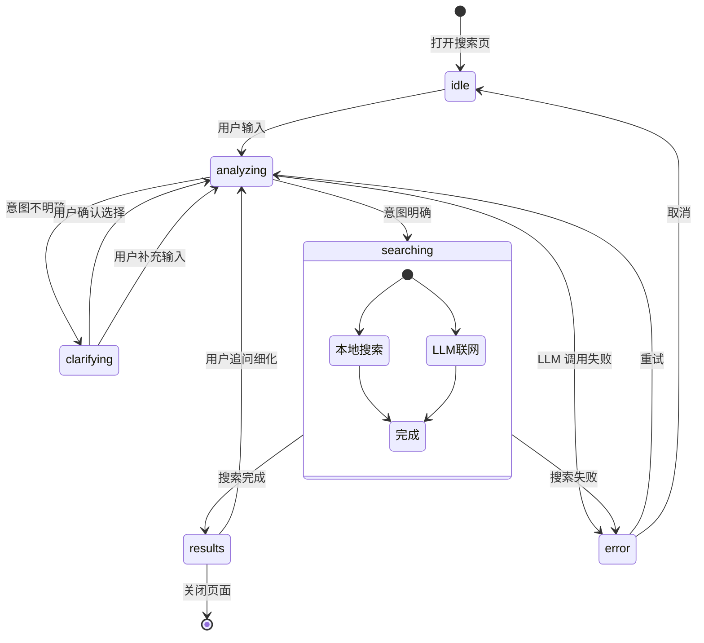
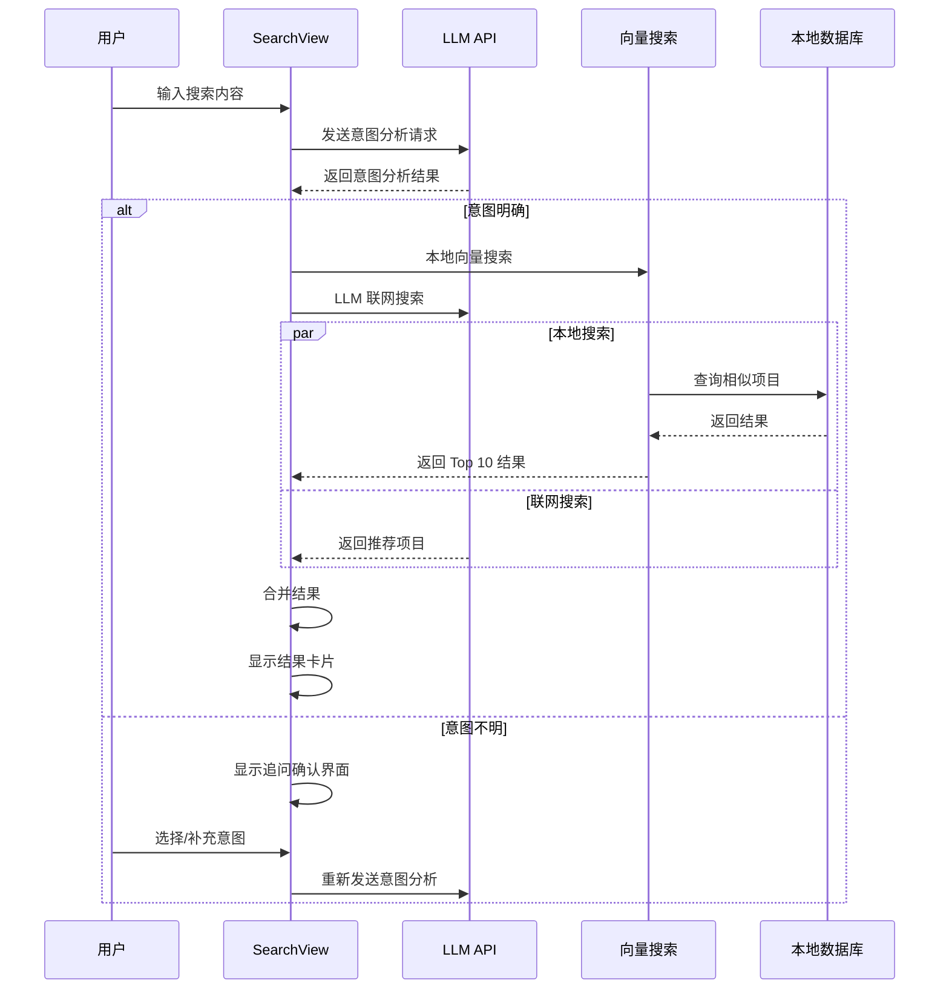
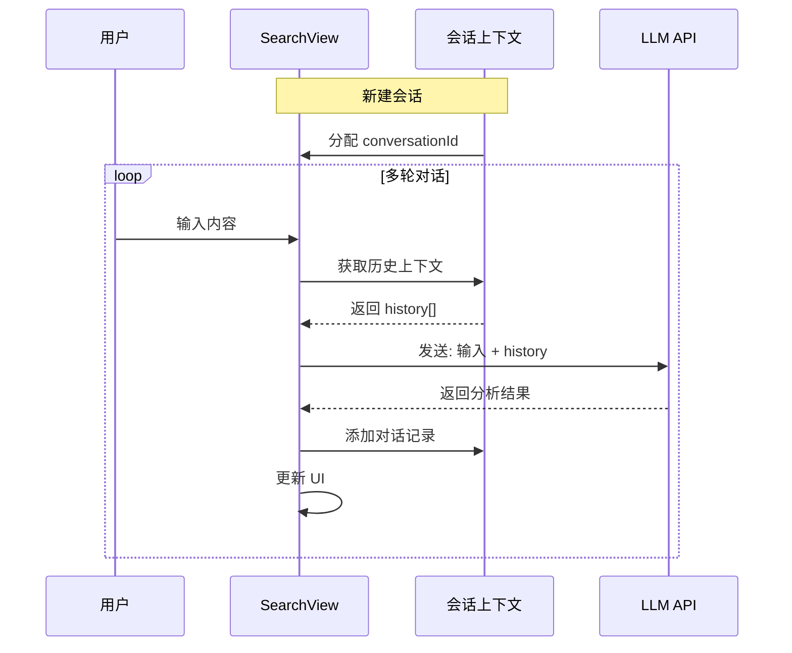
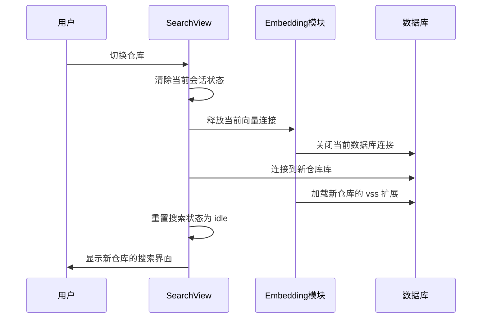

# 智能意图搜索流程设计

> 创建时间：2026-07-28
> 状态：**需求定版**

---

## 1. 核心流程概述

### 1.1 最终定版流程图



### 1.2 流程特点

| 特点 | 说明 |
|------|------|
| 追问后可重新分析 | 用户确认意图后重新进入 LLM 判断 |
| 并行搜索 | 本地和 LLM 同时进行，用户更快看到结果 |
| 任意阶段可追问 | 结果不满意可随时追问细化 |
| 追问入口统一 | 不区分"初始追问"和"结果追问" |

### 1.3 流程说明

| 步骤 | 名称 | 执行者 | 说明 |
|------|------|--------|------|
| Step 1 | 意图分析 | LLM | 分析用户输入，判断意图是否明确 |
| Step 2 | 追问确认 | 系统 | 意图不明时，展示选项供用户选择 |
| Step 3 | 并行搜索 | 本地+LLM | 本地向量搜索 + LLM 联网同时进行 |
| Step 4 | 合并结果 | 系统 | 合并本地和联网结果，去重排序 |
| Step 5 | 智能推荐 | 系统 | 基于结果推荐分类、标签、扩展搜索 |
| Step 6 | 结果展示 | 系统 | 展示项目卡片，可追问/细化 |

---

## 2. Step 1：意图分析

### 2.1 LLM 分析 Prompt

**输入**：用户自然语言

**Prompt 模板**：
```
你是一个开源项目推荐助手。用户输入：「{user_input}」

请分析用户意图：
1. 明确意图：直接描述需求（如"找 Vue 状态管理库"）
2. 不明确意图：模糊描述、闲聊、无法直接搜索

如果是明确意图，返回：
{"intent": "clear", "type": "技术栈/语言/领域/场景", "keywords": ["关键词1", "关键词2"]}

如果意图不明，返回：
{"intent": "unclear", "questions": ["追问问题1", "追问问题2"], "options": ["选项A", "选项B"]}
```

### 2.2 返回结构

```typescript
interface IntentAnalysis {
  intent: 'clear' | 'unclear';
  type?: string;        // 技术栈/语言/领域/场景
  keywords?: string[];   // 关键词列表
  questions?: string[];   // 追问问题
  options?: string[];     // 可选选项
}
```

### 2.3 意图类型分类

| 类型 | 示例输入 | 关键词提取 |
|------|---------|-----------|
| 技术栈 | "Vue状态管理" | vue, 状态管理, state management |
| 编程语言 | "Python爬虫" | python, 爬虫, web crawler |
| 使用场景 | "团队协作工具" | 团队, 协作, project management |
| 问题域 | "AI图像识别" | AI, 图像识别, computer vision |
| 功能特性 | "实时聊天系统" | 实时, 聊天, websocket |

---

## 3. Step 2：追问确认

### 3.1 触发条件

当 `IntentAnalysis.intent === 'unclear'` 时触发。

### 3.2 追问交互流程图



### 3.3 意图分类流程图



### 3.4 UI 示例

```
用户：我想找一个好用的
助手：抱歉，您的需求不够明确。请选择或补充：

🔹 类型
   [ ] 管理工具    [ ] 开发框架    [ ] 工具库    [ ] 应用系统

🔹 技术栈
   [ ] 前端(JS/TS)    [ ] 后端(Java/Python)    [ ] 全栈

🔹 使用场景
   [ ] 个人项目    [ ] 团队协作    [ ] 企业级

[请描述您的具体需求...]
```

### 3.5 追问模板

| 用户输入 | LLM 生成追问 |
|---------|-------------|
| "好用的" | 请选择：1. 什么类型？2. 什么场景？ |
| "苹果" | 是指水果 Apple，还是技术公司 Apple？ |
| "测试" | 是指单元测试框架、集成测试工具还是 E2E 测试？ |
| "管理系统" | 什么类型的管理系统？（项目管理/CRM/ERP/库存） |

---

## 4. Step 3：并行搜索

### 4.1 并行搜索流程图



### 4.2 搜索策略

**并行执行**：
- 本地向量搜索和 LLM 联网搜索同时进行
- 用户更快看到结果
- 本地结果优先展示

**本地搜索**：
1. **意图提取**：从 LLM 分析结果中提取关键词
2. **向量生成**：使用 Embedding 模型生成查询向量
3. **语义匹配**：在本地项目库中计算余弦相似度
4. **结果排序**：按相似度降序返回 Top 10

### 4.3 向量搜索 SQL（参考）

```sql
-- 加载 vss 扩展
PRAGMA load_extension('vss0');

-- 语义搜索
SELECT p.*, e.distance
FROM projects p
JOIN (
  SELECT rowid, vss_search_params(?, 10) as distance
  FROM project_embeddings
) e ON p.id = e.rowid
WHERE p.lifecycle_status != 'DELETED'
ORDER BY e.distance
LIMIT 10;
```

### 4.4 降级策略

当 sqlite-vss 扩展不可用时：
1. 记录错误日志
2. 回退到关键词 LIKE 搜索
3. 在 UI 提示"向量搜索不可用，使用关键词搜索"

### 4.5 LLM 联网搜索 Prompt

```
作为开源项目推荐专家，用户需求是：「{intent_keywords}」

请在 GitHub/Gitee 上搜索相关开源项目，返回：
1. 项目名称和地址
2. 简短描述（1-2 句）
3. 主要特点（3 个 bullet）
4. Star 数

返回格式（JSON 数组，最多 10 个）：
[
  {"name": "", "url": "", "desc": "", "stars": 0, "language": ""}
]
```

### 4.6 结果解析

```typescript
interface LLMProjectResult {
  name: string;
  url: string;
  desc: string;
  stars: number;
  language?: string;
}
```

---

## 5. Step 4：智能推荐

### 5.1 推荐内容

在搜索结果下方展示：
- **相关分类**：项目所属分类标签
- **关联标签**：项目常用标签
- **扩展搜索建议**：基于结果的相似搜索建议

### 5.2 示例

```
📦 找到 3 个本地项目 + 5 个推荐项目

┌─────────────────────────────────────┐
│ 💡 智能建议                          │
├─────────────────────────────────────┤
│ 相关分类：                            │
│   [项目管理] [团队协作] [敏捷开发]      │
│                                      │
│ 关联标签：                            │
│   [react] [typescript] [websocket]  │
│                                      │
│ 扩展搜索：                            │
│   "React状态管理" "Redux替代方案"      │
└─────────────────────────────────────┘
```

---

## 6. 状态机设计

### 6.1 状态定义

| 状态 | 代码 | 说明 | UI 显示 |
|------|------|------|---------|
| 空闲 | `idle` | 等待用户输入 | 输入框可用 |
| 分析意图 | `analyzing` | LLM 判断中 | "正在分析您的意图..." |
| 追问确认 | `clarifying` | 需要用户明确意图 | 展示选项和输入框 |
| 并行搜索 | `searching` | 本地+LLM 同时搜索 | "正在搜索..." |
| 显示结果 | `results` | 展示结果卡片 | 结果列表 + 智能推荐 |
| 错误 | `error` | 搜索失败 | 错误提示 + 重试 |

### 6.2 状态转换图



### 6.3 状态时序图



---

## 7. 会话上下文

### 7.1 数据结构

```typescript
interface SearchContext {
  conversationId: string;      // 会话 ID
  history: ConversationItem[];   // 对话历史
  currentIntent?: ParsedIntent; // 当前解析的意图
  status: SearchStatus;         // 当前状态
  localResults?: Project[];      // 本地搜索结果
  llmResults?: Project[];       // LLM 搜索结果
  createdAt: number;
}

interface ConversationItem {
  id: string;
  role: 'user' | 'assistant';
  content: string;
  timestamp: number;
  metadata?: {
    intent?: ParsedIntent;
    results?: Project[];
  };
}

interface ParsedIntent {
  intent: 'clear' | 'unclear';
  type?: string;
  keywords?: string[];
  questions?: string[];
  options?: string[];
}
```

### 7.2 上下文传递流程图



### 7.3 历史记录管理

- 保留最近 10 条对话历史
- 超出时删除最早的记录

---

## 8. 追问场景示例

| # | 用户输入 | 意图判断 | 系统追问 |
|---|---------|---------|----------|
| 1 | "好用的" | 不明确 | 请选择：1.什么类型？2.什么场景？ |
| 2 | "苹果" | 歧义 | 是指水果 Apple，还是技术公司 Apple？ |
| 3 | "测试" | 不明确 | 是指单元测试/集成测试/E2E测试？ |
| 4 | "管理系统" | 不明确 | 什么类型的管理系统？（项目管理/CRM/ERP） |
| 5 | "Vue状态管理" | 明确 | → 并行搜索 |
| 6 | "Python爬虫框架" | 明确 | → 并行搜索 |

---

## 9. 技术依赖

| 组件 | 说明 | 优先级 |
|------|------|--------|
| LLM 分析 API | 意图判断、Prompt 生成 | P0 |
| Embedding 模型 | 向量生成、语义搜索 | P0 |
| sqlite-vss | 本地向量搜索 | P0 |
| 会话存储 | 上下文持久化 | P1 |
| 结果缓存 | LLM 结果缓存 | P2 |

---

## 10. 工时评估

| 功能 | 描述 | 工时 |
|------|------|------|
| 意图分析 | LLM Prompt + API 调用 | 4h |
| 追问确认 UI | 选项展示 + 用户选择 | 3h |
| 并行搜索 | 本地 + LLM 同时搜索 | 4h |
| 智能推荐 | 分类/标签/扩展搜索 | 3h |
| 会话管理 | 上下文传递 + 历史记录 | 2h |
| 测试调优 | Prompt 优化 + 效果验证 | 4h |
| **总计** | | **20h** |

---

## 11. 异常处理与容错

### 11.1 超时控制

| 操作 | 超时时间 | 超过后行为 |
|------|----------|------------|
| LLM 意图分析 | 30 秒 | 返回错误，提示用户重试 |
| LLM 联网搜索 | 30 秒 | 返回错误，继续展示本地结果 |
| 本地向量搜索 | 5 秒 | 继续等待，不降级 |
| 并行搜索合并 | 60 秒 | 取已返回的结果 |

### 11.2 重试机制

```typescript
interface RetryConfig {
  maxAttempts: number;      // 最大尝试次数
  retryDelay: number;       // 重试间隔（毫秒）
  retryableErrors: string[]; // 可重试的错误类型
}

const DEFAULT_RETRY_CONFIG: RetryConfig = {
  maxAttempts: 2,
  retryDelay: 1000,
  retryableErrors: ['TIMEOUT', 'RATE_LIMIT', 'SERVER_ERROR']
};
```

**重试场景**：
| 场景 | 是否重试 | 说明 |
|------|----------|------|
| LLM API 超时 | ✅ 重试 | 网络波动引起 |
| LLM API 限流 | ✅ 重试 | 等待后重试 |
| LLM API 服务端错误 | ✅ 重试 | 5xx 错误 |
| LLM API 认证失败 | ❌ 不重试 | API Key 错误 |
| 本地向量搜索失败 | ❌ 不重试 | 回退到关键词搜索 |
| 网络断开 | ❌ 不重试 | 提示用户检查网络 |

### 11.3 降级策略

当某个组件不可用时，自动降级：

| 组件 | 降级行为 |
|------|----------|
| sqlite-vss 扩展 | 回退到关键词 LIKE 搜索 |
| Embedding API | 回退到关键词搜索 |
| LLM 联网搜索 | 仅展示本地结果 |
| 向量搜索超时 | 继续使用已返回结果 |

**降级提示**：
```
向量搜索不可用，已切换到关键词搜索
联网搜索超时，仅展示本地项目
```

---

## 12. 结果缓存策略

### 12.1 缓存设计

```typescript
interface SearchCache {
  queryHash: string;        // 查询内容哈希
  localResults?: Project[];  // 本地结果缓存
  llmResults?: Project[];   // LLM 结果缓存
  intentAnalysis?: IntentAnalysis;
  createdAt: number;
  expiresAt: number;
}
```

### 12.2 缓存配置

| 缓存类型 | 过期时间 | 说明 |
|----------|----------|------|
| 本地搜索结果 | 1 小时 | 项目数据相对稳定 |
| LLM 联网结果 | 30 分钟 | 联网数据可能变化 |
| 意图分析结果 | 2 小时 | 同一查询意图相同 |
| 会话上下文 | 永久 | 存储在本地 |

### 12.3 缓存 Key 生成

```typescript
function generateCacheKey(query: string, filters?: SearchFilters): string {
  const normalized = query.toLowerCase().trim();
  const filterStr = filters ? JSON.stringify(filters) : '';
  return sha256(normalized + filterStr);
}
```

### 12.4 缓存策略

| 场景 | 缓存行为 |
|------|----------|
| 相同查询 + 相同过滤 | 返回缓存结果 |
| 相同查询 + 不同过滤 | 重新搜索 |
| 首次查询 | 正常搜索并缓存 |
| 手动刷新 | 清除缓存，重新搜索 |

---

## 13. 仓库切换处理

### 13.1 切换流程



### 13.2 数据隔离

| 数据 | 隔离策略 |
|------|----------|
| 向量数据 | 每个仓库独立，互不影响 |
| 搜索历史 | 跟随仓库切换 |
| 会话上下文 | 跟随仓库切换 |
| 缓存数据 | 仓库切换时清除 |

### 13.3 切换时状态处理

```typescript
interface RepoSwitchHandler {
  onBeforeSwitch: () => void;   // 切换前：保存状态
  onSwitch: (newRepoPath: string) => void;  // 切换中：加载新数据
  onAfterSwitch: () => void;    // 切换后：重置 UI
}

function handleRepoSwitch(newRepoPath: string) {
  // 1. 保存当前搜索状态
  saveSearchState();

  // 2. 释放向量模块
  disposeVectorModule();

  // 3. 切换数据库连接
  switchDatabase(newRepoPath);

  // 4. 重新加载向量模块
  initVectorModule(newRepoPath);

  // 5. 重置搜索状态
  resetSearchState();

  // 6. 更新 UI
  setStatus('idle');
}
```

### 13.4 并发控制

| 场景 | 处理方式 |
|------|----------|
| 搜索中切换仓库 | 取消当前搜索，切换后不自动恢复 |
| 切换中发起搜索 | 等待切换完成后再执行 |
| 快速连续切换仓库 | 仅响应最后一次切换 |

---

## 14. 搜索限流

### 14.1 限流配置

```typescript
interface RateLimitConfig {
  llmCallsPerMinute: number;    // LLM 调用频率限制
  embeddingCallsPerMinute: number; // Embedding 调用限制
  searchCooldownMs: number;      // 搜索冷却时间
}

const DEFAULT_RATE_LIMIT: RateLimitConfig = {
  llmCallsPerMinute: 20,
  embeddingCallsPerMinute: 60,
  searchCooldownMs: 1000  // 1 秒内避免重复搜索
};
```

### 14.2 限流策略

| 操作 | 限制 | 超过后行为 |
|------|------|------------|
| LLM 意图分析 | 20次/分钟 | 提示"请求过于频繁" |
| LLM 联网搜索 | 20次/分钟 | 提示"请求过于频繁" |
| Embedding 生成 | 60次/分钟 | 排队等待 |
| 用户搜索 | 1次/秒 | 忽略重复请求 |

---

## 15. 工时评估（更新）

| 功能 | 描述 | 工时 |
|------|------|------|
| 意图分析 | LLM Prompt + API 调用 | 4h |
| 追问确认 UI | 选项展示 + 用户选择 | 3h |
| 并行搜索 | 本地 + LLM 同时搜索 | 4h |
| 智能推荐 | 分类/标签/扩展搜索 | 3h |
| 会话管理 | 上下文传递 + 历史记录 | 2h |
| **异常处理** | 超时 + 重试 + 降级 | 2h |
| **缓存策略** | 本地 + LLM 结果缓存 | 2h |
| **仓库切换** | 状态保存 + 向量重载 | 2h |
| 测试调优 | Prompt 优化 + 效果验证 | 4h |
| **总计** | | **26h** |

---

> 📝 **更新记录**
> - 2026-07-28：初始文档创建
> - 2026-07-28：需求定版，优化并行搜索流程
> - 2026-07-29：补充异常处理、缓存策略、仓库切换、限流设计
