# OS-Compass 概要设计说明书

| 部门 | 研发部 |
|------|--------|
| 编写 | 系统架构师 |
| 审核 |  |
| 批准 |  |
| 日期 | 2026-07-01 |
| 版本 | V1.2 |
| 修订日期 | 2026-07-08 |
| 修订说明 | 新增仓库管理模块（4.6 章节） |
| 修订日期 | 2026-07-10 |
| 修订说明 | 仓库管理模块新增「导入已有仓库」功能 |
| 修订日期 | 2026-07-22 |
| 修订说明 | 新增初始化向导模块（3.11.10 章节） |

---

## 1 引言

### 1.1 编写目的

本文档在《OS-Compass 产品需求文档 (PRD)》的基础上，从宏观层面对系统的整体架构、核心功能模块、数据流向进行概要设计。

### 1.2 目标及范围

**一期范围**：
- 项目导入：GitHub、Gitee、NPM、PyPI URL 自动解析 + 手动录入
- 项目管理：多层级分类管理、项目 CRUD、看板拖拽流转
- AI 赋能：LLM 自动分析、Runbook 生成、README 翻译
- 本地联动：git clone 下载、IDE 打开
- 数据安全：敏感信息加密存储

**二期范围**：
- 意图搜索（RAG 联网检索）
- 情报雷达（RSS 订阅）
- 插件系统 API

### 1.3 参考资料

- 《OS-Compass 产品需求文档 (PRD) V1.0》
- 《OS-Compass 需求规格说明书 (requirements.md) V1.2》
- 设计系统原型：`design-system/public/`

### 1.4 定义及简写

| 缩写 | 全称 | 说明 |
|------|------|------|
| Tauri | - | 跨平台桌面框架 |
| CRUD | Create/Read/Update/Delete | 增删改查 |
| LLM | Large Language Model | 大语言模型 |
| Runbook | - | 场景化操作手册 |
| MVP | Minimum Viable Product | 最小可行产品 |

---

## 2 系统架构设计

### 2.1 技术选型

| 层级 | 技术 | 说明 |
|------|------|------|
| 桌面框架 | Tauri 2.0 | Rust 后端 + WebView 前端 |
| 前端 | React 18 + TypeScript 5 | 类型安全 |
| 样式 | Tailwind CSS 3 | 原子化 CSS |
| 状态管理 | Zustand | 轻量状态管理 |
| 后端 | Rust 1.75+ | 内存安全、高性能 |
| 数据库 | SQLite 3.40+ | 本地优先、WAL 模式 |
| 加密 | AES-256-GCM | 敏感数据加密 |
| 密钥库 | OS Credential Manager | 系统级密钥存储 |

### 2.2 系统架构图

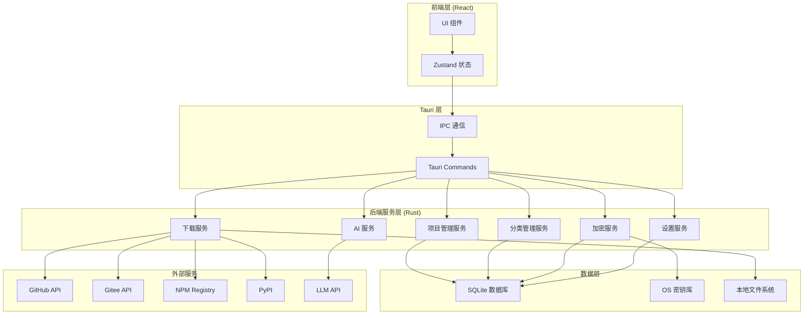

---

## 3 功能模块设计

### 3.1 项目导入模块（扩展化架构）

#### 3.1.1 平台扩展系统

**原型**：[import-form.html](../design-system/public/import-form.html)

**架构设计**：

不同平台（GitHub、Gitee、NPM、PyPI）的数据结构、API 方式、评分方式差异较大，采用扩展化架构解耦核心逻辑。

**Token 双轨制设计**：

| 配置情况 | 数据获取方式 | 数据质量 |
|----------|--------------|----------|
| 有 Token | 平台 API | ✅ 完整数据，可计算健康度 |
| 无 Token | 爬虫服务（web2md） | ⚠️ 部分数据，无法计算健康度 |

> **设计原则**：Token 可选，无 Token 时自动降级到爬虫服务。扩展内部判断 Token 是否存在，不存在则调用爬虫。

**扩展接口定义**：

```typescript
interface SourcePlugin {
  id: string;                           // 扩展唯一标识
  name: string;                         // 扩展显示名称
  pluginClass: string;                  // 扩展实现类名
  match(url: string): boolean;          // 判断 URL 是否匹配本扩展
  fetchMetadata(url: string): Promise<ProjectMetadata>;  // 获取项目元数据
  fetchReadme(url: string): Promise<string>;              // 获取 README 内容
  calculateHealthScore(metadata: ProjectMetadata): HealthScore;  // 计算健康度
  fetchLicense(url: string): Promise<LicenseInfo>;        // 获取许可证信息
}
```

**内置扩展**：

| 扩展 | ID | 类名 | 数据来源 | 评分特点 |
|------|-----|------|----------|----------|
| GitHub | `github` | `plugins::GitHubPlugin` | GitHub REST API | Commit + Issue + Release |
| Gitee | `gitee` | `plugins::GiteePlugin` | Gitee Open API | 类似 GitHub，需 Token |
| 通用爬虫 | `crawler` | `plugins::CrawlerPlugin` | web2md HTTP | 降级方案，无评分 |
| NPM | `npm` | `plugins::NpmPlugin` | NPM Registry | 下载量 + 版本 + 依赖 |
| PyPI | `pypi` | `plugins::PypiPlugin` | PyPI JSON API | 下载量 + 版本 |

**扩展配置**：

| 扩展 | 变量键名 | 显示名称 | 类型 |
|------|----------|----------|------|
| GitHub | github_token | GitHub Token | 敏感 |
| GitHub | github_proxy | 代理地址 | 普通 |
| Gitee | gitee_token | Gitee 私有令牌 | 敏感 |

#### 3.1.2 GitHub 扩展

**URL 格式**：`https://github.com/{owner}/{repo}`

**API 特点**：
- 公开仓库无需 Token，无 Token 时自动降级到爬虫
- 有 Token 时支持获取元数据、README、License、Commit、Issue、Release

**数据获取**：
```typescript
// 获取项目元数据
GET https://api.github.com/repos/{owner}/{repo}

// 获取 README
GET https://api.github.com/repos/{owner}/{repo}/readme

// 获取 License
GET https://api.github.com/repos/{owner}/{repo}/license
```

#### 3.1.3 Gitee 插件

**URL 格式**：`https://gitee.com/{owner}/{repo}`

**API 特点**：
- **需要用户配置 Personal Access Token** 才能正常访问
- API 端点：`https://gitee.com/api/v5`
- 接口风格与 GitHub 类似

**Token 配置**：
- 用户在设置中心的插件配置页填写 Gitee Token
- Token 加密存储在 `plugins_config` 表
- 无 Token 或 Token 过期会导致 API 调用失败

**数据获取**：
```typescript
// 获取项目元数据
GET https://gitee.com/api/v5/repos/{owner}/{repo}
// Header: Authorization: Bearer {token}

// 获取 README
GET https://gitee.com/api/v5/repos/{owner}/{repo}/readme
// Header: Authorization: Bearer {token}
```

#### 3.1.4 NPM 扩展

**URL 格式**：`https://npmjs.com/package/{name}` 或直接输入包名 `{name}`

**API 特点**：
- 无需认证，公开 API
- 返回包含下载量、版本数、依赖数

**数据获取**：
```typescript
// 获取包信息
GET https://registry.npmjs.org/{name}

// 获取下载量
GET https://api.npmjs.org/downloads/point/last-week/{name}
```

#### 3.1.5 PyPI 扩展

**URL 格式**：`https://pypi.org/project/{name}` 或直接输入包名 `{name}`

**API 特点**：
- 无需认证，公开 API
- 返回包含下载量（需额外接口）、版本信息

**数据获取**：
```typescript
// 获取包信息
GET https://pypi.org/pypi/{name}/json

// 获取下载量
GET https://pypi.org/pypi/{name}/json
// 注：PyPI 不直接提供下载量，需使用 pypistats 等第三方接口
```

#### 3.1.6 扩展化优点

| 优点 | 说明 |
|------|------|
| 解耦 | 核心逻辑不依赖任何具体平台 |
| 扩展 | 未来可新增 GitLab、Docker Hub、Crates.io 等 |
| 独立维护 | 各平台扩展独立更新 |
| 差异化评分 | NPM 侧重下载量，GitHub/Gitee 侧重社区活跃度 |
| Token 管理 | Gitee 等需要认证的平台可独立配置 Token |
| 双轨降级 | 无 Token 时自动降级到爬虫服务 |

### 3.1.7 两类扩展的区分

> **命名说明**：本期 MVP 的平台集成功能称为「扩展配置」，二期的高级功能（插件市场、热加载、第三方扩展）称为「插件系统」。

| 对比维度 | 平台扩展（SourcePlugin） | 功能插件（FeaturePlugin） |
|----------|------------------------|----------------------|
| 用途 | 扩展开源平台支持 | 扩展系统功能 |
| 调用时机 | 项目导入时自动调用 | 用户主动触发或后台定时 |
| 数据流向 | 外部 → 系统（拉取） | 外部 ↔ 系统（推送/拉取） |
| MVP 实现 | GitHub/Gitee/NPM/PyPI | 无 |
| M13 实现 | RSS/Telegram/WebCrawl | 情报雷达、意图搜索 |
| M14 实现 | GitLab/Docker Hub | 插件热加载、插件市场 |
| M15 实现 | - | 首页/引导页 |

**功能插件示例**：

| 插件 | 功能描述 |
|------|----------|
| 情报雷达 | RSS 订阅监控，发现项目更新时推送通知；支持搜索增强展示（关键字/来源/时间筛选 + 分页）；内置广告过滤插件 |
| 意图搜索 | **双轨搜索**：本地向量搜索（sqlite-vss）+ LLM 联网搜索 |
| 广告过滤 | 采集时自动过滤广告和垃圾信息，基于 banlex 词库，支持中文扩展 |
| Webhook 通知 | 项目更新时推送到钉钉/飞书/邮件 |

### 3.1.8 平台扩展与功能插件的接口差异

```typescript
// 平台扩展接口 - 用于项目导入时获取数据
interface SourcePlugin {
  id: string;
  name: string;
  pluginClass: string;                  // 扩展实现类名
  match(url: string): boolean;
  fetchMetadata(url: string): Promise<ProjectMetadata>;
  fetchReadme(url: string): Promise<string>;
  calculateHealthScore(metadata: ProjectMetadata): HealthScore;
}

// 功能插件接口 - 用于扩展系统功能
interface FeaturePlugin {
  id: string;
  name: string;
  type: 'radar' | 'search' | 'webhook' | 'importer';
  isEnabled(): boolean;
  execute(context: PluginContext): Promise<FeatureResult>;
}
```

**流程图**：

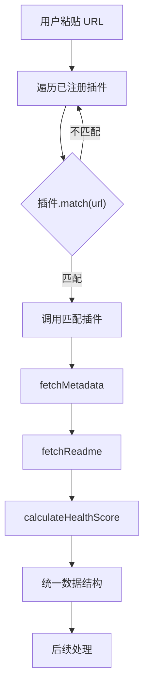

#### 3.1.2 URL 自动导入流程

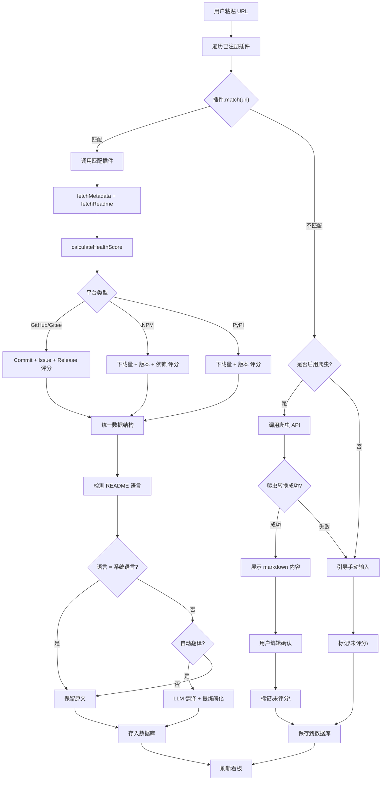

#### 3.1.2.1 平台识别与回退策略

**识别优先级**：

| 优先级 | 平台 | 识别方式 | 处理结果 |
|--------|------|----------|----------|

#### 3.1.2.2 URL 唯一性校验

**校验流程**：

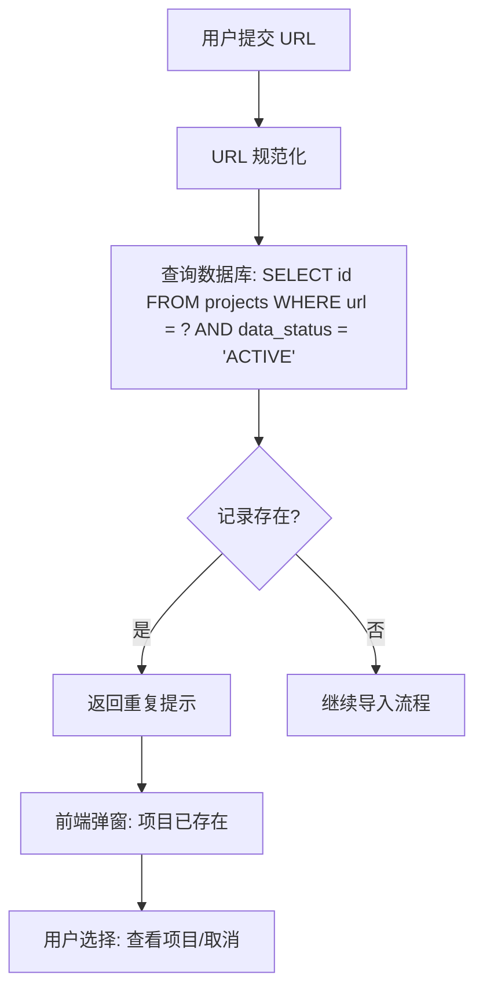

**URL 规范化规则**：
- 去除尾部斜杠
- 域名部分统一小写
- 去除 query 参数和 fragment

#### 3.1.2.3 导入流程异步化设计

**两阶段架构**：

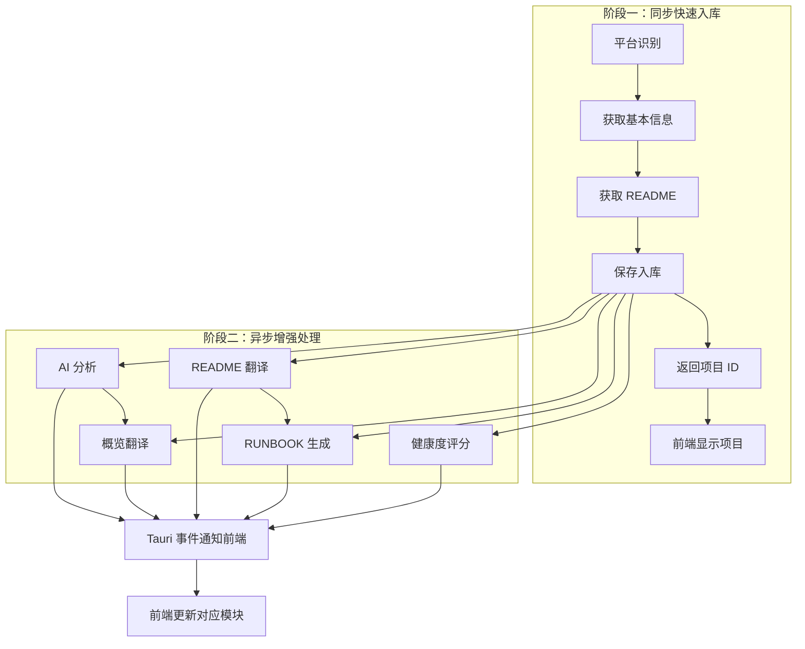

**异步任务状态**：

| 状态 | 说明 | UI 表现 |
|------|------|---------|
| pending | 等待执行 | 模块显示"等待中" |
| running | 正在执行 | 模块显示 spinner |
| done | 已完成 | 模块显示结果 |
| failed | 执行失败 | 模块显示错误提示 + 重试按钮 |

**Tauri 事件设计**：

| 事件名 | 载荷 | 说明 |
|--------|------|------|
| `import:task_progress` | `{project_id, task_type, status, error}` | 通知前端任务状态变更（统一事件，包含 running/done/failed） |

**任务生命周期管理（关键设计）**：

| 设计点 | 实现方式 | 说明 |
|--------|----------|------|
| 脱离前端生命周期 | `tauri::async_runtime::spawn` | 后台任务在 tokio 运行时独立执行，前端关闭页面不影响 |
| 立即返回 | `post_import_tasks` 调用 spawn 后立即返回 `Ok(())` | 前端不等待后台任务完成 |
| 事件驱动更新 | 后台任务通过 `app.emit` 发送进度 | 前端监听事件自动刷新对应模块 |
| 重复项目处理 | 返回 `DuplicateInfo`，不创建新记录 | 前端显示"查看项目"按钮跳转已有项目 |
| 入库失败停留 | 前端检测 `success=false` 时不关闭导入页 | 显示失败统计，界面恢复可编辑 |

**导入页面关闭逻辑**：

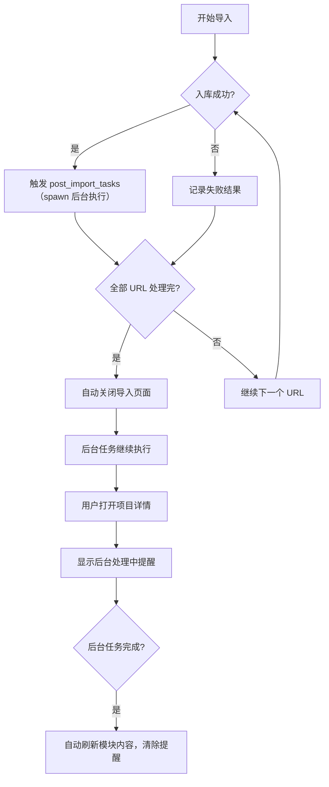
| 1 | GitHub | URL 包含 `github.com` | 插件抓取 + 完整评分 |
| 2 | Gitee | URL 包含 `gitee.com` | 插件抓取 + 完整评分 |
| 3 | NPM | URL 包含 `npmjs.com` | 插件抓取 + 完整评分 |
| 4 | PyPI | URL 包含 `pypi.org` | 插件抓取 + 完整评分 |
| 5 | 其他平台 | 无法匹配已知插件 | 爬虫回退 / 手动输入 |

**回退策略**：

| 场景 | 处理方式 | 数据标记 |
|------|----------|----------|
| 已知平台 | 插件抓取 API 数据 | 正常入库，含健康度评分 |
| 未知平台 + 爬虫成功 | 用户确认 markdown 内容 | "未评分"状态 |
| 未知平台 + 爬虫失败 | 用户手动输入 | "未评分"状态 |

**"未评分"状态说明**：
- 不触发健康度评分计算
- 不触发数据校验
- 卡片显示"未评分"标签
- 用户可后续补充信息

**确认页面交互（import-confirm.html）**：
- 页面加载时自动从 `document.title` 提取项目名称
- 提供"从标题提取"按钮可重新生成
- 智能截取规则：取标题第一个分隔符前的内容，去除括号等冗余字符

#### 3.1.3 各平台健康度评分

**GitHub/Gitee 评分维度及权重**：

| 维度 | 权重 | 评分标准 | 数据来源 |
|------|------|----------|----------|
| 提交活跃度 | 25% | 最近6个月：25分<br>最近12个月：15分<br>最近24个月：8分<br>> 24个月：0分 | REST API |
| Issue 闭环率 | 20% | >= 80%：20分<br>>>= 60%：15分<br>>>= 40%：10分<br>< 40%：5分 | REST API |
| 版本发布频率 | 20% | 最近6个月：20分<br>最近12个月：12分<br>最近24个月：6分<br>> 24个月：0分 | REST API |
| Star 数量 | 15% | >= 50k：15分<br>>>= 10k：12分<br>>>= 1k：8分<br>>>= 100：4分<br>< 100：1分 | REST API |
| 贡献者数量 | 10% | >= 100：10分<br>>>= 20：8分<br>>>= 5：5分<br>< 5：2分 | REST API |
| License 风险 | 10% | MIT/Apache/BSD/ISC：+10分<br>GPL/AGPL：-5分<br>无协议：0分 | LICENSE 文件 |

**NPM 评分维度及权重**：

| 维度 | 权重 | 评分标准 | 数据来源 |
|------|------|----------|----------|
| 下载量 | 30% | >= 10M/周：30分<br>>>= 1M/周：25分<br>>>= 100k/周：20分<br>< 100k/周：10分 | Downloads API |
| 版本数 | 25% | >= 100：25分<br>>>= 50：20分<br>>>= 20：15分<br>< 20：5分 | Registry |
| 依赖数 | 20% | <= 10：20分<br><= 30：15分<br><= 50：10分<br>> 50：5分 | Registry |
| 最近更新时间 | 15% | 最近6个月：15分<br>最近12个月：10分<br>> 12个月：5分 | Registry |
| License | 10% | MIT/Apache/BSD/ISC：+10分<br>其他：0分 | Registry |

**PyPI 评分维度及权重**：

| 维度 | 权重 | 评分标准 | 数据来源 |
|------|------|----------|----------|
| 下载量 | 30% | >= 1M/周：30分<br>>>= 100k/周：25分<br>>>= 10k/周：20分<br>< 10k/周：10分 | Stats API |
| 版本数 | 25% | >= 50：25分<br>>>= 20：20分<br>>>= 10：15分<br>< 10：5分 | JSON API |
| 发布时间 | 15% | 最近6个月：15分<br>最近12个月：10分<br>> 12个月：5分 | JSON API |
| License | 15% | MIT/Apache/BSD/ISC：+15分<br>其他：0分 | JSON API |
| 官方发布 | 15% | 官方发布：15分<br>仅源码分发：5分 | JSON API |

#### 3.1.2 手动录入

**原型**：[manual-add.html](../design-system/public/manual-add.html)

**规则**：
- 项目名称必填
- 分类默认为"未分类"
- 状态固定为"待探索"

**流程图**：

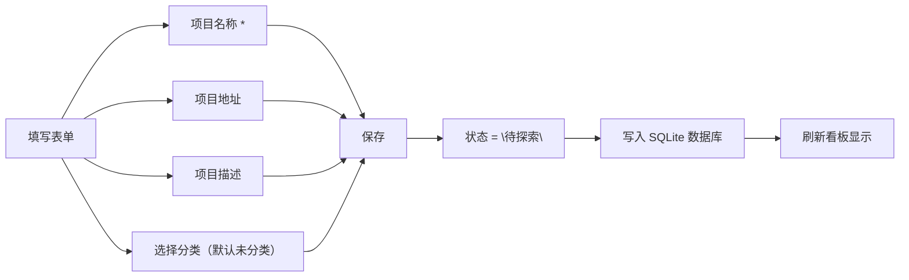

---

### 3.2 项目管理模块

#### 3.2.1 看板视图

**原型**：[main-interface.html](../design-system/public/main-interface.html)

**四列状态（lifecycle_status）**：

| 状态 | 标识 | 说明 |
|------|------|------|
| 待探索 | 💡 | 新发现或感兴趣的项目 |
| 深度研究中 | 🔬 | 正在评估的项目 |
| 已落地/在用 | ✅ | 已采用并使用的项目 |
| 弃用/避坑 | 🗑️ | 已放弃的项目 |

**数据可用性状态（data_status）**：

| 状态 | 说明 |
|------|------|
| ACTIVE | 正常状态，可显示在看板/列表 |
| ARCHIVED | 归档状态，隐藏显示，可恢复 |
| DELETED | 删除状态，隐藏显示，可恢复或彻底删除 |

**交互**：拖拽卡片跨列流转（仅改变 lifecycle_status）

**流程图**：

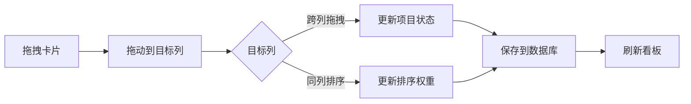

#### 3.2.2 列表视图

**原型**：[list-view.html](../design-system/public/list-view.html)

**筛选器**：
- 关键字模糊搜索
- 分类树状下拉选择
- **语言多选筛选**（支持多语言项目）
- **标签多选筛选**（自由标签）
- 生命周期状态筛选
- 更新时间范围

**语言多选设计**：
- 下拉多选框，支持同时筛选多个语言
- 列表中显示多个语言徽章（如 TypeScript + JavaScript）
- 筛选模式：包含任意一个所选语言

**标签系统设计**：

| 标签来源 | 说明 | 优先级 |
|----------|------|--------|
| LLM 提取 | 导入时 AI 分析项目关键词 | 初始标签 |
| 用户添加 | 手动输入，数量无限制 | 可覆盖 LLM |
| 预设标签 | 系统预设常用标签（可选） | 辅助筛选 |

**标签属性**：
- name：标签名称
- color：标签颜色（可选）
- source：ai（LLM提取）/ user（用户添加）/ preset（预设）

#### 3.2.3 项目详情

**原型**：[project-detail.html](../design-system/public/project-detail.html)

**6 个标签页**：

| 标签 | 内容 |
|------|------|
| 概览 | 基本信息、AI 一句话总结、AI 提炼的适用场景、快速操作 |
| AI 报告 | 健康度评分、License 合规、安全提示、用户口碑 |
| Runbook | 环境要求、安装步骤、运行步骤、二开入口 |
| README | 双语对照（原文/翻译 Toggle） |
| 本地笔记 | 用户踩坑记录 |
| 用户信息 | 数据保险箱（敏感凭证管理） |

**概览标签页 AI 生成内容**：

| 内容 | 说明 | 数据来源 |
|------|------|----------|
| AI 一句话总结 | 用目标语言概括项目核心价值（< 50 字） | LLM 生成 |
| 适用场景 | AI 提炼的 2-3 个典型使用场景 | LLM 生成 |
| AI 评估摘要 | 成熟度、学习曲线、社区活跃度、商业友好度 | 插件数据 + LLM 生成 |
| 快速操作 | 下载到本地、用 IDE 打开、重新分析 | - |

**AI 评估摘要设计**：

| 维度 | 说明 | 平台差异 |
|------|------|----------|
| 成熟度 | 项目稳定性和社区接受度 | GitHub/Gitee：版本历史；NPM：下载量；PyPI：版本稳定性 |
| 学习曲线 | 新手上手难度 | 文档完整性 + 代码复杂度 |
| 社区活跃度 | Issue/PR 响应情况 | GitHub/Gitee：Issue/PR；NPM：维护者状态 |
| 商业友好度 | License 风险评估 | 通用：License 类型 |

**数据流向**：

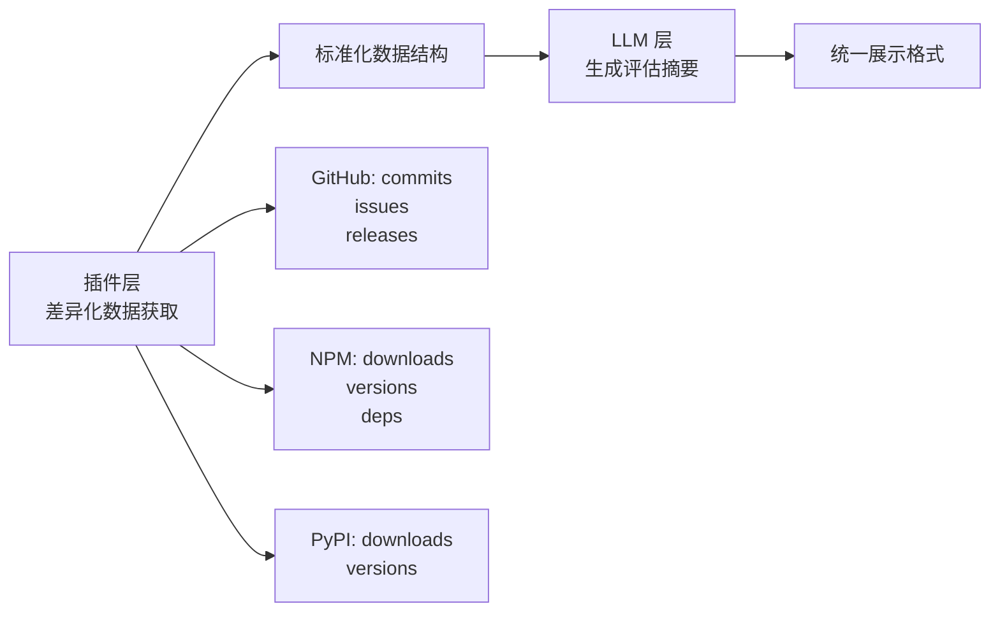

**README 标签页处理流程**：

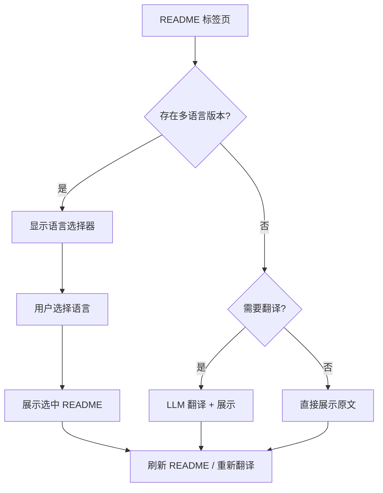

#### 3.2.4 翻译功能模块

**功能入口**：

| 入口 | 说明 |
|------|------|
| 导入时自动翻译 | 导入项目时根据设置自动翻译 README |
| 手动翻译 | 详情页 README 标签页点击"翻译 README"按钮 |
| 重新翻译 | 当翻译结果不满意时，点击"重新翻译" |

**翻译设置**（位于设置中心 - **翻译** 标签页）：

| 配置项 | 说明 | 默认值 |
|--------|------|--------|
| 翻译引擎 | Google 翻译 / LLM 翻译 / 自动选择 | 自动选择 |
| 默认阅读语言 | 用于判断是否需要翻译 | 简体中文 |
| 自动翻译 README | 导入时自动翻译非目标语言 README | 开启 |

**翻译引擎选择策略**：

| 引擎 | 特点 | 适用场景 |
|------|------|----------|
| Google 翻译 | 速度快，免费，有频率限制 | 短文本（&lt;5000字符） |
| LLM 翻译 | 质量好，有成本，响应较慢 | 长文本，需要语义理解 |
| 自动选择（推荐） | 短文本用 Google，长文本用 LLM | 最佳平衡 |

**翻译引擎使用范围**（2026-07-04 确认）：

| 翻译场景 | 使用引擎 | 实现函数/命令 |
|----------|----------|-------------|
| 概览翻译（summary/use_cases/risks/dependencies/description） | LLM | `translate_text_with_llm` / `translate_with_llm` 命令 |
| README 翻译 | 自动选择 | `translate_text` / `translate` 命令 |
| 手动翻译概览 | LLM | `translate_with_llm` 命令 |

**翻译失败自动补译机制**：

| 机制 | 触发时机 | 说明 |
|------|----------|------|
| 后台重试 | 后台翻译任务失败 | 重试 3 次，间隔 3 秒 |
| 前端补译 | 后台任务全部完成（`all` done 事件） | 检查 translations 表缺失字段，用 LLM 补译 |
| 手动补译 | 用户点击"翻译概览" | 跳过已有翻译，只补译缺失字段 |

**AI 分析 README 预处理**（仅用于 AI 分析，不影响 README 模块展示）：

| 用途 | 最大字符数 | 预处理内容 |
|------|-----------|-----------|
| AI 分析（analyze_project） | 6000 | 过滤图片、合并空行、按字符截取 |
| 标签生成（generate_tags） | 2000 | 同上 |
| RUNBOOK 生成（generate_runbook） | 12000 | 同上 |

**翻译引擎流程图**：

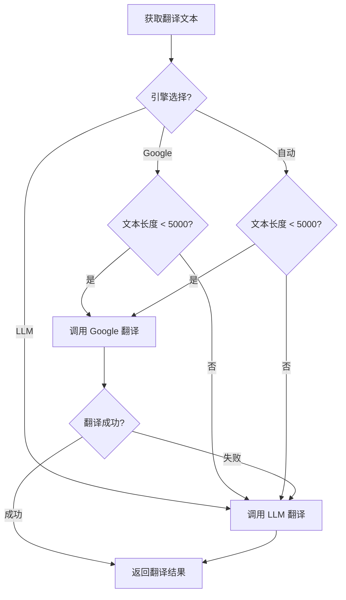

**翻译处理总流程**：

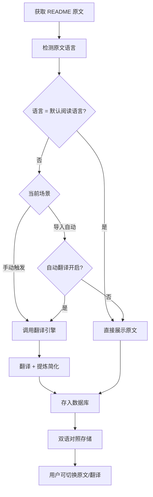

**概览页快速操作区分**：

| 按钮 | 功能 | 耗时 |
|------|------|------|
| 重新分析 | 完整 AI 评估（健康度 + License + 安全 + 口碑） | 较长 |
| 翻译 README | 仅翻译 + 提炼（快速） | 较短 |

#### 3.2.5 翻译引擎详解

**Google 翻译**：

- 优点：速度快，免费，无需 API 成本
- 缺点：有频率限制（免费版），不适合长文本
- 配置：可选 Google API Key（不填使用免费版）

**LLM 翻译**：

- 优点：翻译质量高，支持复杂语义理解
- 缺点：速度较慢，有 API 成本
- 配置：需要配置 LLM（与 AI 报告共用）

**自动选择策略**：

- 文本长度 &lt; 5000 字符：优先 Google 翻译
- 文本长度 ≥ 5000 字符：使用 LLM 翻译
- Google 翻译失败：自动降级到 LLM

**代理设置**：

- 中国大陆访问 Google 需要代理
- 可在"翻译"设置中配置 Google 专用代理

#### 3.2.6 LLM 翻译不仅是翻译

- 提炼：去除冗余信息，保留核心内容
- 简化：将复杂描述转化为简洁清晰的表述
- 结构化：按主题分段，便于快速浏览

#### 3.2.7 重新分析机制

**设计原则**：概览页"重新分析"更新全部，各标签页按钮仅更新自身专题。

| 位置 | 按钮 | 范围 | 说明 |
|------|------|------|------|
| 概览 - 快速操作 | 重新分析（全部） | 数据 + AI报告 + Runbook | 全量更新 |
| AI 报告标签页 | 重新分析 | 仅 AI 报告 | 健康度评分 + 深度分析 |
| Runbook 标签页 | 重新生成 | 仅 Runbook | 环境/安装/二开步骤 |
| README 标签页 | 重新翻译 | 仅 README | 翻译 + 提炼 + 简化 |

**重新分析流程图**：

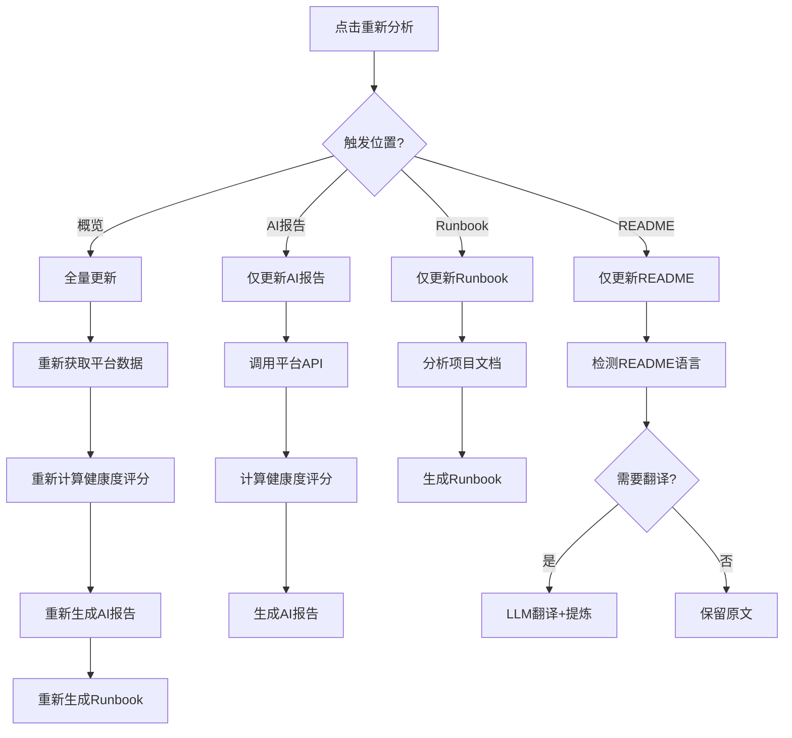

#### 3.2.7 Markdown 处理模块

**模块职责**：统一处理 Markdown 内容的编辑、渲染和格式转换。

**技术选型**：

| 功能 | 技术方案 | 说明 |
|------|----------|------|
| Markdown 渲染 | `marked` + `highlight.js` | 轻量、快速 |
| Markdown 编辑器 | `EasyMDE` | 集成编辑 + 实时预览 |
| XSS 防护 | `DOMPurify` | 渲染前清理恶意脚本 |
| HTML → Markdown | `turndown` | 爬虫回退场景使用 |

**使用场景**：

| 场景 | 功能需求 |
|------|----------|
| 项目详情页 README 标签页 | Markdown 渲染（只读） |
| import-confirm.html | Markdown 编辑 + 实时预览 |
| 爬虫回退 | HTML 转 Markdown |

**Markdown 渲染流程**：

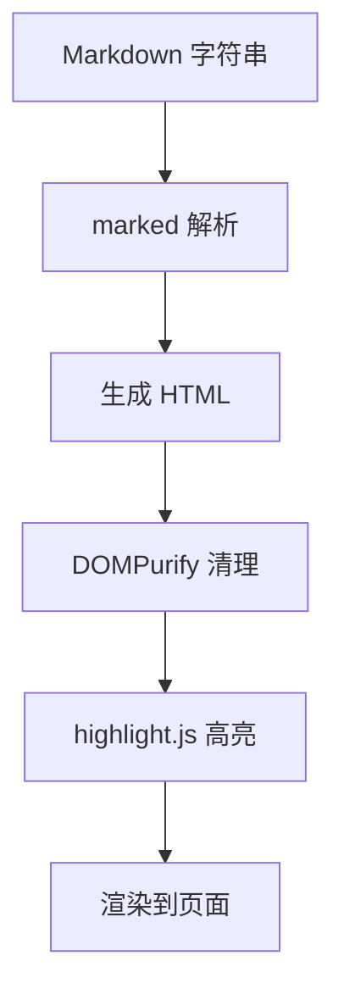

**Markdown 编辑流程**：

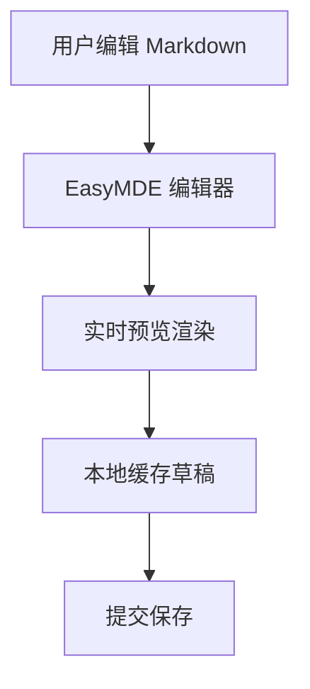

**HTML 转 Markdown 流程**：

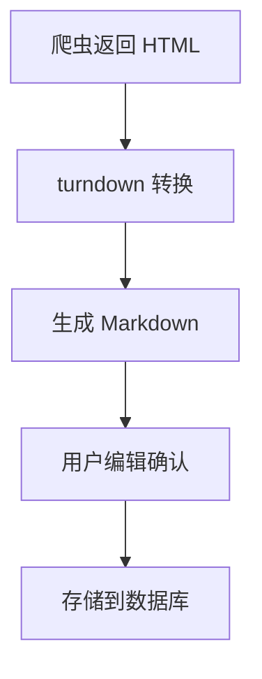

**XSS 防护配置**：

```javascript
DOMPurify.addHook('afterSanitizeAttributes', (node) => {
  if (node.tagName === 'A') {
    node.setAttribute('target', '_blank');
    node.setAttribute('rel', 'noopener noreferrer');
  }
});
```

---

### 3.3 分类管理模块

**原型**：[category-manager.html](../design-system/public/category-manager.html)

**分类字段**：

| 字段 | 类型 | 说明 |
|------|------|------|
| name | VARCHAR | 分类名称 |
| path | VARCHAR | 路径标识（英文） |
| explain | TEXT | 分类描述（供 AI 理解） |
| sort_order | INTEGER | 排序权重 |
| parent_id | INTEGER | 上级分类 |

**特殊分类**：
- **未分类**（系统分类，不可删除）
  - AI 无法判断时自动归入

**流程图**：

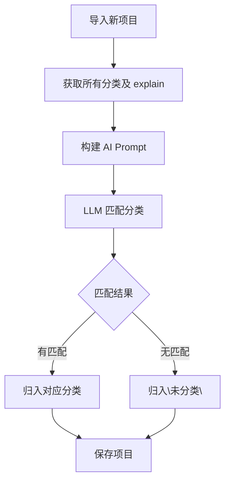

---

### 3.4 数据保险箱模块

**原型**：[project-detail.html（用户信息标签页）](../design-system/public/project-detail.html)

**字典结构**：

| 字段 | 类型 | 说明 |
|------|------|------|
| key | VARCHAR | 键名 |
| value | TEXT | 值（可加密） |
| is_secret | BOOLEAN | 是否敏感 |

**加密流程**：

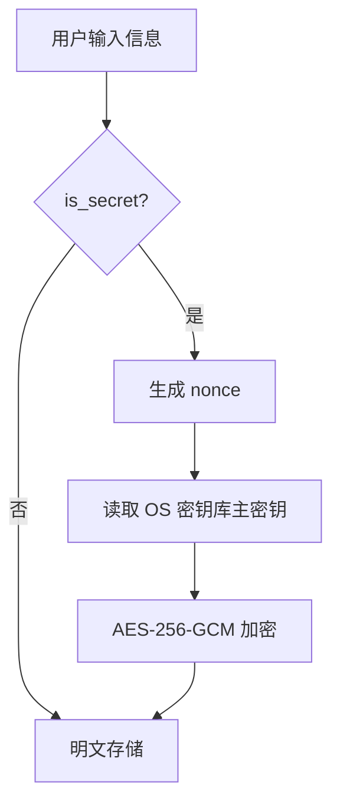

**密钥管理**：
1. 首次启动：自动生成密钥，存入 OS 密钥库
2. 后续启动：自动恢复密钥
3. 用户无感

---

### 3.5 本地联动模块

**原型**：[project-detail.html - 克隆标签页](../design-system/public/project-detail.html)

**设计原则**：
| 原则 | 说明 |
|------|------|
| 独立表存储 | 新建 `project_clone` 表，不影响现有 projects 表 |
| 项目维度 | 每个项目独立配置和记录克隆状态 |
| 按需创建 | 切换到克隆标签页时才创建记录 |
| 代理个性化 | 不同项目可用不同代理设置 |

**数据库设计**：

```
┌─────────────────────────────────────┐
│           projects (现有表)           │
│  id, name, url, source, ...        │
└────────────────┬────────────────────┘
                 │ 1:1
                 ▼
┌─────────────────────────────────────┐
│        project_clone (新建表)         │
│  id, project_id (FK UNIQUE)         │
│  cloned_path, cloned_at             │
│  proxy_enabled, proxy_protocol,     │
│  proxy_host, proxy_port,           │
│  proxy_username, proxy_password     │
└─────────────────────────────────────┘
```

**页面结构**：

```
┌─────────────────────────────────────────────────────────┐
│  克隆设置                                               │
│  ┌───────────────────────────────────────────────────┐  │
│  │ 克隆目录：[/path/to/workspace    ] [选择]         │  │
│  │                                                   │  │
│  │ 代理设置：                                        │  │
│  │   [v] 启用代理                                    │  │
│  │   协议：[HTTP ▼]  地址：[127.0.0.1  ] 端口：[7890] │  │
│  │   用户名：[        ]  密码：[        ]            │  │
│  │                              [💾 保存]              │  │
│  └───────────────────────────────────────────────────┘  │
│                                                         │
│  克隆操作                                               │
│  ┌───────────────────────────────────────────────────┐  │
│  │ git clone https://github.com/facebook/react       │  │
│  │                                                   │  │
│  │  [复制命令]                    [🚀 执行克隆]      │  │
│  └───────────────────────────────────────────────────┘  │
│                                                         │
│  已克隆状态（已克隆时显示）                             │
│  ┌───────────────────────────────────────────────────┐  │
│  │ 已克隆到：D:\Projects\react                      │  │
│  │ 克隆时间：2026-07-06 10:30                       │  │
│  │              [在文件管理器打开]  [重新克隆]        │  │
│  └───────────────────────────────────────────────────┘  │
└─────────────────────────────────────────────────────────┘
```

**流程图**：

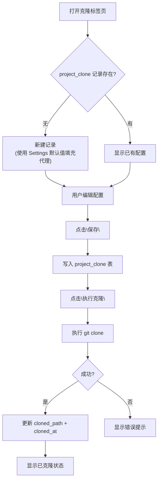

**与 Settings 的关系**：
| 配置来源 | 说明 |
|----------|------|
| Settings 默认值 | 新建记录时，代理设置使用 Settings 中的 download_proxy_* 值 |
| 项目独立设置 | 保存后覆盖默认值，以 project_clone 表为准 |

---

### 3.6 设置中心模块

**原型**：[settings.html](../design-system/public/settings.html)

**3 个标签页**：

| 标签 | 配置项 |
|------|--------|
| 通用 | 数据目录、主题、**默认阅读语言** |
| 下载 | 源码目录、默认编辑器、代理设置 |
| LLM | 供应商、API Base、API Key（加密存储）、模型、测试连接 |

**翻译相关设置**（位于设置中心 - 翻译 标签页）：

| 配置项 | 说明 | 默认值 |
|--------|------|--------|
| 翻译引擎 | Google 翻译 / LLM 翻译 / 自动选择 | 自动选择 |
| 默认阅读语言 | 用于判断是否需要翻译（如：简体中文、English） | 简体中文 |
| 自动翻译 README | 开启后，非目标语言的 README 自动翻译入库 | 开启 |
| 自动翻译 AI 报告 | 开启后，AI 报告使用目标语言生成 | 开启 |
| Google API Key | Google 翻译 API Key（可选） | 空 |
| Google 代理 | 是否使用代理访问 Google | 否 |

**翻译引擎影响流程**：

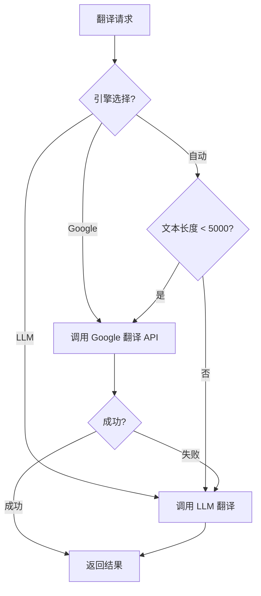

**语言相关设置**：

| 配置项 | 说明 | 默认值 |
|--------|------|--------|
| 默认阅读语言 | 用于判断是否需要翻译（如：简体中文、English） | 简体中文 |
| 自动翻译 README | 开启后，非目标语言的 README 自动翻译入库 | 开启 |
| 自动翻译 AI 报告 | 开启后，AI 报告使用目标语言生成 | 开启 |

**语言影响流程**：

```mermaid
flowchart TD
    A["导入项目"] --> B{"README 语言 = 默认语言?"}
    B -->|是| C["保留原文"]
    B -->|否| D{"自动翻译开启?"}
    D -->|是| E["LLM 翻译 + 提炼简化"]
    D -->|否| F["只保存原文"]
    E --> G["存入数据库"]
    C --> G
    F --> G
```

---

### 3.7 批量操作模块

**功能定位**：支持对多个项目进行批量操作，提高管理效率。

**原型**：list-view.html（列表视图）

**支持的批量操作**：

| 操作 | 说明 | 入口 |
|------|------|------|
| 批量移动 | 将多个项目移动到其他分类 | 列表视图 |
| 批量归档 | 将多个项目标记为归档 | 列表视图 |
| 批量导出 | 批量导出选中项目为 JSON/CSV | 列表视图 |

**交互设计**：

```mermaid
flowchart TD
    A["列表视图"] --> B["勾选复选框"]
    B --> C["顶部显示已选中数量"]
    C --> D{"选择操作"}
    D -->|移动| E["选择目标分类"]
    D -->|归档| F["确认归档"]
    D -->|导出| G["选择格式"]
    E --> H["批量更新"]
    F --> H
    G --> H
    H --> I["刷新列表"]
```

**Shift 多选支持**：点击第一个项目，按住 Shift 点击最后一个项目，选中区间内所有项目。

---

### 3.8 项目归档模块

**设计理念**：采用双维度状态设计（lifecycle_status + data_status），归档替代硬删除，符合"本地优先"理念，避免误操作导致数据丢失。

**状态设计**：

| 状态维度 | 状态值 | 说明 | 看板显示 |
|----------|--------|------|----------|
| **lifecycle_status** | TO_EXPLORE | 待探索 | ✅ 显示 |
| | DIVING | 深度研究中 | ✅ 显示 |
| | IN_USE | 已落地/在用 | ✅ 显示 |
| | ABANDONED | 弃用/避坑 | ✅ 显示 |
| **data_status** | ACTIVE | 正常状态 | ✅ 显示 |
| | ARCHIVED | 归档状态 | ❌ 隐藏（可恢复） |
| | DELETED | 删除状态 | ❌ 隐藏（可恢复/彻底删除） |

**操作说明**：

| 操作 | API | data_status 变化 | 说明 |
|------|-----|------------------|------|
| 归档 | `archive_project` | ACTIVE → ARCHIVED | 不改变看板状态，仅隐藏显示 |
| 恢复 | `restore_project` | ARCHIVED/DELETED → ACTIVE | 恢复显示 |
| 软删除 | `soft_delete_project` | ACTIVE → DELETED | 可恢复 |
| 永久删除 | `permanent_delete` | DELETED → 物理删除 | 仅 data_status=DELETED 时可执行 |

**数据库字段**：

```sql
ALTER TABLE projects ADD COLUMN data_status VARCHAR(20) DEFAULT 'ACTIVE';
ALTER TABLE projects ADD COLUMN archived_at DATETIME;
ALTER TABLE projects ADD COLUMN deleted_at DATETIME;
```

**归档项目管理**：

| 功能 | 说明 |
|------|------|
| 查看归档 | 调用 `get_archived_projects` 接口 |
| 查看已删除 | 调用 `get_deleted_projects` 接口 |
| 恢复项目 | 调用 `restore_project` 接口 |
| 永久删除 | 仅 data_status=DELETED 时可调用 `permanent_delete` |

**状态流转图**：

```mermaid
stateDiagram-v2
  [*] --> TO_EXPLORE: 导入
  TO_EXPLORE --> DIVING: 开始研究
  DIVING --> IN_USE: 落地使用
  IN_USE --> ABANDONED: 放弃
  ABANDONED --> IN_USE: 重新使用
  ABANDONED --> ARCHIVED: 归档

  ACTIVE --> ARCHIVED: archive_project
  ACTIVE --> DELETED: soft_delete_project
  ARCHIVED --> ACTIVE: restore_project
  DELETED --> ACTIVE: restore_project
  DELETED --> [*]: permanent_delete
```

---

### 3.9 统计面板模块

**功能定位**：提供项目数据的可视化统计，帮助用户了解项目库的整体情况。

**原型**：settings.html（设置页标签页）或独立 statistics.html

**统计维度**：

| 统计项 | 可视化方式 |
|--------|------------|
| 项目总数 | 数字 |
| 健康度分布 | 饼图（非常健康/健康/一般/不健康） |
| 分类分布 | 柱状图 |
| 语言分布 | 饼图 |
| 标签使用 TOP 10 | 柱状图/标签云 |
| 月度新增趋势 | 折线图 |

**数据来源**：SQLite 聚合查询，不涉及网络请求。

---

### 3.10 离线与网络容错模块

**设计理念**：强调"本地优先 (Local-First)"理念，在网络不稳定时仍能提供基本功能。

**离线支持**：

| 功能 | 说明 |
|------|------|
| 本地缓存 | 项目数据存储在本地 SQLite |
| 离线浏览 | 无网络时可浏览已导入项目 |
| 离线分析 | 已生成的分析报告可离线查看 |

**网络容错**：

| 场景 | 处理策略 | 用户感知 |
|------|----------|----------|
| 网络超时 | 保存已获取的元数据，标记"网络超时" | Toast 提示 + 重试按钮 |
| API 限流 | 队列重试，延迟入库 | 显示加载状态 |
| 完全离线 | 允许浏览本地数据，禁止导入新项目 | 顶部提示栏显示网络状态 |

**网络状态检测**：Tauri 提供网络状态 API，前端实时监听并显示状态指示器。

---

### 3.11 仓库管理模块 (Vault Management)

**功能定位**：借鉴 Obsidian 的 Vault 概念，将数据存储抽象为独立的「仓库（Vault）」单元，支持多仓库管理，实现数据隔离与灵活迁移。

**原型**：[vault-manager.html](../design-system/public/vault-manager.html)

#### 3.11.1 核心概念

| 概念 | 说明 |
|------|------|
| 仓库 (Vault) | 独立的数据存储单元，包含完整的项目数据、设置、笔记等 |
| 仓库索引 (Vault Index) | 主索引文件 `vault-index.json`，记录所有已注册的仓库 |
| 当前仓库 (Current Vault) | 应用启动时打开的仓库，路径记录在 `last-vault.txt` |
| 仓库元数据 (Vault Config) | 每个仓库目录下的 `config.json`，记录仓库自身信息 |

#### 3.11.2 仓库文件结构

```
/data/
├── vault-index.json          # 主索引：记录所有仓库
├── last-vault.txt            # 当前仓库路径
└── /vaults/
    ├── work/
    │   ├── config.json       # 仓库元数据
    │   └── os_compass.db     # SQLite 数据库
    └── personal/
        ├── config.json
        └── os_compass.db
```

#### 3.11.3 vault-index.json 结构

```json
{
  "version": "1.0",
  "vaults": [
    {
      "id": "uuid",
      "name": "工作项目库",
      "path": "D:/data/vaults/work",
      "created_at": "2026-07-08T10:00:00Z",
      "last_opened": "2026-07-08T14:30:00Z"
    }
  ]
}
```

#### 3.11.4 核心功能

| 功能 | 说明 | API |
|------|------|-----|
| 创建仓库 | 指定名称和目录，创建 SQLite 数据库并执行初始化脚本 | `create_vault` |
| 导入已有仓库 | 选择已有仓库文件目录，校验齐全、有效后登记回仓库清单（不立即切换） | `import_vault` |
| 仓库列表 | 显示所有仓库（名称、路径、项目数量、最后访问时间） | `list_vaults` |
| 切换仓库 | 验证数据库有效性后切换当前仓库 | `open_vault` |
| 删除仓库 | 支持仅移除索引或彻底删除数据库文件 | `delete_vault` |
| 验证仓库 | 检查数据库文件存在、可打开、表结构完整 | `validate_vault` |

#### 3.11.5 创建仓库流程

创建新仓库时，显示实时进度和状态：

| 步骤 | 操作 | 状态显示 |
|------|------|----------|
| 1 | 验证目录有效性 | 待处理 → 进行中 → 成功/失败 |
| 2 | 创建数据库文件 | 待处理 → 进行中 → 成功/失败 |
| 3 | 执行初始化脚本 | 待处理 → 进行中（显示创建表名）→ 成功/失败 |
| 4 | 验证数据库结构 | 待处理 → 进行中 → 成功/失败 |

**初始化脚本**：创建所有必需的表结构（projects、categories、tags 等）。

#### 3.11.6 仓库验证规则

切换仓库时需验证：
- 数据库文件存在
- 可正常打开连接
- 表结构完整（检查关键表是否存在）

验证失败时提示具体原因，不允许切换。

#### 3.11.7 导入已有仓库

**适用场景**：用户手上有完整仓库文件但仓库不在清单里（备份恢复、跨机器迁移、`vault-index.json` 丢失等）。

**操作流程**：
1. 仓库管理弹窗中点击"导入已有仓库"卡片
2. 选择含仓库文件的目录（必须含 `os_compass.db` 和 `.cryptokey`）
3. 仓库名默认取目录名，可手动修改
4. 点击"验证并导入"，后端按顺序校验：目录存在 → db 存在 → cryptokey 存在 → db 能打开 → 12 张必需表全在 → 关键列存在 → 密钥匹配验证（有加密数据时） → 路径不重复 → 名称不重复
5. 校验通过 → 写入 `vault-index.json`，刷新列表，**不切换**到该仓库
6. 校验失败 → 弹窗内显示具体错误，用户可改名称或重选目录后重试

**约束**：
- 仅手动选目录，不做自动扫描
- 不做 schema 自动迁移（旧版本直接拒绝）
- 不跑 `PRAGMA integrity_check`
- 导入是只读操作，不修改目标目录里的任何文件

#### 3.11.8 UI 入口

- 设置中心新增「仓库管理」标签页
- 或作为独立菜单入口

#### 3.11.9 与现有数据库的关系

| 场景 | 处理方式 |
|------|----------|
| 首次启动 | 自动创建默认仓库 |
| 现有数据迁移 | 可选功能：将现有数据导入新仓库 |
| 多实例防冲突 | 切换仓库时检查文件锁 |

#### 3.11.10 初始化向导 (Init Wizard)

**功能定位**：系统首次启动或需要切换仓库时，引导用户完成仓库的创建、选择或导入。

**触发场景**：

| 场景 | 说明 |
|------|------|
| 首次启动 | 系统首次启动时（无 last-vault.txt） |
| 无仓库状态 | 所有仓库都被删除后 |
| 手动入口 | 侧边栏/设置中提供入口，随时可进入 |

**原型**：[init-wizard.html](../design-system/public/init-wizard.html)

**工作流程**：

```
┌─────────────────────────────────────────────────────┐
│ 步骤 1: 选择/创建/导入仓库                          │
│ ┌───────────────┐ ┌───────────────┐ ┌─────────────┐│
│ │选择已有仓库   │ │创建新仓库    │ │从备份导入   ││
│ │               │ │               │ │             ││
│ │• 工作仓库    │ │名称: [     ] │ │[开始导入]   ││
│ │• 个人仓库    │ │位置: [浏览] │ │             ││
│ └───────────────┘ │[创建并继续] │ └─────────────┘│
│                   └───────────────┘                │
└─────────────────────────────────────────────────────┘
          ↓
┌─────────────────────────────────────────────────────┐
│ 步骤 1.5: 从备份导入（点击"开始导入"后）          │
│ ① 选择备份目录 → ② 验证备份完整性                  │
│ ③ 选择导入目标 → ④ 执行导入                        │
└─────────────────────────────────────────────────────┘
          ↓
┌─────────────────────────────────────────────────────┐
│ 步骤 2: 初始化仓库                                  │
│ [████████████░░░░░░░░░] 50%                        │
│ ✓ 创建文件夹 → ✓ 初始化数据库 → ○ 设置加密密钥    │
│ [上一步]                              [下一步]      │
└─────────────────────────────────────────────────────┘
          ↓
┌─────────────────────────────────────────────────────┐
│ 步骤 3: 完成                                        │
│           ✓ 初始化完成！                             │
│           [开始使用 OS-Compass]                      │
└─────────────────────────────────────────────────────┘
```

**三种仓库获取方式**：

| 方式 | 说明 |
|------|------|
| 选择已有仓库 | 直接打开已创建的仓库 |
| 创建新仓库 | 新建本地仓库，进入初始化流程 |
| 从备份导入 | 验证备份后复制到目标位置 |

**从备份导入流程**：

| 子步骤 | 说明 |
|--------|------|
| 选择备份 | 选择包含备份的目录（必须有 `os_compass.db` 和 `.cryptokey`） |
| 验证备份 | 检测备份文件完整性，显示验证结果 |
| 选择目标 | 选择导入到哪个目录 |
| 执行导入 | 复制备份文件到目标位置 |

**初始化流程**：

| 步骤 | 说明 |
|------|------|
| 创建文件夹 | 在目标位置创建仓库目录 |
| 初始化数据库 | 创建 `os_compass.db` 和表结构 |
| 设置加密密钥 | 生成/复制 `.cryptokey` 文件 |
| 注册仓库 | 写入 last-vault.txt 和 vault-index.json |

**API 接口**：

| 接口 | 说明 |
|------|------|
| `get_init_wizard_status` | 获取初始化状态（是否需要初始化、已有仓库列表） |
| `create_vault` | 创建新仓库 |
| `open_vault` | 打开已有仓库 |
| `validate_vault` | 验证仓库有效性 |
| `import_vault` | 从备份导入仓库 |

---

### 3.12 Releases 标签页模块

**功能定位**：展示开源项目的版本发布历史，提供下载入口，帮助用户了解项目活跃度和版本演进。

**原型**：[project-detail.html - Releases 标签页](../design-system/public/project-detail.html)

**功能概述**：

| 特性 | 说明 |
|------|------|
| 数据来源 | 自动抓取（GitHub/GitLab/Gitee Releases API） |
| 刷新机制 | 首次进入自动抓取 + 手动刷新按钮 |
| 翻译功能 | 支持当前页翻译（翻译按钮） |
| 无数据处理 | 空状态提示，不报错 |
| 手动补充 | 不支持 |

**支持的平台**：

| 平台 | API | 说明 |
|------|-----|------|
| GitHub | `/repos/{owner}/{repo}/releases` | 完整支持 |
| GitLab | `/projects/{id}/releases` | 完整支持 |
| Gitee | `/repos/{owner}/{repo}/releases` | 完整支持 |
| 其他 | - | 返回空列表 |

**缓存策略**：

| 场景 | 行为 |
|------|------|
| 首次进入 | 自动抓取，显示 loading |
| 缓存有效（< 1小时） | 直接显示缓存 |
| 缓存过期（≥ 1小时） | 显示缓存 + 后台静默刷新 |
| 手动刷新 | 立即抓取，覆盖缓存 |

**页面布局**：

```
┌─ 项目详情 ─────────────────────────────────────────────────┐
│ [概览] [AI报告] [Runbook] [README] [克隆] [Releases] [笔记]│
├──────────────────────────────────────────────────────────────┤
│ Releases                          [🌐 翻译] [🔄 刷新]      │
├──────────────────────────────────────────────────────────────┤
│ ┌────────────────────────────────────────────────────────┐ │
│ │ v19.0.0  ·  2026-06-15        [📥 下载 ▼] [📋 复制] │ │
│ │ ┌────────────────────────────────────────────────────┐ │ │
│ │ │ ## Breaking Changes                                │ │ │
│ │ │ - Removed legacy APIs...                          │ │ │
│ │ └────────────────────────────────────────────────────┘ │ │
│ └────────────────────────────────────────────────────────┘ │
├──────────────────────────────────────────────────────────────┤
│ 数据来源：GitHub                          最后更新：10:30   │
└──────────────────────────────────────────────────────────────┘
```

**错误处理**：

| 情况 | 处理 |
|------|------|
| 网络错误 | Toast 提示，保留缓存 |
| API 限速 | Toast 提示，保留缓存 |
| 无 Releases | 空状态提示，不报错 |
| 翻译失败 | Toast 提示，保留原文 |

---

### 3.12 AI 智能分类模块

**功能定位**：基于项目信息自动匹配已有分类，帮助用户快速、准确地对项目进行分类。

**原型**：[project-detail.html - 分类栏](../design-system/public/project-detail.html)

**功能概述**：

| 特性 | 说明 |
|------|------|
| 触发方式 | 项目详情页分类栏的"AI 分类"按钮 |
| 匹配范围 | 当前系统中已存在的所有分类 |
| 输出结果 | 直接应用评分最高的分类 |

**交互流程**：

```
用户点击"AI 分类"按钮
        ↓
前端：禁用按钮 + 显示 loading
        ↓
后端：获取项目信息（名称、描述、适用场景、AI 评估摘要）
        ↓
后端：获取所有分类（id, name, path）
        ↓
后端：调用 LLM 进行分类匹配
        ↓
后端：更新项目分类
        ↓
前端：显示新分类 + Toast 提示
```

**输入数据限制**：

| 字段 | 处理方式 |
|------|----------|
| 项目名称 | 完整传入 |
| 描述/简介 | 截取前 2000 字符 |
| 适用场景 | 完整传入 |
| AI 评估摘要 | 截取前 1000 字符 |
| README | 仅加载前 6000 字符，用于分类匹配 |

**LLM 提示词设计**：

```
你是一个开源项目分类助手。请根据项目信息，从给定的分类列表中选择最合适的分类。

项目信息：
- 名称：{project_name}
- 描述：{project_description}
- 适用场景：{use_cases}
- AI 评估摘要：{ai_summary}

可用分类：
{分类列表（id, name, path）}

请分析项目特征，从分类列表中选择最匹配的一个，返回分类 ID 和置信度（0-100）。
```

**错误处理**：

| 情况 | 处理 |
|------|------|
| 项目信息不足 | Toast 提示"项目信息不足，无法分类" |
| 无可用分类 | Toast 提示"系统中暂无分类，请先创建分类" |
| LLM 调用失败 | Toast 提示"分类失败，请重试" |
| 分类匹配度低（<30%） | 仍应用该分类，但提示"未找到合适分类" |

---

## 4 数据流设计

### 4.1 项目导入数据流

```mermaid
sequenceDiagram
    participant U as 用户
    participant F as 前端
    participant T as Tauri
    participant S as 后端服务
    participant DB as SQLite
    participant API as 平台API
    participant LLM as LLM

    U->>F: 粘贴URL
    F->>T: invoke("import_project", {url})
    T->>S: 识别平台
    S->>API: 获取项目元数据
    API-->>S: 返回数据
    S->>DB: 读取分类列表
    DB-->>S: 分类列表
    S->>LLM: AI分析
    LLM-->>S: 分类ID + 报告
    S->>DB: 插入项目
    DB-->>S: 成功
    S-->>T: Project对象
    T-->>F: 返回结果
    F->>F: 刷新看板
```

### 4.2 看板拖拽数据流

```mermaid
sequenceDiagram
    participant U as 用户
    participant F as 前端
    participant T as Tauri
    participant DB as SQLite

    U->>F: 拖拽卡片到目标列
    F->>F: 乐观更新UI
    F->>T: invoke("update_project_status", {id, status})
    T->>DB: UPDATE projects SET status = ?
    DB-->>T: success
    T-->>F: success
```

---

## 5 部署架构

```mermaid
graph TB
    subgraph 设备["用户设备"]
        subgraph 应用["OS-Compass 应用"]
            subgraph 前端["React 前端"]
                UI["UI 组件"]
                Store["Zustand"]
            end
            subgraph 运行时["Tauri 运行时"]
                IPC["IPC"]
                Commands["Commands"]
            end
            subgraph 服务["Rust 后端"]
                Services["业务服务"]
                Crypto["加密服务"]
            end
            subgraph 数据["本地数据"]
                SQLite["SQLite"]
                Keys["OS 密钥库"]
                Files["本地文件"]
            end
        end
    end

    subgraph 外部["外部服务"]
        GitHub["GitHub API"]
        LLM["LLM API"]
    end

    UI --> Store
    Store --> IPC
    IPC --> Commands
    Commands --> Services
    Services --> SQLite
    Services --> Crypto
    Crypto --> Keys
    Services --> Files
    Services --> GitHub
    Services --> LLM
```

---

## 6 安全性设计

### 6.1 敏感数据保护

| 数据类型 | 存储方式 | 保护措施 |
|----------|----------|----------|
| LLM API Key | OS 密钥库 | 系统级加密 |
| 用户密码/Token | SQLite | AES-256-GCM 加密 |
| 项目数据 | SQLite | 明文（本地存储） |

### 6.2 隐私保护

- 严禁向第三方服务器上传数据库内容
- 严禁上传 API Key、路径信息

---

## 7 性能要求

| 指标 | 要求 |
|------|------|
| 内存占用 | ≤ 50MB |
| 启动时间 | ≤ 3 秒 |
| 列表查询（10k条） | ≤ 30ms |
| 看板拖拽响应 | 即时保存 |

---

## 8 原型索引

| 功能模块 | 原型文件 | 说明 |
|----------|----------|------|
| 入口 | [index.html](../design-system/public/index.html) | 页面导航入口 |
| 看板视图 | [main-interface.html](../design-system/public/main-interface.html) | 项目看板，4列拖拽 |
| 列表视图 | [list-view.html](../design-system/public/list-view.html) | 高级筛选列表 |
| 项目详情 | [project-detail.html](../design-system/public/project-detail.html) | 7标签页详情（概览/AI报告/Runbook/README/克隆/Releases/笔记） |
| 分类管理 | [category-manager.html](../design-system/public/category-manager.html) | 多层级树形分类 |
| URL导入 | [import-form.html](../design-system/public/import-form.html) | 自动解析URL |
| 手动录入 | [manual-add.html](../design-system/public/manual-add.html) | 私有/内网项目 |
| 全文搜索 | [search-view.html](../design-system/public/search-view.html) | 项目搜索 |
| 设置中心 | [settings.html](../design-system/public/settings.html) | 3标签页配置 |
| 仓库管理 | [vault-manager.html](../design-system/public/vault-manager.html) | 多仓库管理 |
| 插件管理 | [plugin-manager.html](../design-system/public/plugin-manager.html) | 内置插件（M13） |
| 插件市场 | [plugin-market.html](../design-system/public/plugin-market.html) | 插件浏览/安装（M14） |
| 首页/引导页 | [home.html](../design-system/public/home.html) | 极简输入框（M15） |

---

## 9 M14/M15 功能架构

### 9.1 M14 插件系统扩展

| 功能 | 说明 |
|------|------|
| GitLab 集成 | 支持 gitlab.com 和私有 GitLab 实例 |
| Docker Hub 集成 | 支持官方镜像和用户镜像 |
| 插件热加载 | 运行时加载本地目录中的第三方插件 |
| 插件市场 | 内置 + 远程插件浏览、安装、卸载 |
| 备份恢复 | 数据库备份与恢复 |
| 快捷键 | 全局快捷键支持 |

### 9.2 M15 主页增强

| 功能 | 说明 |
|------|------|
| 首页/引导页 | 极简输入框、URL 识别、最近项目 |
| 新手引导 | 首次使用引导流程 |

### 9.3 文章生成模块（M16）

| 功能 | 说明 |
|------|------|
| 位置 | 项目详情 → 文章生成选项卡 |
| 文章风格 | 技术科普/商业推广/技术博客/简介说明/幽默吐槽/自定义 |
| 字数要求 | 短文(500-800) / 中等(1000-1500) / 长文(2000-3000) / 自定义 |
| 输出格式 | Markdown / PDF / TXT |
| 编辑器 | 页面嵌入 Markdown 编辑器 |
| 导出 | 系统保存对话框 |

**Prompt 模板**：
| 项目 | 说明 |
|------|------|
| 存储位置 | 系统库 `plugins.db` |
| 内容 | 5 种风格预置 Prompt |
| 管理 | 无（预置不变） |
| 不存储 | 生成历史 |

**技术方案**：
| 组件 | 方案 |
|------|------|
| Markdown 编辑器 | 前端 Markdown 编辑组件 |
| PDF 生成 | 纯 Rust 方案（pdf_oxide 或 fullbleed） |
| LLM 调用 | 复用项目 AI 配置 |
| 数据来源 | README + AI 分析结果 + 适用场景 |
| 模板存储 | 系统库 `plugins.db` |

### 9.4 里程碑依赖

```
Phase 2 M13 (进行中)
     ↓
Phase 2 M14 (待开发)
     ↓
Phase 2 M15 (待开发)
     ↓
Phase 2 M16 (待开发)
```

---

**文档结束**
