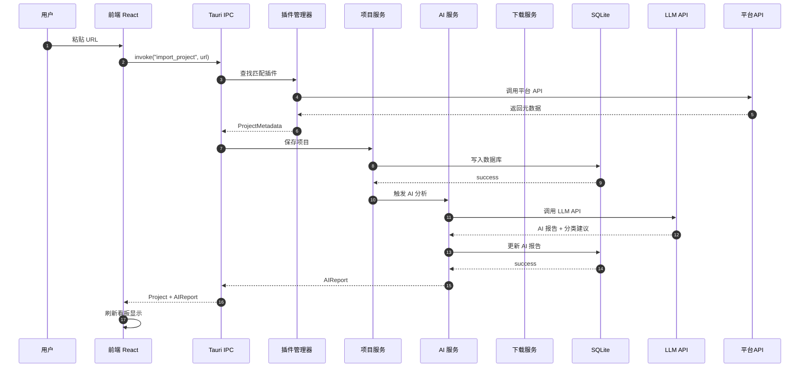
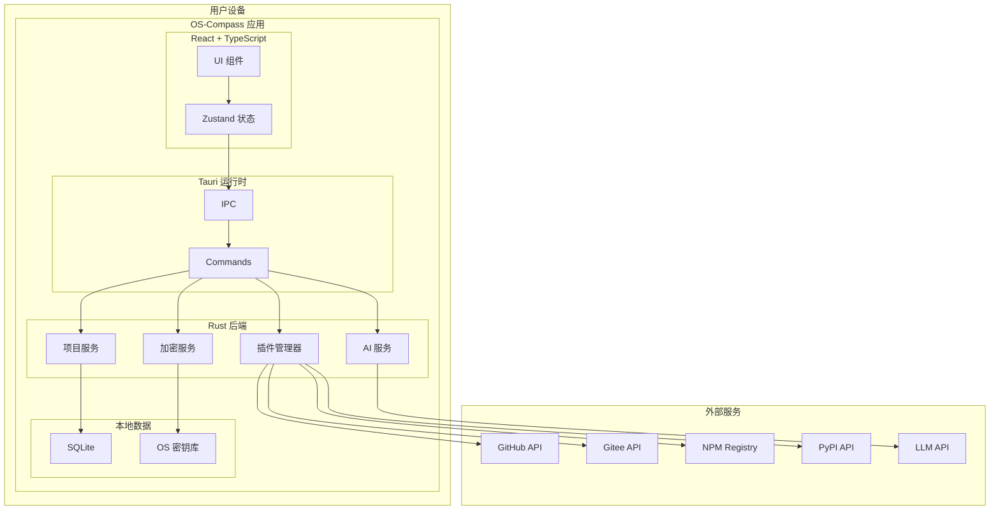
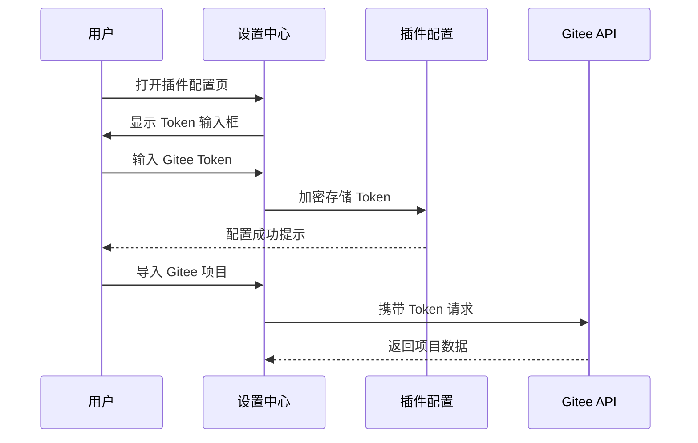
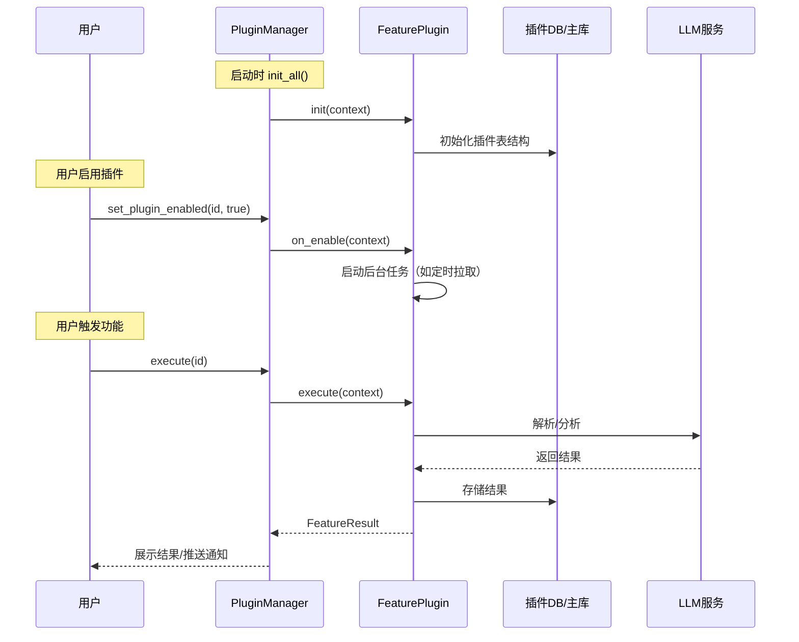
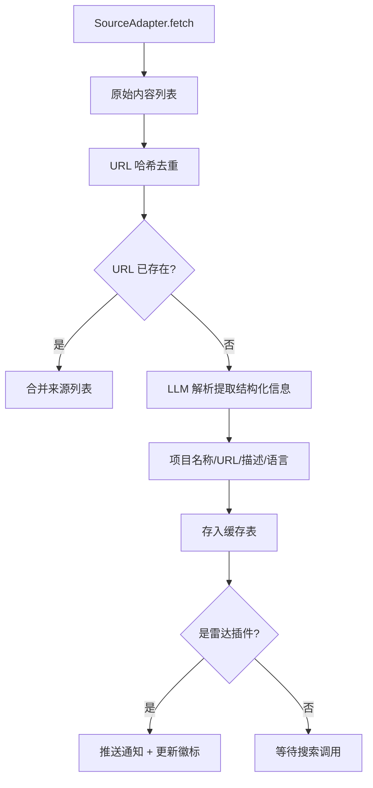
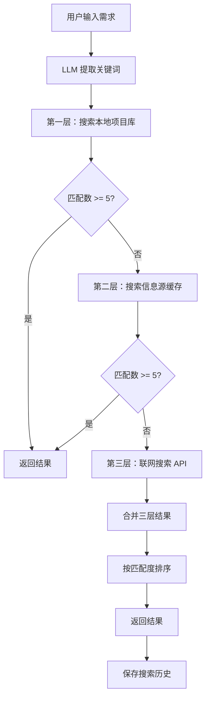
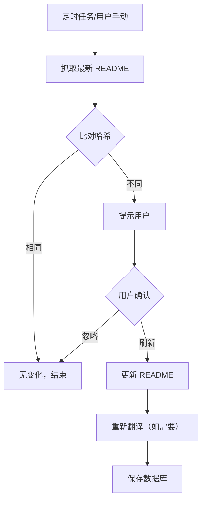
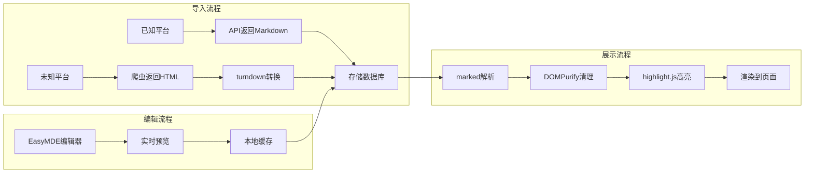
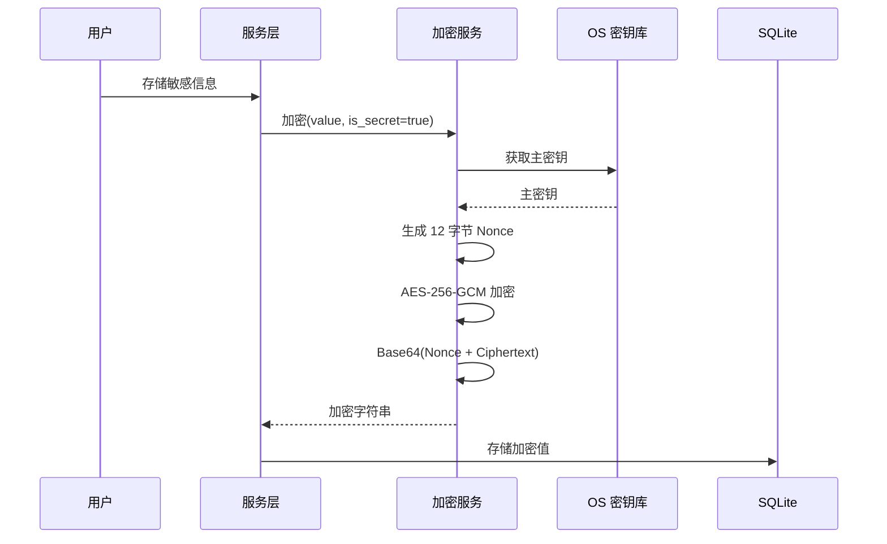

# OS-Compass 详细设计说明书

| 部门 | 研发部 |
|------|--------|
| 编写 | 系统架构师 |
| 审核 | |
| 批准 | |
| 日期 | 2026-07-08 |
| 版本 | V1.3 |

---

## 1 概述

### 1.1 项目背景

随着开源生态爆炸式增长，开发者面临三大痛点：**"收藏即吃灰"、"环境难配难跑通"、"带着业务找轮子效率低"**。现有工具（如浏览器书签、GitHub Star）缺乏：

1. **AI 深度解析能力**：无法自动分析项目质量、生成使用指南
2. **结构化归类能力**：缺乏多维度分类和标签体系
3. **本地环境联动能力**：无法一键下载到本地并快速运行

OS-Compass（开源罗盘）正是为解决上述痛点而设计的一款工具。

### 1.2 项目建设范围

本系统建设范围涵盖跨平台桌面客户端、平台数据获取插件、AI 智能分析引擎及本地工作区联动机制，具体包括：

**一期范围（MVP）**：
- **项目导入模块**：支持 GitHub、Gitee、NPM、PyPI 四种平台的 URL 自动解析，以及手动录入私有/内网项目
- **项目管理模块**：多层级分类管理、项目 CRUD、四列看板拖拽流转
- **AI 赋能模块**：LLM 自动分析、健康度评分、Runbook 生成、README 翻译
- **本地联动模块**：git clone 下载、IDE 打开、本地笔记
- **数据安全模块**：敏感信息加密存储（数据保险箱）

**二期范围**：
- 意图搜索（RAG 联网检索）
- 情报雷达（RSS 订阅）
- 插件系统 API

### 1.3 术语定义

| 术语 | 定义 |
|------|------|
| **本地优先（Local-First）** | 数据优先存储在本地，强调隐私和离线可用性 |
| **数据保险箱** | 每个项目内置的敏感信息加密存储区域，如 Token、密码等 |
| **Runbook** | 场景化操作手册，包含环境要求、安装步骤、运行步骤、二开入口 |
| **健康度评分** | 0-100 分综合评分，反映项目活跃度、社区健康度和 License 合规性 |
| **平台扩展** | 封装特定平台（GitHub/Gitee/NPM/PyPI）数据获取和评分的可替换组件 |
| **扩展配置** | 本期 MVP 的平台集成功能，包括扩展的启用/禁用和变量配置 |
| **插件系统** | 二期的高级功能，包括插件市场、热加载、第三方扩展 |
| **SourcePlugin** | 平台扩展的统一接口规范，定义元数据获取、README 获取、健康度计算等标准行为 |
| **FeaturePlugin** | 功能插件的统一接口规范，定义情报雷达、意图搜索等功能的调用契约 |

---

## 2 设计原则

### 2.1 本地优先原则

**设计决策**：用户数据必须优先存储在本地设备，严禁上传到任何第三方服务器。

**实现要求**：
- SQLite 数据库本地存储，包含项目信息、分类、笔记、AI 报告等全部业务数据
- API Key、Token 等敏感凭证使用 OS 密钥库存储，数据库仅存加密后的密文
- 网络请求仅用于从外部平台（GitHub/Gitee/NPM/PyPI）拉取公开数据
- LLM API 调用由用户配置的代理控制，不经过任何中转服务器

**隐私保护措施**：
- 应用启动时检查网络隔离性
- 禁止在日志中记录敏感信息
- 定期提醒用户检查隐私设置

### 2.2 扩展化原则

> **命名说明**：本期 MVP 的平台集成功能称为「扩展配置」，二期的高级功能称为「插件系统」。

**设计决策**：不同开源平台的数据结构、API 方式、评分维度差异巨大，采用扩展化架构解耦核心逻辑。

**架构优势**：
| 优势 | 说明 |
|------|------|
| 平台解耦 | 核心逻辑不依赖任何具体平台 |
| 差异化评分 | NPM 侧重下载量，GitHub 侧重社区活跃度 |
| 独立演进 | 各平台扩展可独立更新，不影响核心功能 |
| 易于扩展 | 新增平台只需实现 SourcePlugin 接口 |
| 双轨降级 | 无 Token 时自动降级到爬虫服务 |

**Token 双轨制设计**：

| 配置情况 | 数据获取方式 | 数据质量 |
|----------|--------------|----------|
| 有 Token | 平台 API | ✅ 完整数据，可计算健康度 |
| 无 Token | 爬虫服务（web2md） | ⚠️ 部分数据，无法计算健康度 |

**扩展场景**：
- 一期内置：GitHub、Gitee、NPM、PyPI（平台扩展）
- 二期扩展：GitLab、Docker Hub、Crates.io、Packagist（平台扩展）

### 2.3 功能插件化原则

**设计决策**：系统功能采用插件化架构，支持未来扩展新功能而不修改核心代码。

**两类扩展的区分**：

| 对比维度 | 平台扩展（SourcePlugin） | 功能插件（FeaturePlugin） |
|----------|------------------------|----------------------|
| **命名** | 本期 MVP：扩展配置 | 二期：插件系统 |
| **用途** | 扩展开源平台数据获取支持 | 扩展系统功能 |
| **调用时机** | 项目导入时自动调用 | 用户主动触发或后台运行 |
| **数据流向** | 从外部获取项目数据入库 | 向外部获取数据或执行操作 |
| **一期实现** | GitHub/Gitee/NPM/PyPI | 无（二期实现） |
| **二期实现** | GitLab/Docker Hub/Crates.io | 情报雷达、意图搜索 |

**功能插件示例**：

| 插件名称 | 功能描述 | 数据流向 |
|----------|----------|----------|
| 情报雷达 | RSS/Atom 订阅源监控，发现项目更新 | 外部 → 系统 |
| 意图搜索 | 联网检索相关项目，结合 RAG 向量检索 | 用户 → 外部 → 系统 |
| Webhook 通知 | 项目更新时推送通知 | 系统 → 外部（钉钉/飞书/邮件） |

### 2.4 AI 赋能原则

**设计决策**：充分利用 LLM 的理解、总结、翻译能力，降低用户阅读外文项目文档的门槛。

**AI 能力矩阵**：

| 能力 | 输入 | 输出 | 应用场景 |
|------|------|------|----------|
| 智能分类 | 项目元数据 + 分类上下文 | 最佳分类 ID | 导入时自动归类 |
| 健康度分析 | 项目元数据 | 综合评分 + 各维度评分 | AI 报告页 |
| Runbook 生成 | 项目元数据 + README | 结构化安装/运行步骤 | Runbook 标签页 |
| README 翻译 | README 原文 + 目标语言 | 翻译 + 提炼 + 简化 | README 标签页 |
| 适用场景提炼 | 项目描述 | 2-3 个典型场景 | 概览标签页 |

**语言适配**：
- AI 报告、翻译输出语言与系统默认阅读语言一致
- 支持简体中文、English、日本語

### 2.4 容错降级原则

**设计决策**：系统必须能够优雅地处理各种异常情况，保证核心功能可用。

**降级策略**：

| 异常场景 | 降级处理 | 用户感知 |
|----------|----------|----------|
| 网络超时 | 保存已获取的元数据，标记"网络超时" | Toast 提示，显示部分信息 |
| LLM 调用失败 | 保存元数据，标记"AI 解析失败" | 显示元数据 + 重试按钮 |
| Token 超限 | 降级保存，标记"分析不完整" | 提示手动补充 |
| 平台 API 限流 | 队列重试，延迟入库 | 显示加载状态 |

**禁止行为**：
- 禁止抛出导致前端白屏、闪退的异常
- 禁止显示未经处理的原始错误堆栈

### 2.5 批量操作设计

**设计背景**：支持对多个项目进行批量操作，提高管理效率。

**服务设计**：

```rust
pub struct BatchService {
    project_store: Arc<ProjectStore>,
}

impl BatchService {
    /// 批量移动项目到指定分类
    pub async fn batch_move(
        &self,
        project_ids: Vec<String>,
        target_category_id: i64,
    ) -> Result<BatchResult, Error> {
        let mut success_count = 0;
        let mut failed = Vec::new();

        for id in project_ids {
            match self.project_store.update_category(&id, target_category_id).await {
                Ok(_) => success_count += 1,
                Err(e) => failed.push((id, e.to_string())),
            }
        }

        Ok(BatchResult { success_count, failed })
    }

    /// 批量归档项目
    pub async fn batch_archive(
        &self,
        project_ids: Vec<String>,
    ) -> Result<BatchResult, Error> {
        let now = Utc::now();
        let mut success_count = 0;
        let mut failed = Vec::new();

        for id in project_ids {
            match self.project_store.archive(&id, now).await {
                Ok(_) => success_count += 1,
                Err(e) => failed.push((id, e.to_string())),
            }
        }

        Ok(BatchResult { success_count, failed })
    }

    /// 批量恢复项目（从 ARCHIVED 或 DELETED 恢复为 ACTIVE）
    pub async fn batch_restore(
        &self,
        project_ids: Vec<String>,
    ) -> Result<BatchResult, Error> {
        let mut success_count = 0;
        let mut failed = Vec::new();

        for id in project_ids {
            match self.project_store.restore(&id).await {
                Ok(_) => success_count += 1,
                Err(e) => failed.push((id, e.to_string())),
            }
        }

        Ok(BatchResult { success_count, failed })
    }

    /// 批量导出项目（JSON/CSV）
    pub async fn batch_export(
        &self,
        project_ids: Vec<String>,
        format: ExportFormat,
    ) -> Result<String, Error>;
}
```

**前端交互**：

```typescript
// 选中项目状态
const [selectedIds, setSelectedIds] = useState<Set<string>>(new Set());

// Shift 多选
function handleShiftClick(targetId: string) {
  const ids = projectList.map(p => p.id);
  const lastSelected = [...selectedIds].pop();
  const lastIndex = ids.indexOf(lastSelected);
  const targetIndex = ids.indexOf(targetId);
  const [start, end] = [Math.min(lastIndex, targetIndex), Math.max(lastIndex, targetIndex)];
  const rangeIds = ids.slice(start, end + 1);
  setSelectedIds(new Set([...selectedIds, ...rangeIds]));
}
```

### 2.6 项目归档设计

**设计理念**：采用双维度状态设计（lifecycle_status + data_status），归档替代硬删除，符合"本地优先"理念，避免误操作导致数据丢失。

**状态设计**：

| 状态维度 | 字段 | 状态值 | 说明 |
|----------|------|--------|------|
| 看板生命周期 | lifecycle_status | TO_EXPLORE / DIVING / IN_USE / ABANDONED | 看板四列状态 |
| 数据可用性 | data_status | ACTIVE / ARCHIVED / DELETED | 控制数据显示 |

**数据库字段扩展**：

```sql
-- 数据可用性状态
ALTER TABLE projects ADD COLUMN data_status VARCHAR(20) DEFAULT 'ACTIVE'
    CHECK(data_status IN ('ACTIVE', 'ARCHIVED', 'DELETED'));

-- 归档时间
ALTER TABLE projects ADD COLUMN archived_at DATETIME;

-- 删除时间
ALTER TABLE projects ADD COLUMN deleted_at DATETIME;

-- 查询归档项目
SELECT * FROM projects WHERE data_status = 'ARCHIVED';

-- 查询已删除项目
SELECT * FROM projects WHERE data_status = 'DELETED';

-- 查询正常项目（默认）
SELECT * FROM projects WHERE data_status = 'ACTIVE';
```

**服务设计**：

```rust
pub struct ProjectStore {
    pool: Pool<Sqlite>,
}

impl ProjectStore {
    /// 归档项目（不改变看板状态）
    pub async fn archive(&self, id: &str, archived_at: DateTime<Utc>) -> Result<(), Error> {
        sqlx::query("UPDATE projects SET data_status = 'ARCHIVED', archived_at = ? WHERE id = ?")
            .bind(archived_at)
            .bind(id)
            .execute(&self.pool)
            .await?;
        Ok(())
    }

    /// 软删除项目
    pub async fn soft_delete(&self, id: &str, deleted_at: DateTime<Utc>) -> Result<(), Error> {
        sqlx::query("UPDATE projects SET data_status = 'DELETED', deleted_at = ? WHERE id = ?")
            .bind(deleted_at)
            .bind(id)
            .execute(&self.pool)
            .await?;
        Ok(())
    }

    /// 恢复项目（从 ARCHIVED 或 DELETED 恢复）
    pub async fn restore(&self, id: &str) -> Result<(), Error> {
        sqlx::query("UPDATE projects SET data_status = 'ACTIVE', archived_at = NULL, deleted_at = NULL WHERE id = ?")
            .bind(id)
            .execute(&self.pool)
            .await?;
        Ok(())
    }

    /// 永久删除（仅 data_status = 'DELETED' 时可执行）
    pub async fn permanent_delete(&self, id: &str) -> Result<(), Error> {
        // 先检查状态
        let project: Option<Project> = sqlx::query_as(
            "SELECT * FROM projects WHERE id = ? AND data_status = 'DELETED'"
        ).bind(id).fetch_optional(&self.pool).await?;

        if project.is_none() {
            return Err(Error::NotSoftDeleted);
        }

        // 删除关联数据
        sqlx::query("DELETE FROM project_tags WHERE project_id = ?").bind(id).execute(&self.pool).await?;
        sqlx::query("DELETE FROM project_notes WHERE project_id = ?").bind(id).execute(&self.pool).await?;
        sqlx::query("DELETE FROM project_user_info WHERE project_id = ?").bind(id).execute(&self.pool).await?;
        // 删除项目
        sqlx::query("DELETE FROM projects WHERE id = ?").bind(id).execute(&self.pool).await?;
        Ok(())
    }
}
```

**状态流转规则**：

| 操作 | API | data_status 变化 | 说明 |
|------|-----|------------------|------|
| 归档 | `archive_project` | ACTIVE → ARCHIVED | 不改变看板状态 |
| 恢复 | `restore_project` | ARCHIVED/DELETED → ACTIVE | 恢复显示 |
| 软删除 | `soft_delete_project` | ACTIVE → DELETED | 可恢复 |
| 永久删除 | `permanent_delete` | DELETED → 物理删除 | 仅 DELETED 时可执行 |

### 2.7 统计面板设计

**设计背景**：提供项目数据的可视化统计。

**数据聚合查询**：

```rust
pub struct StatisticsService {
    pool: Arc<Pool<Sqlite>>,
}

pub struct Statistics {
    pub total_projects: i64,
    pub health_distribution: HashMap<String, i64>,
    pub category_distribution: HashMap<String, i64>,
    pub language_distribution: HashMap<String, i64>,
    pub tag_usage: Vec<(String, i64)>,
    pub monthly_trend: Vec<(String, i64)>,
}

impl StatisticsService {
    /// 获取项目统计
    pub async fn get_statistics(&self) -> Result<Statistics, Error> {
        let total = self.count_total().await?;
        let health = self.health_distribution().await?;
        let category = self.category_distribution().await?;
        let language = self.language_distribution().await?;
        let tag = self.top_tags(10).await?;
        let trend = self.monthly_new_projects().await?;

        Ok(Statistics {
            total_projects: total,
            health_distribution: health,
            category_distribution: category,
            language_distribution: language,
            tag_usage: tag,
            monthly_trend: trend,
        })
    }

    /// 健康度分布
    async fn health_distribution(&self) -> Result<HashMap<String, i64>, Error> {
        let rows: Vec<(String, i64)> = sqlx::query_as(
            r#"
            SELECT
                CASE
                    WHEN health_score >= 80 THEN 'very_healthy'
                    WHEN health_score >= 60 THEN 'healthy'
                    WHEN health_score >= 40 THEN 'normal'
                    ELSE 'unhealthy'
                END as level,
                COUNT(*) as count
            FROM projects
            WHERE archived_at IS NULL
            GROUP BY level
            "#
        ).fetch_all(&*self.pool).await?;

        Ok(rows.into_iter().collect())
    }
}
```

**前端图表**：使用 Chart.js 或 Recharts 渲染。

### 2.8 离线与网络容错设计

**网络状态检测**：

```rust
use tauri::Manager;

#[tauri::command]
async fn check_network_status(app: tauri::AppHandle) -> Result<bool, String> {
    match app.handle().state::<NetworkState>() {
        NetworkState::Online => Ok(true),
        NetworkState::Offline => Ok(false),
    }
}
```

**前端网络状态监听**：

```typescript
const [isOnline, setIsOnline] = useState(navigator.onLine);

useEffect(() => {
  const handleOnline = () => setIsOnline(true);
  const handleOffline = () => setIsOnline(false);

  window.addEventListener('online', handleOnline);
  window.addEventListener('offline', handleOffline);

  return () => {
    window.removeEventListener('online', handleOnline);
    window.removeEventListener('offline', handleOffline);
  };
}, []);

// 网络状态指示器
{!isOnline && (
  <div className="bg-yellow-500 text-white px-4 py-2">
    当前离线，部分功能不可用
  </div>
)}
```

**离线数据访问**：SQLite 数据完全本地存储，读取操作不依赖网络。

---

## 3 架构详细设计

### 3.1 总体架构执行视图

系统采用分层架构，前端通过 Tauri IPC 调用后端 Rust 服务，核心执行流程如下：



### 3.2 模块职责划分

| 模块 | 职责 | 边界 |
|------|------|------|
| **前端层** | UI 渲染、用户交互、状态管理 | 接收用户输入，调用后端命令 |
| **Tauri 层** | IPC 通信、命令路由 | 前端与后端的桥梁 |
| **插件管理器** | 平台插件注册、URL 匹配、插件调度 | 不感知具体平台实现 |
| **项目服务** | 项目 CRUD、状态流转、关联查询 | 业务逻辑核心 |
| **AI 服务** | LLM 调用、Prompt 构建、结果解析 | 不感知具体 LLM 实现 |
| **下载服务** | git clone、目录管理、IDE 唤起 | 操作系统交互 |
| **加密服务** | 敏感数据加密、密钥管理 | OS 密钥库交互 |
| **设置服务** | 配置读写、LLM 连接测试 | 应用配置管理 |

### 3.3 部署架构设计

系统采用单应用部署架构，满足桌面客户端的轻量化需求：



---

## 4 核心模块详细设计

### 4.1 平台扩展系统

#### 4.1.1 设计背景

不同开源平台的数据结构和 API 方式存在显著差异：

| 平台 | 数据特点 | API 特点 | 评分维度 |
|------|----------|----------|----------|
| GitHub | 丰富的社区数据 | REST API，有 Token 用 API，无 Token 用爬虫 | Commit + Issue + Release + Star |
| Gitee | 类似 GitHub | Open API，有 Token 用 API，无 Token 用爬虫 | 类似 GitHub |
| NPM | 包管理器数据 | Registry API，无需认证 | 下载量 + 版本数 + 依赖数 |
| PyPI | 包管理器数据 | JSON API，无需认证 | 下载量 + 版本数 |

如果将这些逻辑耦合在一起，将导致：
- 代码复杂度指数增长
- 新增平台需要修改核心代码
- 各平台的边界情况处理互相影响

**Token 双轨制设计**：

扩展内部判断 Token 是否存在，不存在则自动降级到爬虫服务。

#### 4.1.2 扩展接口设计

采用 **依赖反转（Dependency Inversion）** 原则，定义统一的 `SourcePlugin` Trait：

```rust
/// 平台扩展接口
/// 所有平台扩展必须实现此接口
#[async_trait]
pub trait SourcePlugin: Send + Sync {
    /// 扩展唯一标识
    fn id(&self) -> &str;

    /// 扩展显示名称
    fn name(&self) -> &str;

    /// 扩展实现类名
    fn plugin_class(&self) -> &str;

    /// 判断 URL 是否由本扩展处理
    /// 例如：GitHub 匹配 github.com，Gitee 匹配 gitee.com
    fn match_url(&self, url: &str) -> bool;

    /// 获取项目元数据
    /// 返回项目名称、描述、Star 数、语言等基础信息
    async fn fetch_metadata(&self, url: &str) -> Result<ProjectMetadata, PluginError>;

    /// 获取 README 内容
    /// 返回 Markdown 格式的 README 原文
    async fn fetch_readme(&self, url: &str) -> Result<String, PluginError>;

    /// 获取许可证信息
    async fn fetch_license(&self, url: &str) -> Result<LicenseInfo, PluginError>;

    /// 计算健康度评分
    /// 根据平台特点使用不同的评分算法
    fn calculate_health_score(&self, metadata: &ProjectMetadata) -> HealthScore;

    /// 获取平台特定的评估数据
    /// 用于生成 AI 评估摘要
    fn get_evaluation_data(&self, url: &str) -> Result<EvaluationData, PluginError>;
}

/// 标准化评估数据结构
/// 包含各平台通用的评估维度
pub struct EvaluationData {
    /// 提交频率（GitHub/Gitee 特有）
    pub commit_frequency: Option<f32>,
    /// Issue 响应率（GitHub/Gitee 特有）
    pub issue_response_rate: Option<f32>,
    /// 发布频率（GitHub/Gitee 特有）
    pub release_frequency: Option<f32>,
    /// 贡献者数量（GitHub/Gitee 特有）
    pub contributor_count: Option<u32>,
    
    /// 周下载量（NPM/PyPI 特有）
    pub weekly_downloads: Option<u64>,
    /// 版本数量
    pub version_count: Option<u32>,
    /// 依赖数量（NPM 特有）
    pub dependency_count: Option<u32>,
    
    /// License 类型（通用）
    pub license_type: Option<String>,
    /// Star 数量
    pub star_count: Option<u32>,
}
```

#### 4.1.3 扩展管理器设计

扩展管理器负责扩展的注册、查找和调度：

```rust
pub struct PluginManager {
    /// 已注册的扩展集合
    plugins: HashMap<String, Box<dyn SourcePlugin>>,
    /// 扩展配置存储
    config_store: Arc<dyn ConfigStore>,
}

impl PluginManager {
    /// 注册新扩展
    pub fn register(&mut self, plugin: Box<dyn SourcePlugin>) {
        let id = plugin.id().to_string();
        self.plugins.insert(id, plugin);
    }

    /// 根据 URL 查找匹配的扩展
    pub fn find_plugin(&self, url: &str) -> Option<&dyn SourcePlugin> {
        self.plugins
            .values()
            .find(|p| p.match_url(url))
            .map(|p| p.as_ref())
    }

    /// 导入项目的主流程
    pub async fn import(&self, url: &str) -> Result<ImportResult, ImportError> {
        // 1. 查找匹配的扩展
        if let Some(plugin) = self.find_plugin(url) {
            // 已知平台：扩展抓取 + 完整评分
            // 扩展内部判断 Token 是否存在，有 Token 用 API，无 Token 降级爬虫
            let metadata = plugin.fetch_metadata(url).await
                .map_err(ImportError::NetworkFailed)?;
            let readme = plugin.fetch_readme(url).await.ok();
            let health_score = plugin.calculate_health_score(&metadata);
            let project = self.normalize(metadata, readme, health_score)?;
            Ok(ImportResult::Scored(project))
        } else {
            // 未知平台：回退策略
            self.import_unknown_platform(url).await
        }
    }

    /// 未知平台导入流程
    /// 策略：爬虫转 markdown → 用户确认 → 标记"未评分"
    /// 前端确认页（import-confirm.html）支持从 page_title 智能提取项目名称
    async fn import_unknown_platform(&self, url: &str) -> Result<ImportResult, ImportError> {
        // 1. 检查爬虫服务是否启用
        if self.crawler_service.is_enabled() {
            // 2. 尝试使用爬虫转换
            match self.crawler_service.fetch_as_markdown(url).await {
                Ok(content) => {
                    // 爬虫成功，返回 markdown 内容供用户确认
                    // page_title 由前端从 document.title 获取，用于智能提取项目名称
                    Ok(ImportResult::NeedsConfirmation {
                        url: url.to_string(),
                        markdown_content: content,
                        platform: "unknown".to_string(),
                        page_title: None, // 前端填充
                    })
                }
                Err(_) => {
                    // 爬虫失败，引导手动输入
                    Ok(ImportResult::ManualInputRequired {
                        url: url.to_string(),
                        reason: "crawler_failed".to_string(),
                    })
                }
            }
        } else {
            // 爬虫未启用，直接引导手动输入
            Ok(ImportResult::ManualInputRequired {
                url: url.to_string(),
                reason: "crawler_disabled".to_string(),
            })
        }
    }

    /// 确认未知平台导入
    pub async fn confirm_import(
        &self,
        url: &str,
        markdown_content: String,
        metadata: ManualMetadata,
    ) -> Result<Project, ImportError> {
        let project = Project {
            id: Uuid::new_v4().to_string(),
            name: metadata.name,
            url: url.to_string(),
            description: metadata.description,
            source_platform: "unknown".to_string(),
            is_scored: false,
            health_score: None,
            readme_content: markdown_content,
            readme_language: "unknown".to_string(),
            category_id: None,
            status: ProjectStatus::ToExplore,
            created_at: Utc::now(),
            updated_at: Utc::now(),
        };

        self.save_project(project).await?;
        Ok(project)
    }
}

pub enum ImportResult {
    Scored(Project),                                    // 已评分项目
    NeedsConfirmation {
        url: String,
        markdown_content: String,
        platform: String,
        page_title: Option<String>,                      // 页面标题，用于智能提取项目名称
    },                                                  // 需要用户确认
    ManualInputRequired {
        url: String,
        reason: String,
    },                                                  // 需要手动输入
}

/// 手动录入元数据
pub struct ManualMetadata {
    pub name: String,
    pub description: Option<String>,
}
```

#### 4.1.4 GitHub 扩展实现要点

**Token 双轨制**：GitHub 扩展内部判断 Token 是否存在，有 Token 用 API，无 Token 降级爬虫。

```rust
pub struct GitHubPlugin {
    client: Client,
    /// Token 存储在扩展配置中，加密存储
    /// 有 Token 用 API，无 Token 降级爬虫
    token: Option<String>,
}

impl GitHubPlugin {
    /// GitHub URL 格式：https://github.com/{owner}/{repo}
    fn parse_url(&self, url: &str) -> Result<(&str, &str), PluginError> {
        let segments: Vec<&str> = url
            .trim_end_matches('/')
            .split('/')
            .collect();

        if segments.len() < 2 {
            return Err(PluginError::InvalidUrl);
        }

        let owner = segments[segments.len() - 2];
        let repo = segments[segments.len() - 1];

        Ok((owner, repo))
    }
}

#[async_trait]
impl SourcePlugin for GitHubPlugin {
    fn match_url(&self, url: &str) -> bool {
        url.contains("github.com")
    }

    async fn fetch_metadata(&self, url: &str) -> Result<ProjectMetadata, PluginError> {
        let (owner, repo) = self.parse_url(url)?;
        let api_url = format!("https://api.github.com/repos/{}/{}", owner, repo);

        let mut request = self.client.get(&api_url);
        request.header("User-Agent", "OS-Compass");
        if let Some(token) = &self.token {
            request.header("Authorization", format!("Bearer {}", token));
        }

        let resp = request.send().await?;
        let data: GitHubRepo = resp.json().await?;

        Ok(ProjectMetadata {
            name: data.name,
            full_name: data.full_name,
            description: data.description,
            stars: data.stargazers_count,
            forks: data.forks_count,
            language: data.language,
            license: data.license.map(|l| l.spdx_id),
            open_issues: data.open_issues_count,
            created_at: data.created_at,
            updated_at: data.updated_at,
            pushed_at: data.pushed_at,
            homepage: data.homepage,
        })
    }
}
```

#### 4.1.5 Gitee 扩展实现要点

**Token 双轨制**：Gitee 扩展内部判断 Token 是否存在，有 Token 用 API，无 Token 降级爬虫。

**与 GitHub 的差异**：
| 差异项 | GitHub | Gitee |
|--------|--------|-------|
| API 端点 | `api.github.com` | `gitee.com/api/v5` |
| 认证方式 | 可选（有 Token 提升限额） | 可选（有 Token 用 API，无 Token 降级爬虫） |
| Token 类型 | Personal Access Token | Personal Access Token |
| 请求限额 | 60次/小时（未认证）/ 5000次/小时（认证） | 根据 Token 类型有限额 |

```rust
pub struct GiteePlugin {
    client: Client,
    /// Gitee API **必须** 携带 Token 才能正常访问
    token: Option<String>,
}

impl GiteePlugin {
    /// Gitee URL 格式：https://gitee.com/{owner}/{repo}
    fn parse_url(&self, url: &str) -> Result<(&str, &str), PluginError> {
        let segments: Vec<&str> = url
            .trim_end_matches('/')
            .split('/')
            .collect();

        if segments.len() < 2 {
            return Err(PluginError::InvalidUrl);
        }

        let owner = segments[segments.len() - 2];
        let repo = segments[segments.len() - 1];

        Ok((owner, repo))
    }

    /// 检查 Token 是否配置
    fn ensure_token(&self) -> Result<&str, PluginError> {
        self.token.as_deref()
            .ok_or(PluginError::ConfigMissing("Gitee Token 未配置"))
    }
}

#[async_trait]
impl SourcePlugin for GiteePlugin {
    fn match_url(&self, url: &str) -> bool {
        url.contains("gitee.com")
    }

    async fn fetch_metadata(&self, url: &str) -> Result<ProjectMetadata, PluginError> {
        let (owner, repo) = self.parse_url(url)?;
        let token = self.ensure_token()?;
        let api_url = format!("https://gitee.com/api/v5/repos/{}/{}", owner, repo);

        let resp = self.client
            .get(&api_url)
            .header("Authorization", format!("Bearer {}", token))
            .send()
            .await?;

        if resp.status() == 401 {
            return Err(PluginError::AuthFailed("Gitee Token 无效或已过期"));
        }

        let data: GiteeRepo = resp.json().await?;

        Ok(ProjectMetadata {
            name: data.name,
            full_name: data.path_url,
            description: data.description,
            stars: data.stargazers_count,
            forks: data.forks_count,
            language: data.language,
            license: data.license.map(|l| l.name),
            open_issues: data.open_issues_count,
            created_at: data.created_at,
            updated_at: data.updated_at,
            pushed_at: data.pushed_at,
            homepage: data.homepage,
        })
    }
}
```

**Gitee Token 配置流程**：


#### 4.1.6 NPM 健康度评分算法

由于 NPM/PyPI 没有 GitHub 那样丰富的社区数据，采用不同的评分体系：

**NPM 健康度评分算法**：

| 维度 | 权重 | 评分规则 | 设计理由 |
|------|------|----------|----------|
| 下载量 | 30% | >= 10M: 30分，>= 1M: 25分，>= 100K: 20分，< 100K: 10分 | 下载量直接反映包的流行程度 |
| 版本数 | 25% | >= 100: 25分，>= 50: 20分，>= 20: 15分，< 20: 5分 | 版本数反映包的活跃度和稳定性 |
| 依赖数 | 20% | <= 10: 20分，<= 30: 15分，<= 50: 10分，> 50: 5分 | 依赖过多表示包过于复杂 |
| 最近更新时间 | 15% | 最近6月: 15分，最近12月: 10分，> 12月: 5分 | 更新时间反映包的维护状态 |
| License | 10% | MIT/Apache/BSD: 10分，其他: 0分 | License 合规性 |

```rust
impl NPMPlugin {
    pub fn calculate_health_score(&self, metadata: &ProjectMetadata) -> HealthScore {
        let download_score = self.score_downloads(metadata.weekly_downloads);
        let version_score = self.score_versions(metadata.version_count);
        let dependency_score = self.score_dependencies(metadata.dependency_count);
        let update_score = self.score_last_update(metadata.last_update);
        let license_score = self.score_license(&metadata.license);

        let total = (download_score * 30
            + version_score * 25
            + dependency_score * 20
            + update_score * 15
            + license_score * 10) / 100;

        HealthScore {
            total,
            dimensions: vec![
                ScoreDimension::new("下载量", download_score, 30),
                ScoreDimension::new("版本数", version_score, 25),
                ScoreDimension::new("依赖数", dependency_score, 20),
                ScoreDimension::new("更新时间", update_score, 15),
                ScoreDimension::new("License", license_score, 10),
            ],
        }
    }
}
```

#### 4.1.7 系统插件管理基础设施（二期 M13）

> **二期功能标记**：本节所有功能均为二期（Phase 2）设计。

**设计目标**：为意图搜索、情报雷达等功能插件提供统一的注册、启用/禁用、配置管理和生命周期管理。当前支持内置插件，架构预留热加载（M14）。

##### 4.1.7.1 FeaturePlugin vs SourcePlugin

| 维度 | SourcePlugin（平台插件） | FeaturePlugin（功能插件） |
|------|------------------------|----------------------|
| 用途 | 扩展开源平台数据获取 | 扩展系统功能 |
| 调用时机 | 项目导入时自动触发 | 用户主动触发或后台定时 |
| 生命周期 | 一次性获取数据 | 可能需要持续运行 |
| 数据存储 | 获取数据存入主库 | 插件自行决定（独立 .db 或主库） |
| 数据流向 | 外部 → 系统（拉取） | 外部 ↔ 系统（推送/拉取） |
| 一期实现 | GitHub/Gitee/NPM/PyPI | 无（二期） |
| 二期实现 | GitLab/Docker Hub | 情报雷达、意图搜索 |

##### 4.1.7.2 Rust Trait 定义

```rust
/// 功能插件接口
/// 用于扩展情报雷达、意图搜索等系统功能
#[async_trait]
pub trait FeaturePlugin: Send + Sync {
    /// 插件唯一标识
    fn id(&self) -> &str;

    /// 插件显示名称
    fn name(&self) -> &str;

    /// 插件类型
    fn plugin_type(&self) -> FeaturePluginType;

    /// 插件版本
    fn version(&self) -> &str;

    /// 检查插件是否启用
    fn is_enabled(&self) -> bool;

    /// 插件初始化（启动时调用）
    async fn init(&self, context: &PluginContext) -> Result<(), PluginError>;

    /// 插件启用（用户切换为启用时调用）
    async fn on_enable(&self, context: &PluginContext) -> Result<(), PluginError>;

    /// 插件禁用（用户切换为禁用时调用）
    async fn on_disable(&self, context: &PluginContext) -> Result<(), PluginError>;

    /// 执行插件功能（用户触发或定时触发）
    async fn execute(&self, context: &PluginContext) -> Result<FeatureResult, PluginError>;
}

/// 功能插件类型
pub enum FeaturePluginType {
    Radar,    // 情报雷达 - RSS/网站/TG 订阅监控
    Search,   // 意图搜索 - 三层优先级搜索
    Webhook,  // Webhook - 更新通知（未来）
    Importer, // 导入器 - 从其他工具导入（未来）
}

/// 插件上下文
pub struct PluginContext {
    /// 仓库目录路径
    pub vault_dir: PathBuf,
    /// 插件配置 JSON
    pub config: Value,
    /// 主库数据库连接（可直接读写主库）
    pub db: MutexGuard<'static, Option<Database>>,
    /// LLM 服务引用
    pub llm: Arc<LLMService>,
    /// 通知服务引用
    pub notifier: Arc<Notifier>,
}

/// 插件执行结果
pub struct FeatureResult {
    pub status: ResultStatus,
    pub data: Value,
    pub message: String,
}
```

##### 4.1.7.3 插件分类与存储架构

###### 4.1.7.3.1 两类插件

| 分类 | 说明 | 生命周期 | 配置存储 | 业务数据存储 |
|------|------|----------|----------|--------------|
| 系统级插件 | 系统默认加载，全局存在 | 随应用启动，不受仓库切换影响 | `${AppData}/.os-compass/plugins.db` | 跟随 db_mode |
| 仓库级插件 | 只在特定仓库加载 | 依赖仓库，切换仓库时重新加载 | 跟随仓库目录 | 跟随 db_mode |

> **当前实现**：RadarPlugin 和 SearchPlugin 均为系统级插件，配置存储在系统级配置库。

###### 4.1.7.3.2 存储目录结构

```
跨平台统一配置目录：${AppData}/.os-compass\
├── plugins.db              ← 系统级插件配置库
│   └── system_plugins 表   ← id, name, type, version, enabled, config
│
${AppData}/com.os-compass.app\
├── os_compass.db           ← 主数据库（项目数据）
├── settings.db             ← 应用设置
└── plugins/                ← 插件业务数据目录（可选）
    └── plugin_*.db         ← 按 db_mode 存放

仓库目录 ${vault_dir}\
├── projects/              ← 克隆的项目
└── plugin_*.db            ← vault 模式插件业务数据
```

###### 4.1.7.3.3 跨平台路径变量

| 变量 | Windows | macOS | Linux |
|------|---------|-------|-------|
| `${AppData}` | `C:\Users\xxx\AppData\Roaming` | `/Users/xxx/Library/Application Support` | `/home/xxx/.config` |

###### 4.1.7.3.4 PluginConfigDb 模块

```rust
/// 系统级插件配置库
pub struct PluginConfigDb {
    conn: Mutex<Connection>,
}

impl PluginConfigDb {
    /// 初始化或打开插件配置库
    pub fn new() -> Result<Self>;
    
    /// 初始化表结构
    fn init_schema(&self) -> Result<()>;
    
    /// 列出所有系统级插件
    pub fn list_system_plugins(&self) -> Vec<PluginInfo>;
    
    /// 注册系统级插件（首次启动时自动注册内置插件）
    pub fn register_system_plugin(&self, info: &PluginInfo) -> Result<()>;
    
    /// 设置插件启用状态
    pub fn set_enabled(&self, plugin_id: &str, enabled: bool) -> Result<()>;
    
    /// 获取插件启用状态
    pub fn get_enabled(&self, plugin_id: &str) -> bool;
    
    /// 获取插件配置 JSON
    pub fn get_config(&self, plugin_id: &str) -> Option<String>;
    
    /// 保存插件配置 JSON
    pub fn save_config(&self, plugin_id: &str, config: &str) -> Result<()>;
}

lazy_static::lazy_static! {
    pub static ref PLUGIN_CONFIG_DB: PluginConfigDb = PluginConfigDb::new().expect(...);
}
```

##### 4.1.7.4 PluginContext 运行时注入

插件执行时，系统构建 PluginContext，注入三层数据：

```rust
pub struct PluginContext {
    /// 插件域：插件自己的配置（来自 plugins.db）
    pub config: Value,

    /// 仓库域：当前仓库的 LLM 配置
    pub llm_config: Value,

    /// 仓库域：代理配置
    pub proxy_config: Value,

    /// 业务域：插件数据库路径
    pub plugin_db_path: Option<PathBuf>,

    /// 目录信息
    pub vault_dir: PathBuf,
    pub app_data_dir: PathBuf,
}
```

| 字段 | 来源 | 说明 |
|------|------|------|
| `config` | `${AppData}/.os-compass/plugins.db` | 插件自己的配置（checkInterval、notificationEnabled 等） |
| `llm_config` | 当前仓库 os_compass.db | API Base/Key/Model 等 |
| `proxy_config` | 当前仓库 os_compass.db | 代理 Host/Port/Auth 等 |
| `plugin_db_path` | `{vault_dir}/plugin_*.db` | 插件业务数据路径 |

**构建时机**：
- 应用启动时
- 仓库切换时（重新构建所有已启用插件的 Context）

##### 4.1.7.5 插件管理器

```rust
/// 插件注册表 - 管理所有已注册的内置插件
pub struct PluginRegistry {
    plugins: Vec<Box<dyn FeaturePlugin>>,
}

impl PluginRegistry {
    /// 启动时注册所有内置插件
    pub fn register_builtin(&mut self) {
        self.register(Box::new(RadarPlugin::new()));
        self.register(Box::new(SearchPlugin::new()));
    }

    /// 预留：热加载外部插件（M14 实现）
    pub fn register_external(&mut self, _path: &str) -> Result<(), PluginError> {
        Err(PluginError::NotSupported("热加载将在 M14 实现".into()))
    }
}

/// 插件管理器 - 管理插件生命周期
pub struct PluginManager {
    registry: Mutex<PluginRegistry>,
    initialized: Mutex<bool>,
}

impl PluginManager {
    /// 初始化：注册内置插件到配置库
    pub fn init(&self);
    
    /// 列出所有插件（从注册表读取元数据，从配置库读取状态）
    pub fn list_plugins(&self) -> Result<Vec<PluginInfo>, String>;
    
    /// 设置插件启用状态
    pub fn set_enabled(&self, plugin_id: &str, enabled: bool) -> Result<(), String>;
    
    /// 获取插件启用状态
    pub fn is_enabled(&self, plugin_id: &str) -> Result<bool, String>;
    
    /// 获取插件配置
    pub fn get_config(&self, plugin_id: &str) -> Result<Option<String>, String>;
    
    /// 保存插件配置
    pub fn save_config(&self, plugin_id: &str, config: &str) -> Result<(), String>;
    
    /// 构建插件执行上下文
    pub fn build_context(&self, plugin: &dyn FeaturePlugin, vault_dir: &PathBuf, app_data_dir: &PathBuf) -> PluginContext;
}

lazy_static::lazy_static! {
    pub static ref PLUGIN_MANAGER: PluginManager = PluginManager::new();
}
```

##### 4.1.7.6 插件数据库策略

| 策略 | API | 说明 |
|------|-----|------|
| 独立 .db 文件 | `plugin_get_db_path(plugin_id)` | 返回 `{vault_dir}/plugin_{id}.db` 路径，插件自行打开连接 |
| 主库读写 | `PluginContext.db` | 插件可直接读写主库 `os_compass.db` |
| 开发者决定 | - | 插件自行选择独立 .db、主库、或两者结合 |
| 仓库隔离 | - | 插件 .db 跟随仓库目录，切换仓库时加载对应数据 |

##### 4.1.7.7 热加载预留

| 当前（M13） | 未来（M14） |
|-------------|-------------|
| 内置插件编译进二进制 | 支持运行时加载第三方插件 |
| `register_builtin()` 静态注册 | `register_external(path)` 动态注册 |
| `PluginRegistry` 持有 `Vec<Box<dyn FeaturePlugin>>` | 扩展为支持动态库加载 |

##### 4.1.7.8 插件执行流程



---

#### 4.1.8 信息源引擎设计（二期 M13）

> **二期功能标记**：本节所有功能均为二期（Phase 2）设计。

信息源引擎是情报雷达和意图搜索共用的底层能力，统一处理四种信息源的拉取、解析和缓存。

##### 4.1.8.1 SourceAdapter Trait

```rust
/// 信息源适配器接口
/// 四种信息源各自实现此接口
#[async_trait]
pub trait SourceAdapter: Send + Sync {
    /// 适配器类型标识
    fn adapter_type(&self) -> &str;

    /// 拉取内容
    async fn fetch(&self, url: &str) -> Result<Vec<RawContent>, SourceError>;
}

/// 原始内容（拉取后未经 LLM 解析）
pub struct RawContent {
    pub title: String,
    pub url: String,
    pub content: String,
    pub published_at: Option<String>,
}
```

##### 4.1.8.2 四种适配器实现

| 适配器 | 信息源类型 | 技术方案 | 说明 |
|--------|----------|----------|------|
| RssAdapter | rss / atom | `feed-rs` crate 解析 RSS/Atom feed | 标准 RSS 解析，提取标题、链接、正文、发布时间 |
| WebCrawlAdapter | web_crawl | 调用 web2md HTTP API 爬取网页 | 复用现有爬虫服务，网页转 Markdown |
| TelegramAdapter | telegram | 调用 web2md 爬取 `t.me/s/{channel}` | TG 频道网页版，提取消息和链接 |
| PlatformPresetAdapter | platform_preset | 内置 GitHub/Gitee Trending RSS URL | 预置源 URL，使用 RssAdapter 解析 |

##### 4.1.8.3 内容处理流水线



##### 4.1.8.4 LLM 解析 Prompt 模板

```
你是一个开源项目信息提取专家。请从以下内容中提取开源项目信息。

内容：
{raw_content}

请提取以下信息并以 JSON 格式返回：
{
  "project_name": "项目名称（如 facebook/react）",
  "project_url": "项目地址（GitHub/Gitee URL，如果没有则留空）",
  "description": "项目描述（一句话）",
  "language": "主要编程语言（如果可识别）",
  "keywords": ["关键词1", "关键词2"]
}

注意：
- 只提取明确提到的开源项目
- 如果内容中没有提到具体项目，返回空 JSON 对象
- 如果提到多个项目，返回 JSON 数组
```

---

#### 4.1.9 情报雷达插件设计（二期 M13）

> **二期功能标记**：本节所有功能均为二期（Phase 2）设计。

##### 4.1.9.1 RadarPlugin 实现

```rust
pub struct RadarPlugin {
    enabled: AtomicBool,
    scan_task: Mutex<Option<JoinHandle<()>>>,
}

impl FeaturePlugin for RadarPlugin {
    fn id(&self) -> &str { "radar" }
    fn name(&self) -> &str { "情报雷达" }
    fn plugin_type(&self) -> FeaturePluginType { FeaturePluginType::Radar }

    async fn on_enable(&self, context: &PluginContext) -> Result<(), PluginError> {
        // 启动 Tokio 定时扫描任务
        let task = tokio::spawn(radar_scan_loop(context.clone()));
        *self.scan_task.lock().unwrap() = Some(task);
        Ok(())
    }

    async fn on_disable(&self, _context: &PluginContext) -> Result<(), PluginError> {
        // 停止定时任务
        if let Some(handle) = self.scan_task.lock().unwrap().take() {
            handle.abort();
        }
        Ok(())
    }

    async fn execute(&self, context: &PluginContext) -> Result<FeatureResult, PluginError> {
        // 手动触发扫描
        let result = radar_scan_all(context).await?;
        Ok(FeatureResult {
            status: ResultStatus::Success,
            data: serde_json::to_value(&result)?,
            message: format!("扫描 {} 个源，发现 {} 个新条目", result.scanned, result.new_items),
        })
    }
}
```

##### 4.1.9.2 定时扫描循环

```rust
async fn radar_scan_loop(context: PluginContext) {
    loop {
        // 读取配置中的检测频率
        let interval = context.config["check_interval"].as_u64().unwrap_or(86400);
        
        // 执行扫描
        if let Err(e) = radar_scan_all(&context).await {
            eprintln!("[radar] Scan error: {}", e);
        }

        // 等待下次扫描
        tokio::time::sleep(Duration::from_secs(interval)).await;
    }
}
```

##### 4.1.9.3 通知机制

| 通知方式 | 实现 | 说明 |
|----------|------|------|
| 系统桌面通知 | Tauri `notification` API | 即使应用最小化也能看到，点击跳转到收件箱 |
| 应用内徽标 | Sidebar 红点数字 | 调用 `get_radar_unread_count` 更新 |

---

#### 4.1.10 意图搜索插件设计（二期 M13）

> **二期功能标记**：本节所有功能均为二期（Phase 2）设计。

##### 4.1.10.1 SearchPlugin 实现

```rust
pub struct SearchPlugin {
    enabled: AtomicBool,
}

impl FeaturePlugin for SearchPlugin {
    fn id(&self) -> &str { "search" }
    fn name(&self) -> &str { "意图搜索" }
    fn plugin_type(&self) -> FeaturePluginType { FeaturePluginType::Search }

    async fn execute(&self, context: &PluginContext) -> Result<FeatureResult, PluginError> {
        // 三层搜索流程
        let query = context.config["query"].as_str().unwrap_or("");
        let result = three_layer_search(query, context).await?;
        Ok(FeatureResult {
            status: ResultStatus::Success,
            data: serde_json::to_value(&result)?,
            message: format!("找到 {} 个结果", result.total),
        })
    }
}
```

##### 4.1.10.2 三层搜索流程



##### 4.1.10.3 联网搜索策略

```rust
pub enum WebSearchStrategy {
    GitHubSearch,    // GitHub Search API
    Tavily,          // Tavily API
    Perplexity,      // Perplexity API
    WebCrawl,        // web2md 爬取搜索引擎
    Disabled,        // 禁用联网搜索
}

async fn web_search(query: &str, strategy: &WebSearchStrategy) -> Result<Vec<ProjectMatch>, SearchError> {
    match strategy {
        WebSearchStrategy::GitHubSearch => github_search(query).await,
        WebSearchStrategy::Tavily => tavily_search(query).await,
        WebSearchStrategy::Perplexity => perplexity_search(query).await,
        WebSearchStrategy::WebCrawl => webcrawl_search(query).await,
        WebSearchStrategy::Disabled => Ok(vec![]),
    }
}
```

---

### 4.2 AI 服务模块

#### 4.2.1 设计背景

AI 服务是系统的智能核心，需要解决以下问题：

1. **Prompt 工程化**：如何构建高质量的 Prompt，使 LLM 返回结构化的预期结果
2. **容错降级**：LLM 调用可能失败，如何保证核心功能可用
3. **语言适配**：如何让 AI 输出与用户的默认阅读语言一致
4. **成本控制**：如何减少不必要的 LLM 调用

#### 4.2.2 服务结构设计

```rust
/// AI 服务负责与 LLM 交互
pub struct AIService {
    /// LLM 客户端，支持 OpenAI、DeepSeek、Ollama 等
    llm_client: Arc<dyn LLMClient>,
    /// 应用设置存储
    settings_store: Arc<SettingsStore>,
    /// Prompt 模板存储
    template_store: Arc<TemplateStore>,
}

impl AIService {
    /// 分析项目，生成 AI 报告
    pub async fn analyze_project(&self, project: &Project) -> Result<AIReport, AIError> {
        // 1. 获取分类上下文
        let categories = self.get_categories_context()?;

        // 2. 构建分析 Prompt
        let prompt = self.build_analysis_prompt(project, &categories)?;

        // 3. 调用 LLM
        let response = self.llm_client.chat_json(&prompt).await?;

        // 4. 解析响应
        let report = self.parse_analysis_response(&response)?;

        Ok(report)
    }

    /// 翻译 README
    pub async fn translate_readme(&self, project: &Project) -> Result<String, AIError> {
        let prompt = self.build_translate_prompt(
            &project.readme_raw,
            &self.settings_store.get().await?.default_language,
        )?;

        let response = self.llm_client.chat(&prompt).await?;
        Ok(response)
    }
}
```

#### 4.2.3 Prompt 构建策略

**分析项目 Prompt 模板设计**：

```
你是一个专业的开源项目分析师。请分析以下项目并返回结构化结果。

项目信息：
- 名称：{project.name}
- 描述：{project.description}
- Stars：{project.stars}
- 语言：{project.language}

可用分类（AI 会根据分类描述匹配合适的分类）：
{categories}

请以 JSON 格式返回分析结果，包含以下字段：
- category_id: 数字（最佳匹配分类 ID，如果都不合适设为 null）
- summary: 一句话总结（不超过 50 字）
- applicable_scenarios: 2-3 个适用场景数组
- tags: 3-5 个技术标签数组
- runbook: 对象，包含 requirements、install_steps、run_steps、dev_entry 四个数组
```

**翻译 Prompt 模板设计**：

```
请将以下 README 内容翻译成 {target_language}，同时进行以下处理：
1. 提炼：去除冗余信息，保留核心内容
2. 简化：将复杂描述转化为简洁清晰的表述
3. 结构化：按主题分段，便于快速浏览

原文：
{readme_content}

翻译要求：
- 使用 {target_language} 输出
- 保持 Markdown 格式
- 长度适中，不要过于冗长
```

#### 4.2.4 容错降级设计

```rust
pub enum AIError {
    /// LLM 服务不可用
    ServiceUnavailable(String),
    /// 请求超时
    Timeout,
    /// 响应格式错误
    InvalidResponse(String),
    /// 用户未配置 LLM
    NotConfigured,
}

impl AIService {
    /// 带降级的分析流程
    pub async fn analyze_with_fallback(
        &self,
        project: &Project,
    ) -> Result<Option<AIReport>, AIError> {
        match self.analyze_project(project).await {
            Ok(report) => Ok(Some(report)),
            Err(AIError::NotConfigured) => {
                // 用户未配置 LLM，标记为未分析
                tracing::info!("LLM not configured, skipping analysis");
                Ok(None)
            }
            Err(e) => {
                // 其他错误，记录日志但不影响主流程
                tracing::warn!("AI analysis failed: {}", e);
                Ok(None)
            }
        }
    }
}
```

### 4.3 README 服务模块

#### 4.3.1 设计背景

README 是开源项目的核心文档，需要处理以下场景：
- 多语言 README 版本选择
- README 更新检测
- 翻译与原文切换

#### 4.3.2 服务设计

```rust
/// README 服务
pub struct ReadmeService {
    plugin_manager: Arc<PluginManager>,
    http_client: Client,
    llm_service: Arc<LlmService>,
}

impl ReadmeService {
    /// 抓取 README（优先多语言版本）
    pub async fn fetch_readme(&self, url: &str) -> Result<ReadmeContent, ReadmeError> {
        let plugin = self.plugin_manager.find_plugin(url)?;
        let versions = plugin.fetch_readme_versions(url).await?;

        // 选择最佳版本（优先用户语言，其次 README.md）
        let selected = self.select_best_version(&versions);
        let hash = compute_hash(&selected.content);

        Ok(ReadmeContent {
            versions,
            selected_language: selected.language.clone(),
            translations: HashMap::new(),
            hash,
            last_fetched: Utc::now(),
        })
    }

    /// 刷新 README（检测更新）
    pub async fn refresh_readme(&self, project_id: i64) -> Result<RefreshResult, ReadmeError> {
        let project = self.get_project(project_id).await?;
        let new_content = self.fetch_readme(&project.url).await?;

        // 比对哈希
        if new_content.hash == project.readme.hash {
            Ok(RefreshResult::Unchanged)
        } else {
            // 保存新内容
            self.save_readme(project_id, &new_content).await?;
            Ok(RefreshResult::Updated(new_content))
        }
    }

    /// 翻译 README
    pub async fn translate_readme(
        &self,
        project_id: i64,
        target_lang: &str,
    ) -> Result<String, ReadmeError> {
        let project = self.get_project(project_id).await?;
        let content = project.readme.get_content();

        let translated = self.llm_service
            .translate_and_simplify(content, target_lang)
            .await?;

        // 保存翻译结果
        project.readme.set_translation(target_lang, &translated).await?;
        Ok(translated)
    }
}

pub enum RefreshResult {
    Unchanged,
    Updated(ReadmeContent),
}
```

#### 4.3.3 多语言版本获取

```rust
/// 插件扩展：获取多语言 README 版本
pub trait ReadmeVersionProvider {
    /// 获取所有可用的 README 版本
    async fn fetch_readme_versions(&self, url: &str) -> Result<Vec<ReadmeVersion>, PluginError>;
}

pub struct ReadmeVersion {
    pub language: String,      // 语言代码：en, zh, ja, ko...
    pub source_file: String,    // 文件名：README.md, README_zh.md...
    pub content: String,       // 内容
    pub hash: String,          // 内容哈希
}
```

#### 4.3.4 更新检测流程



#### 4.3.5 Markdown 处理模块

**设计背景**：

| 场景 | 原始格式 | 处理需求 |
|------|----------|----------|
| 已知平台导入 | GitHub/Gitee API 直接返回 Markdown | 渲染展示 |
| 未知平台爬虫 | HTML 网页 | HTML → Markdown → 渲染展示 |
| import-confirm 编辑 | Markdown | Markdown 编辑 + 实时预览 |

**前端技术选型**：

| 功能 | 技术方案 | 说明 |
|------|----------|------|
| Markdown 渲染 | `marked` + `highlight.js` | 轻量、快速 |
| Markdown 编辑器 | `EasyMDE` | 集成编辑 + 实时预览 |
| XSS 防护 | `DOMPurify` | 渲染前清理恶意脚本 |
| HTML → Markdown | `turndown` | 爬虫回退场景使用 |

**渲染组件实现**：

```typescript
// MarkdownRenderer.tsx
import { marked } from 'marked';
import hljs from 'highlight.js';
import DOMPurify from 'dompurify';

marked.setOptions({
  highlight: (code, lang) => {
    if (lang && hljs.getLanguage(lang)) {
      return hljs.highlight(code, { language: lang }).value;
    }
    return code;
  },
});

export function renderMarkdown(content: string): string {
  const html = marked.parse(content) as string;
  return DOMPurify.sanitize(html, {
    ADD_ATTR: ['target'],
  });
}
```

**编辑器组件实现**：

```typescript
// MarkdownEditor.tsx
import EasyMDE from 'easymde';
import 'easymde/dist/easymde.min.css';

export function initMarkdownEditor(
  element: HTMLElement,
  initialValue: string,
  onChange: (value: string) => void
): EasyMDE {
  const editor = new EasyMDE({
    element,
    initialValue,
    spellChecker: false,
    autofocus: true,
    status: false,
    toolbar: [
      'bold', 'italic', 'heading', '|',
      'code', 'quote', '|',
      'unordered-list', 'ordered-list', '|',
      'link', 'image', '|',
      'preview', 'side-by-side', '|',
      'fullscreen'
    ],
  });

  editor.codemirror.on('change', () => {
    onChange(editor.value());
  });

  return editor;
}
```

**HTML 转 Markdown 实现**：

```typescript
// HtmlToMarkdown.ts
import TurndownService from 'turndown';

const turndownService = new TurndownService({
  headingStyle: 'atx',
  codeBlockStyle: 'fenced',
});

export function htmlToMarkdown(html: string): string {
  return turndownService.turndown(html);
}
```

**XSS 防护策略**：

| 防护项 | 实现方式 |
|--------|----------|
| 脚本清除 | DOMPurify 默认移除所有 `<script>` |
| 属性过滤 | 移除 `onclick`、`onerror` 等事件属性 |
| 链接安全 | 外链添加 `rel="noopener noreferrer"` |
| 图片安全 | 移除 `onerror` 等事件属性 |

**数据流**：



### 4.4 数据保险箱模块

#### 4.3.1 设计背景

用户在使用开源项目时，通常需要存储：
- NPM Token（用于发布包）
- GitHub PAT（用于 API 调用）
- 服务器登录凭证
- API Key

这些信息属于敏感数据，必须加密存储。

### 4.5 加密方案设计

**密钥层次**：
1. **主密钥（Master Key）**：应用级密钥，用于加密所有敏感数据
2. **存储位置**：Windows 使用 Credential Manager，macOS 使用 Keychain

**加密流程**：



**实现要点**：

```rust
pub struct CryptoService {
    key_store: Arc<dyn KeyStore>,
}

impl CryptoService {
    /// 加密敏感数据
    pub fn encrypt(&self, plaintext: &str) -> Result<String, CryptoError> {
        // 1. 获取或生成主密钥
        let key = self.get_or_create_master_key()?;

        // 2. 生成随机 Nonce
        let mut nonce_bytes = [0u8; 12];
        rand::fill(&mut nonce_bytes);

        // 3. AES-256-GCM 加密
        let cipher = Aes256Gcm::new(&key);
        let nonce = Nonce::from_slice(&nonce_bytes);
        let ciphertext = cipher
            .encrypt(nonce, plaintext.as_bytes())
            .map_err(|_| CryptoError::EncryptionFailed)?;

        // 4. 拼接 Nonce + 密文，Base64 编码
        let mut combined = nonce_bytes.to_vec();
        combined.extend(ciphertext);
        Ok(base64::encode(&combined))
    }

    /// 解密敏感数据
    pub fn decrypt(&self, encrypted: &str) -> Result<String, CryptoError> {
        // 1. Base64 解码
        let combined = base64::decode(encrypted)
            .map_err(|_| CryptoError::InvalidFormat)?;

        // 2. 分离 Nonce 和密文
        let nonce = Nonce::from_slice(&combined[..12]);
        let ciphertext = &combined[12..];

        // 3. 获取主密钥
        let key = self.get_or_create_master_key()?;

        // 4. 解密
        let cipher = Aes256Gcm::new(&key);
        let plaintext = cipher
            .decrypt(nonce, ciphertext)
            .map_err(|_| CryptoError::DecryptionFailed)?;

        String::from_utf8(plaintext)
            .map_err(|_| CryptoError::InvalidFormat)
    }

    fn get_or_create_master_key(&self) -> Result<Key<Aes256Gcm>, CryptoError> {
        match self.key_store.get("os-compass-master-key")? {
            Some(hex_key) => {
                let bytes = hex::decode(hex_key)
                    .map_err(|_| CryptoError::InvalidKey)?;
                Ok(Key::from_slice(&bytes))
            }
            None => {
                // 生成新的 32 字节密钥
                let mut key_bytes = [0u8; 32];
                rand::fill(&mut key_bytes);

                // 存储到密钥库
                self.key_store.set(
                    "os-compass-master-key",
                    &hex::encode(&key_bytes),
                )?;

                Ok(Key::from_slice(&key_bytes))
            }
        }
    }
}
```

#### 4.4.3 OS 密钥库接口

```rust
/// 密钥库 trait，支持 Windows Credential Manager 和 macOS Keychain
pub trait KeyStore: Send + Sync {
    fn get(&self, key: &str) -> Result<Option<String>, KeyStoreError>;
    fn set(&self, key: &str, value: &str) -> Result<(), KeyStoreError>;
    fn delete(&self, key: &str) -> Result<(), KeyStoreError>;
}
```

### 4.4 本地联动模块

#### 4.4.1 设计原则

| 原则 | 说明 |
|------|------|
| 独立表存储 | 新建 `project_clone` 表，不影响现有 projects 表 |
| 项目维度 | 每个项目独立配置和记录克隆状态 |
| 按需创建 | 切换到克隆标签页时才创建记录 |
| 代理个性化 | 不同项目可用不同代理设置 |

#### 4.4.2 数据库设计

**新建 `project_clone` 表**：

```rust
// src-tauri/src/db.rs

conn.execute(
    "CREATE TABLE IF NOT EXISTS project_clone (
        id INTEGER PRIMARY KEY AUTOINCREMENT,
        project_id INTEGER NOT NULL UNIQUE REFERENCES projects(id) ON DELETE CASCADE,
        cloned_path TEXT,
        cloned_at TEXT,
        proxy_enabled BOOLEAN DEFAULT FALSE,
        proxy_protocol TEXT,
        proxy_host TEXT,
        proxy_port INTEGER,
        proxy_username TEXT,
        proxy_password TEXT,
        created_at TEXT DEFAULT (datetime('now', 'localtime')),
        updated_at TEXT DEFAULT (datetime('now', 'localtime'))
    )",
    [],
)?;
```

#### 4.4.3 数据模型

```rust
// src-tauri/src/models/mod.rs

#[derive(Debug, Clone, Serialize, Deserialize)]
pub struct ProjectClone {
    pub id: i64,
    pub project_id: i64,
    pub cloned_path: Option<String>,
    pub cloned_at: Option<String>,
    pub proxy_enabled: bool,
    pub proxy_protocol: String,
    pub proxy_host: String,
    pub proxy_port: i32,
    pub proxy_username: String,
    pub proxy_password: String,
}

impl Default for ProjectClone {
    fn default() -> Self {
        Self {
            id: 0,
            project_id: 0,
            cloned_path: None,
            cloned_at: None,
            proxy_enabled: false,
            proxy_protocol: "http".to_string(),
            proxy_host: String::new(),
            proxy_port: 0,
            proxy_username: String::new(),
            proxy_password: String::new(),
        }
    }
}
```

#### 4.4.4 服务设计

```rust
// src-tauri/src/commands/clone_cmd.rs

pub struct CloneService {
    db: Arc<Database>,
    settings: Arc<SettingsStore>,
}

impl CloneService {
    /// 获取或创建项目克隆记录
    pub fn get_or_create_clone_settings(&self, project_id: i64) -> Result<ProjectClone, CloneError> {
        // 1. 查询是否已有记录
        if let Some(clone) = self.get_clone_settings(project_id)? {
            return Ok(clone);
        }

        // 2. 无记录则新建，使用 Settings 默认值填充代理
        let mut clone = ProjectClone::default();
        clone.project_id = project_id;

        // 从 Settings 获取默认代理配置
        let settings = self.settings.get_settings();
        clone.proxy_enabled = settings.proxy_enabled;
        clone.proxy_protocol = settings.proxy_protocol;
        clone.proxy_host = settings.proxy_host;
        clone.proxy_port = settings.proxy_port;
        clone.proxy_username = settings.proxy_username;
        clone.proxy_password = settings.proxy_password;

        // 保存新建记录
        self.save_clone_settings(&clone)?;
        Ok(clone)
    }

    /// 保存克隆设置
    pub fn save_clone_settings(&self, clone: &ProjectClone) -> Result<(), CloneError>;

    /// 执行克隆
    pub async fn execute_clone(&self, project_id: i64, git_url: &str) -> Result<String, CloneError> {
        let clone = self.get_or_create_clone_settings(project_id)?;

        // 1. 检查目标目录
        let target_dir = clone.cloned_path.as_ref()
            .ok_or(CloneError::PathNotSet)?
            .clone();

        if Path::new(&target_dir).exists() {
            return Err(CloneError::DirectoryExists(target_dir));
        }

        // 2. 构造 git 命令
        let mut cmd = Command::new("git");
        cmd.arg("clone")
           .arg(git_url)
           .arg(&target_dir);

        // 3. 配置代理
        if clone.proxy_enabled {
            if let Some(proxy_url) = self.build_proxy_url(&clone) {
                cmd.env("HTTPS_PROXY", &proxy_url);
                cmd.env("HTTP_PROXY", &proxy_url);
            }
        }

        // 4. 执行
        let output = cmd.output().await.map_err(|e| CloneError::GitFailed(e.to_string()))?;

        if !output.status.success() {
            let stderr = String::from_utf8_lossy(&output.stderr);
            return Err(CloneError::GitFailed(stderr.to_string()));
        }

        // 5. 更新记录
        let mut updated = clone.clone();
        updated.cloned_path = Some(target_dir.clone());
        updated.cloned_at = Some(chrono::Local::now().format("%Y-%m-%d %H:%M").to_string());
        self.save_clone_settings(&updated)?;

        Ok(target_dir)
    }

    /// 构建代理 URL
    fn build_proxy_url(&self, clone: &ProjectClone) -> Option<String> {
        if !clone.proxy_enabled {
            return None;
        }
        let auth = if !clone.proxy_username.is_empty() {
            format!("{}:{}@", clone.proxy_username, clone.proxy_password)
        } else {
            String::new()
        };
        Some(format!(
            "{}://{}{}:{}",
            clone.proxy_protocol, auth, clone.proxy_host, clone.proxy_port
        ))
    }
}

pub enum CloneError {
    PathNotSet,
    DirectoryExists(String),
    GitFailed(String),
    DatabaseError(String),
}
```

#### 4.4.5 Tauri 命令接口

```rust
// src-tauri/src/commands/clone_cmd.rs

#[tauri::command]
pub async fn get_clone_settings(project_id: i64) -> Result<ProjectClone, String>;

#[tauri::command]
pub async fn save_clone_settings(clone: ProjectClone) -> Result<(), String>;

#[tauri::command]
pub async fn build_clone_command(project_id: i64, git_url: String) -> Result<String, String>;

#[tauri::command]
pub async fn execute_clone(project_id: i64, git_url: String) -> Result<String, String>;
```

#### 4.4.6 前端组件设计

```tsx
// src/components/ClonePanel.tsx

interface ClonePanelProps {
  project: Project;
}

export function ClonePanel({ project }: ClonePanelProps) {
  const [cloneSettings, setCloneSettings] = useState<ProjectClone | null>(null);
  const [cloneCommand, setCloneCommand] = useState('');
  const [isCloning, setIsCloning] = useState(false);

  // 加载或创建克隆记录
  useEffect(() => {
    invoke<ProjectClone>('get_clone_settings', { projectId: project.id })
      .then(setCloneSettings);
  }, [project.id]);

  // 生成克隆命令
  useEffect(() => {
    if (cloneSettings?.cloned_path) {
      const targetPath = `${cloneSettings.cloned_path}/${project.name}`;
      let cmd = `git clone ${project.url} "${targetPath}"`;
      // 添加代理参数到命令（如果启用）
      if (cloneSettings.proxy_enabled) {
        cmd = `git config --global http.proxy ${proxyUrl} && ${cmd}`;
      }
      setCloneCommand(cmd);
    }
  }, [cloneSettings, project]);

  // 保存设置
  const handleSave = async () => {
    await invoke('save_clone_settings', { clone: cloneSettings });
    toast.success('克隆设置已保存');
  };

  // 执行克隆
  const handleClone = async () => {
    setIsCloning(true);
    try {
      const path = await invoke<string>('execute_clone', {
        projectId: project.id,
        gitUrl: project.url,
      });
      toast.success(`克隆成功：${path}`);
      // 刷新设置
      const updated = await invoke<ProjectClone>('get_clone_settings', { projectId: project.id });
      setCloneSettings(updated);
    } catch (e) {
      toast.error(`克隆失败：${e}`);
    } finally {
      setIsCloning(false);
    }
  };

  // ... 渲染
}
```

### 4.5 项目管理模块

#### 4.5.1 看板状态设计

看板采用四列状态设计，对应项目的生命周期阶段：

```rust
pub enum ProjectStatus {
    /// 待探索：新发现或感兴趣的项目
    ToExplore,
    /// 深度研究中：正在评估的项目
    Diving,
    /// 已落地/在用：已采用并使用的项目
    InUse,
    /// 弃用/避坑：已放弃的项目
    Abandoned,
}
```

#### 4.5.2 拖拽交互设计

采用 **乐观更新（Optimistic Update）** 策略：

1. 用户拖拽卡片到新列
2. 前端立即更新 UI（乐观假设）
3. 异步发送更新请求到后端
4. 如果后端保存失败，回滚 UI 并显示错误

```rust
#[tauri::command]
pub async fn update_project_status(
    id: i64,
    status: ProjectStatus,
) -> Result<(), String> {
    // 前端乐观更新已在 UI 层完成
    // 这里只负责持久化
    state.project_service
        .update_status(id, status)
        .await
        .map_err(|e| e.to_string())
}
```

### 4.6 分类管理模块

#### 4.6.1 多层级树设计

分类采用 **邻接表模型** 存储：

```sql
CREATE TABLE categories (
    id INTEGER PRIMARY KEY,
    name VARCHAR(100) NOT NULL,
    path VARCHAR(255) NOT NULL UNIQUE,  -- 例如：AI/LLM/GPT
    explain TEXT,                        -- 分类描述，供 AI 理解
    sort_order INTEGER DEFAULT 0,
    parent_id INTEGER REFERENCES categories(id),
    is_system BOOLEAN DEFAULT FALSE
);
```

**路径生成规则**：
- 顶级分类：path = name 的拼音（英文）
- 子分类：path = parent.path + "/" + name 的拼音

#### 4.6.2 AI 分类上下文

入库时将所有分类作为 Prompt 上下文：

```
可用分类：
1. 前端框架 (frontend/framework)：用于构建 Web 用户界面的框架和库
2.   2.1 React 生态 (frontend/framework/react)：Facebook 开发的 UI 库
3.   2.2 Vue 生态 (frontend/framework/vue)：渐进式 JavaScript 框架
4. 后端服务 (backend/service)：提供 API 或后台服务的项目
...
```

AI 根据分类的 `explain` 字段理解分类边界，返回最佳匹配的分类 ID。

#### 4.6.3 系统分类

系统内置一个不可删除的"未分类"分类：

```rust
fn ensure_system_categories(&self) -> Result<(), Error> {
    let uncategorized = Category {
        id: 0,  // 将被忽略
        name: "未分类".to_string(),
        path: "uncategorized".to_string(),
        explain: Some("无法归入其他分类的项目".to_string()),
        sort_order: 0,
        parent_id: None,
        is_system: true,
    };

    // 如果不存在则创建
    self.create_if_not_exists(&uncategorized)?;
    Ok(())
}
```

---

### 4.7 Releases 标签页模块

#### 4.7.1 功能概述

| 特性 | 说明 |
|------|------|
| 数据来源 | 自动抓取（GitHub/GitLab/Gitee Releases API） |
| 刷新机制 | 首次进入自动抓取 + 手动刷新按钮 |
| 翻译功能 | 支持当前页翻译（翻译按钮） |
| 无数据处理 | 空状态提示，不报错 |

#### 4.7.2 数据库设计

新建 `project_releases` 表：

```sql
CREATE TABLE project_releases (
    id TEXT PRIMARY KEY,
    project_id TEXT NOT NULL,
    tag_name TEXT,           -- 版本号（如 v2.1.0）
    published_at TEXT,       -- 发布日期（YYYY-MM-DD HH:MM:SS）
    body TEXT,               -- 发布说明（Markdown）
    body_zh TEXT,            -- 翻译后的发布说明
    download_urls TEXT,       -- JSON数组：[{name, url}]
    source TEXT,             -- 来源平台：github/gitlab/gitee
    fetched_at TEXT,         -- 抓取时间
    FOREIGN KEY (project_id) REFERENCES projects(id)
);
```

#### 4.7.3 数据模型

```rust
#[derive(Serialize, Deserialize, Clone)]
pub struct Release {
    pub id: String,
    pub tag_name: String,
    pub published_at: String,
    pub body: String,
    pub body_zh: Option<String>,
    pub download_urls: Vec<DownloadUrl>,
    pub source: String,
}

#[derive(Serialize, Deserialize, Clone)]
pub struct DownloadUrl {
    pub name: String,
    pub url: String,
}
```

#### 4.7.4 服务设计

```rust
pub trait ReleasesService {
    /// 抓取并保存 Releases
    async fn fetch_releases(&self, project_id: &str) -> Result<Vec<Release>, Error>;

    /// 获取本地缓存的 Releases
    async fn get_releases(&self, project_id: &str) -> Result<Vec<Release>, Error>;

    /// 翻译 Release 说明
    async fn translate_release_body(
        &self,
        project_id: &str,
        release_id: &str,
        text: &str,
    ) -> Result<String, Error>;
}
```

#### 4.7.5 平台 API 映射

| 平台 | API | 字段映射 |
|------|-----|----------|
| GitHub | `GET /repos/{owner}/{repo}/releases` | tag_name, published_at, body, assets[].browser_download_url |
| GitLab | `GET /projects/{id}/releases` | tag_name, released_at, description, assets.links[].direct_asset_url |
| Gitee | `GET /repos/{owner}/{repo}/releases` | tag_name, published_at, body, assets[] |

#### 4.7.6 Tauri 命令接口

```rust
#[tauri::command]
pub async fn fetch_releases(project_id: String) -> Result<Vec<Release>, String>;

#[tauri::command]
pub async fn get_releases(project_id: String) -> Result<Vec<Release>, String>;

#[tauri::command]
pub async fn translate_release_body(
    project_id: String,
    release_id: String,
    text: String,
) -> Result<String, String>;
```

#### 4.7.7 前端组件设计

| 组件 | 说明 |
|------|------|
| `ReleasesPanel` | 入口组件，管理数据加载和刷新 |
| `ReleaseItem` | 单个 Release 卡片 |
| `ReleaseDownloadMenu` | 下载下拉菜单 |
| `ReleaseEmptyState` | 空状态组件 |

#### 4.7.8 缓存策略

| 场景 | 行为 |
|------|------|
| 首次进入 | 自动抓取，显示 loading |
| 缓存有效（< 1小时） | 直接显示缓存 |
| 缓存过期（≥ 1小时） | 显示缓存 + 后台静默刷新 |
| 手动刷新 | 立即抓取，覆盖缓存 |

---

### 4.8 AI 智能分类模块

#### 4.8.1 功能概述

| 特性 | 说明 |
|------|------|
| 触发方式 | 项目详情页分类栏的"AI 分类"按钮 |
| 匹配范围 | 当前系统中已存在的所有分类 |
| 输出结果 | 直接应用评分最高的分类 |

#### 4.8.2 服务设计

```rust
pub trait AIClassifyService {
    /// AI 智能分类
    async fn ai_classify_project(
        &self,
        project_id: &str,
    ) -> Result<ClassifyResult, Error>;

    /// 构建分类匹配的提示词
    fn build_classify_prompt(
        &self,
        project: &Project,
        categories: &[Category],
    ) -> String;

    /// 解析 LLM 返回的分类结果
    fn parse_classify_result(&self, response: &str) -> Result<ClassifyResult, Error>;
}

#[derive(Serialize, Deserialize)]
pub struct ClassifyResult {
    pub category_id: String,
    pub category_path: String,
    pub confidence: u8,
}
```

#### 4.8.3 LLM 提示词设计

```
你是一个开源项目分类助手。请根据项目信息，从给定的分类列表中选择最合适的分类。

项目信息：
- 名称：{project_name}
- 描述：{project_description}
- 适用场景：{use_cases}
- AI 评估摘要：{ai_summary}

可用分类：
{分类列表（id, name, path）}

请分析项目特征，从分类列表中选择最匹配的一个，返回分类 ID 和置信度（0-100）。

返回格式（JSON）：
{
  "category_id": "xxx",
  "category_path": "前端 / UI框架",
  "confidence": 92
}
```

#### 4.8.4 输入数据限制

| 字段 | 处理方式 |
|------|----------|
| 项目名称 | 完整传入 |
| 描述/简介 | 截取前 2000 字符 |
| 适用场景 | 完整传入 |
| AI 评估摘要 | 截取前 1000 字符 |
| README | 仅加载前 6000 字符 |

#### 4.8.5 Tauri 命令接口

```rust
#[tauri::command]
pub async fn ai_classify_project(project_id: String) -> Result<ClassifyResult, String>;
```

#### 4.8.6 前端组件设计

分类栏 AI 分类按钮：

```typescript
const AIClassifyButton = () => {
  const [isLoading, setIsLoading] = useState(false);

  const handleClassify = async () => {
    setIsLoading(true);
    try {
      const result = await invoke<ClassifyResult>('ai_classify_project', {
        projectId: currentProject.id
      });
      // 更新分类显示
      onCategoryChange(result.category_id);
      toast.success(`分类完成：${result.category_path}（置信度 ${result.confidence}%）`);
    } catch (e) {
      toast.error(`分类失败：${e}`);
    } finally {
      setIsLoading(false);
    }
  };

  return (
    <button
      onClick={handleClassify}
      disabled={isLoading}
      className="px-3 py-1 text-xs bg-purple-100 text-purple-700 rounded hover:bg-purple-200"
    >
      <i className={`fa-solid fa-wand-magic-sparkles ${isLoading ? 'animate-spin' : ''}`} />
      AI 分类
    </button>
  );
};
```

#### 4.8.7 错误处理

| 情况 | 处理 |
|------|------|
| 项目信息不足 | Toast 提示"项目信息不足，无法分类" |
| 无可用分类 | Toast 提示"系统中暂无分类，请先创建分类" |
| LLM 调用失败 | Toast 提示"分类失败，请重试" |
| 分类匹配度低（<30%） | 仍应用该分类，但提示"未找到合适分类" |

---

## 5 数据契约与配置规范

### 5.1 插件配置契约

每个插件可有自己的配置项，存储在 `plugins_config` 表：

| 字段 | 类型 | 说明 |
|------|------|------|
| plugin_id | VARCHAR | 插件 ID |
| key | VARCHAR | 配置项键名 |
| value | TEXT | 配置值 |
| is_secret | BOOLEAN | 是否敏感 |

**示例 - Gitee Token 配置**：

```json
{
  "plugin_id": "gitee",
  "key": "api_token",
  "value": "加密后的 Token",
  "is_secret": true
}
```

### 5.2 应用设置结构

| 顶级键 | 子键 | 类型 | 默认值 | 说明 |
|--------|------|------|--------|------|
| theme | - | string | "dark" | 主题：dark/light/system |
| default_language | - | string | "zh-CN" | 默认阅读语言 |
| auto_translate | readme | boolean | true | 自动翻译 README |
| auto_translate | report | boolean | true | 自动翻译 AI 报告 |
| download | path | string | "" | 下载目录 |
| download | editor | string | "code" | 默认编辑器 |
| llm | provider | string | "openai" | LLM 供应商 |
| llm | api_base | string | "" | API Base URL |
| llm | api_key | string | "" | API Key（加密存储） |
| llm | model | string | "gpt-4o" | 模型名称 |
| proxy | enabled | boolean | false | 是否启用代理 |
| proxy | protocol | string | "http" | 代理协议 |
| proxy | host | string | "" | 代理地址 |
| proxy | port | integer | 0 | 代理端口 |
| proxy | auth | boolean | false | 是否需要认证 |
| proxy | username | string | "" | 用户名 |
| proxy | password | string | "" | 密码（加密存储） |

---

## 6 异常处理设计

### 6.1 错误码定义

系统采用 **统一错误码** 规范，前端根据错误码展示友好提示：

| 错误码 | 触发条件 | 用户提示 | 处理建议 |
|--------|----------|----------|----------|
| `NETWORK_TIMEOUT` | 网络请求超时 | "网络连接超时，请检查网络或代理设置" | 重试或检查代理 |
| `NETWORK_FAILED` | 网络请求失败 | "无法连接到 {platform}，请检查网络" | 重试 |
| `INVALID_URL` | URL 格式无效 | "URL 格式不正确" | 检查输入 |
| `PLUGIN_NOT_FOUND` | 无匹配的插件 | "暂不支持该平台" | 选择支持的平台 |
| `DUPLICATE_PROJECT` | 项目已存在 | "该项目已存在于您的列表中" | 查看现有项目 |
| `LLM_NOT_CONFIGURED` | 未配置 LLM | "请先在设置中配置 LLM" | 跳转设置页 |
| `LLM_API_ERROR` | LLM 调用失败 | "AI 分析失败，请重试" | 重试 |
| `LLM_PARSE_ERROR` | LLM 响应格式错误 | "AI 响应解析失败" | 记录日志 |
| `DOWNLOAD_DIR_EXISTS` | 下载目录已存在 | "该目录已存在" | 选择其他目录 |
| `GIT_NOT_FOUND` | 未安装 git | "未检测到 git，请先安装" | 提示安装 |
| `EDITOR_NOT_FOUND` | 编辑器未安装 | "未找到 {editor}，请先安装" | 提示安装 |
| `DB_ERROR` | 数据库操作失败 | "数据保存失败" | 重试或反馈 |

### 6.2 前端错误处理模式

```typescript
// 使用统一错误处理 Hook
export function useProjectImport() {
  const { showToast } = useToast();

  const importProject = async (url: string, options: ImportOptions) => {
    try {
      const project = await invoke<Project>('import_project', {
        url,
        ...options,
      });
      showToast('导入成功', 'success');
      return project;
    } catch (error) {
      const appError = parseAppError(error);

      switch (appError.code) {
        case 'NETWORK_TIMEOUT':
          showToast('网络超时，请检查代理设置', 'warning');
          break;
        case 'PLUGIN_NOT_FOUND':
          showToast('暂不支持该平台', 'error');
          break;
        case 'DUPLICATE_PROJECT':
          showToast('该项目已存在', 'info');
          break;
        default:
          showToast(appError.message || '导入失败', 'error');
      }

      throw appError;
    }
  };
}
```

### 6.3 后端错误转换

```rust
#[derive(Error, Debug)]
pub enum AppError {
    #[error("网络错误: {0}")]
    NetworkError(#[from] reqwest::Error),

    #[error("无效的 URL: {0}")]
    InvalidUrl(String),

    #[error("未找到匹配的插件")]
    PluginNotFound,

    #[error("项目已存在")]
    DuplicateProject,

    #[error("数据库错误: {0}")]
    DatabaseError(#[from] rusqlite::Error),

    #[error("LLM 配置错误: {0}")]
    LLMConfigError(String),

    #[error("LLM 调用失败: {0}")]
    LLMApiError(String),
}

impl From<AppError> for String {
    fn from(error: AppError) -> String {
        serde_json::json!({
            "code": error.to_error_code(),
            "message": error.to_user_message(),
        }).to_string()
    }
}
```

---

## 7 非功能需求

### 7.1 性能需求

| 指标 | 要求 | 说明 |
|------|------|------|
| 启动时间 | ≤ 3 秒 | 冷启动到主界面可交互 |
| 内存占用 | ≤ 50MB | 后台静默运行 |
| 列表查询 | ≤ 30ms | 10,000 条项目数据下的条件过滤 |
| 看板拖拽 | 即时响应 | UI 更新立即发生，数据库异步保存 |
| 导入响应 | ≤ 10 秒 | 正常网络下的完整导入流程（不含 AI 分析） |

### 7.2 可靠性需求

| 指标 | 要求 | 说明 |
|------|------|------|
| 数据持久化 | 100% | 所有业务数据必须持久化到 SQLite |
| 崩溃恢复 | 自动恢复 | 重启后自动恢复最近状态 |
| 异常隔离 | 单个失败不影响其他 | 一个项目导入失败不影响看板显示 |

### 7.3 安全性需求

| 需求 | 实现方式 |
|------|----------|
| 敏感数据加密 | AES-256-GCM 加密，密钥存 OS 密钥库 |
| API Key 保护 | 存储加密后的密文 |
| 本地数据保护 | 依赖操作系统文件权限 |
| 隐私保证 | 严禁上传任何数据到第三方服务器 |

### 7.4 兼容性需求

| 平台 | 要求 | 说明 |
|------|------|------|
| Windows | Windows 10+ | WebView2 自带 |
| macOS | macOS 10.15+ | 预留 |
| Linux | Ubuntu 20.04+ | 预留 |

### 7.5 可用性需求

| 需求 | 说明 |
|------|------|
| 离线可用 | 核心功能（查看、分类）可在离线环境使用 |
| 导入可跳过 | 可跳过 AI 分析直接导入 |
| 设置可重置 | 所有设置可一键重置为默认值 |

### 7.6 可维护性需求

| 需求 | 说明 |
|------|------|
| 日志记录 | 关键操作记录日志，支持排查问题 |
| 配置持久化 | 所有配置存储在 SQLite |
| 迁移支持 | 数据库结构变更通过迁移脚本 |

---

## 9 仓库管理模块

### 9.1 模块概述

借鉴 Obsidian 的 Vault 概念，将数据存储抽象为独立的「仓库（Vault）」单元，支持多仓库管理。

### 9.2 核心概念

| 概念 | 说明 |
|------|------|
| 仓库 (Vault) | 独立的数据存储单元，包含完整的项目数据 |
| 仓库索引 | `vault-index.json` 文件，记录所有仓库 |
| 当前仓库 | 应用启动时打开的仓库 |
| 仓库元数据 | 每个仓库目录下的 `config.json` |

### 9.3 文件结构

```
/data/
├── vault-index.json          # 主索引
├── last-vault.txt          # 当前仓库路径
└── /vaults/
    ├── work/
    │   ├── config.json
    │   └── os_compass.db
    └── personal/
        ├── config.json
        └── os_compass.db
```

### 9.4 API 设计

#### 9.4.1 create_vault

创建新仓库。

```rust
#[tauri::command]
pub fn create_vault(name: String, path: String) -> Result<Vault, String> {
    // 1. 验证目录
    // 2. 创建仓库子目录
    // 3. 创建数据库文件
    // 4. 执行初始化脚本
    // 5. 创建 config.json
    // 6. 更新 vault-index.json
    // 7. 返回仓库信息
}
```

#### 9.4.2 list_vaults

获取仓库列表。

```rust
#[tauri::command]
pub fn list_vaults() -> Result<Vec<Vault>, String> {
    // 1. 读取 vault-index.json
    // 2. 遍历每个仓库，获取项目数量
    // 3. 返回仓库列表
}
```

#### 9.4.3 open_vault

切换当前仓库。

```rust
#[tauri::command]
pub fn open_vault(path: String) -> Result<Vault, String> {
    // 1. 验证仓库有效性
    // 2. 关闭当前数据库连接
    // 3. 打开新数据库
    // 4. 更新 last-vault.txt
    // 5. 更新仓库的 last_opened
    // 6. 返回仓库信息
}
```

#### 9.4.4 delete_vault

删除仓库。

```rust
#[tauri::command]
pub fn delete_vault(path: String, permanent: bool) -> Result<(), String> {
    if permanent {
        // 删除数据库文件和 config.json
    }
    // 从 vault-index.json 移除记录
}
```

#### 9.4.5 validate_vault

验证仓库有效性。

```rust
#[tauri::command]
pub fn validate_vault(path: String) -> Result<VaultValidation, String> {
    // 1. 检查数据库文件存在
    // 2. 尝试打开连接
    // 3. 检查关键表存在
    // 4. 返回验证结果
}
```

#### 9.4.6 import_vault

导入已有仓库（用户手上有完整仓库文件但不在清单里）。

```rust
#[tauri::command]
pub fn import_vault(app: AppHandle, name: String, path: String) -> Result<Vault, String> {
    // 1. 调 check_vault_integrity(&path) 做完整齐全+有效性校验
    // 2. 加载 vault-index.json
    // 3. 路径重复检查：index.vaults.iter().any(|v| v.path == path)
    // 4. 名称重复检查：index.vaults.iter().any(|v| v.name == name)
    // 5. 追加 VaultInfo { name, path } 到 vaults
    // 6. save_vault_index 持久化
    // 7. 返回 Vault { name, path, project_count }
    // 注：不切换当前仓库，不修改目标目录里任何文件
}
```

#### 9.4.7 check_vault_integrity

完整的"齐全 + 有效"校验函数，使用本地 `Connection` 做只读校验，**不调用 `db::switch_database`**，不触碰全局 `DATABASE`。

```rust
pub fn check_vault_integrity(path: &str) -> Result<VaultIntegrityInfo, String> {
    // 1. 目录存在 → "目录不存在"
    // 2. os_compass.db 存在 → "未找到 os_compass.db，不是有效的仓库目录"
    // 3. .cryptokey 存在 → "未找到 .cryptokey 加密密钥文件，无法解密敏感数据"
    // 4. db 能打开 → "数据库文件损坏：{错误详情}"
    // 5. 12 张必需表全在 → "数据库结构不完整，缺少表：{表名}。可能不是 OS-Compass 仓库或为旧版本"
    // 6. 关键列存在（tags.source、projects.data_status、projects.lifecycle_status、system_variables.is_secret）
    //    → "数据库版本过旧，不支持导入"
    // 7. 密钥匹配验证（仅当 db 中有 is_secret=1 且 value != '' 的记录时）
    //    - 读 .cryptokey，调 crypto::key_from_base64
    //      失败 → ".cryptokey 文件格式无效，无法解密敏感数据"
    //    - 构造 CryptoManager，对一条记录的 value 调 decrypt
    //      失败 → ".cryptokey 与数据库加密数据不匹配，请确认密钥文件来自同一仓库"
    // 8. 返回 VaultIntegrityInfo { project_count }
}
```

**必需表清单**（12 张，与 `init_schema.sql` 一致）：
`categories`、`tags`、`projects`、`project_tags`、`project_notes`、`system_variables`、`app_settings`、`source_plugins`、`readme_variants`、`translations`、`project_clone`、`project_releases`

**关键列清单**（用于排除早期旧版本数据库）：

| 表 | 列 |
|---|---|
| `tags` | `source` |
| `projects` | `data_status`、`lifecycle_status` |
| `system_variables` | `is_secret` |

**返回结构**：

```rust
pub struct VaultIntegrityInfo {
    pub project_count: i64,  // 通过校验后从 projects 表查到的项目数
}
```

### 9.5 前端设计

#### 9.5.1 VaultManager 组件

| 功能 | 说明 |
|------|------|
| 仓库列表 | 卡片展示所有仓库 |
| 创建仓库 | 弹窗 + 进度显示 |
| 导入已有仓库 | 弹窗 + 校验错误展示（无进度条） |
| 切换仓库 | 弹窗选择 |
| 删除仓库 | 确认弹窗 |

#### 9.5.2 创建流程 UI

```
┌─────────────────────────────────┐
│ 创建新仓库                        │
├─────────────────────────────────┤
│ 仓库名称：________________       │
│ 存放位置：______ [浏览]          │
│                                 │
│ ⚠ 重要说明                      │
│ - 将创建新的 SQLite 数据库文件     │
│ - 执行数据库初始化脚本            │
│ - 此过程可能需要几秒钟           │
├─────────────────────────────────┤
│ [取消]  [创建仓库]               │
└─────────────────────────────────┘

点击"创建仓库"后：

┌─────────────────────────────────┐
│ 正在创建仓库...                  │
├─────────────────────────────────┤
│ ① 验证目录有效性        ✓       │
│ ② 创建数据库文件        ✓       │
│ ③ 执行初始化脚本        ▓░░    │
│ ④ 验证数据库结构        ○       │
│                                 │
│ ████████░░░░░░░░░░░  40%       │
│ 创建数据库文件...                 │
├─────────────────────────────────┤
│           [取消]                 │
└─────────────────────────────────┘
```

#### 9.5.3 导入已有仓库流程 UI

```
┌─────────────────────────────────┐
│ 导入已有仓库                      │
├─────────────────────────────────┤
│ 仓库名称：________________       │
│ 存放位置：______ [浏览]          │
│                                 │
│ i 将校验目录下的仓库文件         │
│   齐全、有效后登记到仓库清单     │
├─────────────────────────────────┤
│ [取消]  [验证并导入]             │
└─────────────────────────────────┘
```

校验失败时（弹窗内显示错误，不关闭弹窗）：

```
┌─────────────────────────────────┐
│ 导入已有仓库                      │
├─────────────────────────────────┤
│ 仓库名称：work                   │
│ 存放位置：D:/backup/work [浏览]  │
│                                 │
│ ⚠ 导入失败                      │
│   .cryptokey 与数据库加密数据    │
│   不匹配，请确认密钥文件来自     │
│   同一仓库                       │
├─────────────────────────────────┤
│ [取消]  [验证并导入]             │
└─────────────────────────────────┘
```

**UX 细节**：
- 仓库名默认取所选目录名，**只在输入框为空时自动填入**（不覆盖用户已输入的值）
- 错误信息实时显示在弹窗内错误展示区，不用 `alert()`
- "验证并导入"按钮请求中显示 loading 状态（`fa-spinner fa-spin`）
- 遮罩点击不关闭弹窗（避免误关丢失输入），只能用取消按钮或右上角 X 关闭
- 校验通过后不弹成功提示，直接关闭弹窗刷新列表

### 9.6 数据库动态切换

```rust
// 全局变量存储当前数据库连接
static CURRENT_DB: OnceLock<Database> = OnceLock::new();

pub fn switch_database(path: &str) -> Result<(), String> {
    let db = Database::open(path)?;
    CURRENT_DB.set(db).map_err(|_| "Already initialized")?;
    Ok(())
}
```

### 9.7 启动流程

```
应用启动
    ↓
读取 last-vault.txt 获取上次仓库路径
    ↓
验证仓库有效性
    ↓
┌─────────────────────────────┐
│ 有效？                        │
├─────────────────────────────┤
│ 是 → 打开数据库 → 启动完成   │
│ 否 → 显示仓库选择界面        │
└─────────────────────────────┘
```

### 9.8 错误处理

| 错误码 | 说明 | 处理 |
|--------|------|------|
| PATH_NOT_FOUND | 目录不存在 | 提示用户选择其他目录 |
| VAULT_EXISTS | 同名仓库已存在 | 提示用户使用其他名称 |
| DB_INIT_FAILED | 数据库初始化失败 | 显示详细错误，提供重试 |
| VAULT_INVALID | 仓库无效 | 提示用户仓库已损坏 |
| VAULT_PATH_DUPLICATE | 导入路径已在清单中 | 提示"该仓库已在清单中，无需重复导入" |
| VAULT_NAME_DUPLICATE | 导入名称已在清单中 | 提示"仓库名'xxx'已存在，请修改名称" |
| VAULT_CRYPTOKEY_MISSING | 缺少 .cryptokey 文件 | 提示"未找到 .cryptokey 加密密钥文件，无法解密敏感数据" |
| VAULT_CRYPTOKEY_MISMATCH | 密钥与加密数据不匹配 | 提示".cryptokey 与数据库加密数据不匹配，请确认密钥文件来自同一仓库" |
| VAULT_SCHEMA_OUTDATED | 数据库版本过旧（缺关键列） | 提示"数据库版本过旧，不支持导入" |
| VAULT_TABLES_MISSING | 缺少必需表 | 提示"数据库结构不完整，缺少表：xxx" |

### 9.9 配置迁移安全规范

新建仓库时 `app_settings` 表为空会触发 legacy migration（从旧 `settings.db` 或 `config.json` 读取配置）。迁移逻辑必须遵守 `docs/安全工程方法论.md` 第 8 章规定：

**允许迁移的字段**（用户偏好，非敏感）：
- theme、default_language、auto_translate_readme、auto_translate_report
- download_path、default_editor、crawler_enabled
- readme_update_frequency、translate_engine

**禁止迁移的字段**（凭据类，敏感）：
- LLM 连接：llm_provider、llm_api_base、llm_api_key、llm_model
- LLM 代理：llm_proxy_*（host/port/username/password/protocol/enabled）
- 下载代理：proxy_*（host/port/username/password/protocol/enabled）
- Google 翻译：google_api_key、google_proxy_*（host/port/username/password/protocol/enabled）
- 爬虫地址：crawler_api_url

**实现**：`settings.rs::apply_legacy_settings()` 只迁移用户偏好类字段，凭据类字段保持空白，由用户按需重新配置。

**代码默认值规范**：
- `AppSettings::default()` 中所有凭据类字段必须为空字符串或 0
- `get_settings()` 回退值同样必须为空字符串或 0
- 禁止将用户真实配置（如特定代理端口）作为代码默认值
- SQL 初始化脚本的描述字段中禁止包含具体代理地址示例

---

## 10 文档变更记录

| 版本 | 日期 | 变更说明 |
|------|------|----------|
| V1.0 | 2026-06-27 | 初始版本 |
| V1.1 | 2026-06-29 | 更新 2.6 项目归档设计为双维度状态；新增 batch_restore 批量恢复接口 |
| V1.2 | 2026-07-01 | 新增 AI 智能分类、Releases 标签页详细设计 |
| V1.3 | 2026-07-08 | 新增仓库管理模块详细设计 |
| V1.4 | 2026-07-10 | 仓库管理模块新增导入已有仓库功能（import_vault、check_vault_integrity、错误码、UI） |
| V1.5 | 2026-07-10 | 新增 9.9 配置迁移安全规范（凭据迁移白名单/黑名单、代码默认值规范） |

---

**文档结束**