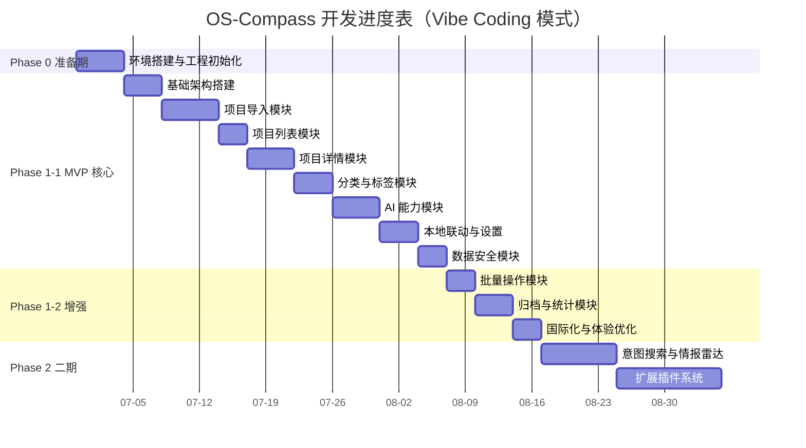

# OS-Compass 开源罗盘 - 里程碑和开发计划

| **部 门** | 研发部 |
| --------- | ------ |
| **编 写** | 系统架构师 |
| **审 核** | Charlie Liu |
| **日 期** | 2026-06-29 |
| **版 本** | V2.0（Vibe Coding 优化版） |

---

## 1 引言

### 1.1 编写目的

本文档为 OS-Compass 项目提供分阶段里程碑规划与开发执行指南，确保开发过程有序推进、按期交付。

### 1.2 项目背景

OS-Compass 是一款基于"本地优先（Local-First）"理念设计的跨平台桌面端开源项目全生命周期管理与决策系统，采用 Tauri 2.0 + React 18 + TypeScript 5 + Rust 技术栈。

### 1.3 开发约束

| 约束类型 | 说明 |
|----------|------|
| 技术栈 | Tauri 2.0 / React 18 / TypeScript 5 / Rust 1.75+ |
| 目标平台 | Windows 10+（首发），macOS/Linux 待定 |
| 开发模式 | **AI 辅助开发（Vibe Coding）** |

### 1.4 Vibe Coding 效率说明

> ⚠️ **重要**：本文档所有工时均基于 **Vibe Coding（AI 辅助开发）** 模式估算。

**效率系数**：

| 任务复杂度 | 传统开发 | Vibe Coding | 效率提升 |
|------------|-----------|--------------|----------|
| 低（CRUD、简单配置） | 1d | 0.3d | **70%** |
| 中（API调用、组件开发） | 2-3d | 0.5-1d | **60-70%** |
| 高（插件系统、复杂架构） | 5-7d | 2-3d | **50-60%** |

**实际效率取决于**：
- AI 模型能力（如 Claude 3.5 / GPT-4）
- Prompt 工程质量
- 需求/设计文档清晰度
- 开发者与 AI 协作经验

---

### 1.4 本机环境说明

> ⚠️ **重要**：本机使用 **MSYS2** 环境，VS C++ 安装失败。

| 组件 | 路径 | 说明 |
|------|------|------|
| MSYS2 | `D:\Soft\msys64` | 编译工具链 |
| UCRT64 | `D:\Soft\msys64\ucrt64` | C 运行时 |
| MinGW64 | `D:\Soft\msys64\mingw64` | GCC 工具链 |

**详细文档**：`docs/环境配置指南.md`、`docs/环境验证记录.md`

---

## 2 里程碑总览

### 2.1 阶段划分（Vibe Coding 估算）



### 2.2 里程碑概览（Vibe Coding 估算）

| 里程碑 | 阶段 | 功能点 | 传统工时 | **Vibe Coding 工时** | 目标日期 | 状态 |
|--------|------|--------|----------|---------------------|----------|------|
| M0 | Phase 0 准备期 | 11 | 14d | **7d** | 2026-07-06 | ✅ |
| M1-M12 | Phase 1-1 MVP + Phase 1-2 增强 | 56+2+26 | 84d | **39d** | 2026-08-19 | ✅ |
| M13 | Phase 2 二期 | 20 | 33d | **18.9d** | - | ✅ |
| M14 | Phase 2 扩展 | 9 | 28d | **6.3d** | - | ✅ |
| M15 | Phase 2 增强 | 5 | 11.5d | **5.5d** | - | ✅ |
| M16 | Phase 2 增强 | 9 | 7.8d | **4.15d** | - | ✅ |
| M17 | Phase 2 增强 | 9 | 19d | **2.4d** | - | ✅ |
| M18 | Phase 2 增强 | 9 | 7h | **7h** | - | ✅ |
| M19 | Phase 2 扩展 | 15 | 19.5d | **8.2d** | - | ⚠️ 部分完成 |
| M20 | Phase 2 扩展 | 3 | 4h | **4h** | - | ✅ |
| M21 | Phase 2 扩展 | 3 | 2h | **2h** | - | ✅ |
| M22 | Phase 2 增强 | 7 | 5h | **5h** | - | 📋 |

### 2.3 工时对比

| 阶段 | 传统开发 | **Vibe Coding** | 节省时间 | 效率提升 | 状态 |
|------|-----------|-----------------|----------|----------|------|
| Phase 0 | 14d | **7d** | 7d | 50% | ✅ |
| Phase 1 MVP + 增强 | 84d | **39d** | 45d | 54% | ✅ |
| M13 二期搜索与雷达 | 31d | **14.2d** | 16.8d | 54% | 🔄 |
| M14 扩展插件 | 14d | **7d** | 7d | 50% | 📋 |
| M15 主页增强 | 7d | **3.5d** | 3.5d | 50% | 📋 |
| **总计** | **150d** | **70.7d** | **79.3d** | **53%** | |

---

## 3 Phase 0 准备期

### 3.1 里程碑目标

完成开发环境搭建、Tauri 工程初始化、基础架构搭建，确保开发团队可以开始功能开发。

### 3.2 详细任务

| 任务 | 功能点 | 传统工时 | **Vibe Coding 工时** | 验收标准 |
|------|--------|-----------|---------------------|----------|
| **环境准备** |
| Tauri 2.0 安装与配置 | - | 1d | **0.5d** | `npm create tauri-app` 成功 |
| Rust 工具链配置 | - | 0.5d | **0.25d** | `rustc --version` >= 1.75 |
| MSYS2 环境配置 | - | 0.5d | **0.25d** | gcc/clang 编译通过 |
| pnpm 包管理器 | - | 0.5d | **0.25d** | pnpm --version |
| **工程初始化** |
| Tauri 工程创建 | 3.1.1 | 1d | **0.5d** | src-tauri/src/ 结构完整 |
| 前端工程配置 | 3.2.1-3.2.3 | 1d | **0.5d** | Tailwind + Zustand 集成 |
| 后端工程配置 | 3.3.1-3.3.3 | 2d | **1d** | sqlx + 迁移工具 + 日志 |
| **开发规范** |
| 代码规范制定 | 1.1.1-1.1.3 | 1d | **0.5d** | eslint + rustfmt 配置完成 |
| AGENTS.md 初始化 | 1.2.1 | 0.5d | **0.25d** | 文档结构完整 |
| 会话记录规范 | 1.2.2 | 0.5d | **0.25d** | SESSION-LOG.md 模板 |
| **设计交接** |
| 设计文档评审 | - | 1d | **0.5d** | 无阻塞性问题 |
| 原型评审 | - | 1d | **0.5d** | 与设计一致 |
| **Phase 0 小计** | | **14d** | **7d** | |

### 3.3 MSYS2 环境说明

> ⚠️ **重要**：本机使用 MSYS2 环境，VS C++ 安装失败。

| 组件 | 路径 |
|------|------|
| MSYS2 根目录 | `D:\Soft\msys64` |
| UCRT64 bin | `D:\Soft\msys64\ucrt64\bin` |
| MinGW64 bin | `D:\Soft\msys64\mingw64\bin` |

**详细文档**：`docs/环境配置指南.md`、`docs/环境验证记录.md`

**Phase 0 交付物**：
- 可运行的 Tauri 空壳项目
- 配置完成的开发环境（MSYS2）
- 代码规范文档
- 交接检查清单
- 环境配置文档
- 测试文档

**Phase 0 依赖文档**：
- `docs/环境配置指南.md`
- `docs/环境验证记录.md`
- `docs/测试文档/验收测试计划.md`

---

## 4 Phase 1-1 MVP 核心

### 4.1 里程碑目标

交付可运行的核心功能版本，支持项目导入、AI 分析、本地联动三大核心场景。

### 4.2 M1: 基础架构模块

**目标**：搭建前后端通信框架、数据库迁移、插件系统基础。

| 任务 | 功能点 | 复杂度 | 传统工时 | **Vibe Coding 工时** | 验收标准 |
|------|--------|--------|-----------|---------------------|----------|
| Tauri IPC 通信框架 | - | 中 | 2d | **1d** | invoke 调用正常返回 |
| 数据库 Schema 设计 | - | 中 | 2d | **1d** | migrations 脚本可执行 |
| 插件管理器框架 | - | 高 | 3d | **2d** | 插件可注册/调用 |
| **小计** | | | **7d** | **4d** | |

### 4.2.1 M1.1: 系统变量管理

**目标**：实现系统变量 CRUD，供插件配置使用。

| 任务 | 功能点 | 复杂度 | 传统工时 | **Vibe Coding 工时** | 验收标准 |
|------|--------|--------|-----------|---------------------|----------|
| system_variables 表 | 3.4.1 | 低 | 0.5d | **0.2d** | 表结构正确 |
| 变量 CRUD API | 3.4.2 | 中 | 1d | **0.5d** | 增删改查正常 |
| 变量加密存储 | 3.4.3 | 中 | 1d | **0.5d** | 敏感变量加密 |
| 变量管理页面 | 3.4.4 | 低 | 0.5d | **0.3d** | 设置中心标签页 |
| **小计** | | | **3d** | **1.5d** | |

### 4.2.2 M1.2: 扩展配置管理

**目标**：实现扩展的启用/禁用和变量配置管理。

| 任务 | 功能点 | 复杂度 | 传统工时 | **Vibe Coding 工时** | 验收标准 |
|------|--------|--------|-----------|---------------------|----------|
| source_plugins 表 | 3.5.1 | 低 | 0.5d | **0.2d** | 表结构正确 |
| 扩展列表 API | 3.5.2 | 低 | 0.5d | **0.2d** | 列表查询正常 |
| 扩展启用/禁用 | 3.5.3 | 低 | 0.5d | **0.3d** | 状态切换正常 |
| 扩展配置页面 | 3.5.4 | 中 | 1d | **0.5d** | 设置中心标签页 |
| **小计** | | | **2.5d** | **1.2d** | |

### 4.3 M2: 项目导入模块

**目标**：支持 GitHub/Gitee/NPM/PyPI 平台导入，Unknown 平台爬虫回退。

**Token 双轨制设计**：

| 配置情况 | 数据获取方式 | 数据质量 |
|----------|--------------|----------|
| 有 Token | 平台 API | ✅ 完整数据，可计算健康度 |
| 无 Token | 爬虫服务（web2md） | ⚠️ 部分数据，无法计算健康度 |

**插件内部 Token 判断**：插件自己检查 Token 是否存在，不存在则降级到爬虫。

| 任务 | 功能点 | 复杂度 | 传统工时 | **Vibe Coding 工时** | 验收标准 |
|------|--------|--------|-----------|---------------------|----------|
| URL 解析与平台识别 | 4.1.1 | 中 | 1d | **0.5d** | 自动识别 5 种平台 |
| GitHub 插件（API + 爬虫降级） | 4.1.2 | 高 | 3d | **1.5d** | 有 Token 用 API，无 Token 降级爬虫 |
| Gitee 插件（API + 爬虫降级） | 4.1.3 | 高 | 3d | **1.5d** | Token 配置正常，API 调用成功 |
| NPM 插件 | 4.1.4 | 中 | 1d | **0.5d** | 下载量/版本数获取正常 |
| PyPI 插件 | 4.1.5 | 中 | 1d | **0.5d** | 元数据获取正常 |
| 未知平台回退（爬虫/web2md） | 4.1.6 | 高 | 2d | **1d** | web2md 转换成功 |
| 手动录入表单 | 4.1.7 | 低 | 0.5d | **0.2d** | 表单验证通过 |
| 导入流程联调 | - | 中 | 0.5d | **0.3d** | 全流程可运行 |
| **小计** | | | **12d** | **6d** | |

### 4.4 M3: 项目列表模块

**目标**：交付看板视图与列表视图，支持拖拽排序。

| 任务 | 功能点 | 复杂度 | 传统工时 | **Vibe Coding 工时** | 验收标准 |
|------|--------|--------|-----------|---------------------|----------|
| 看板视图 | 4.2.1 | 中 | 2d | **1d** | 四列状态正常显示 |
| 列表视图 | 4.2.2 | 中 | 2d | **1d** | 表格排序/筛选正常 |
| 项目卡片组件 | 4.2.3 | 中 | 1d | **0.5d** | 卡片样式与原型一致 |
| 拖拽排序 | 4.2.4 | 高 | 2d | **1d** | 拖拽状态更新正常 |
| **小计** | | | **7d** | **3.5d** | |

### 4.5 M4: 项目详情模块

**目标**：交付项目详情页，包含 AI 报告、Runbook、README、克隆、Releases 等标签页。

| 任务 | 功能点 | 复杂度 | 传统工时 | **Vibe Coding 工时** | 验收标准 |
|------|--------|--------|-----------|---------------------|----------|
| 概览标签页 | 4.3.1 | 中 | 2d | **1d** | 元数据显示完整 |
| AI 报告标签页 | 4.3.2 | 中 | 2d | **1d** | 健康度评分显示 |
| Runbook 标签页 | 4.3.3 | 中 | 2d | **1d** | 操作步骤可复制 |
| README 标签页 | 4.3.4 | 高 | 2d | **1d** | Markdown 渲染正常 |
| 克隆标签页 | 4.3.5 | 中 | 2d | **1d** | 克隆命令执行正常 |
| Releases 标签页 | 4.25 | 中 | 2d | **1d** | Releases 列表显示，下载功能正常 |
| 本地笔记标签页 | 4.3.6 | 低 | 1d | **0.3d** | 笔记 CRUD 正常 |
| 用户信息标签页 | 4.3.7 | 中 | 1d | **0.5d** | 敏感信息加密/解密 |
| **小计** | | | **14d** | **6.8d** | |

### 4.6 M5: 分类与标签模块

**目标**：交付分类树与标签管理，支持 AI 智能分类。

| 任务 | 功能点 | 复杂度 | 传统工时 | **Vibe Coding 工时** | 验收标准 |
|------|--------|--------|-----------|---------------------|----------|
| 分类 CRUD | 5.1.1 | 中 | 1d | **0.5d** | 增删改查正常 |
| 多层级树形结构 | 5.1.2 | 高 | 3d | **1.5d** | 父子关系正确 |
| 系统分类"未分类" | 5.1.3 | 低 | 0.5d | **0.2d** | 默认分类存在 |
| AI 智能分类 | 4.26 | 中 | 2d | **1d** | LLM 返回分类 ID 正确，直接应用 |
| 标签 CRUD | 6.1.1 | 低 | 0.5d | **0.2d** | 标签管理正常 |
| LLM 提取标签 | 6.1.2 | 中 | 1d | **0.5d** | 标签提取准确 |
| 标签筛选 | 6.1.4 | 低 | 0.5d | **0.2d** | 筛选结果正确 |
| **小计** | | | **8.5d** | **4.1d** | |

### 4.7 M6: AI 能力模块

**目标**：交付 LLM 配置、健康度评分、Markdown 处理能力。

| 任务 | 功能点 | 复杂度 | 传统工时 | **Vibe Coding 工时** | 验收标准 |
|------|--------|--------|-----------|---------------------|----------|
| LLM 供应商配置 | 7.1.1 | 中 | 2d | **1d** | OpenAI/DeepSeek/Ollama 可切换 |
| 容错降级机制 | 7.1.2 | 中 | 1d | **0.5d** | 超时/失败降级正常 |
| 健康度评分算法 | 7.2.1 | 高 | 3d | **1.5d** | 各平台评分维度正确 |
| AI 评估摘要 | 7.2.2 | 高 | 2d | **1d** | LLM 生成摘要质量可接受 |
| Markdown 渲染 | 7.3.1 | 中 | 1d | **0.5d** | 渲染结果正确 |
| XSS 防护 | 7.3.2 | 中 | 0.5d | **0.3d** | XSS 攻击拦截 |
| Markdown 编辑器 | 7.3.3 | 中 | 1d | **0.5d** | EasyMDE 集成正常 |
| HTML 转 MD | 7.3.4 | 中 | 0.5d | **0.3d** | turndown 转换正常 |
| **小计** | | | **11d** | **5.6d** | |

### 4.8 M7: 本地联动与设置

**目标**：交付 git clone、IDE 集成、设置中心。

| 任务 | 功能点 | 复杂度 | 传统工时 | **Vibe Coding 工时** | 验收标准 |
|------|--------|--------|-----------|---------------------|----------|
| git clone 下载 | 8.1.1 | 高 | 2d | **1d** | 下载成功 |
| 下载进度显示 | 8.1.2 | 中 | 1d | **0.5d** | 进度条正常 |
| 代理配置支持 | 8.1.3 | 中 | 1d | **0.5d** | 代理请求正常 |
| 打开本地目录 | 8.2.1 | 低 | 0.5d | **0.2d** | 文件管理器打开 |
| VS Code 打开 | 8.2.2 | 低 | 0.5d | **0.2d** | VS Code 打开 |
| 数据目录配置 | 9.1.1 | 低 | 0.5d | **0.2d** | 目录切换正常 |
| LLM 设置 | 9.2.1-9.2.2 | 中 | 1d | **0.5d** | API 配置可保存 |
| 代理设置 | 9.2.3 | 中 | 1d | **0.5d** | 代理配置可保存 |
| **小计** | | | **8.5d** | **3.6d** | |

### 4.9 M8: 数据安全模块

**目标**：交付加密服务与数据保险箱。

| 任务 | 功能点 | 复杂度 | 传统工时 | **Vibe Coding 工时** | 验收标准 |
|------|--------|--------|-----------|---------------------|----------|
| AES-256-GCM 加密 | 10.1.1 | 中 | 2d | **1d** | 加解密正常 |
| OS 密钥库集成 | 10.1.2 | 高 | 2d | **1d** | Windows Credential Manager 正常 |
| 敏感信息加密存储 | 10.2.1 | 中 | 1d | **0.5d** | 加密存储成功 |
| 点击复制 | 10.2.2 | 低 | 0.5d | **0.2d** | 复制功能正常 |
| **小计** | | | **5.5d** | **2.7d** | |

**Phase 1-1 MVP 交付物**：
- 可运行的 Tauri 桌面客户端
- 项目导入 → AI 分析 → 本地下载完整流程
- 健康度评分系统（4 个平台）
- LLM 配置与 AI 报告生成
- 设置中心完整功能

---

## 5 Phase 1-2 增强功能

### 5.1 里程碑目标

在 MVP 基础上增强用户体验，增加批量操作、统计面板、国际化等功能。

### 5.2 M9: 批量操作模块

**目标**：交付批量多选、批量移动/归档/导出功能。

| 任务 | 功能点 | 复杂度 | 传统工时 | **Vibe Coding 工时** | 验收标准 |
|------|--------|--------|-----------|---------------------|----------|
| 复选框多选 | 5.1.1 | 低 | 1d | **0.3d** | Shift 多选正常 |
| 批量移动分类 | 5.1.2 | 中 | 2d | **1d** | 批量更新成功 |
| 批量归档 | 5.1.3 | 中 | 2d | **1d** | 批量归档成功 |
| 批量导出 | 5.1.4 | 中 | 2d | **1d** | JSON/CSV 导出正常 |
| **小计** | | | **7d** | **3.3d** | |

### 5.3 M10: 归档与统计模块

**目标**：交付归档列表、恢复、永久删除，以及统计面板。

| 任务 | 功能点 | 复杂度 | 传统工时 | **Vibe Coding 工时** | 验收标准 |
|------|--------|--------|-----------|---------------------|----------|
| 归档字段 | 5.2.1 | 低 | 0.5d | **0.2d** | 数据库字段正常 |
| 归档列表查看 | 5.2.2 | 低 | 1d | **0.3d** | 归档列表显示 |
| 恢复归档 | 5.2.3 | 低 | 1d | **0.3d** | 恢复功能正常 |
| 永久删除 | 5.2.4 | 中 | 1.5d | **0.6d** | 二次确认生效 |
| 健康度分布统计 | 5.3.1 | 中 | 1d | **0.5d** | 图表显示正确 |
| 分类分布统计 | 5.3.2 | 中 | 1d | **0.5d** | 分类饼图正确 |
| 语言分布统计 | 5.3.3 | 中 | 1d | **0.5d** | 语言柱状图正确 |
| 标签使用统计 | 5.3.4 | 中 | 1d | **0.5d** | 标签云显示正确 |
| **小计** | | | **8d** | **3.4d** | |

### 5.4 M11: 国际化与体验优化 ✅

**目标**：交付中英文界面、骨架屏，空状态等体验优化。

**状态**：已完成

| 任务 | 功能点 | 复杂度 | 传统工时 | **Vibe Coding 工时** | 验收标准 | 状态 |
|------|--------|--------|-----------|---------------------|----------|------|
| i18n 框架集成 | 5.5.1 | 中 | 2d | **1d** | react-i18next 正常 | ✅ |
| 中英文界面 | 5.5.2 | 低 | 1d | **0.3d** | 切换正常 | ✅ |
| 骨架屏/Loading | 5.4.1 | 低 | 1d | **0.3d** | 加载动画显示 | ✅ |
| 错误状态展示 | 5.4.2 | 低 | 1d | **0.3d** | 错误提示正确 | ✅ |
| 空状态设计 | 5.4.3 | 低 | 1d | **0.3d** | 空状态文案正确 | ✅ |
| 拖拽调整分类层级 | 5.6.1 | 高 | 2d | **1d** | 拖拽层级调整正常 | ✅ |
| 标签管理页面 | 5.7.1 | 低 | 1d | **0.3d** | 标签增删改正常 | ✅ |
| 主题设置 | 5.8.1 | 低 | 0.5d | **0.2d** | 暗色/亮色切换 | ✅ |
| 默认编辑器配置 | 5.8.2 | 低 | 0.5d | **0.2d** | 编辑器切换正常 | ✅ |
| 本地文件状态同步 | 5.9.1 | 中 | 1.5d | **0.6d** | 文件状态同步正常 | ✅ |
| README 多语言选择 | 5.10.1 | 低 | 0.5d | **0.2d** | 语言切换正常 | ✅ |
| 刷新 README | 5.10.2 | 低 | 0.5d | **0.2d** | 刷新功能正常 | ✅ |
| **小计** | | | **12.5d** | **4.9d** | | |

**Phase 1-2 增强交付物**：
- 批量操作功能
- 项目归档系统
- 统计面板
- 中英文界面
- **UI 状态优化（空状态、错误状态、主题切换）**
- UI 状态优化

### 5.5 M12: 仓库管理模块（前置模块）✅

**目标**：借鉴 Obsidian 的 Vault 概念，实现多仓库管理，支持数据隔离与灵活迁移。

**状态**：已完成（含安全修复）

| 任务 | 功能点 | 复杂度 | 传统工时 | **Vibe Coding 工时** | 验收标准 | 状态 |
|------|--------|--------|-----------|---------------------|----------|------|
| 仓库索引管理 | 5.11.1 | 低 | 1d | **0.3d** | vault-index.json 读写正常 | ✅ |
| 创建仓库 | 5.11.2 | 中 | 2d | **1d** | 数据库初始化成功 | ✅ |
| 导入已有仓库 | 5.11.8 | 中 | 2d | **0.8d** | 校验齐全有效后写入清单，密钥匹配验证通过 | ✅ |
| 仓库列表 | 5.11.3 | 低 | 1d | **0.3d** | 显示所有仓库信息 | ✅ |
| 切换仓库 | 5.11.4 | 中 | 2d | **1d** | 切换后数据正确 | ✅ |
| 删除仓库 | 5.11.5 | 中 | 1.5d | **0.6d** | 索引移除/文件删除正常 | ✅ |
| 仓库验证 | 5.11.6 | 中 | 1.5d | **0.6d** | 无效仓库拒绝切换 | ✅ |
| 启动加载 | 5.11.7 | 低 | 1d | **0.3d** | 启动时自动打开上次仓库 | ✅ |
| 安全修复 | — | 中 | 1d | **0.4d** | 凭据迁移不泄露、默认值无硬编码 | ✅ |
| **小计** | | | **13d** | **5.3d** | | |

**原型**：[vault-manager.html](../design-system/public/vault-manager.html)

---

## 6 Phase 2 二期功能

### 6.1 里程碑目标

交付意图搜索、情报雷达、插件系统等高级功能。

### 6.2 M13: 意图搜索与情报雷达

**目标**：交付 ChatGPT 风格的联网搜索与 RSS 订阅监控。

**状态**：架构完善中

**参照文档**：`docs/M13实施计划.md`、`docs/插件接入规范.md`

| 任务 | 功能点 | 复杂度 | 传统工时 | **Vibe Coding 工时** | 验收标准 | 状态 |
|------|--------|--------|-----------|---------------------|----------|------|
| **Task 1: FeaturePlugin trait** | FeaturePlugin trait + DbMode + PluginContext + PluginError | 中 | 2d | **1d** | trait 定义完整，编译通过 | ✅ |
| **Task 2: plugins.db** | plugin_config_db + 独立配置库 | 中 | 1d | **0.5d** | 配置库初始化成功，预设数据正确 | ✅ |
| **Task 3: PluginManager** | PluginRegistry + PluginManager + 占位插件 | 中 | 3d | **1.5d** | 插件可注册/启停/配置管理 | ✅ |
| **Task 4: 插件命令** | list/enable/config/db_path 命令 | 低 | 1d | **0.3d** | 5 个 Tauri 命令正常返回 | ✅ |
| **Task 5: SourceAdapter** | SourceAdapter trait + 4 种适配器 | 中 | 4d | **2d** | RSS/WebCrawl/Telegram/PlatformPreset 均可 fetch | ✅ |
| **Task 6: LLM 解析器** | parse_content_with_llm | 中 | 2d | **1d** | 原始内容解析为项目信息 | ✅ |
| **Task 7: RadarPlugin** | 定时扫描 + URL 去重 + 通知 | 中 | 3d | **1.5d** | 定时任务正常，新条目推送通知 | ✅ |
| **Task 8: SearchPlugin** | 三层搜索 + 联网策略 | 高 | 4d | **2d** | 本地→缓存→联网搜索正常 | ✅ |
| **Task 9: 雷达命令** | 信息源 CRUD + 收件箱 + 扫描 + 徽标 | 低 | 2d | **0.5d** | 8 个雷达命令正常返回 | ✅ |
| **Task 10: 搜索命令** | intent_search + 历史 + 信息源 + 导入 | 中 | 2d | **1d** | 搜索命令正常，历史持久化 | ✅ |
| **Task 11: RadarInbox UI** | 收件箱视图 + 暗色 + i18n | 中 | 2d | **1d** | 收件箱 UI 与原型一致 | ✅ |
| **Task 12: SearchView UI** | 搜索视图 + ChatGPT 风格 + i18n | 中 | 2d | **1d** | 搜索 UI 与原型一致 | ✅ |
| **Task 13: 前端集成** | Sidebar + App + SettingsDialog 插件面板 | 中 | 2d | **1d** | 导航集成正常，徽标更新 | ✅ |
| **Task 14: i18n + 构建** | 翻译键 + 暗色 + 构建验证 | 低 | 1d | **0.3d** | i18n 测试通过，release 构建成功 | ✅ |
| **Task 15: 设计文档** | 插件接入规范 + 数据库设计 + API 接口 | 中 | 1d | **0.5d** | 文档完整，操作域层次清晰 | ✅ |
| **Task 16: 前端 UI 重构** | Settings 功能插件标签页重构 | 中 | 2d | **1d** | UI 与原型一致，主题联动 | 🔄 |
| **Task 17: 插件配置弹窗** | Radar/Search 配置弹窗 | 中 | 1d | **0.5d** | 配置保存正确 | 🔄 |
| **Task 18: 雷达搜索增强** | 关键字/来源/日期筛选 + 分页 | 中 | 1.5d | **0.8d** | 筛选和分页正常 | 📋 |
| **Task 19: 广告过滤插件** | banlex 集成 + 中文词库 + 强度控制 | 中 | 2d | **1d** | 过滤功能正常 | 📋 |
| **小计** | | | **40.5d** | **18.9d** | | |

**已完成：Task 1-15** | **进行中：Task 16-17** | **待开发：Task 18-19**

**Task 依赖链**：
```
Task 1 ──> Task 3 ──> Task 4
Task 2 ──────────────> Task 3 ──> Task 5 ──> Task 6 ──> Task 7 ──> Task 9 ──> Task 11 ──> Task 13 ──> Task 14
                                         └──────> Task 8 ──> Task 10 ──> Task 12 ──> Task 13 ──> Task 14
```

### 6.3 M14: 插件系统扩展

**目标**：交付 GitLab/Docker Hub 扩展、本地插件管理、备份恢复、新手引导、快捷键。

> **范围说明**：
> - GitLab/Docker Hub：仅项目导入场景
> - 插件热加载：目录加载（WASM 后续实现）
> - 本地插件管理：无远程市场

| 任务 | 功能点 | 复杂度 | 传统工时 | **Vibe Coding 工时** | 验收标准 |
|------|--------|--------|-----------|---------------------|----------|
| GitLab 适配器 | 项目导入 | 中 | 2d | **1d** | GitLab API 集成正常 |
| Docker Hub 适配器 | 项目导入 | 中 | 2d | **1d** | Docker Hub API 集成正常 |
| 插件热加载 | 目录加载 | 中 | 3d | **1.5d** | 运行时加载正常 |
| 本地插件管理 | 内置+本地插件 | 中 | 2d | **1d** | 插件列表正常 |
| 备份恢复 | 文件级备份 | 低 | 1d | **0.5d** | 备份恢复正常 |
| 新手引导 | 5 步引导 | 中 | 1d | **0.5d** | 引导流程正常 |
| 快捷键 | 全局快捷键 | 低 | 1d | **0.5d** | 快捷键响应正常 |
| i18n + 构建 | 翻译键 + 构建 | 低 | 1d | **0.3d** | 构建成功 |
| **小计** | | | **13d** | **6.3d** | |

**M14 交付物**：
- GitLab 适配器（项目导入）
- Docker Hub 适配器（项目导入）
- 插件热加载（目录加载）
- 本地插件管理 UI
- 备份恢复（文件级）
- 新手引导（5 步）
- 快捷键系统

**M15 交付物**：
- 首页/引导页（极简输入框）
- 导航优化

### 6.4 M15: 主页增强 + 用户信息 + 雷达增强

**目标**：主页引导页 + 数据保险箱 + 雷达搜索增强 + 广告过滤插件。

| 任务 | 功能点 | 复杂度 | 传统工时 | **Vibe Coding 工时** | 验收标准 | 状态 |
|------|--------|--------|-----------|---------------------|----------|------|
| 首页原型 | home.html 引导页 | 中 | 1d | **0.5d** | 原型完成 | ✅ |
| 数据保险箱 | 项目级敏感信息存储 | 低 | 1.5d | **0.8d** | CRUD 正常 | 📋 |
| 雷达搜索增强 | 关键字/来源/时间筛选 + 分页 | 中 | 2d | **0.9d** | 筛选正常 | 📋 |
| 广告过滤插件 | banlex 集成 + 中文词库 | 中 | 2d | **1d** | 过滤正常 | 📋 |
| 首页 UI | 主页组件实现 | 中 | 2d | **1d** | UI 与原型一致 | 📋 |
| 极简输入 | URL 自动识别 | 中 | 1d | **0.5d** | 自动识别平台 | 📋 |
| 导航优化 | Logo/侧边栏 | 低 | 1d | **0.5d** | 导航正常 | 📋 |
| i18n + 构建 | 翻译键 + 构建 | 低 | 1d | **0.3d** | 构建成功 | 📋 |
| **小计** | | | **11.5d** | **5.5d** | | |

**M15 交付物**：
- 用户信息标签页（数据保险箱）
- 情报雷达搜索增强
- 广告过滤插件
- 主页引导页

**M15 原型**：
- `radar-inbox.html`（雷达搜索增强）
- `radar-filter-settings.html`（广告过滤设置）
- `project-detail.html`（用户信息，已存在）

---

### 6.5 M16: 初始化向导 + 主页增强

**目标**：首次启动引导 + 功能入口页 + 极简首页。

| 任务 | 功能点 | 复杂度 | 传统工时 | **Vibe Coding 工时** | 验收标准 | 状态 |
|------|--------|--------|-----------|---------------------|----------|------|
| 初始化向导原型 | init-wizard.html | 中 | 0.5d | **0.25d** | 原型完成 | ✅ |
| 选择已有仓库 | 前端+后端 | 中 | 1d | **0.5d** | 仓库列表正常 | 📋 |
| 创建新仓库 | 前端+后端 | 中 | 1d | **0.5d** | 创建流程正常 | 📋 |
| 从备份导入 | 前端+后端 | 中 | 1d | **0.5d** | 导入流程正常 | 📋 |
| 初始化流程 | 进度条+完成 | 中 | 0.5d | **0.3d** | 进度显示正常 | 📋 |
| App 集成 | 触发逻辑 | 中 | 0.5d | **0.3d** | 首次启动正常 | 📋 |
| 侧边栏入口 | 切换仓库入口 | 低 | 0.3d | **0.2d** | 入口可用 | 📋 |
| 功能入口页 | index.html | 低 | 0.5d | **0.3d** | 页面正常 | 📋 |
| 极简首页 | home.html + 组件 | 中 | 2d | **1d** | URL 识别正常 | 📋 |
| i18n + 构建 | 翻译键 + 构建 | 低 | 0.5d | **0.3d** | 构建成功 | 📋 |
| **小计** | | | **7.8d** | **4.15d** | | |

**M16 交付物**：
- 初始化向导（首次启动引导）
- 功能入口页（index.html）
- 极简首页（home.html）

**M16 原型**：
- `init-wizard.html`（初始化向导）

---

### 6.6 M19: 其他常用网站采集扩展

**目标**：扩展平台采集能力，支持 NPM、PyPI、Crates.io 等常用网站；增加广告标记学习和定时采集功能。

**参照文档**：`docs/M19其他常用网站采集扩展.md`

#### 6.6.1 平台扩展

**目标**：支持 NPM、PyPI、Crates.io 平台导入。

| 任务 | 功能点 | 复杂度 | 传统工时 | **Vibe Coding 工时** | 验收标准 | 状态 |
|------|--------|--------|-----------|---------------------|----------|------|
| NPM 适配器 | registry.npmjs.org API | 中 | 2d | **1d** | 包数据获取正常 | 📋 |
| PyPI 适配器 | pypi.org API | 中 | 2d | **1d** | 包数据获取正常 | 📋 |
| Crates.io 适配器 | crates.io API | 中 | 1.5d | **0.8d** | Crate 数据获取正常 | 📋 |
| 平台路由集成 | detect_platform 路由 | 中 | 1d | **0.5d** | 自动识别平台 | 📋 |
| 前端界面适配 | ImportModal 适配 | 低 | 1d | **0.3d** | NPM/PyPI/Crates 导入正常 | 📋 |
| 测试 + 构建 | 全流程测试 | 低 | 0.5d | **0.2d** | 构建成功 | 📋 |
| **小计** | | | **8d** | **3.8d** | | |

#### 6.6.2 广告学习功能

**目标**：让用户参与广告识别，训练屏蔽模型。

> **已实现**：banlex 广告过滤插件（`content_filter.rs`），集成中文词库

| 任务 | 功能点 | 复杂度 | 传统工时 | **Vibe Coding 工时** | 验收标准 | 状态 |
|------|--------|--------|-----------|---------------------|----------|------|
| 广告过滤插件 | banlex 集成 + 中文词库 | 中 | 2d | **1d** | banlex 过滤正常 | ✅ |
| 广告标记 UI | RadarCard 增加标记按钮 | 低 | 1d | **0.3d** | 按钮可见，点击响应 | 📋 |
| LLM 广告判定 | 广告判定 Prompt + 服务 | 中 | 2d | **1d** | LLM 返回判定结果 | 📋 |
| 屏蔽列表管理 | ad_patterns 表 CRUD | 低 | 1d | **0.3d** | 屏蔽规则增删改查 | 📋 |
| 雷达数据过滤 | 采集时自动过滤广告 | 中 | 1.5d | **0.6d** | 已屏蔽广告不显示 | 📋 |
| **小计** | | | **7.5d** | **3.2d** | | |

#### 6.6.3 定时采集功能

**目标**：后台自动采集 + 系统通知提醒。

| 任务 | 功能点 | 复杂度 | 传统工时 | **Vibe Coding 工时** | 验收标准 | 状态 |
|------|--------|--------|-----------|---------------------|----------|------|
| 定时采集开关 UI | RadarHeader 组件 | 低 | 1d | **0.3d** | 开关可切换 | 📋 |
| 后台定时任务 | Tauri 后台任务 | 中 | 2d | **1d** | 定时任务正常执行 | 📋 |
| 系统通知集成 | Tauri notification | 低 | 1d | **0.3d** | 新内容通知正常 | 📋 |
| 数据去重逻辑 | source_url 去重 | 低 | 1d | **0.3d** | 新增数量统计正确 | 📋 |
| 托盘菜单集成 | 托盘右键菜单 | 低 | 1d | **0.3d** | 菜单功能正常 | 📋 |
| **小计** | | | **6d** | **2.2d** | | |

#### 6.6.4 M19 工时汇总

| 模块 | 任务 | 工时 | 完成 |
|------|------|------|------|
| 平台扩展 | Task 1-6 | **3.8d** | 0/6 |
| 广告学习 | Task 7-10 | **3.2d** | 1/5 |
| 定时采集 | Task 11-15 | **2.2d** | 0/5 |
| **总计** | 15 Tasks | **9.2d** | 1/16 |

**M19 交付物**：
- NPM/PyPI/Crates.io 平台适配器
- 广告标记学习系统
- 定时采集 + 系统通知
- 托盘菜单集成

---

## 7 风险管理

### 7.1 风险识别

| 风险 | 影响 | 概率 | 应对策略 |
|------|------|------|----------|
| Rust 学习曲线高 | 进度延迟 | 中 | AI 辅助开发，加强 Code Review |
| 平台 API 变更 | 功能失效 | 中 | 预留缓冲，接口抽象隔离 |
| LLM 响应不稳定 | AI 功能不可靠 | 高 | 容错降级机制，缓存历史结果 |
| Tauri 2.0 早期版本 BUG | 阻塞开发 | 低 | 关注 Release Note，及时升级 |

### 7.2 关键依赖

| 依赖 | 说明 | 备选方案 |
|------|------|----------|
| WebView2 | Windows 10 自带 | 检查并引导安装 |
| git | 本地下载 | 检查并提示安装 |
| VS Code | IDE 打开（可选） | 用户自行配置 |
| LLM API | AI 功能必需 | 引导配置 |

---

## 8 开发规范

### 8.1 Vibe Coding 实践指南

1. **明确上下文**：告知 AI 当前模块、已使用的技术栈
2. **给定约束**：明确 TypeScript/Rust 类型定义、API 签名
3. **即时验证**：AI 生成代码后立即运行测试
4. **错误驱动**：遇到问题直接投喂完整错误信息
5. **分步迭代**：大任务拆分为小步骤逐步完成

### 8.2 会话管理

- 每 Session 开始前读取 AGENTS.md
- Session 结束时更新 SESSION-LOG.md
- 关键节点创建 Checkpoint
- 每次提交前运行 lint/typecheck

---

## 9 附录

### 9.1 功能点统计汇总

| 阶段 | 高 | 中 | 低 | 合计 |
|------|----|----|----|------|
| Phase 0 | 0 | 4 | 7 | 11 |
| Phase 1-1 MVP | 9 | 25 | 22 | 56 |
| Phase 1-2 增强 | 1 | 13 | 12 | 26 |
| M13 二期搜索与雷达 | 3 | 9 | 8 | 20 |
| M14 扩展插件 | 3 | 4 | 2 | 9 |
| M15 主页增强 | 1 | 2 | 2 | 5 |
| M16 初始化向导 | 0 | 5 | 4 | 9 |
| M17 意图搜索增强 | 0 | 4 | 5 | 9 |
| M18 意图搜索修复 | 0 | 3 | 6 | 9 |
| M19 网站采集扩展 | 0 | 5 | 10 | 15 |
| M20 批量向量化 | 0 | 1 | 2 | 3 |
| M21 向量化修复 | 0 | 1 | 2 | 3 |
| M22 意图搜索历史 | 0 | 2 | 5 | 7 |
| **总计** | **17** | **78** | **85** | **180** |

### 9.2 Vibe Coding 工时汇总

| 阶段 | 传统工时 | **Vibe Coding 工时** | 节省 |
|------|-----------|---------------------|------|
| Phase 0 | 14d | **7d** | 7d |
| Phase 1-1 MVP | 63d | **34d** | 29d |
| Phase 1-2 增强 | 21d | **10d** | 11d |
| M13 二期搜索与雷达 | 33d | **18.9d** | 14.1d |
| M14 扩展插件 | 28d | **6.3d** | 21.7d |
| M15 主页增强 | 11.5d | **5.5d** | 6d |
| M16 初始化向导 | 7.8d | **4.15d** | 3.65d |
| M17 意图搜索增强 | 19d | **2.4d** | 16.6d |
| M18 意图搜索修复 | 7h | **7h** | - |
| M19 网站采集扩展 | 19.5d | **8.2d** | 11.3d |
| M20 批量向量化 | 4h | **4h** | - |
| M21 向量化修复 | 2h | **2h** | - |
| M22 意图搜索历史 | 5h | **5h** | - |
| **总计** | **199.3d+** | **96.95d+** | **102.85d+** |

### 9.3 原型清单

| # | 原型 | 阶段 | 状态 |
|---|------|------|------|
| 1 | main-interface.html | MVP | ✅ |
| 2 | list-view.html | MVP | ✅ |
| 3 | import-form.html | MVP | ✅ |
| 4 | import-confirm.html | MVP | ✅ |
| 5 | manual-add.html | MVP | ✅ |
| 6 | project-detail.html | MVP | ✅ |
| 7 | category-manager.html | MVP | ✅ |
| 8 | tag-manager.html | MVP | ✅ |
| 9 | settings.html | MVP | ✅ |
| 10 | plugin-manager.html | MVP | ✅ |
| 11 | search-view.html | M13 | ✅ |
| 12 | radar-inbox.html | M13 | ✅ |
| 13 | radar-filter-settings.html | M13 | ✅ |
| 14 | archive.html | 1-2 | ✅ |
| 15 | vault-manager.html | 1-2 | ✅ |

---

## 10 文档变更记录

| 版本 | 日期 | 变更说明 |
|------|------|----------|
| V1.0 | 2026-06-29 | 初始版本 |
| V2.0 | 2026-06-29 | Vibe Coding 效率优化版：工时减少 44%（126d → 70d） |
| V2.1 | 2026-06-29 | 新增 MSYS2 环境配置说明，避免遗忘 |
| V2.2 | 2026-07-07 | 新增 Releases 标签页（M4）、AI 智能分类（M5）|
| V2.3 | 2026-07-10 | M11 国际化与体验优化标记完成 ✅；Phase 1 全部完成 |
| V2.4 | 2026-07-11 | M13 详细里程碑（14 Tasks，59 功能点，14.2d Vibe Coding 工时） |
| V2.5 | 2026-07-20 | 新增 M15 主页增强里程碑；更新功能点统计汇总 |
| V2.6 | 2026-07-21 | 新增广告过滤插件（banlex）；更新需求文档和原型 |
| V2.7 | 2026-07-21 | M15 新增用户信息、雷达增强、广告过滤；更新里程碑 |
| V2.8 | 2026-08-13 | 新增 M16、M19 里程碑；更新统计汇总 |
| V2.9 | 2026-08-13 | M16-M18、M20-M21 标记为已完成 ✅；更新统计汇总 |
| V2.10 | 2026-08-13 | 修正 M19 状态：banlex 广告过滤已完成，NPM/PyPI/Crates、定时采集未完成 |
| V2.11 | 2026-08-14 | 新增 M22 意图搜索历史记录；更新里程碑和统计汇总 |

---

**文档结束**
