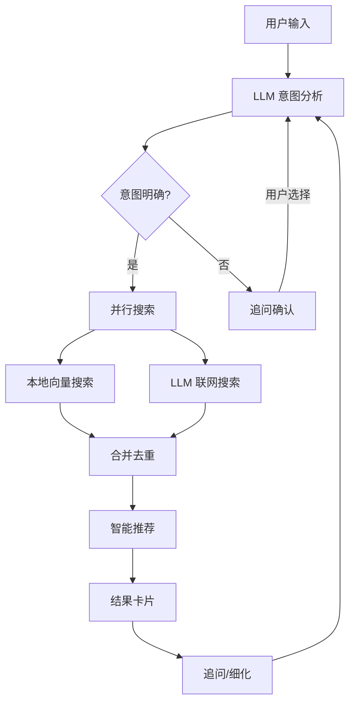
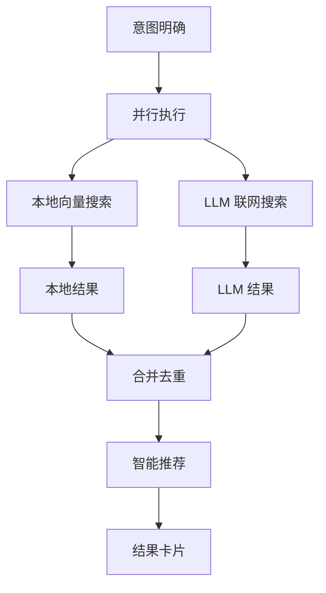
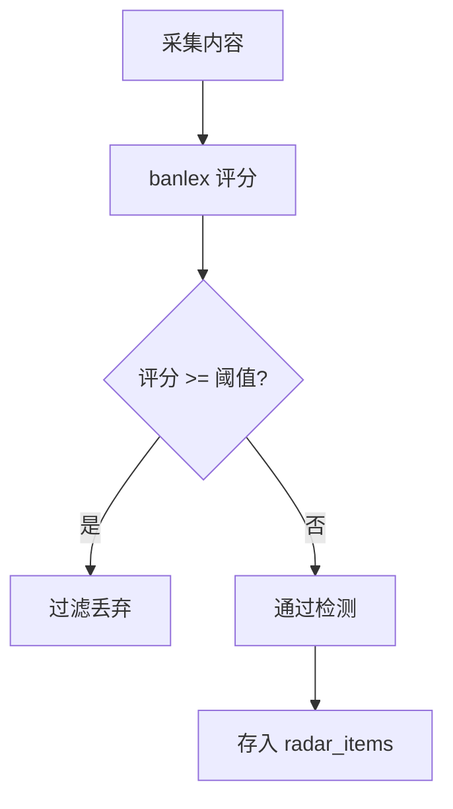

# OS-Compass 需求确认文档

版本：V1.0
日期：2026-06-27

---

## 1. 文档目的

本文档用于确认需求细节，补充需求初步沟通记录中的模糊点，为概要设计和详细设计提供明确的决策依据。

---

## 2. AI 评估报告相关确认

### 2.1 LLM 配置（使用者自由配置）

**设计原则**：不限制具体 LLM 供应商，使用者自由配置。

| 配置项 | 说明 |
|--------|------|
| 供应商 | OpenAI / DeepSeek / Anthropic / Ollama / 其他兼容 API |
| API Base URL | 支持第三方反代地址 |
| API Key | 使用者自有 Key，不经过任何中转 |
| 模型 | 如 gpt-4o、deepseek-chat |

**配置方式**：设置中心 → LLM 配置标签页 → 填写后测试连接

### 2.2 AI 评估报告包含内容

| 评估维度 | 说明 | 数据来源 |
|----------|------|----------|
| 健康度评分 | 1-100 分综合评分 | GitHub/Gitee API |
| 社区活跃度 | Commit 频率、Issue 闭环率 | GitHub/Gitee API |
| 版本发布频率 | 最近版本发布时间和频率 | GitHub/Gitee API |
| License 合规 | 许可证风险评估 | 项目 LICENSE 文件 |
| 安全提示 | 潜在安全风险提醒 | GitHub Advisory API |

**评分维度及权重**：

| 维度 | 权重 | 评分标准 | 数据来源 |
|------|------|----------|----------|
| 提交活跃度 | 25% | 最近6个月有提交：25分<br>最近12个月：15分<br>最近24个月：8分<br>超过24个月：0分 | GitHub REST API |
| Issue 闭环率 | 20% | 闭环率 >= 80%：20分<br>>= 60%：15分<br>>= 40%：10分<br>< 40%：5分 | GitHub REST API |
| 版本发布频率 | 20% | 最近6个月有版本：20分<br>最近12个月：12分<br>最近24个月：6分<br>超过24个月：0分 | GitHub REST API |
| Star 数量 | 15% | >= 50k：15分<br>>= 10k：12分<br>>= 1k：8分<br>>>= 100：4分<br>< 100：1分 | GitHub REST API |
| 贡献者数量 | 10% | >= 100：10分<br>>>= 20：8分<br>>>= 5：5分<br>< 5：2分 | GitHub REST API |
| License 风险 | 10% | MIT/Apache/BSD/ISC：+10分<br>GPL/AGPL：-5分<br>无协议：0分 | 项目 LICENSE 文件 |

**评分等级**：

| 分数范围 | 等级 | 颜色标识 |
|----------|------|----------|
| 80-100 | 非常健康 | 绿色 |
| 60-79 | 健康 | 浅绿 |
| 40-59 | 一般 | 黄色 |
| 0-39 | 不健康 | 红色 |

### 2.3 分析触发时机

| 时机 | 说明 | 用户控制 |
|------|------|----------|
| 入库时自动分析 | 导入 URL 时可选勾选"自动分析" | 默认勾选，可跳过 |
| 手动触发 | 在项目详情页点击"重新分析"按钮 | 用户主动操作 |

**原型调整**：

概览页快速操作区：
- `重新分析` → 完整 AI 评估（健康度、License、安全、口碑）
- `翻译 README` → 仅翻译 + 提炼（快速）

### 2.4 数据来源

| 数据项 | 来源 | API/方式 |
|--------|------|----------|
| 项目元数据 | GitHub/Gitee API | `GET /repos/{owner}/{repo}` |
| Commit 历史 | GitHub/Gitee API | `GET /repos/{owner}/{repo}/commits` |
| Issue 状态 | GitHub/Gitee API | `GET /repos/{owner}/{repo}/issues` |
| Release 信息 | GitHub/Gitee API | `GET /repos/{owner}/{repo}/releases` |
| License 类型 | 项目文件或 API | `GET /repos/{owner}/{repo}/license` |
| 安全漏洞 | GitHub Advisory API | `GET /advisories` |
| README 内容 | GitHub/Gitee API | `GET /repos/{owner}/{repo}/readme` |

---

## 3. 语言设置相关确认

### 3.1 语言处理流程

| 场景 | 处理方式 |
|------|----------|
| 原文语言 = 系统语言 | 直接展示原文 |
| 原文语言 ≠ 系统语言 + 自动翻译开启 | LLM 翻译 + 提炼 + 简化 |
| 原文语言 ≠ 系统语言 + 自动翻译关闭 | 仅展示原文 |

### 3.2 LLM 处理内容

翻译不仅仅是语言转换，还包括：

- **提炼**：去除冗余信息，保留核心内容
- **简化**：将复杂描述转化为简洁清晰的表述
- **结构化**：按主题分段，便于快速浏览

### 3.3 翻译引擎设置

#### 3.3.1 翻译引擎类型

| 引擎 | 特点 | 适用场景 | 配置要求 |
|------|------|----------|----------|
| Google 翻译 | 速度快，免费，有频率限制 | 短文本（&lt;5000字符） | 可选 API Key |
| LLM 翻译 | 质量好，有成本，响应较慢 | 长文本，需要语义理解 | 需要配置 LLM |

#### 3.3.2 引擎选择策略

| 策略 | 说明 | 触发条件 |
|------|------|----------|
| 自动选择（推荐） | 短文本用 Google，长文本用 LLM | 默认 |
| 仅 Google | 所有翻译都用 Google | 需要 Google API Key |
| 仅 LLM | 所有翻译都用 LLM | 需要 LLM 配置 |

**自动选择规则**：
- 文本长度 &lt; 5000 字符：优先使用 Google 翻译
- 文本长度 ≥ 5000 字符：使用 LLM 翻译（质量更好）
- Google 翻译失败时：自动降级到 LLM

#### 3.3.3 Google 翻译配置

| 配置项 | 说明 | 必填 |
|--------|------|------|
| API Key | Google Cloud Console 获取 | 否（不填使用免费版） |
| 代理设置 | 用于访问 Google 服务 | 中国大陆必填 |

#### 3.3.4 多语言 README 自动检测

**功能说明**：自动检测项目仓库中的多语言 README 文件（如 README_ZH.md、README_HANT.md、README_EN.md 等），让用户直接选择查看，无需 LLM 翻译。

**支持的命名格式**：
- `README_ZH.md`、`README_CN.md`、`README.zh-CN.md`
- `README_HANT.md`、`README.zh-TW.md`
- `README_EN.md`、`README.md`（默认英文）
- `README_JA.md`、`README_JP.md`
- `README_KO.md`、`README_KR.md`

**处理流程**：
1. 导入项目时，API 获取仓库根目录文件列表
2. 检测所有以 `README` 开头且以 `.md` 结尾的文件
3. 获取每个文件的原始内容
4. 存入数据库 `readme_variants` 字段（JSON 格式）
5. 前端 README 标签页显示选择器，用户选择查看

**配置位置**：

设置中心 → **翻译** 标签页

---

## 4. 平台插件化设计确认

### 4.1 插件化架构

不同平台（GitHub、Gitee、NPM、PyPI）的数据结构、API 方式、评分方式差异较大，采用插件化架构解耦核心逻辑。

**插件目录**：`plugins/sources/`

**插件类型**：SourcePlugin（与二期插件系统区分）

### 4.2 插件定义

| 插件 | 数据来源 | API 方式 | Token 配置 | 评分特点 | 状态 |
|------|----------|----------|-----------|----------|------|
| GitHub 插件 | REST API | `api.github.com` | 可选 | Commit + Issue + Release | 🔄 测试中 |
| Gitee 插件 | Open API | `gitee.com/api/v5` | 可选 | 类似 GitHub | ⬜ 待开发 |
| NPM 插件 | Registry API | `registry.npmjs.org` | 不需要 | 下载量 + 版本数 + 依赖数 | ⬜ 待开发 |
| PyPI 插件 | JSON API | `pypi.org/pypi/{pkg}/json` | 不需要 | 下载量 + 版本数 | ⬜ 待开发 |
| Crawler 插件 | 爬虫服务 | HTTP API | 不需要 | 无评分（标记为"未评分"） | ✅ 已实现 |

### 4.3 插件接口规范（Rust Trait）

```rust
/// 平台插件接口
trait SourcePlugin: Send + Sync {
    /// 插件唯一标识
    fn id(&self) -> &'static str;
    
    /// 插件显示名称
    fn name(&self) -> &'static str;
    
    /// 判断 URL 是否匹配本插件
    fn matches(&self, url: &str) -> bool;
    
    /// 获取项目元数据
    async fn fetch(&self, url: &str) -> Result<ProjectInfo, PluginError>;
    
    /// 计算平台健康度（返回平台原生指标，可选）
    fn score(&self, info: &ProjectInfo) -> Option<PlatformMetrics>;
    
    /// 获取 README 内容（可选）
    async fn fetch_readme(&self, source_id: &str) -> Result<String, PluginError>;
    
    /// 声明需要的系统变量
    fn required_variables(&self) -> Vec<Variable>;
}

/// 系统变量定义
struct Variable {
    key: String,       // "github_token"
    name: String,      // "GitHub Token"
    secret: bool,      // 是否加密存储
}

/// 项目信息
struct ProjectInfo {
    name: String,
    url: String,
    source: String,        // "github"
    source_id: String,
    description: Option<String>,
    languages: Option<Vec<String>>,
    stars: i64,
    forks: i64,
    open_issues: i64,
    license: Option<String>,
    homepage: Option<String>,
    latest_commit: Option<String>,
    latest_release: Option<String>,
}

/// 平台指标（用于统一量化）
struct PlatformMetrics {
    raw_metrics: HashMap<String, f64>,
}
```

### 4.4 双轨制设计

**设计原则**：Token 可选，无 Token 时降级到爬虫服务。

| 配置情况 | 数据获取方式 | 数据质量 |
|----------|--------------|----------|
| 有 Token | 平台 API | ✅ 完整数据，可计算健康度 |
| 无 Token | 爬虫服务（web2md） | ⚠️ 部分数据，无法计算健康度 |

### 4.5 系统变量管理

设置中心「变量管理」标签页：

**system_variables 表结构**：

| 字段 | 类型 | 说明 |
|------|------|------|
| key | VARCHAR PRIMARY KEY | 变量键名（github_token、gitee_token） |
| value | TEXT | 变量值 |
| is_secret | BOOLEAN | 是否加密存储 |
| created_at | DATETIME | 创建时间 |
| updated_at | DATETIME | 更新时间 |

**变量声明**：

插件通过 `required_variables()` 声明需要的变量：
```rust
fn required_variables(&self) -> Vec<Variable> {
    vec![
        Variable {
            key: "github_token".to_string(),
            name: "GitHub Token".to_string(),
            secret: true,  // 加密存储
        },
        Variable {
            key: "github_proxy".to_string(),
            name: "GitHub 代理".to_string(),
            secret: false,
        },
    ]
}
```

### 4.6 扩展配置

设置中心「扩展配置」标签页：

**source_plugins 表结构**：

| 字段 | 类型 | 说明 |
|------|------|------|
| id | VARCHAR PRIMARY KEY | 扩展 ID（github、gitee、crawler） |
| name | VARCHAR | 显示名称 |
| plugin_class | VARCHAR | 插件实现类名（plugins.GitHubPlugin） |
| description | TEXT | 扩展描述 |
| enabled | BOOLEAN | 是否启用 |
| version | VARCHAR | 版本号 |
| required_variables | TEXT | 声明需要的变量（JSON 数组） |
| created_at | DATETIME | 创建时间 |
| updated_at | DATETIME | 更新时间 |

### 4.7 插件内部 Token 判断逻辑

```rust
impl GitHubPlugin {
    async fn fetch(&self, url: &str) -> Result<ProjectInfo, PluginError> {
        // 1. 检查系统变量是否有 Token
        let token = get_variable("github_token");
        
        if token.is_some() {
            // 2a. 有 Token，用 API 获取完整数据
            self.fetch_with_api(url, token).await
        } else {
            // 2b. 无 Token，降级到爬虫
            self.fetch_with_crawler(url).await
        }
    }
}
```

### 4.8 扩展配置页面原型

```
┌─────────────────────────────────────────────────┐
│  设置中心                                    │
├─────────────────────────────────────────────────┤
│ [通用] [下载] [LLM] [扩展配置]                │
├─────────────────────────────────────────────────┤
│                                                 │
│  已安装的扩展                                  │
│  ┌─────────────────────────────────────────┐   │
│  │ 🟢 GitHub        v1.0    [启用] [配置]  │   │
│  │    获取 GitHub 项目信息、评分              │   │
│  └─────────────────────────────────────────┘   │
│  ┌─────────────────────────────────────────┐   │
│  │ 🟢 Gitee        v1.0    [启用] [配置]  │   │
│  │    获取 Gitee 项目信息、评分              │   │
│  └─────────────────────────────────────────┘   │
│  ┌─────────────────────────────────────────┐   │
│  │ 🟢 Crawler      内置      [启用]         │   │
│  │    通用网页爬虫（无 Token 时降级使用）    │   │
│  └─────────────────────────────────────────┘   │
│                                                 │
└─────────────────────────────────────────────────┘
```

### 4.9 扩展详情/变量配置弹窗

```
┌─────────────────────────────────────────────────┐
│  GitHub 扩展配置                               │
├─────────────────────────────────────────────────┤
│                                                 │
│  Token（已加密存储）                            │
│  ┌─────────────────────────────────────────┐   │
│  │ github_xxx...                          │   │
│  └─────────────────────────────────────────┘   │
│                                                 │
│  [保存变量配置]                                │
│                                                 │
└─────────────────────────────────────────────────┘
```

### 4.8 扩展接口定义

**SourcePlugin Trait**（扩展实现接口）：

```rust
use async_trait::async_trait;
use serde::{Deserialize, Serialize};

/// 扩展元信息
#[derive(Debug, Clone, Serialize, Deserialize)]
pub struct PluginMeta {
    pub id: String,                    // 扩展唯一标识符
    pub name: String,                  // 显示名称
    pub plugin_class: String,         // 扩展实现类名
    pub version: String,               // 版本号
    pub description: String,           // 扩展描述
    pub enabled: bool,                // 是否启用
    pub required_variables: Vec<VariableDef>,  // 需要的变量声明
}

/// 变量定义
#[derive(Debug, Clone, Serialize, Deserialize)]
pub struct VariableDef {
    pub key: String,           // 变量键名
    pub name: String,           // 显示名称
    pub description: Option<String>,  // 描述
    pub secret: bool,          // 是否敏感（加密存储）
    pub default: Option<String>,     // 默认值
}

/// 项目信息
#[derive(Debug, Clone, Serialize, Deserialize)]
pub struct ProjectInfo {
    pub platform: String,       // 平台标识
    pub url: String,            // 原始 URL
    pub name: String,           // 项目名称
    pub description: Option<String>,
    pub language: Option<String>,
    pub languages: Option<Vec<String>>,  // 多语言
    pub license: Option<String>,
    pub git_url: Option<String>,
    pub stars: Option<i64>,
    pub forks: Option<i64>,
    pub watchers: Option<i64>,
    pub open_issues: Option<i64>,
    pub updated_at: Option<String>,
    pub contributors: Option<i64>,
    pub readme: Option<String>,
    pub platform_data: Option<serde_json::Value>,  // 平台特有数据
    pub platform_score: Option<f64>,              // 平台评分
    pub quality: DataQuality,                     // 数据质量
}

/// 数据质量
#[derive(Debug, Clone, Copy, PartialEq, Eq, Serialize, Deserialize)]
pub enum DataQuality {
    High,  // API 获取，完整数据
    Low,   // 爬虫获取，部分数据
}

/// 插件错误
#[derive(Debug, thiserror::Error)]
pub enum PluginError {
    #[error("插件未启用")]
    Disabled,
    #[error("缺少必需变量: {0}")]
    MissingVariable(String),
    #[error("不支持的 URL: {0}")]
    UnsupportedUrl(String),
    #[error("网络请求失败: {0}")]
    NetworkError(String),
    #[error("API 错误: {0}")]
    ApiError(String),
}

/// 平台特有指标
#[derive(Debug, Clone, Serialize, Deserialize)]
pub struct PlatformMetrics {
    pub platform: String,
    pub raw_score: f64,
    pub metrics: std::collections::HashMap<String, MetricValue>,
}

/// 源码来源插件 trait
#[async_trait]
pub trait SourcePlugin: Send + Sync {
    fn meta(&self) -> PluginMeta;
    fn matches(&self, url: &str) -> bool;
    async fn fetch(&self, url: &str) -> Result<ProjectInfo, PluginError>;
    async fn get_metrics(&self, url: &str) -> Result<PlatformMetrics, PluginError>;
    fn get_variable(&self, key: &str) -> Option<String>;
    fn set_variable_provider<F>(&mut self, provider: F)
    where F: Fn(&str) -> Option<String> + Send + Sync + 'static;
}
```

### 4.9 内置扩展实现

**扩展列表**：

| 扩展 | ID | 类名 | 说明 |
|------|-----|------|------|
| GitHub | `github` | `plugins::GitHubPlugin` | 获取项目信息、评分 |
| Gitee | `gitee` | `plugins::GiteePlugin` | 获取项目信息、评分 |
| 通用爬虫 | `crawler` | `plugins::CrawlerPlugin` | 降级方案 |

**GitHub 扩展配置**：

| 变量键名 | 显示名称 | 类型 | 说明 |
|----------|----------|------|------|
| github_token | GitHub Token | 敏感 | Personal Access Token |
| github_proxy | 代理地址 | 普通 | HTTP 代理，如 http://127.0.0.1:7890 |

**Gitee 扩展配置**：

| 变量键名 | 显示名称 | 类型 | 说明 |
|----------|----------|------|------|
| gitee_token | Gitee 私有令牌 | 敏感 | 私有访问令牌 |

**通用爬虫扩展**：

- 无需配置
- 匹配所有 URL（作为最后降级方案）
- 调用 web2md HTTP 服务获取网页正文

### 4.10 扩展管理器

```rust
pub struct PluginManager {
    plugins: RwLock<HashMap<String, Box<dyn SourcePlugin>>>,
    variable_provider: Box<dyn Fn(&str) -> Option<String> + Send + Sync>,
}

impl PluginManager {
    pub fn new<F>(variable_provider: F) -> Self
    where F: Fn(&str) -> Option<String> + Send + Sync + 'static;

    /// 注册扩展
    pub fn register<P: SourcePlugin + 'static>(&self, plugin: P);

    /// 获取扩展列表
    pub fn list(&self) -> Vec<PluginMeta>;

    /// 根据 URL 匹配扩展
    pub fn match_plugin(&self, url: &str) -> Option<String>;

    /// 获取项目信息
    pub async fn fetch(&self, url: &str) -> Result<ProjectInfo, PluginError>;
}
```

### 4.11 扩展加载流程

```
应用启动
    ↓
初始化 PluginManager
    ↓
从数据库加载扩展列表（source_plugins 表）
    ↓
创建各扩展实例
    ↓
设置变量读取器（从 system_variables 表读取）
    ↓
注册到 PluginManager
    ↓
完成
```

### 4.12 扩展化优点

| 优点 | 说明 |
|------|------|
| 解耦 | 核心逻辑不依赖具体平台 |
| 扩展 | 未来可新增 GitLab、NPM、PyPI 等 |
| 独立维护 | 各平台扩展独立更新 |
| 差异化评分 | NPM 侧重下载量，GitHub 侧重社区活跃度 |

### 4.13 NPM/PyPI 健康度评分适配

| 平台 | 评分维度 | 权重 |
|------|----------|------|
| NPM | 下载量 | 30% |
| NPM | 版本数（活跃度） | 25% |
| NPM | 依赖数（生态健康） | 20% |
| NPM | 最近更新时间 | 15% |
| NPM | License | 10% |
| PyPI | 下载量 | 30% |
| PyPI | 版本数 | 25% |
| PyPI | 发布时间 | 15% |
| PyPI | License | 15% |
| PyPI | 是否发布到 PyPI | 15% |

### 4.14 确认事项

| 序号 | 确认项 | 状态 | 备注 |
|------|--------|------|------|
| 1 | 健康度评分计算规则 | 已确认 | GitHub 6 维度评分 |
| 2 | 分析触发时机 | 已确认 | 入库时可选 + 手动触发 |
| 3 | 语言处理流程 | 已确认 | 翻译 + 提炼 + 简化 |
| 4 | LLM 处理内容 | 已确认 | 翻译 + 提炼 + 简化 |
| 5 | 平台扩展化架构 | 已确认 | 扩展接口 + 差异化评分 |
| 6 | NPM/PyPI 评分适配 | 已确认 | 下载量 + 版本数为主 |
| 7 | 翻译触发场景 | 已确认 | 导入自动 + 手动 + 重新翻译 |
| 8 | AI 报告 vs 翻译区别 | 已确认 | 重新分析(完整) vs 翻译 README(快速) |
| 9 | Gitee Token 配置 | 已确认 | 扩展配置表，敏感字段加密 |
| 10 | NPM/PyPI README | 已确认 | NPM/PyPI 有对应的描述字段 |
| 11 | AI 报告语言 | 已确认 | 与系统默认阅读语言一致 |
| 12 | Runbook 生成 | 已确认 | LLM 分析项目文档提炼 |
| 13 | 扩展热加载 | 已确认 | 支持运行时动态加载 |
| 14 | 未知平台回退策略 | **已确认** | 爬虫转 markdown → 用户确认 → 标记"未评分" |
| 15 | 重新分析机制 | **已确认** | 概览全部更新，各标签页仅更新自身专题 |
| 16 | 编程语言多选 | **已确认** | language → languages (JSON数组) |
| 17 | 标签系统 | **已确认** | LLM提取 + 用户添加 + 预设标签 |
| 18 | AI评估摘要（差异化） | **已确认** | 扩展提供数据 + LLM生成摘要 |
| 19 | README多语言处理 | **已确认** | 优先多语言版本 + 用户选择 |
| 20 | README定期更新 | **已确认** | 智能检测（哈希比对）+ 手动刷新 |
| 21 | 意图搜索 | **已确认** | 二期：用户输入需求 → LLM联网搜索 |
| 22 | 情报雷达 | **已确认** | 二期：RSS订阅监控 + 推送通知 |
| 23 | GitHub/Gitee获取方式 | **已确认** | 扩展规范已定义 |
| 24 | Markdown 处理模块 | **已确认** | 渲染(marked) + 编辑(EasyMDE) + HTML转MD(turndown) + XSS防护(DOMPurify) |
| 25 | 数据导出/备份 | **已确认** | JSON/CSV 导出 + SQLite 手动备份 |
| 26 | 离线支持 | **已确认** | 本地缓存 + 离线浏览 |
| 27 | UI 状态设计 | **已确认** | 骨架屏 + Toast + 空状态 |
| 28 | 帮助系统 | **已确认** | 新手引导 + 快捷键 |
| 29 | 界面国际化 | **已确认** | 中英文界面切换 |
| 30 | 批量操作 | **已确认** | 批量移动/归档/导出 |
| 31 | 项目归档（替代删除） | **已确认** | 软删除 + 可恢复 |
| 32 | 统计面板 | **已确认** | 健康度/分类/语言分布统计 |
| 33 | 扩展配置规范 | **已确认** | SourcePlugin trait + 内置扩展实现 |
| 34 | 翻译引擎选择 | **已确认** | Google(快速) vs LLM(质量) vs 自动选择 |
| 35 | Google翻译代理支持 | **已确认** | 中国大陆访问Google需要代理 |
| 36 | 多语言README检测 | **已确认** | 自动检测README_ZH等文件 |
| 37 | 导入URL唯一性校验 | **已确认** | 通过URL判断重复，重复导入时提示用户 |
| 38 | 导入流程异步化 | **已确认** | 基本信息先入库，AI分析/翻译/RUNBOOK等异步处理 |
| 39 | 翻译引擎使用范围 | **已确认** | 概览翻译用LLM，README翻译用自动选择(Google优先) |
| 40 | AI分析README预处理 | **已确认** | 过滤图片+按场景截取，不影响README模块展示 |
| 41 | 翻译失败自动补译 | **已确认** | 后台任务完成后检查缺失字段并自动补译 |
| 42 | 项目分类显示 | **已确认** | 项目详情页显示分类全路径，位于状态栏上方 |
| 43 | 项目编辑功能 | **已确认** | 仅可编辑项目名称和分类，名称需唯一性校验 |
| 44 | 项目物理删除 | **已确认** | 删除按钮+确认弹框，物理删除不可恢复 |
| 45 | 克隆功能重构 | **已确认** | 克隆设置持久化，克隆操作一次性执行，不记录"已克隆"状态 |
| 46 | 翻译引擎设置持久化 | **已确认** | 后端 AppSettings 添加 translate_engine 等字段 |
| 47 | Markdown外链浏览器打开 | **已确认** | 拦截链接点击，用 opener 插件在系统浏览器打开 |
| 48 | 看板拖拽重构 | **已确认** | 用 Pointer Events 替代 HTML5 Drag API |
| 49 | 项目状态即时更新 | **已确认** | 详情页切换状态后立即显示新状态 |
| 50 | 克隆功能设计 | **已完成** | 后端 clone_cmd.rs、前端 ClonePanel 组件、克隆日志 UI、本地时间格式 |
| 51 | 克隆功能测试 | 待测试 | 功能已实现，待完整测试验证 |
| 52 | Releases 标签页 | **开发完成** | 后端+前端已实现，待测试 |
| 53 | AI 智能分类 | **开发完成** | 后端+前端已实现，待测试 |
| 54 | GitLab 集成 | **待开发** | M14：GitLab API 集成、项目导入、健康度评分 |
| 55 | Docker Hub 集成 | **待开发** | M14：Docker Hub API 集成、镜像统计 |
| 56 | 插件热加载 | **待开发** | M14：运行时加载第三方插件 |
| 57 | 插件市场 | **待开发** | M14：插件浏览、安装、卸载 UI |
| 58 | 备份恢复 | **待开发** | M14：数据库备份与恢复 |
| 59 | 新手引导 | **待开发** | M14/M15：首次使用引导流程 |
| 60 | 快捷键系统 | **待开发** | M14：全局快捷键支持 |
| 61 | 首页/引导页 | **待开发** | M15：极简输入框、URL 识别、最近项目 |
| 62 | 导航优化 | **待开发** | M15：Logo 点击返回主页 |

---

## 4.15 导入URL唯一性校验

### 4.15.1 需求背景

当前导入模块没有任何唯一性判断，`projects` 表的 `url` 字段无 UNIQUE 约束。重复导入同一个项目会创建多条记录，导致：
- 看板视图中出现重复项目卡片
- 浪费 AI 分析和翻译资源
- 用户数据混乱

### 4.15.2 校验规则

| 规则 | 说明 |
|------|------|
| 唯一性字段 | `url` 字段（规范化后比对） |
| 校验范围 | `data_status = 'ACTIVE'` 的项目（归档项目不参与判断） |
| URL 规范化 | 去除尾部斜杠、统一小写域名 |
| 重复处理 | 弹出提示"该项目已导入，是否查看？"，阻止重复导入 |

### 4.15.3 校验时机

| 时机 | 说明 |
|------|------|
| 导入提交时 | `import_project` 命令执行前先查询 URL 是否已存在 |
| 手动添加时 | `add_project` 命令执行前同样校验 |

### 4.15.4 用户体验

- 导入重复 URL 时，前端弹出提示框：
  - 标题："项目已存在"
  - 内容："该项目已导入（项目名：XXX），是否跳转到该项目详情？"
  - 按钮："查看项目" / "取消"
- 批量导入时，跳过重复 URL 并在结果中显示"已跳过 N 个重复项目"

---

## 4.16 导入流程异步化

### 4.16.1 需求背景

当前导入流程是同步串行的：获取基本信息 → 保存入库 → AI 分析 → 翻译 → RUNBOOK 生成 → README 翻译。用户需等待全部完成才能看到项目，体验较差。

### 4.16.2 异步化设计

将导入流程分为两个阶段：

**阶段一：同步快速入库（用户可立即看到项目）**

| 步骤 | 说明 | 耗时 |
|------|------|------|
| 平台识别 | 根据 URL 识别 GitHub/Gitee/Unknown | <1s |
| 获取基本信息 | API 获取项目元数据（名称、描述、Stars等） | 1-3s |
| 获取 README | API 获取 README 原文 | 1-2s |
| 保存入库 | 写入 projects 表，返回项目 ID | <1s |

**阶段二：异步增强处理（后台执行，用户可查看已入库项目）**

| 步骤 | 说明 | 触发条件 | 状态显示 |
|------|------|----------|----------|
| AI 分析 | 生成摘要、适用场景、风险、依赖 | 勾选"自动分析" | 项目详情页显示"分析中..." |
| 概览翻译 | 翻译 AI 分析结果和描述 | 勾选"自动翻译" | 项目详情页各模块显示 spinner |
| README 翻译 | 翻译 README 内容 | 勾选"自动翻译 README" | README 标签页显示"翻译中..." |
| RUNBOOK 生成 | LLM 生成运行手册 | 勾选"生成 RUNBOOK" | RUNBOOK 标签页显示"生成中..." |
| 健康度评分 | 计算健康度 | 自动执行 | 项目详情页显示评分进度 |

### 4.16.3 异步任务管理

| 设计点 | 说明 |
|--------|------|
| 任务队列 | 每个导入项目创建独立的异步任务集 |
| 任务状态 | pending → running → done/failed |
| 进度通知 | 通过 Tauri 事件 `import:task_progress` 通知前端更新 UI |
| 失败重试 | 单个任务失败不影响其他任务，用户可手动重试 |
| 任务取消 | 用户可在导入进度页面取消未完成的任务 |
| **任务脱离前端生命周期** | **使用 `tauri::async_runtime::spawn` 在 tokio 后台运行，前端关闭导入页面或项目详情不影响任务执行** |
| **入库即关闭导入页** | **所有项目入库完成后自动关闭导入页面，后台任务继续执行** |
| **入库失败停留** | **入库失败时不关闭导入页面，左下角显示失败统计，界面恢复可编辑** |

### 4.16.4 用户体验

- 导入完成后，项目立即出现在看板视图（状态：TO_EXPLORE，健康度：待评分）
- **入库成功后导入页面自动关闭，后台任务继续执行**
- **入库失败时停留在导入页面，显示失败原因，界面恢复可编辑**
- 项目详情页 AI 分析卡片显示"后台处理中 (N)"蓝色标识
- 项目详情页显示具体任务进度（AI 分析中、生成标签中、翻译简介中、翻译 README 中）
- 各异步任务完成后，对应模块自动更新（无需刷新）
- 关闭项目详情页再打开，后台任务继续执行，已完成的结果自动显示

---

## 4.17 翻译引擎使用范围

### 4.17.1 需求背景

之前所有翻译都走 `translate_text`（Google 优先，失败降级 LLM），但 Google 翻译 API 不稳定（限流、网络问题），导致概览翻译经常失败。

### 4.17.2 引擎使用规则

| 翻译场景 | 使用引擎 | 原因 |
|----------|----------|------|
| 概览翻译（summary/use_cases/risks/dependencies/description） | LLM | 质量好、稳定，文本量小成本可控 |
| README 翻译 | 自动选择（Google 优先，失败降级 LLM） | 文本量大，Google 免费快速 |
| 手动翻译概览（点击"翻译概览"按钮） | LLM | 与后台任务一致 |

### 4.17.3 技术实现

| 命令/函数 | 说明 |
|-----------|------|
| `translate_text` | 自动选择：Google 优先，失败降级 LLM（用于 README） |
| `translate_text_with_llm` | 强制使用 LLM（用于概览翻译） |
| `translate` 命令 | 前端调用，自动选择 |
| `translate_with_llm` 命令 | 前端调用，强制 LLM |

---

## 4.18 AI 分析 README 预处理

### 4.18.1 需求背景

大型 README（如 comfyui-portrait-master-zh-cn）包含大量图片链接，占用大量 token，导致 AI 分析耗时长、成本高。

### 4.18.2 预处理策略（仅用于 AI 分析，不影响 README 模块展示）

| 预处理步骤 | 说明 |
|------------|------|
| 过滤整行图片 | `` 和 `` 开头的行 |
| 过滤行内图片 | 移除行内的 `` 引用，保留文字 |
| 合并连续空行 | 多个空行合并为一个 |
| 按字符截取 | 使用 `chars().take()` 避免字节截断导致中文乱码 |
| 截取提示 | 截取后添加 `[... README truncated, showing first N chars ...]` |

### 4.18.3 按场景截取上限

| 用途 | 函数 | 最大字符数 | 说明 |
|------|------|-----------|------|
| AI 分析 | `preprocess_readme_for_analysis` | 6000 | 摘要、适用场景、风险、依赖 |
| 标签生成 | `preprocess_readme_for_tags` | 2000 | 只需项目概况 |
| RUNBOOK 生成 | `preprocess_readme_for_runbook` | 12000 | 需要安装步骤等详细信息 |

### 4.18.4 重要约束

- 预处理**仅用于 AI 分析输入**（analyze_project、generate_tags、generate_runbook）
- README 模块展示和翻译使用**完整 `readme_content`**，不受预处理影响

---

## 4.19 翻译失败自动补译

### 4.19.1 需求背景

LLM 翻译不稳定，后台任务可能部分字段翻译成功、部分失败，导致用户看到部分翻译部分原文。

### 4.19.2 补译机制

| 触发时机 | 说明 |
|----------|------|
| 后台任务全部完成（`all` done 事件） | 前端检查 translations 表，对缺失字段用 LLM 补译 |
| 用户点击"翻译概览" | `translateAndSave` 跳过已有翻译，只补译缺失字段 |

### 4.19.3 补译流程

1. 从 `get_translations_cmd` 获取已翻译字段列表
2. 对比 AI 分析结果（summary/use_cases/risks/dependencies）和 description
3. 缺失的字段用 `translate_with_llm` 命令逐个补译
4. 补译时显示 spinner，完成后保存到数据库并更新 UI

### 4.19.4 重试机制

| 配置项 | 值 | 说明 |
|--------|-----|------|
| 后台翻译重试次数 | 3 次 | 每次失败后等待 3 秒重试 |
| 前端补译重试 | 无限制 | 用户可多次点击"翻译概览" |
| LLM 请求超时 | 60 秒 | 避免请求挂起阻塞后续任务 |
| 字段间延迟 | 500ms | 避免 API 限流 |

---

## 4.20 项目分类显示

### 4.20.1 需求背景

项目详情页未显示分类信息，用户无法直观了解项目所属分类，也没有手工修改分类的入口。

### 4.20.2 显示规则

| 设计点 | 说明 |
|--------|------|
| 显示位置 | Header 下方、状态栏上方，独立分类栏 |
| 显示格式 | "分类：📁 全路径" |
| 全路径 | 通过 parent_id 递归构建，用 " / " 连接，如"前端 / 框架 / React" |
| 未分类 | 项目无 category_id 时显示"未分类" |

---

## 4.21 项目编辑功能

### 4.21.1 需求背景

用户需要修改项目名称和分类，但之前项目详情页没有编辑入口。

### 4.21.2 编辑范围

| 可编辑字段 | 控件类型 | 校验规则 |
|-----------|---------|---------|
| 项目名称 | 文本框 | 非空、全局唯一（排除自身） |
| 分类 | 下拉框（显示全路径层级） | 可选，支持"未分类" |

### 4.21.3 交互流程

| 步骤 | 说明 |
|------|------|
| 1. 点击"编辑"按钮 | 项目名称变为文本框，分类变为下拉框，"编辑"按钮变为"保存"+"取消" |
| 2. 修改名称或分类 | 文本框预填当前名称，下拉框预选当前分类 |
| 3. 点击"保存" | 后端校验名称唯一性，成功则恢复展示状态并刷新数据 |
| 4. 保存失败 | 弹出错误提示（如"项目名称已存在"），保持编辑状态 |
| 5. 点击"取消" | 恢复原值，退出编辑状态 |

### 4.21.4 唯一性校验

- 查询 `SELECT COUNT(*) FROM projects WHERE name = ? AND id != ? AND data_status = 'ACTIVE'`
- 重复时返回错误：`项目名称 "XXX" 已存在，请使用其他名称`
- 只检查 ACTIVE 状态项目（归档项目名称不占用）

---

## 4.22 项目物理删除

### 4.22.1 需求背景

项目详情页缺少删除入口，用户只能通过列表视图批量删除。需要提供单个项目的物理删除功能。

### 4.22.2 删除流程

| 步骤 | 说明 |
|------|------|
| 1. 点击"删除"按钮 | Header 右侧红色按钮 |
| 2. 弹出确认弹框 | 显示警告图标、项目名、不可恢复提示 |
| 3. 点击"确认删除" | 调用 `delete_project(id, permanent=true)` 物理删除 |
| 4. 删除成功 | 关闭弹框，关闭详情页，刷新项目列表 |

### 4.22.3 删除范围

- 项目记录（projects 表）
- 关联的翻译（translations 表，通过外键 CASCADE）
- 关联的笔记（project_notes 表，通过外键 CASCADE）
- 关联的标签关联（project_tags 表，通过外键 CASCADE）

### 4.22.4 确认弹框设计

- 标题："确认删除项目？"
- 内容：项目名 + "及其所有数据（AI 分析、翻译、笔记、标签）将被永久删除"
- 警告："此操作不可恢复！"
- 按钮："取消" / "确认删除"（红色）

---

## 4.23 克隆功能重构

### 4.23.1 设计原则

| 原则 | 说明 |
|------|------|
| 独立表存储 | 新建 `project_clone` 表，不影响现有 projects 表 |
| 项目维度 | 每个项目独立配置和记录克隆状态 |
| 按需创建 | 切换到克隆标签页时才创建记录 |
| 代理个性化 | 不同项目可用不同代理设置 |

### 4.23.2 数据库设计

**新建 `project_clone` 表**：

```sql
CREATE TABLE project_clone (
    id INTEGER PRIMARY KEY AUTOINCREMENT,
    project_id INTEGER NOT NULL UNIQUE REFERENCES projects(id) ON DELETE CASCADE,

    -- 克隆状态
    cloned_path TEXT,           -- 克隆到的本地目录
    cloned_at TEXT,            -- 克隆时间

    -- 代理设置（可选，每个项目独立）
    proxy_enabled BOOLEAN DEFAULT FALSE,
    proxy_protocol TEXT,
    proxy_host TEXT,
    proxy_port INTEGER,
    proxy_username TEXT,
    proxy_password TEXT,

    created_at TEXT DEFAULT CURRENT_TIMESTAMP,
    updated_at TEXT DEFAULT CURRENT_TIMESTAMP
);
```

### 4.23.3 页面结构

项目详情页新增"克隆"标签页：

```
┌─────────────────────────────────────────────────────────┐
│  克隆设置                                               │
│  ┌───────────────────────────────────────────────────┐  │
│  │ 克隆目录：[/path/to/workspace    ] [选择]         │  │
│  │                                                   │  │
│  │ 代理设置：                                        │  │
│  │   [v] 启用代理                                    │  │
│  │   协议：[HTTP ▼]  地址：[127.0.0.1  ] 端口：[7890] │  │
│  │   用户名：[        ]  密码：[        ]            │  │
│  │                              [💾 保存]              │  │
│  └───────────────────────────────────────────────────┘  │
│                                                         │
│  克隆操作                                               │
│  ┌───────────────────────────────────────────────────┐  │
│  │ git clone https://github.com/facebook/react       │  │
│  │                                                   │  │
│  │  [复制命令]                    [🚀 执行克隆]      │  │
│  └───────────────────────────────────────────────────┘  │
│                                                         │
│  已克隆（可选显示）                                     │
│  ┌───────────────────────────────────────────────────┐  │
│  │ 已克隆到：D:\Projects\react                      │  │
│  │ 克隆时间：2026-07-06 10:30                       │  │
│  │              [在文件管理器打开]  [重新克隆]        │  │
│  └───────────────────────────────────────────────────┘  │
└─────────────────────────────────────────────────────────┘
```

### 4.23.4 交互流程

```
用户打开项目详情 → 切换到克隆标签页
        ↓
检查 project_clone 是否有该 project_id 的记录
        ↓
无记录 → 新建一条（用 settings 默认值填充代理设置）
有记录 → 显示已有信息
        ↓
用户修改设置 → 保存
用户执行克隆 → 更新 cloned_path + cloned_at
```

### 4.23.5 与 Settings 的关系

| 配置来源 | 说明 |
|----------|------|
| Settings 默认值 | 新建记录时，代理设置使用 Settings 中的 download_proxy_* 值 |
| 项目独立设置 | 保存后覆盖默认值，以 project_clone 表为准 |
| 全局 clone_path | 可选，是否保留待定 |

---

## 4.24 翻译引擎设置持久化

### 4.24.1 需求背景

设置中心的翻译引擎选择无法更改，默认显示 Google 而非"自动选择"。

### 4.24.2 根因与修复

| 问题 | 说明 |
|------|------|
| 后端缺少字段 | `AppSettings` 结构体没有 `translate_engine`、`google_api_key`、`google_proxy_*` 字段 |
| 前端 fallback 错误 | `settings.translate_engine \|\| "google"` 应为 `"auto"` |

### 4.24.3 新增后端字段

| 字段 | 类型 | 默认值 | 说明 |
|------|------|--------|------|
| `translate_engine` | string | "auto" | 翻译引擎选择 |
| `google_api_key` | string | "" | Google 翻译 API Key |
| `google_proxy_enabled` | bool | false | Google 翻译代理开关 |
| `google_proxy_protocol` | string | "http" | 代理协议 |
| `google_proxy_host` | string | "" | 代理地址 |

---

## 4.25 Markdown 外链浏览器打开

### 4.25.1 需求背景

README 和 RUNBOOK 中的超链接点击后在程序内跳转，用户体验差且可能导致导航丢失。

### 4.25.2 实现方案

| 设计点 | 说明 |
|--------|------|
| 链接拦截 | `MarkdownRenderer` 组件监听 click 事件，检测 `<a>` 标签 |
| 打开方式 | 使用 `@tauri-apps/plugin-opener` 的 `openUrl` 在系统浏览器打开 |
| 锚点链接 | `#` 开头的链接不拦截（页内跳转） |
| javascript 链接 | `javascript:` 开头的链接不拦截（安全考虑） |
| 组件化 | `dangerouslySetInnerHTML` 改为 `MarkdownRenderer` 组件，自动获得链接拦截 |

---

## 4.26 看板拖拽重构

### 4.26.1 需求背景

看板视图的项目卡片需要在四个泳道（待探索、深度研究中、已落地/在用、弃用/避坑）间拖拽流转状态。原 HTML5 Drag API 在 Tauri WebView2 中不工作。

### 4.26.2 技术方案

| 方案 | 说明 |
|------|------|
| Pointer Events | 用 `onPointerDown`/`pointermove`/`pointerup` 替代 HTML5 Drag API |
| 元素检测 | `document.elementFromPoint` + `closest("[data-column]")` 检测悬停列 |
| 拖拽浮层 | 半透明卡片浮层跟随鼠标 |
| 列高亮 | 目标列 `ring-2 ring-indigo-400` 高亮 |
| 触摸支持 | `touchAction: "none"` 避免触摸滚动干扰 |

### 4.26.3 交互流程

1. 按住项目卡片 → 开始拖拽，显示浮层
2. 移动鼠标 → 浮层跟随，目标列高亮
3. 松开鼠标 → 检测释放列，调用 `onStatusChange` 变更状态
4. 状态相同列释放 → 不触发变更

### 4.26.4 Bug 修复

| Bug | 修复 |
|-----|------|
| `update_project_status` 参数名错误 | `lifecycle_status` → `lifecycleStatus`（camelCase） |
| 项目状态切换不更新详情页 | `handleStatusChange` 用 `setProject` 更新本地 state |

---

## 17. 批量操作

### 17.1 功能定位

支持对多个项目进行批量操作，提高管理效率。

### 17.2 支持的批量操作

| 操作 | 说明 | 入口 |
|------|------|------|
| 批量移动 | 将多个项目移动到其他分类 | 列表视图 |
| 批量归档 | 将多个项目标记为归档 | 列表视图 |
| 批量导出 | 批量导出选中项目为 JSON/CSV | 列表视图 |
| 全选/反选 | 快速选择多个项目 | 列表视图 |

### 17.3 交互设计

- 列表视图每行左侧增加复选框
- 选中项目后顶部显示"已选中 X 项" + 操作按钮
- 支持 Shift 多选

---

## 18. 项目归档

### 18.1 设计理念

删除改为归档，符合"本地优先"理念，避免误操作导致数据丢失。

### 18.2 归档与删除的区别

| 操作 | 说明 | 数据处理 |
|------|------|----------|
| 归档 | 软删除，不显示在正常列表 | `archived_at = now()`，可恢复 |
| 永久删除 | 彻底删除，需二次确认 | 从数据库移除，不可恢复 |

### 18.3 归档项目管理

| 功能 | 说明 |
|------|------|
| 查看归档 | 设置页提供"显示归档项目"开关 |
| 恢复归档 | 将项目恢复到原分类 |
| 永久删除 | 归档列表中可永久删除 |

### 18.4 数据库设计

```sql
ALTER TABLE projects ADD COLUMN archived_at DATETIME;
```

---

## 19. 统计面板

### 19.1 功能定位

提供项目数据的可视化统计，帮助用户了解项目库的整体情况。

### 19.2 统计维度

| 统计项 | 说明 | 可视化方式 |
|--------|------|------------|
| 项目总数 | 已导入项目数量 | 数字 |
| 健康度分布 | 各健康度等级项目占比 | 饼图/柱状图 |
| 分类分布 | 各分类项目数量 | 树状图/柱状图 |
| 语言分布 | 各编程语言项目占比 | 饼图 |
| 标签使用 | 最常用标签 TOP 10 | 标签云/柱状图 |
| 活跃趋势 | 按月统计新增项目 | 折线图 |

### 19.3 入口设计

| 入口 | 说明 |
|------|------|
| 设置页入口 | 设置中心提供"查看统计"链接 |
| 悬浮球入口 | 左下角悬浮按钮（可选） |

### 19.4 原型说明

统计面板可作为 `settings.html` 的一个标签页，或独立为 `statistics.html`。

---

---

## 5. 未知平台回退策略

### 5.1 问题背景

当用户导入的 URL 不属于已知平台（GitHub/Gitee/NPM/PyPI）时，需要提供回退方案。

### 5.2 回退策略

| 场景 | 处理方式 | 数据标记 |
|------|----------|----------|
| 已知平台 | SourcePlugin 抓取 API 数据 | 正常入库，含健康度评分 |
| 未知平台 + 爬虫成功 | 用户确认 markdown 内容 | `is_scored = false` |
| 未知平台 + 爬虫失败 | 用户手动输入 | `is_scored = false` |

### 5.3 爬虫服务

**核心能力**：
- 调用外部爬虫程序，将目标网页转换为 Markdown
- 保留页面核心内容（标题、描述、正文等）
- 从页面 `<title>` 智能提取并截取项目名称（默认填充到项目名称输入框）

**配置选项**：
- 爬虫服务启用/禁用开关
- 爬虫 API 地址（外部爬虫服务）

**确认页面（import-confirm.html）交互**：
- 页面加载时自动从 `document.title` 提取项目名称
- 提供"从标题提取"按钮可重新生成
- 智能截取规则：取标题第一个分隔符前的内容，去除括号等冗余字符

### 5.4 "未评分"状态说明

| 限制项 | 说明 |
|--------|------|
| 健康度评分 | 不计算，显示"未评分"标签 |
| 数据校验 | 不触发数据完整性校验 |
| AI 分析 | 可手动触发，但结果仅供参考 |
| 卡片展示 | 显示"未评分"橙色标签 |

| 序号 | 待确认项 | 说明 |
|------|----------|------|
| - | 无 | 所有核心需求已确认 |

---

## 6. 编程语言多选

### 6.1 设计背景

单一 `language` 字段无法准确描述混合语言项目。

### 6.2 设计方案

| 设计项 | 说明 |
|--------|------|
| 存储结构 | JSON 数组，如 `["TypeScript", "JavaScript", "CSS"]` |
| 主要语言 | 数组第一个元素为"主要语言" |
| 二次分析 | LLM 可分析代码结构补充语言列表 |
| 前端展示 | 显示多个语言徽章 |

---

## 7. 标签系统

### 7.1 标签来源

| 来源 | 说明 | 优先级 |
|------|------|--------|
| LLM 提取 | 导入时 AI 分析项目关键词 | 初始标签 |
| 用户添加 | 手动输入，数量无限制 | 可覆盖 LLM |
| 预设标签 | 系统预设常用标签（可选） | 辅助筛选 |

### 7.2 标签属性

| 字段 | 类型 | 说明 |
|------|------|------|
| name | VARCHAR(50) | 标签名称 |
| color | VARCHAR(7) | 标签颜色（可选） |
| source | 'ai' \| 'user' \| 'preset' | 来源 |

---

## 8. AI 评估摘要

### 8.1 设计原则

AI 评估摘要由插件提供差异化数据，LLM 统一生成摘要文本。

### 8.2 评估维度

| 维度 | 说明 | 平台差异 |
|------|------|----------|
| 成熟度 | 项目稳定性和社区接受度 | GitHub/Gitee：版本历史；NPM：下载量 |
| 学习曲线 | 新手上手难度 | 文档完整性 + 代码复杂度 |
| 社区活跃度 | Issue/PR 响应情况 | GitHub/Gitee：Issue/PR；NPM：维护者状态 |
| 商业友好度 | License 风险评估 | 通用：License 类型 |

### 8.3 平台差异化数据源

| 平台 | 可用数据 | 评估指标 |
|------|----------|----------|
| **GitHub/Gitee** | commits, issues, releases, contributors, forks | 提交活跃度、Issue 闭环率、版本迭代速度、贡献者规模 |
| **NPM** | downloads, versions, dependencies, maintainers | 下载热度、版本活跃度、依赖健康度、维护者状态 |
| **PyPI** | downloads, versions, release_status, author | 下载热度、版本稳定性、发布规范性 |

---

## 9. README 处理机制

### 9.1 获取时机

| 时机 | 行为 |
|------|------|
| 项目导入时 | 自动抓取 README（优先多语言版本） |
| 手动刷新 | 用户点击"刷新 README"按钮 |

### 9.2 多语言 README 处理

| 场景 | 行为 |
|------|------|
| 存在多语言版本 | 列出可选语言，用户选择后加载 |
| 仅有单一语言 | 加载该 README，不可切换语言 |
| 非目标语言 | 自动/手动触发 LLM 翻译 |

### 9.3 定期更新机制

| 方案 | 说明 | 默认 |
|------|------|------|
| 关闭 | 完全手动更新 | - |
| 智能检测 | 检测 README 哈希变化，提示用户 | ✅ |
| 自动同步 | 定期自动抓取最新 README | - |

---

## 10. 意图搜索（二期）

> **二期功能标记**：本节所有功能均为二期（Phase 2），不在 MVP 范围内。
> **更新日期**：2026-07-28
> **里程碑归属**：
> - M13：基础意图搜索（关键词匹配 + LLM 联网）
> - M17：向量搜索增强（sqlite-vec 本地向量 + ChatGPT 风格界面）
> - **M18**：智能意图搜索（LLM 意图分析 + 并行搜索）
> - **M22**：意图搜索历史记录（搜索历史保存与加载）

### 10.1 功能定位

用户输入业务需求描述，系统通过智能意图分析，从本地项目库和 LLM 联网搜索中推荐相关开源项目。

### 10.2 使用场景

- 用户有业务需求，不知道用什么开源项目
- 用户想探索某个领域有哪些优秀项目
- 用户想从自己已入库的项目中发现相关推荐

### 10.3 智能意图搜索流程（M18）

#### 10.3.1 核心流程图



#### 10.3.2 流程特点

| 特点 | 说明 |
|------|------|
| 追问后可重新分析 | 用户确认意图后重新进入 LLM 判断 |
| 并行搜索 | 本地和 LLM 同时进行，用户更快看到结果 |
| 任意阶段可追问 | 结果不满意可随时追问细化 |
| 追问入口统一 | 不区分"初始追问"和"结果追问" |

#### 10.3.3 意图分析 Prompt

**输入**：用户自然语言

**Prompt 模板**：
```
你是一个开源项目推荐助手。用户输入：「{user_input}」

请分析用户意图：
1. 明确意图：直接描述需求（如"找 Vue 状态管理库"）
2. 不明确意图：模糊描述、闲聊、无法直接搜索

如果是明确意图，返回：
{"intent": "clear", "type": "技术栈/语言/领域/场景", "keywords": ["关键词1", "关键词2"]}

如果意图不明，返回：
{"intent": "unclear", "questions": ["追问问题1", "追问问题2"], "options": ["选项A", "选项B"]}
```

#### 10.3.4 追问交互

**触发条件**：`IntentAnalysis.intent === 'unclear'`

**UI 示例**：
```
用户：我想找一个好用的
助手：抱歉，您的需求不够明确。请选择或补充：

🔹 类型
   [ ] 管理工具    [ ] 开发框架    [ ] 工具库    [ ] 应用系统

🔹 技术栈
   [ ] 前端(JS/TS)    [ ] 后端(Java/Python)    [ ] 全栈

[请描述您的具体需求...]
```

#### 10.3.5 并行搜索策略



**搜索策略**：
- 本地向量搜索：使用 Embedding 模型生成查询向量，在本地项目库中计算余弦相似度，返回 Top 10
- LLM 联网搜索：组织 Prompt 让 LLM 搜索 GitHub/Gitee 并返回推荐

#### 10.3.6 状态机设计

| 状态 | 代码 | UI 显示 |
|------|------|---------|
| 空闲 | `idle` | 等待输入 |
| 分析意图 | `analyzing` | 正在分析意图... |
| 追问确认 | `clarifying` | 显示追问选项 |
| 并行搜索 | `searching` | 正在搜索... |
| 显示结果 | `results` | 结果列表 + 智能推荐 |
| 错误 | `error` | 错误提示 + 重试 |

#### 10.3.7 智能推荐

在搜索结果下方展示：
- **相关分类**：项目所属分类标签
- **关联标签**：项目常用标签
- **扩展搜索建议**：基于结果的相似搜索建议

### 10.4 向量数据库设计

使用 **sqlite-vss** 扩展，在仓库库创建向量虚拟表：

| 表 | 说明 |
|---|---|
| `project_embeddings` | 项目向量表（project_id + embedding） |
| 向量生成 | 项目导入时自动生成，基于 summary + description |
| 维度 | 1536（OpenAI 默认，支持自定义） |
| 存储位置 | 仓库库 `os_compass.db`（跟随仓库切换） |

**向量生成时机**：
| 时机 | 说明 |
|------|------|
| 项目导入时 | 自动生成向量 |
| AI 分析后 | 重新生成（summary 可能更新） |
| 手动触发 | 用户可触发重建 |

### 10.5 功能设计

| 功能 | 说明 |
|------|------|
| LLM 意图分析 | 分析用户输入，判断意图是否明确 |
| 追问确认 | 意图不明时，展示选项供用户选择 |
| 并行搜索 | 本地向量 + LLM 联网同时进行 |
| 智能推荐 | 基于结果推荐分类、标签、扩展搜索 |
| 结果展示 | 项目卡片，支持追问/细化 |
| 搜索历史 | 持久化存储，右侧边栏显示 |
| 向量重建 | 用户可手动触发重建项目向量 |

### 10.6 界面设计（M18）

**参考原型**：`design-system/public/search-view.html`

**样式规范**：
| 样式 | 值 |
|------|-----|
| 背景 | `bg-white dark:bg-gray-900` |
| 卡片背景 | `bg-white dark:bg-gray-800` |
| 主色调 | `blue-500 to indigo-600` |
| 本地标签 | `bg-blue-100 dark:bg-blue-900/40` |
| LLM 标签 | `bg-purple-100 dark:bg-purple-900/40` |

### 10.7 数据存储

| 数据 | 存储位置 | 说明 |
|------|----------|------|
| 插件元数据/配置 | 系统库 `plugins.db` | 启用状态、配置 JSON |
| 搜索历史 | 系统库 `plugins.db` | search_history 表（跨仓库共享） |
| 项目向量 | 仓库库 `os_compass.db` | project_embeddings 虚拟表 |

> **搜索历史存储说明**：搜索历史存储在系统库而非仓库库，因为搜索历史是用户行为记录，与具体仓库无关，方便跨仓库使用。

### 10.8 工时评估（M18）

| 功能 | 工时 |
|------|------|
| 意图分析 | 4h |
| 追问确认 UI | 3h |
| 并行搜索 | 4h |
| 智能推荐 | 3h |
| 会话管理 | 2h |
| 测试调优 | 4h |
| **总计** | **20h**

### 10.9 搜索历史记录功能（M22）

> **功能概述**：SearchView 右上角侧边栏有"搜索历史"UI，但功能未实现。每次搜索后保存 query 到数据库，用户可查看历史、点击重新加载搜索。

#### 10.9.1 功能点

| 功能 | 说明 |
|------|------|
| 保存搜索记录 | 搜索完成后 INSERT 到 search_history |
| 展示历史列表 | 按 created_at DESC 展示最新20条 |
| 点击重新搜索 | 点击历史项 → 填充 query → 触发搜索 |
| 清除历史 | 提供清除按钮（可选） |

#### 10.9.2 数据模型

```sql
CREATE TABLE search_history (
    id INTEGER PRIMARY KEY AUTOINCREMENT,
    query TEXT NOT NULL,
    result_count INTEGER DEFAULT 0,
    created_at TEXT DEFAULT (datetime('now', 'localtime'))
);
```

#### 10.9.3 涉及文件

| 文件 | 修改内容 |
|------|----------|
| `src-tauri/src/system_db.rs` | 添加 search_history 表初始化 |
| `src-tauri/src/commands/search_cmd.rs` | 新增 get_search_history, clear_search_history 命令 |
| `src-tauri/src/lib.rs` | 注册新命令 |
| `src/api/search.ts` | 新增 API 调用 |
| `src/components/SearchView.tsx` | 加载历史列表，点击触发搜索 |

#### 10.9.4 工时评估（M22）

| Task | 内容 | 工时 |
|------|------|------|
| Task 1 | system_db.rs 添加表 | 0.5h |
| Task 2 | search_cmd.rs 命令 | 1h |
| Task 3 | lib.rs 注册 | 0.5h |
| Task 4 | search.ts API | 0.5h |
| Task 5 | SearchView 历史展示 | 1h |
| Task 6 | 点击重新搜索 | 0.5h |
| Task 7 | 测试构建 | 1h |
| **总计** | | **5h** |

---

## 11. 情报雷达（二期）

> **二期功能标记**：本节所有功能均为二期（Phase 2），不在 MVP 范围内。

### 11.1 功能定位

通过 RSS 订阅、网站爬取、Telegram 频道监控等信息源，定时拉取最新内容，用 LLM 解析提取项目信息，发现新项目时主动推送通知，用户在"收件箱"中决定导入或忽略。

### 11.2 使用场景

- 用户关注某个技术领域的最新动态
- 用户想追踪特定开源项目的版本更新、Issue 讨论等
- 用户想发现领域内的新项目
- 用户希望通过 Telegram 频道、技术博客等渠道被动获取开源项目情报

### 11.3 功能设计

| 功能 | 说明 |
|------|------|
| 信息源管理 | 用户添加/编辑/删除信息源（RSS、网站、TG 频道、平台预设） |
| 定时拉取 | Tokio 后台定时任务按配置频率拉取信息源内容 |
| 即时 LLM 解析 | 拉取后立即用 LLM 提取项目名称、URL、描述等结构化信息 |
| 自动去重 | 基于 URL 哈希去重，同一项目从多个源出现时合并来源列表 |
| 收件箱模式 | 新条目进入收件箱，用户选择"导入"（入库）或"不感兴趣"（入黑名单） |
| 系统通知 | 发现新内容时推送系统桌面通知 |
| 应用内徽标 | Sidebar 显示未读条目数量徽标 |
| 一键导入 | 收件箱条目可一键导入到本地项目库 |
| **搜索增强** | 对已采集数据进行关键字/来源/时间筛选和分页浏览 |

### 11.3.1 搜索增强功能

对已采集的数据进行二次筛选展示，与采集筛选（控制采集哪些信息源）区分。

| 功能 | 说明 |
|------|------|
| 关键字搜索 | 模糊匹配 project_name、description |
| 信息源筛选 | 多选下拉，筛选来自特定信息源的数据 |
| 时间范围筛选 | 开始日期 ~ 结束日期，精确筛选数据时间 |
| 分页浏览 | 每页数量可选（10/20/50），完整分页导航 |

### 11.4 信息源类型

| 类型 | 说明 | 技术 | 示例 |
|------|------|------|------|
| RSS/Atom | 标准 RSS/Atom feed | feed-rs 解析 | 阮一峰周刊、Hacker News |
| 网站爬取 | 指定网站 URL 定期爬取 | web2md 爬虫 | 技术博客、项目主页 |
| Telegram 频道 | 爬取 TG 频道网页版 | web2md 爬取 t.me/s/频道名 | 开源推荐频道 |
| 平台预设源 | GitHub/Gitee Trending RSS | 预置 RSS URL | GitHub Trending Daily |

### 11.5 配置选项

| 配置项 | 说明 | 默认 |
|--------|------|------|
| 雷达开关 | 启用/禁用情报雷达插件 | 关闭 |
| 检测频率 | 每小时/每天/每周/自定义 | 每天 |
| 通知方式 | 系统通知 + 应用内徽标 | 两者结合 |
| TTL 自动过期 | 是否启用缓存自动清理 | 关闭（永久保留） |
| TTL 天数 | 缓存保留天数（TTL 开启时生效） | 30 |
| 订阅列表 | 管理信息源 | - |

### 11.6 缓存管理策略

| 策略 | 说明 |
|------|------|
| 默认：永久保留 | 缓存所有拉取过的内容，不自动删除，用户可手动清理 |
| 可选：TTL 自动过期 | 用户开启后，超过配置天数的缓存内容自动清理 |

### 11.7 数据存储

| 数据 | 存储位置 | 说明 |
|------|----------|------|
| 插件元数据/配置 | 主库 `feature_plugins` 表 | 启用状态、配置 JSON |
| 信息源配置 | 插件独立库 `plugin_radar.db` | radar_sources 表 |
| 条目数据 | 插件独立库 `plugin_radar.db` | radar_items 表 |
| 黑名单 | 插件独立库 `plugin_radar.db` | radar_blacklist 表 |

> **插件数据库策略**：系统提供独立 .db 文件 API 和主库读写 API，插件开发者自行决定数据存储方式。情报雷达插件默认使用独立 .db。

### 11.9 广告过滤插件

**功能定位**：情报雷达采集时自动过滤广告和垃圾信息，提升入库数据质量。

**使用场景**：
- RSS 源中存在广告内容
- Telegram 频道充斥营销信息
- 网页爬取包含推广链接

**技术方案**：
- **核心库**：banlex（Rust 词库检测库）
- **GitHub**：https://github.com/cognis-digital/banlex
- **混淆检测**：支持 leetspeak、homoglyph、零宽字符等混淆手段
- **内置分类**：spam/scam/harassment
- **中文扩展**：针对 Telegram 和国内平台优化的中文词库

**功能设计**：

| 功能 | 说明 |
|------|------|
| 自动过滤 | 采集内容通过 banlex 评分，超过阈值则过滤 |
| 强度控制 | 关闭/低/中/高 四档可调 |
| 混淆检测 | 检测 "bUy n0w" → "buy now" 等混淆 |
| 中文扩展 | 内置中文广告词库 |

**强度定义**：

| 强度 | 阈值 | 说明 |
|------|------|------|
| 关闭 | - | 不过滤任何内容 |
| 低 | 2.0 | 只过滤明显广告（如 "buy now click here"） |
| 中 | 1.0 | **标准过滤（推荐）** |
| 高 | 0.5 | 激进过滤，可能误杀部分正常内容 |

**过滤流程**：



**配置选项**：

| 配置项 | 说明 | 默认 |
|--------|------|------|
| 广告过滤开关 | 启用/禁用过滤 | 开启 |
| 过滤强度 | 关闭/低/中/高 | 中（推荐） |

**内置词库**：

| 分类 | 英文示例 | 中文扩展 |
|------|----------|----------|
| spam（垃圾） | buy now, click here | 加微信、扫码关注、二维码 |
| scam（欺诈） | verify account, gift card | 联系我、收徒 |
| harassment（骚扰） | threat, harassment | 培训、课程、优惠券 |

**参照规范**：
- 原型：`design-system/public/radar-filter-settings.html`
- 库：banlex（Rust crate）

---

## 12. 系统插件管理基础设施（二期）

> **二期功能标记**：本节所有功能均为二期（Phase 2），不在 MVP 范围内。

### 12.1 功能定位

为意图搜索、情报雷达等功能插件提供统一的注册、启用/禁用、配置管理和生命周期管理基础设施。当前只支持内置插件，架构预留热加载扩展点（M14）。

### 12.2 插件类型

| 类型 | 说明 | 示例 |
|------|------|------|
| Radar | 情报雷达，后台定时拉取并通知 | RadarPlugin |
| Search | 意图搜索，用户触发的联网搜索 | SearchPlugin |
| Webhook | 通知推送到第三方（未来） | - |
| Importer | 从其他工具导入数据（未来） | - |

### 12.3 插件生命周期

| 阶段 | 说明 |
|------|------|
| 注册 | 应用启动时，PluginRegistry 注册所有内置插件 |
| 初始化 | 已注册的插件初始化默认配置，但不自动启用 |
| 启用 | 用户在设置中启用插件，插件开始工作（如启动定时任务） |
| 禁用 | 用户禁用插件，停止后台任务，保留配置和数据 |
| 动态启停 | 启用/禁用立即生效，无需重启应用 |

### 12.4 插件数据库策略

系统支持四种数据库管理模式，插件开发者根据自身需求选择（详见 `docs/插件接入规范.md`）：

| 模式 | db_mode | 说明 | 仓库切换行为 |
|------|---------|------|-------------|
| 主库 | `main` | 直接读写主库 os_compass.db | 跟随仓库 |
| 全局库 | `global` | 全局固定位置的独立 .db 文件 | 不变（跨仓库共享） |
| 仓库独立库 | `vault` | 跟随仓库目录的独立 .db 文件 | 跟随仓库（仓库隔离） |
| 无数据库 | `none` | 不使用数据库 | N/A |

插件通过 `db_path_template` 路径规则表达式声明数据库位置，系统在运行时替换变量占位符（`${app_data_dir}`、`${vault_dir}`、`${plugin_id}`）为实际路径。

### 12.5 热加载预留

| 当前（M13） | 未来（M14） |
|-------------|-------------|
| 内置插件编译进二进制 | 支持运行时加载第三方插件 |
| PluginRegistry 静态注册 | PluginRegistry 动态注册 |
| `load_plugin(path)` 返回 "not supported" | 实现动态库/脚本加载 |

### 12.6 数据存储

| 数据 | 存储位置 | 说明 |
|------|----------|------|
| 插件注册表 | 主库 `feature_plugins` 表 | 插件 ID、名称、类型、启用状态、配置 JSON |
| 插件数据 | 插件独立 .db 或主库 | 由插件开发者自行决定 |

---

**最后更新**：2026-07-11（二期需求 M13 全面更新：意图搜索三层优先级、情报雷达收件箱模式、系统插件管理基础设施）

---

## 13. 数据导出与备份

### 12.1 功能定位

支持项目数据的导出和数据库备份，满足用户数据迁移和备份需求。

### 12.2 导出功能

| 导出格式 | 内容 | 适用场景 |
|----------|------|----------|
| JSON | 项目元数据（不含本地笔记和敏感信息） | 数据迁移、第三方工具集成 |
| CSV | 项目列表（名称、URL、状态、分类、标签） | Excel 分析、表格统计 |

### 12.3 数据库备份

| 功能 | 说明 |
|------|------|
| 手动备份 | 用户手动触发 SQLite 数据库文件导出 |
| 备份位置 | 用户可选择保存位置 |

---

## 13. 离线与网络容错

### 13.1 功能定位

强调"本地优先"理念，在网络不稳定时仍能提供基本功能。

### 13.2 离线支持

| 功能 | 说明 |
|------|------|
| 本地缓存 | 项目数据存储在本地 SQLite |
| 离线浏览 | 无网络时可浏览已导入项目 |
| 离线分析 | 已生成的分析报告可离线查看 |

### 13.3 网络容错

| 场景 | 处理策略 | 用户感知 |
|------|----------|----------|
| 网络超时 | 保存已获取的元数据，标记"网络超时" | Toast 提示，显示部分信息 + 重试按钮 |
| API 限流 | 队列重试，延迟入库 | 显示加载状态 |
| 完全离线 | 允许浏览本地数据，禁止导入新项目 | 顶部提示栏显示网络状态 |

---

## 14. UI 状态与体验

### 14.1 加载状态

| 场景 | 加载策略 |
|------|----------|
| 页面初始化 |骨架屏（Skeleton） |
| 数据加载 | 骨架屏或 Loading 动画 |
| 操作提交 | 按钮显示 Loading，禁止重复提交 |

### 14.2 错误状态

| 错误类型 | 展示方式 |
|----------|----------|
| 网络错误 | Toast 提示 + 重试按钮 |
| API 错误 | 错误信息弹窗 + 解决方案 |
| 数据错误 | 内联错误提示（表单字段下方） |

### 14.3 空状态

| 页面 | 空状态设计 |
|------|------------|
| 项目列表为空 | 引导图 + "还没有项目，导入第一个开源项目吧" + 跳转按钮 |
| 搜索无结果 | "未找到匹配项目" + 调整筛选条件提示 |
| 分类为空 | 引导创建分类 |

---

## 15. 帮助系统

### 15.1 新手引导

| 功能 | 说明 |
|------|------|
| 首次使用引导 | 弹窗引导用户完成首次导入（可选跳过） |
| 功能提示 | hover 显示功能说明 Tooltip |
| 示例项目 | 提供 1-2 个示例项目供用户体验 |

### 15.2 快捷键

| 快捷键 | 功能 |
|--------|------|
| `Ctrl/Cmd + N` | 新建导入 |
| `Ctrl/Cmd + F` | 全局搜索 |
| `Ctrl/Cmd + ,` | 打开设置 |
| `Escape` | 关闭弹窗 |

---

## 16. 界面国际化

### 16.1 界面语言

| 语言 | 说明 |
|------|------|
| 简体中文 | 默认语言 |
| English | 英文界面（可选） |

### 16.2 实现方式

- 使用 i18n 框架（如 react-i18next）
- 界面文本与业务数据分离
- 语言切换后立即生效，无需重启

---

## 4.25 Releases 标签页

### 4.25.1 需求背景

用户需要快速了解开源项目的版本发布历史，下载特定版本，以及判断项目的活跃度。

### 4.25.2 功能概述

| 特性 | 说明 |
|------|------|
| 数据来源 | 自动抓取（GitHub/GitLab/Gitee Releases API） |
| 刷新机制 | 首次进入自动抓取 + 手动刷新按钮 |
| 无数据处理 | 空状态提示，不报错 |
| 手动补充 | 不支持 |
| 翻译功能 | 支持当前页翻译（翻译按钮） |

### 4.25.3 页面布局

```
┌─ 项目详情 ─────────────────────────────────────────────────┐
│ ...                                                         │
│ [概览] [AI报告] [Runbook] [README] [克隆] [Releases] [笔记]│
├──────────────────────────────────────────────────────────────┤
│ Releases                          [🌐 翻译] [🔄 刷新]      │
├──────────────────────────────────────────────────────────────┤
│ ┌──────────────────────────────────────────────────────────┐ │
│ │ v19.0.0  ·  2026-06-15        [📥 下载 ▼] [📋 复制]   │ │
│ │ ┌────────────────────────────────────────────────────┐  │ │
│ │ │ ## Breaking Changes                                │  │ │
│ │ │ - Removed legacy APIs...                          │  │ │
│ │ │ ## New Features                                   │  │ │
│ │ │ - Native support for custom elements              │  │ │
│ │ └────────────────────────────────────────────────────┘  │ │
│ └──────────────────────────────────────────────────────────┘ │
│                                                              │
│ ┌──────────────────────────────────────────────────────────┐ │
│ │ v18.3.1  ·  2026-05-20        [📥 下载 ▼] [📋 复制]   │ │
│ │ ...                                                     │ │
│ └──────────────────────────────────────────────────────────┘ │
├──────────────────────────────────────────────────────────────┤
│ 数据来源：GitHub                          最后更新：10:30   │
└──────────────────────────────────────────────────────────────┘
```

### 4.25.4 数据字段映射

| 平台 | API | tag_name | published_at | body | assets |
|------|-----|----------|--------------|------|--------|
| GitHub | `/repos/{owner}/{repo}/releases` | ✅ | ✅ | ✅ | ✅ browser_download_url |
| GitLab | `/projects/{id}/releases` | ✅ | ✅ | ✅ | ✅ direct_asset_url |
| Gitee | `/repos/{owner}/{repo}/releases` | ✅ | ✅ | ✅ | ✅ |

### 4.25.5 数据库设计

**新建 `project_releases` 表**：

```sql
CREATE TABLE project_releases (
    id TEXT PRIMARY KEY,
    project_id TEXT NOT NULL,
    tag_name TEXT,           -- 版本号（如 v2.1.0）
    published_at TEXT,       -- 发布日期（YYYY-MM-DD HH:MM:SS）
    body TEXT,               -- 发布说明（Markdown）
    body_zh TEXT,            -- 翻译后的发布说明
    download_urls TEXT,       -- JSON数组：[{name, url}]
    source TEXT,             -- 来源平台：github/gitlab/gitee
    fetched_at TEXT,         -- 抓取时间
    FOREIGN KEY (project_id) REFERENCES projects(id)
);
```

### 4.25.6 后端 API 设计

#### 4.25.6.1 新增命令

| 命令 | 参数 | 返回值 | 说明 |
|------|------|--------|------|
| `fetch_releases` | project_id | `Result<Vec<Release>, String>` | 抓取并保存 Releases |
| `get_releases` | project_id | `Result<Vec<Release>, String>` | 获取本地缓存 |
| `translate_release_body` | project_id, release_id, text | `Result<String, String>` | 翻译单个 Release 说明 |

#### 4.25.6.2 Release 数据结构

```rust
#[derive(Serialize, Deserialize)]
pub struct Release {
    pub id: String,
    pub tag_name: String,
    pub published_at: String,
    pub body: String,
    pub body_zh: Option<String>,
    pub download_urls: Vec<DownloadUrl>,
    pub source: String,
}

#[derive(Serialize, Deserialize)]
pub struct DownloadUrl {
    pub name: String,
    pub url: String,
}
```

### 4.25.7 交互说明

| 交互 | 行为 |
|------|------|
| 进入标签页 | 检查本地缓存，存在且 < 1小时直接显示；否则自动抓取 |
| 刷新按钮 | 立即重新抓取，禁用按钮 + loading 动画 |
| 翻译按钮 | 调用 LLM 翻译所有 Release 的 body 字段，保存到 body_zh |
| 下载按钮 | 下拉菜单显示所有下载项，点击跳转系统浏览器 |
| 复制按钮 | 复制第一个下载链接，Toast 提示"已复制" |

### 4.25.8 缓存策略

| 场景 | 行为 |
|------|------|
| 首次进入 | 自动抓取，显示 loading |
| 缓存有效（< 1小时） | 直接显示缓存 |
| 缓存过期（≥ 1小时） | 显示缓存 + 后台静默刷新 |
| 手动刷新 | 立即抓取，覆盖缓存 |

### 4.25.9 错误处理

| 情况 | 处理 |
|------|------|
| 网络错误 | Toast 提示"获取 Releases 失败"，保留缓存 |
| API 限速 | Toast 提示"请求过于频繁，请稍后重试"，保留缓存 |
| 平台不支持 | 返回空列表，不报错 |
| 无 Releases | 空状态提示"暂无 Releases 信息"，不报错 |
| 翻译失败 | Toast 提示"翻译失败"，保留原文 |

### 4.25.10 前端组件设计

| 组件 | 说明 |
|------|------|
| `ReleasesPanel` | 入口组件，管理数据加载和刷新 |
| `ReleaseItem` | 单个 Release 卡片 |
| `ReleaseDownloadMenu` | 下载下拉菜单 |
| `ReleaseEmptyState` | 空状态组件 |

### 4.25.11 实现优先级

| 优先级 | 功能 |
|--------|------|
| P0 | GitHub Releases 抓取 + 展示 |
| P0 | 下载链接跳转 + 复制 |
| P1 | 手动刷新按钮 |
| P1 | 翻译功能 |
| P2 | GitLab/Gitee 支持 |
| P2 | 缓存策略优化 |

---

## 4.26 AI 智能分类

### 4.26.1 需求背景

项目导入后没有自动 AI 分类的功能，用户需要手动为项目选择分类。添加 AI 分类功能可帮助用户快速、准确地对项目进行分类。

### 4.26.2 功能概述

| 特性 | 说明 |
|------|------|
| 触发方式 | 项目详情页分类栏的"AI 分类"按钮 |
| 匹配范围 | 当前系统中已存在的所有分类 |
| 输出结果 | 直接应用评分最高的分类 |
| 分类依据 | 分类名称 + 项目信息的语义相似度 |

### 4.26.3 页面布局

```
┌──────────────────────────────────────────────────────────────────┐
│ 分类：  [前端 / 框架 / React]  [🤖 AI 分类]                     │
├──────────────────────────────────────────────────────────────────┤
│ ...                                                              │
└──────────────────────────────────────────────────────────────────┘
```

### 4.26.4 交互流程

```
用户点击"AI 分类"按钮
        ↓
前端：禁用按钮 + 显示 loading
        ↓
后端：获取项目信息（名称、描述、适用场景、AI 评估摘要）
        ↓
后端：获取所有分类（id, name, path）
        ↓
后端：调用 LLM 进行分类匹配
        ↓
后端：更新项目分类
        ↓
前端：显示新分类 + Toast 提示
```

### 4.26.5 后端 API 设计

#### 4.26.5.1 新增命令

| 命令 | 参数 | 返回值 | 说明 |
|------|------|--------|------|
| `ai_classify_project` | project_id | `Result<{category_id, category_path, confidence}, String>` | AI 分类并更新 |

#### 4.26.5.2 LLM 提示词设计

```
你是一个开源项目分类助手。请根据项目信息，从给定的分类列表中选择最合适的分类。

项目信息：
- 名称：{project_name}
- 描述：{project_description}
- 适用场景：{use_cases}
- AI 评估摘要：{ai_summary}

可用分类：
{分类列表（id, name, path）}

请分析项目特征，从分类列表中选择最匹配的一个，返回分类 ID 和置信度（0-100）。

返回格式（JSON）：
{
  "category_id": "xxx",
  "category_path": "前端 / UI框架",
  "confidence": 92
}
```

### 4.26.6 输入数据限制

| 字段 | 处理方式 |
|------|----------|
| 项目名称 | 完整传入 |
| 描述/简介 | 截取前 2000 字符 |
| 适用场景 | 完整传入 |
| AI 评估摘要 | 截取前 1000 字符 |
| README | **仅加载前 6000 字符**，用于 AI 分类等场景 |

### 4.26.7 错误处理

| 情况 | 处理 |
|------|------|
| 项目信息不足 | Toast 提示"项目信息不足，无法分类" |
| 无可用分类 | Toast 提示"系统中暂无分类，请先创建分类" |
| LLM 调用失败 | Toast 提示"分类失败，请重试" |
| 分类匹配度低（<30%） | 仍应用该分类，但 Toast 提示"未找到合适分类" |

### 4.26.8 实现优先级

| 优先级 | 功能 |
|--------|------|
| P0 | 分类栏添加 AI 分类按钮 |
| P0 | 后端 AI 分类逻辑实现 |
| P0 | 分类匹配成功后更新项目 |
| P1 | 加载状态和错误提示 |

---

## 14. GitLab 集成（M14）

### 14.1 功能定位

扩展平台支持，支持从 GitLab 导入项目。

> **使用场景**：项目导入（用户输入 GitLab URL 导入新项目）

### 14.2 支持范围

| 类型 | 说明 |
|------|------|
| gitlab.com | 公共 GitLab.com 项目 |
| 私有 GitLab 实例 | 自托管 GitLab 服务器 |

### 14.3 数据获取

| 数据项 | API | 说明 |
|--------|-----|------|
| 项目元数据 | `GET /api/v4/projects/:id` | 名称、描述、星标、语言 |
| 贡献者 | `GET /api/v4/projects/:id/repository/contributors` | 提交活跃度 |
| CI/CD | `GET /api/v4/projects/:id/pipelines` | CI/CD 配置完整性 |
| MR 合并率 | `GET /api/v4/merge_requests` | Issue 闭环率 |

### 14.4 健康度评分维度（GitLab 特有）

| 维度 | 权重 | 评分标准 |
|------|------|----------|
| CI/CD 配置 | 15% | 有 .gitlab-ci.yml：15分 |
| MR 合并率 | 20% | >= 80%：20分，>= 60%：15分 |
| Issue 闭环率 | 20% | >= 80%：20分，>= 60%：15分 |
| 提交活跃度 | 25% | 最近6个月：25分 |
| Star 数量 | 10% | >= 10k：10分 |
| License | 10% | 有 License 文件：10分 |

### 14.5 Token 配置

通过扩展配置中的 `token` 字段存储 Personal Access Token。

---

## 15. Docker Hub 集成（M14）

### 15.1 功能定位

支持从 Docker Hub 导入镜像信息。

> **使用场景**：项目导入（用户输入 Docker 镜像名导入信息）

### 15.2 支持范围

| 类型 | 说明 |
|------|------|
| 官方镜像 | library/nginx、library/postgres |
| 用户镜像 | namespace/image |

### 15.3 数据获取

| 数据项 | API | 说明 |
|--------|-----|------|
| 镜像元数据 | `GET /v2/repositories/{name}` | 名称、描述、官方标识 |
| 下载量 | 同上 | pull_count |
| 标签列表 | `GET /v2/repositories/{name}/tags` | 版本标签 |

### 15.4 项目卡片字段（Docker 特有）

| 字段 | 说明 |
|------|------|
| 基础镜像 | Dockerfile 第一行 FROM |
| 容器化程度 | 有 Dockerfile：100%，无：0% |
| 镜像大小 | 总大小 |
| 下载量趋势 | 7天/30天下载量变化 |

---

## 16. 插件热加载（M14）

### 16.1 功能定位

支持加载本地目录中的第三方插件。

> **技术方案**：先实现目录加载，WASM 支持后续扩展。

### 16.2 插件目录

扫描 `${AppData}/.os-compass/plugins/` 目录。

### 16.3 插件清单格式

```json
{
  "id": "example-plugin",
  "name": "Example Plugin",
  "version": "1.0.0",
  "author": "Developer",
  "description": "A example plugin",
  "entry": "plugin.js",
  "permissions": ["network", "storage"]
}
```

### 16.4 生命周期

| 阶段 | 说明 |
|------|------|
| init | 插件初始化 |
| start | 插件启动 |
| stop | 插件停止 |
| destroy | 插件销毁 |

### 16.5 权限控制

| 权限 | 说明 |
|------|------|
| network | 网络请求 |
| storage | 本地存储 |
| filesystem | 文件系统访问 |

---

## 17. 本地插件管理（M14）

### 17.1 功能定位

管理本地已安装的插件。

> **注意**：本期不包含远程插件市场，仅实现本地插件管理。

### 17.2 功能列表

| 功能点 | 说明 |
|--------|------|
| 插件列表 | 显示 `${AppData}/.os-compass/plugins/` 下的插件 |
| 插件详情 | 版本、作者、描述、权限 |
| 启用/禁用 | 开关控制插件是否加载 |
| 卸载插件 | 删除插件目录 |

### 17.3 内置插件

radar/search 作为内置插件，始终存在且可启用/禁用。

---

## 18. 备份恢复（M14）

### 18.1 功能定位

仓库文件夹级别的备份与恢复，不是数据库级别的。

### 18.2 备份

| 项目 | 说明 |
|------|------|
| 作用域 | 单个仓库，只备份当前仓库目录下的所有文件 |
| 备份粒度 | 整个仓库文件夹打包为 .zip |
| 手动备份 | 用户输入文件名，保存到用户选择的位置 |
| 自动备份 | 按表达式自动命名，保存到用户选择的位置 |
| 同名处理 | 覆盖 |

### 18.3 恢复

| 项目 | 说明 |
|------|------|
| 目标位置 | 用户选择目录（新仓库） |
| 目录冲突 | 提示"目录不为空"，用户确认后覆盖 |
| 恢复验证 | 数据库文件存在、密钥文件存在、版本兼容 |

### 18.4 数据存储

**不需要数据库表**记录备份历史。备份列表直接从用户选择的目录读取 .zip 文件。

---

## 19. 快捷键系统（M14）

### 19.1 功能定位

全局快捷键支持，提升操作效率。

### 19.2 快捷键列表

| 快捷键 | 功能 | 说明 |
|--------|------|------|
| `Ctrl+K` | 命令面板 | 快速搜索和执行命令 |
| `Ctrl+N` | 新建项目 | 打开导入表单 |
| `Ctrl+,` | 设置 | 打开设置中心 |
| `Ctrl+/` | 快捷键帮助 | 显示所有快捷键 |
| `Escape` | 关闭弹窗 | 通用关闭操作 |

---

## 20. 首页/引导页（M15）

### 20.1 功能定位

提供极简入口体验，用户快速开始使用。

### 20.2 核心设计

> **极简输入（消灭手动填表）**：界面上只有一个大大的输入框。用户只需要粘贴一个 GitHub 链接（或者你在网上看到的开源项目主页链接），敲击回车，用户的操作就结束了。

### 20.3 功能模块

| 模块 | 说明 |
|------|------|
| 极简输入框 | 大幅面居中输入框，粘贴 URL 自动识别平台 |
| 快速导入 | 输入即导入，无需多次点击 |
| 最近项目 | 下方显示最近导入的项目（最近 5 个） |
| 快捷入口 | 情报雷达、意图搜索入口 |

### 20.4 支持的平台

| 平台 | 识别格式 |
|------|----------|
| GitHub | github.com/owner/repo |
| Gitee | gitee.com/owner/repo |
| NPM | npmjs.com/package/name |
| PyPI | pypi.org/project/name |
| GitLab | gitlab.com/owner/repo |
| Docker Hub | docker.io/library/image |

### 20.5 输入状态

| 状态 | 显示 |
|------|------|
| 空 | 占位符："粘贴开源项目链接并回车..." |
| 识别中 | 加载动画 |
| 识别成功 | 平台图标 + 项目名预览 + 导入按钮 |
| 识别失败 | 错误提示 + 手动录入入口 |

---

## 21. 新手引导（M14/M15）

### 21.1 功能定位

首次使用引导流程，帮助用户快速上手。

### 21.2 引导步骤

| 步骤 | 内容 | 说明 |
|------|------|------|
| 1. 欢迎 | 介绍产品功能 | 欢迎页 |
| 2. 创建仓库 | 设置数据目录 | 仓库创建 |
| 3. 配置 LLM | API Key 设置 | AI 能力配置 |
| 4. 导入项目 | 添加第一个开源项目 | 快速导入 |
| 5. 完成 | 进入主界面 | 引导结束 |

### 21.3 触发条件

| 条件 | 行为 |
|------|------|
| 首次启动 | 显示引导弹窗 |
| 已完成引导 | 不显示 |

---

## 22. 文章生成（M16）

### 22.1 功能定位

将项目转化为介绍文章，支持多种风格和格式导出。

### 22.2 功能位置

| 位置 | 说明 |
|------|------|
| 项目详情页 | 新增"文章生成"选项卡（用户信息之后） |
| 入口 | 仅在有项目时显示 |
| 模板管理 | 设置中心 → Prompt 模板标签页 |

### 22.3 生成配置

| 配置项 | 选项 |
|--------|------|
| 文章风格 | 技术科普 / 商业推广 / 技术博客 / 简介说明 / 幽默吐槽 / 自定义 |
| 字数要求 | 短文(500-800) / 中等(1000-1500) / 长文(2000-3000) / 自定义 |
| 输出格式 | Markdown / PDF / TXT |

### 22.4 Prompt 模板存储

| 存储位置 | 说明 |
|----------|------|
| 系统库 | `%APPDATA%\.os-compass\plugins.db` 的 `article_prompts` 表 |
| 切换仓库 | 不变（全局预置） |
| 管理方式 | 无管理界面（预置数据） |

**不存储**：生成历史（每次生成独立）

### 22.5 生成流程

```
选择风格 → 选择/编辑模板 → 选择字数 → 生成文章 → 编辑内容 → 导出文件
```

### 22.6 编辑功能

| 功能 | 说明 |
|------|------|
| 编辑器 | Markdown 编辑器（页面嵌入） |
| 实时编辑 | 用户可修改生成的内容 |
| 文件名 | 用户自定义文件名 |
| 格式选择 | 可切换导出格式（MD/PDF/TXT） |

### 22.7 导出功能

| 功能 | 说明 |
|------|------|
| 触发方式 | 点击"导出"按钮 |
| 保存方式 | 系统文件保存对话框 |
| 文件名 | 用户自定义 |

### 22.8 技术实现

| 组件 | 技术方案 |
|------|----------|
| Markdown 编辑器 | 前端 Markdown 编辑组件 |
| PDF 生成 | 纯 Rust 方案（pdf_oxide 或 fullbleed） |
| LLM 调用 | 复用项目 AI 配置 |
| 数据来源 | README + AI 分析结果 + 适用场景 |
| 模板存储 | SQLite 表 `article_prompt_templates` |

### 22.9 状态展示

| 状态 | 显示 |
|------|------|
| 生成中 | "正在生成中..."加载提示 |
| 生成完成 | Markdown 编辑器显示内容 |
| 导出中 | 系统保存对话框 |
| 导出完成 | 成功提示 |

---

**最后更新**：2026-07-24（新增 M16 文章生成功能需求）

